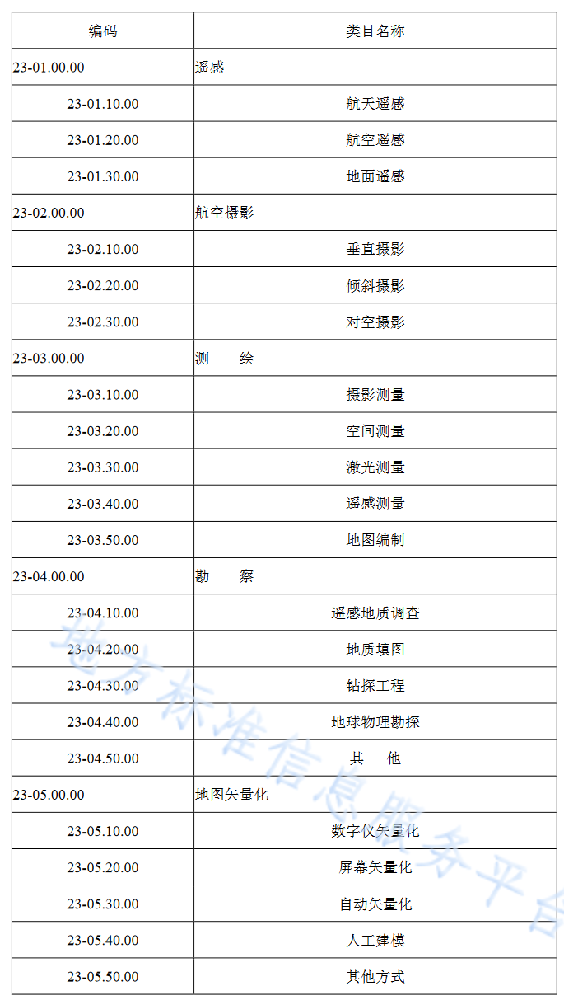

### 坐标系

cgcs2000 投影坐标系

### 分类编码

采用面状编码，由表代码和详细代码组成，用英文-连接。
表代码：2 位数字；
详细代码：大中小和子类代码，用英文.隔开。

### 数据库存储要求

应收集并整理相应成果数据与元数据等，并对入库前的成果数 据进行坐标转换、数据格式转换或属性项对接转换等预处理工作。

### 数据服务规格

I3S / 3D tiles / S3M

### CIM 数据按采集方式分类和编码

