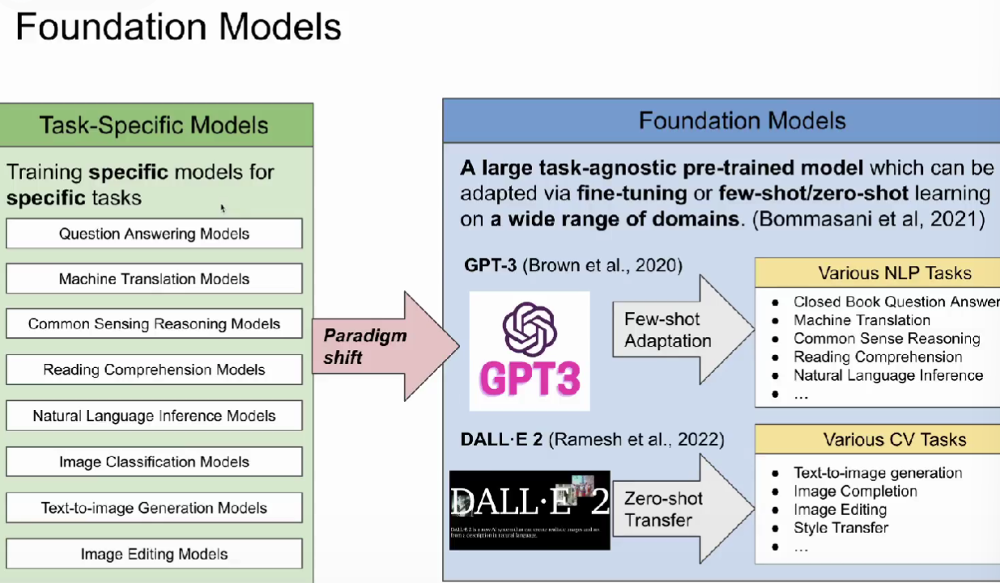
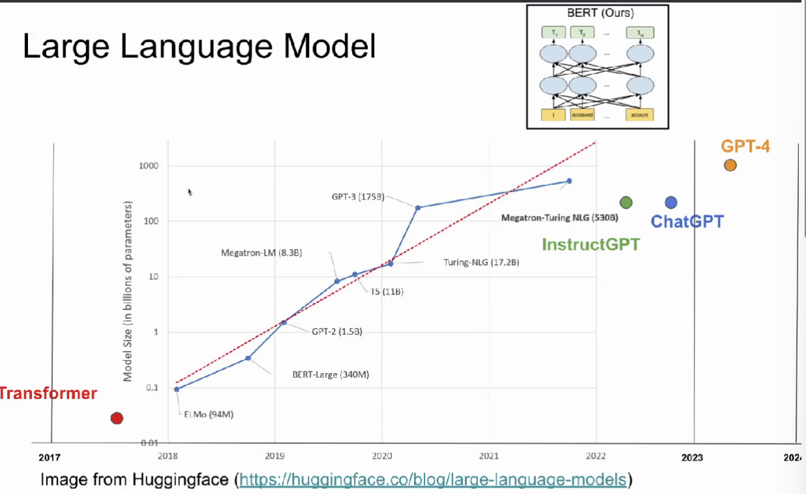
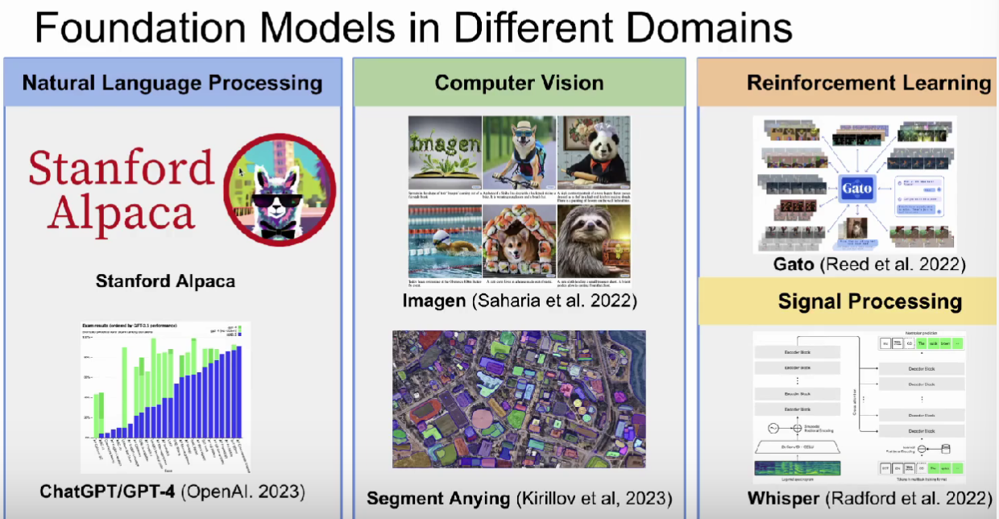
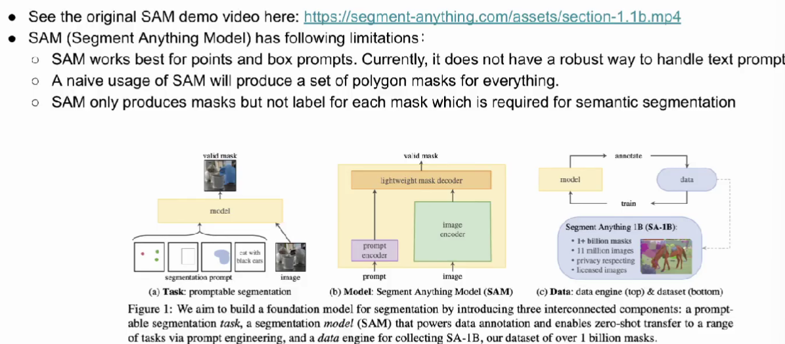

[toc]

ACM SIGSPATIAL中国分会
旨在为中国空间信息相关领域讨论和交流提供一个平台。

### **买庚辰**

**on the opportunities and challenges of foundation models for geospatial artificial intelligence**

**foudation models基础大模型**

收集网站上所有可能出现的文字数据进行预训练。
（自然语言处理）

**BERT**

区别：如何去训练模型

CHATGPT:用强化学习和监督学习，专门应用于人机对话的交流模式。

**segment anything**
对于任何影像分割任务，可以用SAM实现。

## geospatial semantics-TOPO 地理语义学
自然语言处理在地理领域的子应用。。

### typonym recognition - 地名识别

 
### location description recognition - 地址识别

## urban geography
POI-based urban function classification 

## health geography - dementia forecast
### US STATE - Level dementia time series forecasting
给定 一个 neighborhood，提供几百个POI，

### street view image-based urban noise intensity classification

## remote sensing - RS image classification 

### remote sensing semantic segmentation

是分割但不是语义分割
解决：将多个大语言模型叠加在一起。

745

