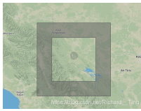

[TOC]


# gis


三维gis和计算机视觉


摄像机测量是在飞机上搭载测量相机来拍摄航片，通过POS系统和地面控制点做相机绝对定向。然后可在两张重叠航片汇利用三角测量来获取同名点的


## geojson

geojson是对各种地理数据结构进行编码的格式。


geojson对象可表示几何，特征或特征集合

```javascript
var geojsonFeature = {
    "type": "Feature",
    "properties": {
        "name": "Coors Field",
        "amenity": "Baseball Stadium",
        "popupContent": "This is where the Rockies play!"
    },
    "geometry": {
        "type": "Point",
        "coordinates": [-104.99404, 39.75621]
    }
};
```

**基本要素**
+ **点**
+ **多点multipoint**
+ **线linestring**
    在地理数据中，曲线（如贝塞尔曲线）不能很好表达；在地理数据中，曲线会拟合。

+ **多线multilinestring**
  
```json
"geometry":{
    "type":"multilinestring",
    "cordinates":
    [
        [
            [Lon,Lat],
            [lon,Lat]
        ],
        [
            [Lon,Lat],
            [Lon,Lat]
        ]
    ]
}
```


+ **polygon**
一个无孔单面

```json
"geojson":{
    "type":"Polygon",
    "cordinates":[
        [
            [100.0,0.0],
            [101.0,0.0],
            [101.0,1.0],
            [100.0,1.0]

        ]//里面多出一层括号以区分于线
    ]
}
```
一个有孔单面
```json
"geometry":{ 
        "type": "Polygon",
        "coordinates": [
                        [ 
                            [100.0, 0.0], 
                            [101.0, 0.0], 
                            [101.0, 1.0], 
                            [100.0, 1.0], 
                            [100.0, 0.0] 
                        ], // 这层括号可能就是为了突出此为面，首尾点相同
                        [ 
                            [100.2, 0.2], 
                            [100.8, 0.2], 
                            [100.8, 0.8], 
                            [100.2, 0.8], 
                            [100.2, 0.2] 
                        ] // 这层括号可能就是为了突出此为面，首尾点相同
    ]
 }
 ```



+ **multpolygon**
   + 两个不会镶嵌的面
   + 两个镶嵌的面（大面在前小面在后，效果不是有洞的）
   + 连个不会镶嵌的面（小面在前大面在后，效果是有洞的）

```json
"geometry": {
        "type": "MultiPolygon",
        "coordinates":
        [ 
            [
                [
                    [101.6455078125,27.68352808378776],
                    [114.78515624999999,27.68352808378776],
                    [114.78515624999999,35.209721645221386],
                    [101.6455078125,35.209721645221386],
                    [101.6455078125,27.68352808378776]
                ], // 一个外部环
                
                [
                    [104.2822265625,30.107117887092357],
                    [108.896484375,30.107117887092357],
                    [108.896484375,33.76088200086917],
                    [104.2822265625,33.76088200086917],
                    [104.2822265625,30.107117887092357]
                ] // 一个内部环
        ] // 一个有孔的单面
    ] // 因为是多个有孔的蛋面组成的集合，所以这里多了一个层级。 
}
```

+ **geometryCollection（几何集合）**


geojson对象通


## 空间关系查询
**根据空间关系选择（select by location）**
**空间关系连接（spatial join）**

### 空间关系类型
+ completely within 完全被包含
+ completely contain 完全包含
+ contained by 被包含
+ contain 包含
+ intersect 相交
+ crossed by the outline of 边界相交
---
+ within a distance of 邻近
+ touch the boundary of 相接
+ share a line segment with 共享边线
+ have their center in 质心位于
+ identical to 相同

### select by location


### 空间关系连接
**根据图层间关系连接属性表**
+ 基于要素的几何关系
+ 比较要素间包容关系/距离，然后将属性表连接
  
例：
按距离最近给每个学生分配学校


## 数字高程模型
### DEM

digital elevation model，是通过有限地形高程数据实现对地面地形的数字化模拟。**用一组有序数值阵列形式表示地面高程的一种实体地面模型**是数字地面模型（digital terrain model）DTM的一个分支。

DEM三种表现模型：
规则格网模型
等高线模型
不规则三角网TIN


### DOM
数字正射影像

利用DOM对经过扫描处理的数字化航空影片或遥感影像（单色或彩色）经逐像元辐射改正/微分纠正和镶嵌，按规定图幅范围裁剪生成的影像数据

由于DOM同时具有地图几何精度和影像特征，它也是4D基础地理信息产品重要组成部分，应用
+ 实景三维城市模型基础数据
+ 结合多源空间数据，提取生产数字线划图（DLG）数字栅格图（DRG）。

### DEM数据源获取
+ 光学卫星影像/航空摄影
+ 雷达卫星
+ lidar激光雷达
  

### 为何自然资源管理/“三调”需要使用他们？
在测绘/水文/气象/地貌/地质/土壤/工程建设/通讯/军事等国民经济和国防建设/人文和自然科学领域应用广泛

**三调**
作为资源管理的基础数据，能很好构建自然资源数字管理的底层框架和宏观视野，并与多元遥感数据/专题数据/时空数据融合，掌握各类型自然资源的精确空间分布和利用情况，构建更加实时/多为/真实形态的自然资源指挥管理数字孪生环境，建立国土资源调查，耕地/生态红线等业务的时空数据基础体系，形成自然资源高质量发展的有利保障。

**实景三维城市**
和多源地理空间数据，如矢量数据/BIM数据，倾斜模型/雷达激光点云等，以及物联网动态时空数据，汇合构建实景三维数据库，通过时空数据索引快速查询/组织/管理。


**空间仿真智能分析**
通过地形学和自然地理学的地形分析，模拟水流量或质量运动，形成对自然地理空间的数字孪生仿真动态模拟，和遥感/GNSS/物联网等智能感知设别配合。


