### 基本操作

rp : 定参照平面 标高

dl : 

shift + 滚轮： 旋转视角

mm : 选中 ， 镜像
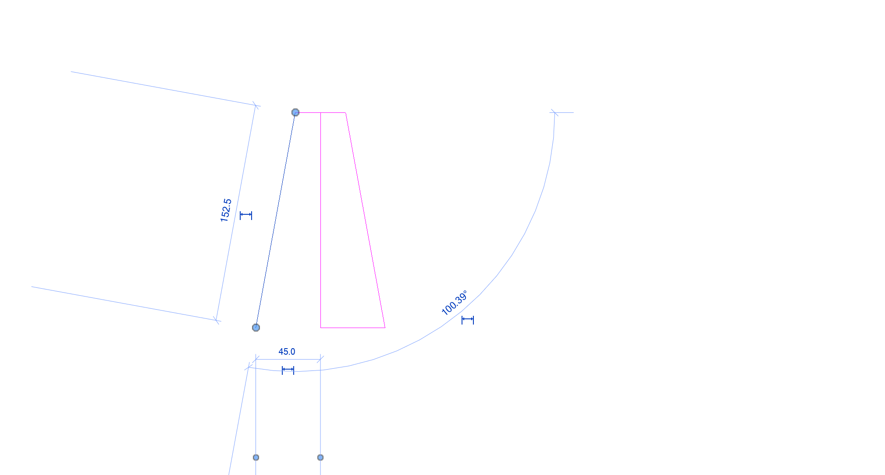

of : 偏移 ，**按住tab  , 首尾相连的偏移**、

sl: 打断

tr: 修剪

旋转： ro   + 空格 调整旋转终点

阵列批量360度生成
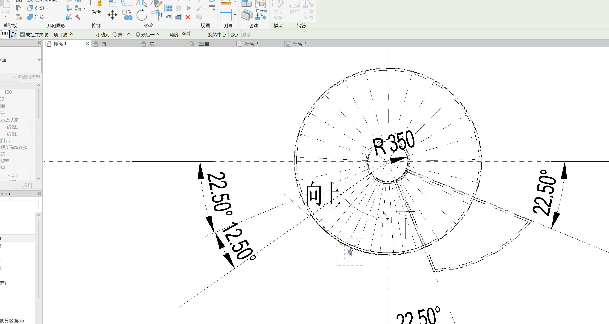

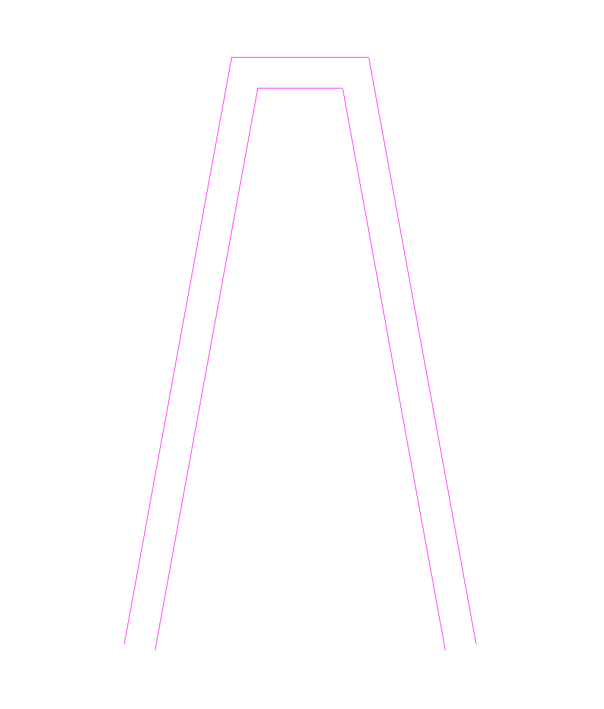

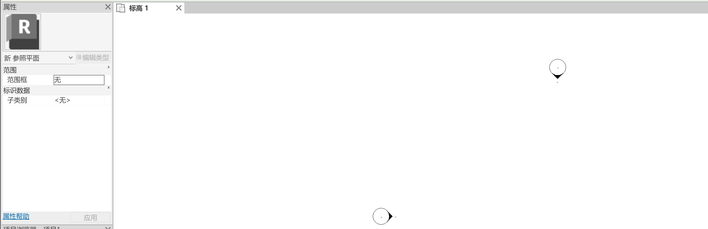

旋转： 创建 - 旋转  - 轴线  - 

注释 - 详图线 定位圆

参照平面：

S

辅助线：可以用

- 详图  只能出现在一个楼层

 
- rp 参照辅助线 可以在其他平面看到

- 轴线

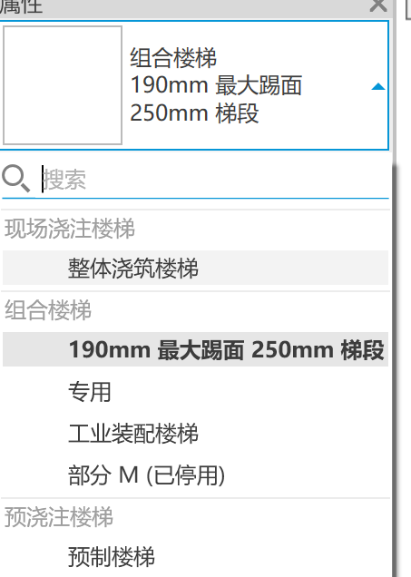

### 问题：
1.现场浇筑楼梯？

2.栏杆连接处 有问题

3.怎么将这些柱一起拉伸
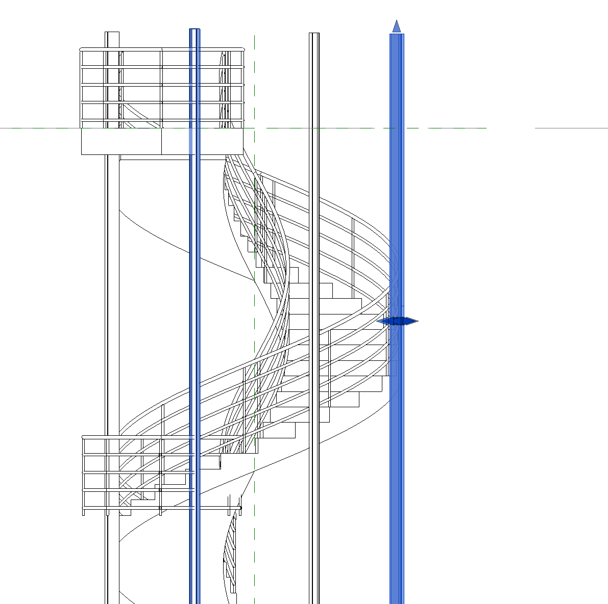

### 楼梯

- 踏面

- 踢面

- 踏板深度

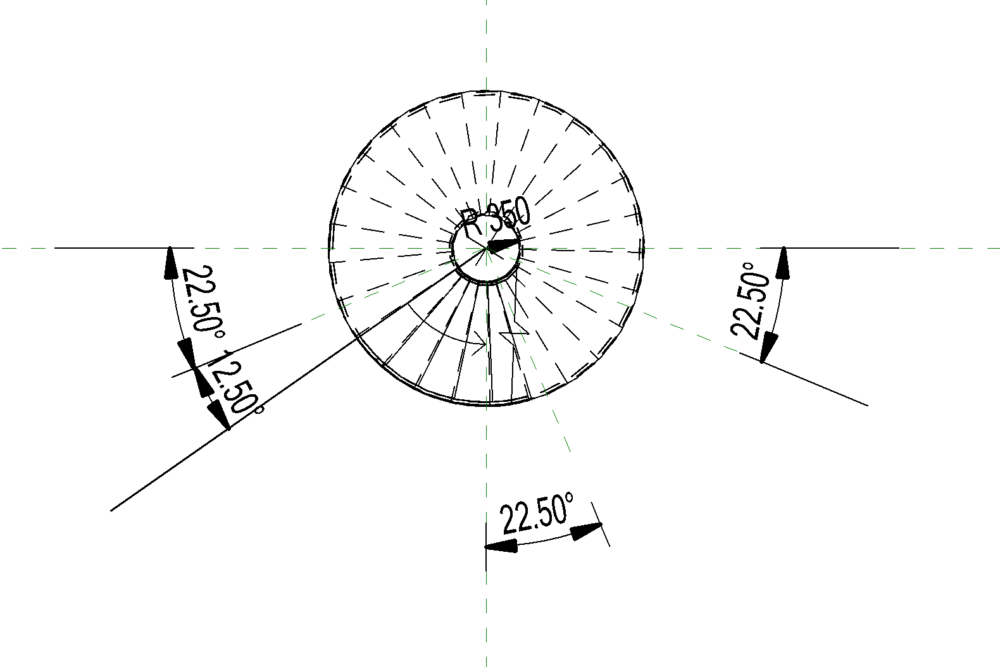

创建平台：
楼梯：
创建草图 ->
拾取线

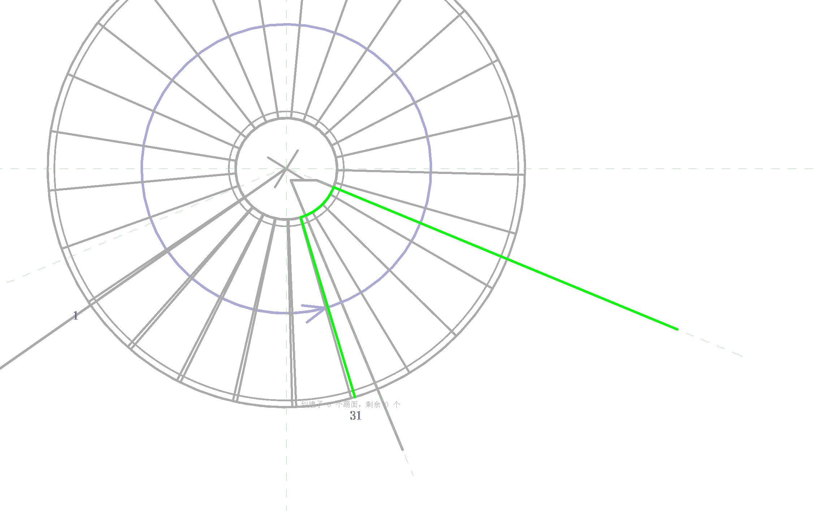

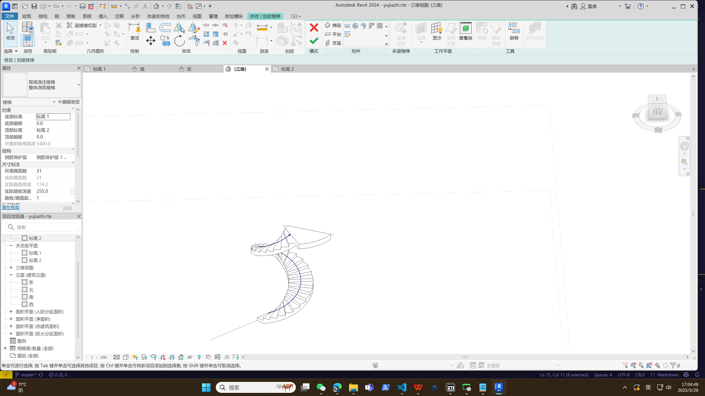

粉色这条线特别粗
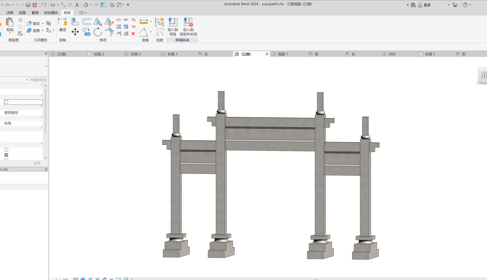
### 生成玻璃幕墙

- [ ] 

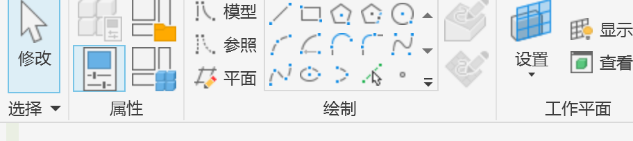

- 通过点的样条曲线
- 样条曲线
- 起点-终点-半径弧：不能创建实心曲面

与参照平面对齐

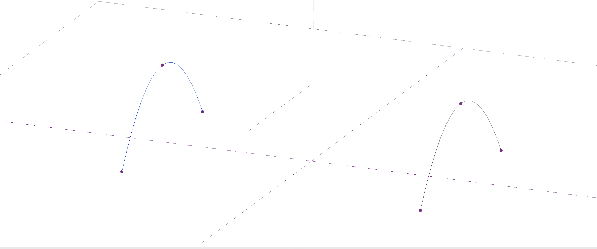

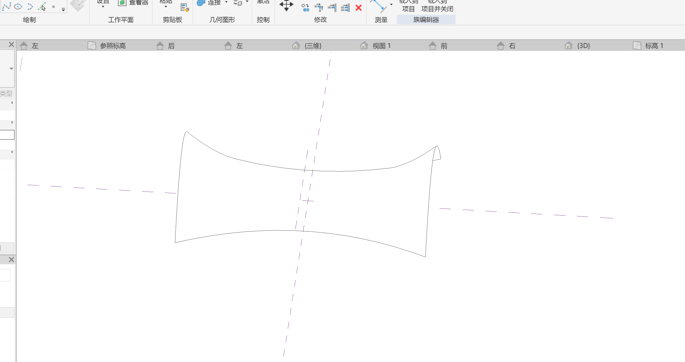

视图范围
显示奇怪需要修改视图范围
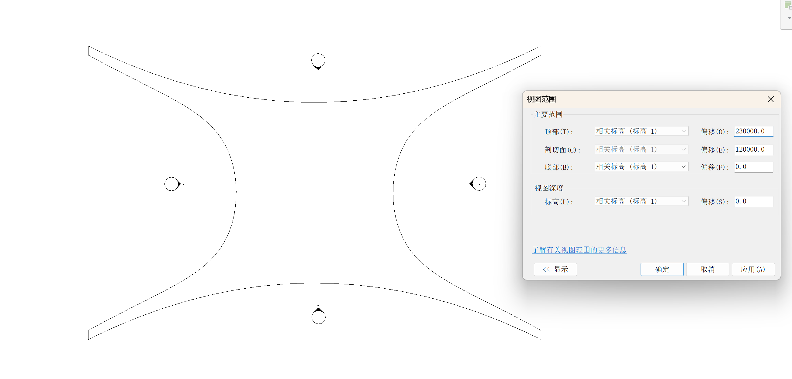

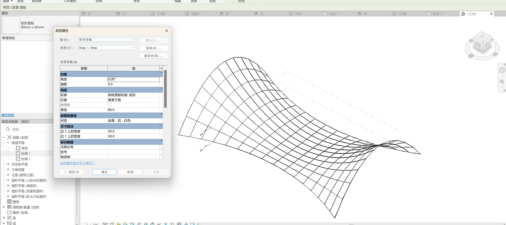

## revit 与 ue

可以添加datasmith 自动同步
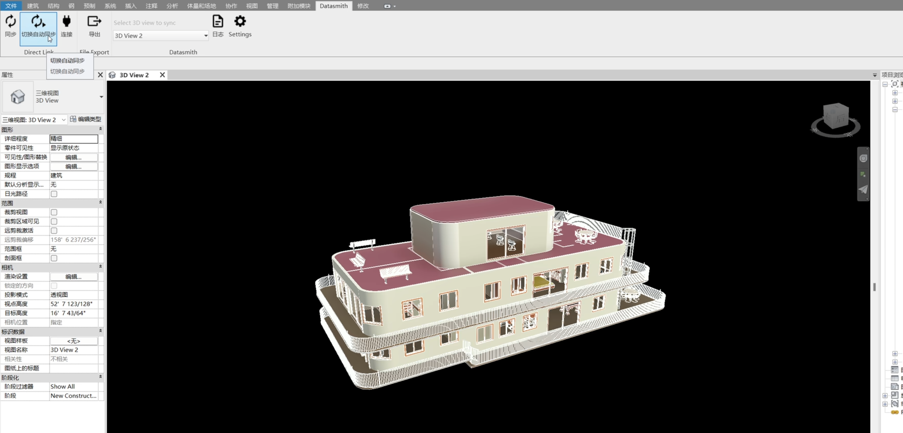

