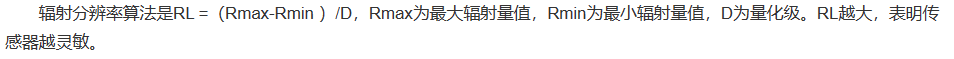
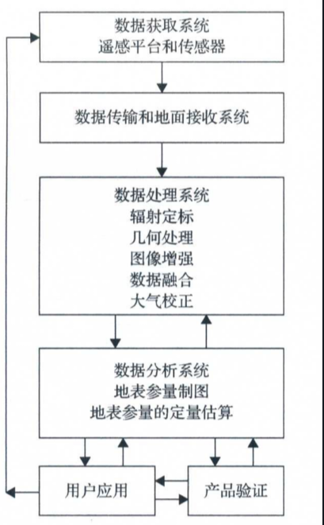
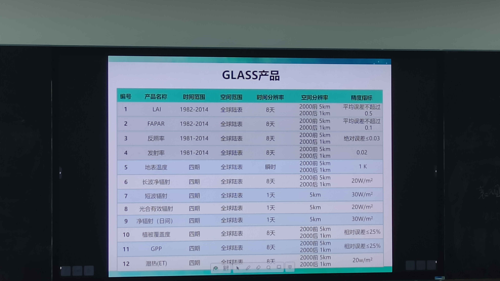
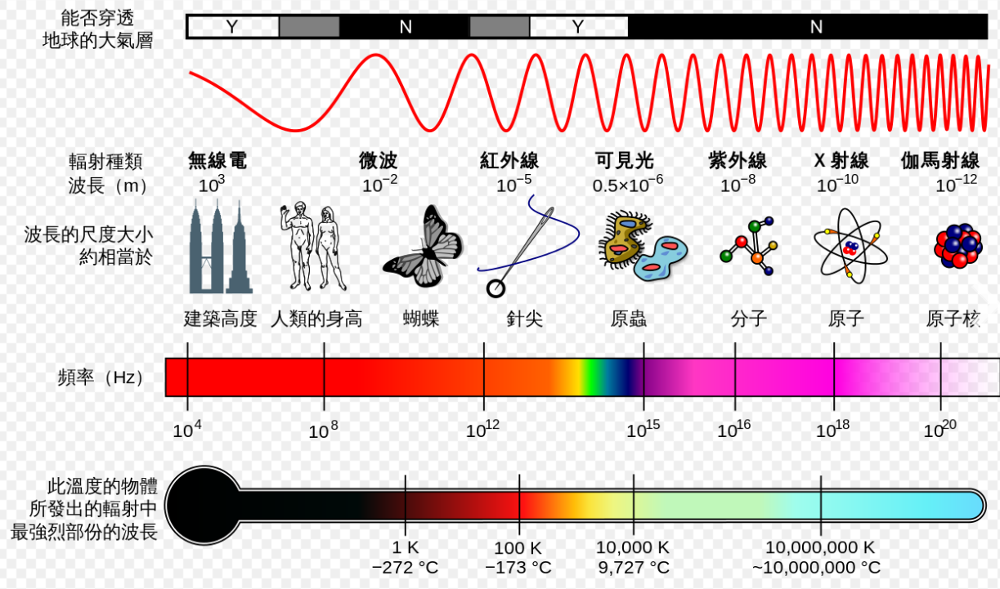
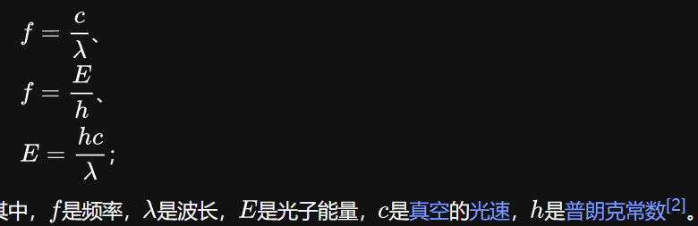
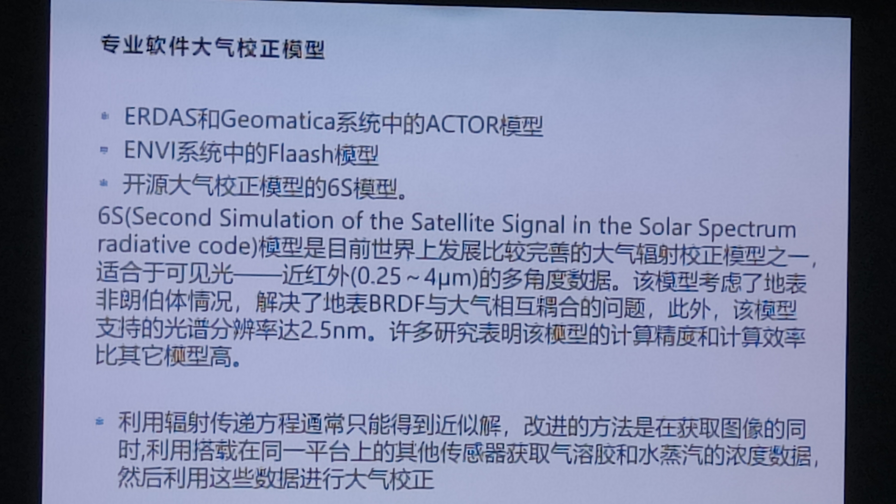
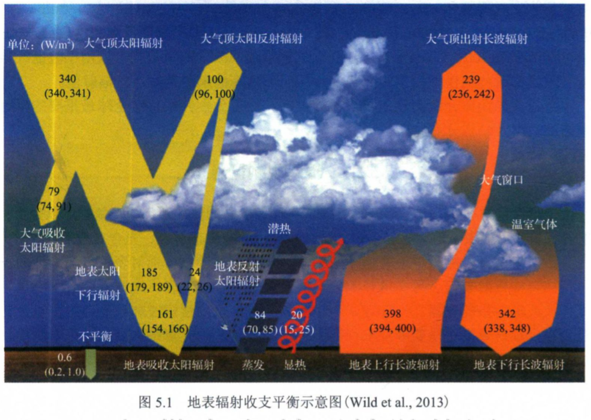
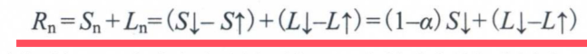
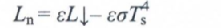
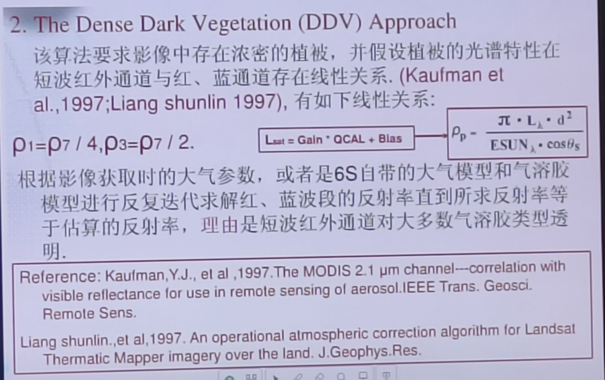

# rs

rs 技术是从人造卫星，飞机或其他飞行器上收集地物目标的电磁辐射信息，判认地球环境和资源的技术。

计算机视觉：从图片来重构和理解世界，

计算机图形学：根据模型和数据来生成图片。

倾斜摄影在多视匹配后得到密集点云，然后对点云构图，参数化，纹理映射等，

渲染：根据模型生成图像。

## 本科课程

- 遥感概论：遥感过程/成像原理/遥感应用论述
- 可见光遥感/高光谱遥感/微波遥感/激光雷达遥感
- 数字图像处理：matlab/c++
- GIS/大地测量学/地籍测量学

遥感源--地物电磁反射/辐射--传感器--数据接收--数据处理--信息应用

未来：实时/近实时处理

- 传感器==

CCD 传感器
多光谱扫描仪
合成孔径雷达
机载激光雷达

空间分辨率
波普分辨率
辐射分辨率---遥感图像上每一像元的辐射量化级。

时间分辨率

LiDAR

## 1 数据处理方法和技术

### GLASS(global land surface satellite)

### 电磁波谱

### 大气校正

大气校正的目的是消除大气和光照等因素对地物反射的影响，获得地物反射率、辐射率、地表温度等正式物理模型参数，包括消除大气中水蒸气、氧气、二氧化碳、甲烷和臭氧等对地物反射的影响；消除大气分子和气溶胶散射的影响
工具：
TOA FLAASH LEDAPS

- 查找表

- 软件中的大气校正模型
  ERDAS ACTOR 模型
  ENVI flaash 模型
  6s 模型：参数：
  几何参数 / 大气中的水和臭氧浓度 / 气溶胶浓度 / 辐射体哦阿健、观测波段和海拔高度 / 地表覆盖类型和辐射率。
  和 MORTRAN 比较：---
  
  MORTRAN

LEDAPS 处理流程

- 大气校正验证

## 2 地表辐射收支参量估算

地表辐射收支参量估算：

长波净辐射：

辐射传输过程中的干扰因素：

- 大气分子及气溶胶的瑞利散射(增加辐射量）和米氏散射（减少辐射量）
- 地表因素 BRDF
- 地形因素
  目标高度和坡向影响

### 双向反射率分布函数

## 3 生物物理和生物化学参数估算

## 4 水循环

## 付作业

微波遥感--SAR

激光荧光遥感--

高光谱技术和激光荧光遥感技术融合--
非弹性高光谱沙姆激光雷达系统--

资源 3 号 03 星 / 高分七号卫星激光测高--基地冰川检测、湖泊水位测量、森林树高测量及碳汇估算、滩涂浅水地形测量——卫星激光测高

长征四号搭载大气探测激光雷达这一主动载荷——国内首次实现全球气溶胶光学厚度、形状、尺寸等垂直分布信息的获取。

- PM2.5 监测——将主动发射激光接收的回波信号和被动接收的太阳光反射信号相结合，综合反演多种遥感数据，实现对近地面细颗粒物（PM2.5 等）浓度的高精度监测。
- 偏振交火

《星载激光测高技术进展》--
机载 / 星载

lidar -- 激光雷达

## 罗--高光谱遥感

高光谱分辨率--10-20nm
。
识别方法：通过波形识别地物特征

### 关键技术

光谱重建技术

光谱库和光谱分析技术
光谱匹配

目标检测

定量遥感
