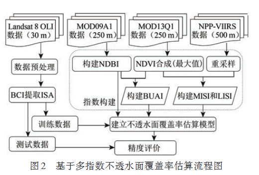
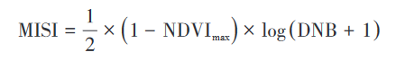
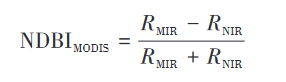
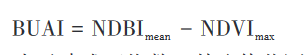

[toc]

# 融合多源时序遥感数据大尺度不透水面覆盖度估算

单一遥感数据或特征
存在“同物异谱”现象

### 国内外提取方法

+ 基于面向对象的模糊分类方法

无法解决光谱混淆和阴影问题，同时受图像分割结果的影像较大；数据获取周期长，生产成本高和数据处理复杂问题。

+ 光谱混合分解方法（SMA），基于中低分辨率遥感影像进行大尺度不透水面提取

但是由于城市景观复杂 、端元数量不确定及 混合模式多样等问题，光谱混合分解法同样很难 适用于大范围不透水面的提取

+ 回归模型

+ 指数法
  + 直接利用不透水面在遥感影像上的反射光谱特征，通过波段比值运算构建不透水面指数
  + 基于指数特征构建复合指数模型提取
  + 基于多源遥感数据进行不透水面提取

## 研究区域和数据
### 研究区域
考虑不透水面特征在遥感影像上的空间差异性，选择13个典型城市。

+ 特大城市：北京 / 上海

+ 东北部城市：哈尔滨 / 长春 / 沈阳

+ 南方：深圳

+ 中部：武汉 / 西安 / 郑州

+ 西北部：乌鲁木齐 / 兰州

+ 西南部：昆明
  
### 数据和预处理
+ 几何校正
  对多源数据进行几何校正，统一所有遥感数据的地理坐标系和投影系统

+ 重采样
  将 NPP-VIIRS 和 MOD09A1 数据的空间分辨率重采 样至 250m 。此外，本研究所使用的 MODIS NDVI 数据为 MODIS 多时相 NDVI 产品年季最大合成结果。Landsat 8 OLI 数据用来制作不透水面覆盖信息 参考数据集，使用前主要进行了辐射定标 、大气 校正和剔除水体等处理。夜间灯光数据的预处理 主要包括：利用阈值法将 DN 值小于 0.5 的像元赋 值为 0，以剔除杂散光以及短暂光源等背景噪声的 影响；DN 值大于 99 的像元赋值 99，以去除极亮像 元值；最后将 9—11 月的夜间灯光数据进行均值合 成并对合成数据进行归一化处理。

## 研究方法

### 构建特征指数
MISI ( Modified Impervious Surface Index )；修正不透水面指数
NDBI ( Normalized Difference Built-up Index )；归一化建筑物指数
BUAI ( Built Up Area Index )；城市建成区指数

+ **MISI指数**

+ **NDBI指数**

+ **BUAI指数**

