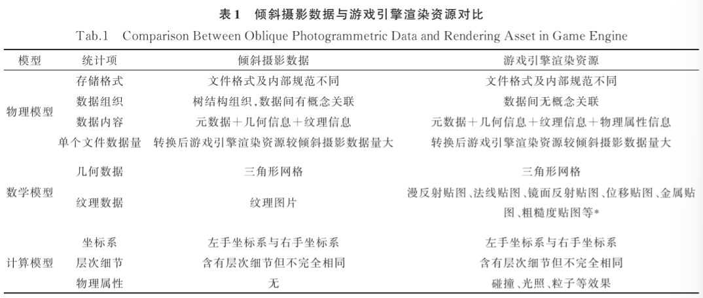

[toc]

## 摘要

GIS+游戏引擎。

利用原始数据据的文件组织，通过数据解析获取转换信息构建数据读取树；迭代树节点时分别对几何数据和纹理数据进行转换。转换过程兼顾游戏引擎渲染资源的纹理属性。

从计算机图形学角度，倾斜摄影三维模型本质上为基于真实影像纹理的三角形网格，在解析摄影数据时常提取其几何信息和纹理信息应用于城市三维模型重建优化或语义增强等研究。

## 模型分析

### 倾斜摄影数据和游戏引擎渲染资源

**倾斜摄影数据**
具有位置精准和要素全面的特点。

**游戏引擎渲染资源**
表达物理属性。
**基于物理的渲染（physically based rendering）。**
**PBR**

## 模型转换

+ 利用倾斜摄影层次细节结构创建数据读取树
+ 将数据分解为几何和纹理两个部分
+ 建立几何数据描述集表达三角形网格体
+ 解析纹理图片创建材质
+ 通过uv坐标映射关系进行资源重组完成数据转换
