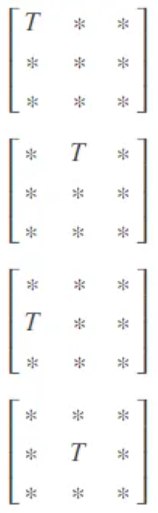
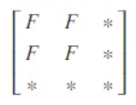
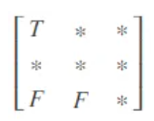
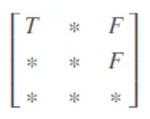
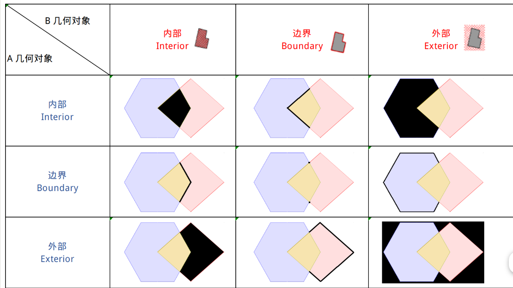
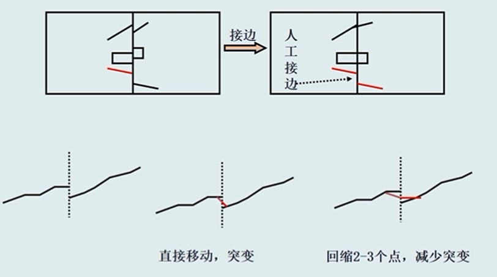

## GIS 空间拓扑

### 九交模型

**intersects 相交**

就是说 对应 Interior,Boundary 的 2×2 的部分任意一个单元是 T 就可以了，其他的都“DONTCARE”。注意，这些矩阵都是对称的。
**disjoint 相离**

**contains 包含**

**within**
和 contain 互为转置

**equal**

**overlap 叠置**

**touch 邻接**

**cross**

**九交模型**

通过描述 A 与 B 的内部(Interior , I)，边界(Boundary , B)，外部(Exterior , E)之间的关系来表达 A 与 B 的拓扑关系，内部(I)、边界(B)、外部(E)三者的关系构成了一个 3×3 的交集矩阵：

定义域{F, 0, 1, 2}。

1. 多边形的维度是 2，含组合多边形，带洞多边形等。
2. 折线的维度为 1，含多线。
3. 点的维度为 0，含多点。
4. 空集(无交集)维度为 F。

DE-9IM 模型把几何对象分为 `内部`/`边界`/`外部`三部分，两个几何对象间这三个部分两两之间 的关系，可以组合成一个 3\*3 的矩阵。

如上图所示，淡紫色的多边形为 `条件几何对象（A）`，淡红色的多边形为 `测试几何对象(B)`，图中的 **黑色** 部分表示两个几何对象对应的部分（内部、边界、外部）之间的相交（或者说重合）部分（ `A.[I/B/E] intersection B.[I/B/E]`）。

### 图幅接边

启动编辑

地理处理-空间校正-矫正方法：边捕捉-方法：平滑
