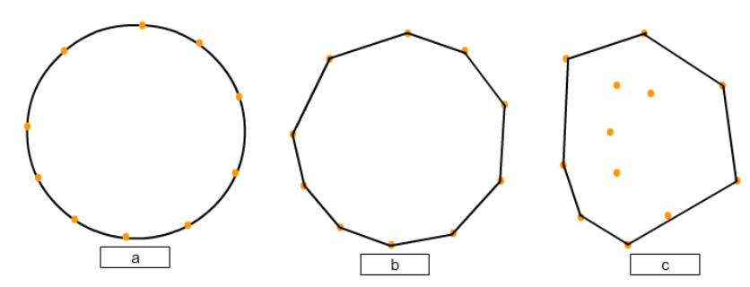
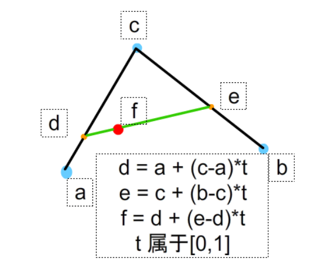

[toc]

### 基本海岸轮廓线

#### 贝塞尔曲线生成岛屿轮廓

随机生成一些在指定范围内的点，利用凸包来连接它们。



利用贝塞尔曲线把长直线拆分为短折线。



---

利用**噪音**生成不规则轮廓
多次随机生成噪音并叠加，模拟自然景观。。
（**Perlin 噪音**）

```javascript
+ RGB = [ 0 , 0 , 0]
(黑)代表低地

+ RGB = [ 255 , 255 , 255]
（白）代表高地

```


此时边缘太规则，需为边缘继续添加噪音，
**为相邻的边缘添加相近的噪音（利用少数控制点生成大轮廓，再继续细分，绘制出曲折的海岸线）**

```java
noiseX = new NoiseGenerator();
noiseY = new NoiseGenerator();

for (x = 0; x < mapHeight; y++){
    if(circularMask(x , y , radius) == true){
        x += noiseX(x , y);
        y += noiseY(x , y);
        world[x, y] = land;
    }
}
```

### 手绘风格的山

### 生物群落

### 森林和海洋

### 名称标签的摆放和杂项

### 地图上生成蜿蜒河流的方法(additional)
