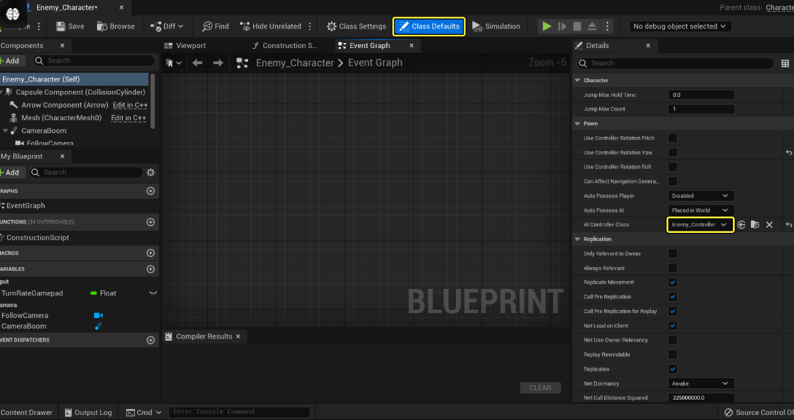
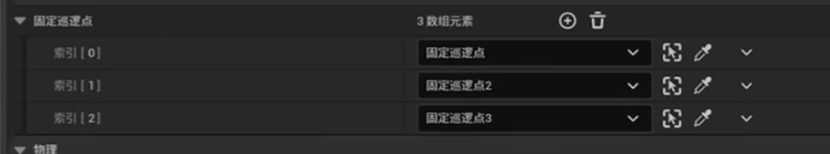
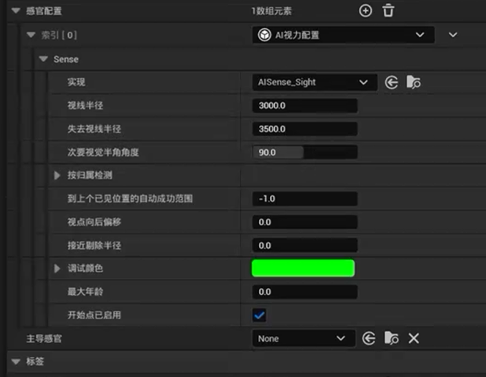

## AI 行为树文件结构

**创建内容：NPCcharacter / AIController / (Blackboard 可以在 AIbehavior 中创建) / AIBehaviorTree**

建立行为树 - > 建立黑板
建立 AI controller

在 NPCcharacter 中 ，在 class default 中 将 AI Controller 设置为》》

**pawn 的 Auto Possess AI 模式：**
已放置在场景中；
已蓝图生成；
放置在场景中或生成；

体积 -> 导航网格体边界体积

### 范围内随机移动

**新建任务**

### 导航边界

### 平行合成节点

完成模式：
直接：主任务完成后，整个任务完成；
延迟：需要等后台也完成后，整个任务算完成。；

### 正向固定巡逻点

在地图中，添加巡逻点 actor。

在 NPC 中，新建一个可编辑实例的存储巡逻点的 actor 数组。绑定场景中的三个巡逻点 actor。

### 反向固定巡逻

## 视力感知

感官系统可以在 AI Controller 中 添加，也可以在 AI 角色蓝图中添加，建议在 controller 中添加。

### NPC 跟踪玩家
