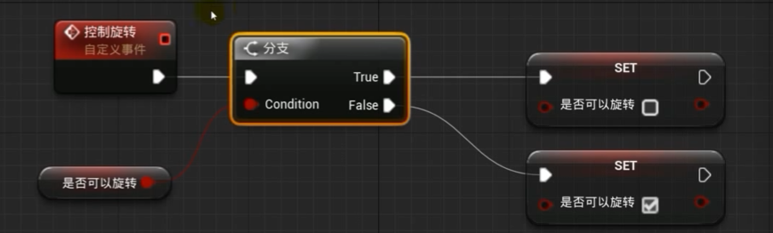
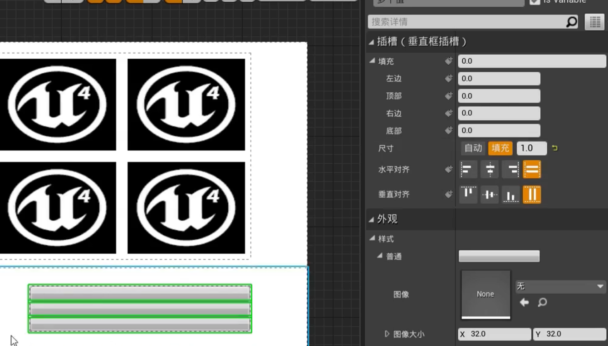
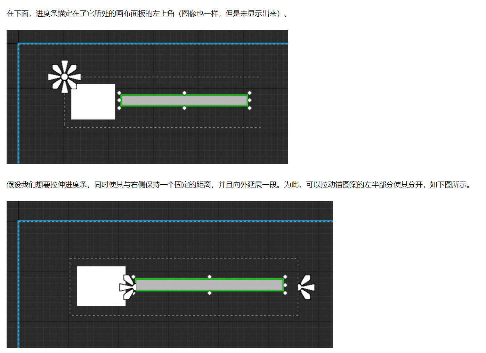
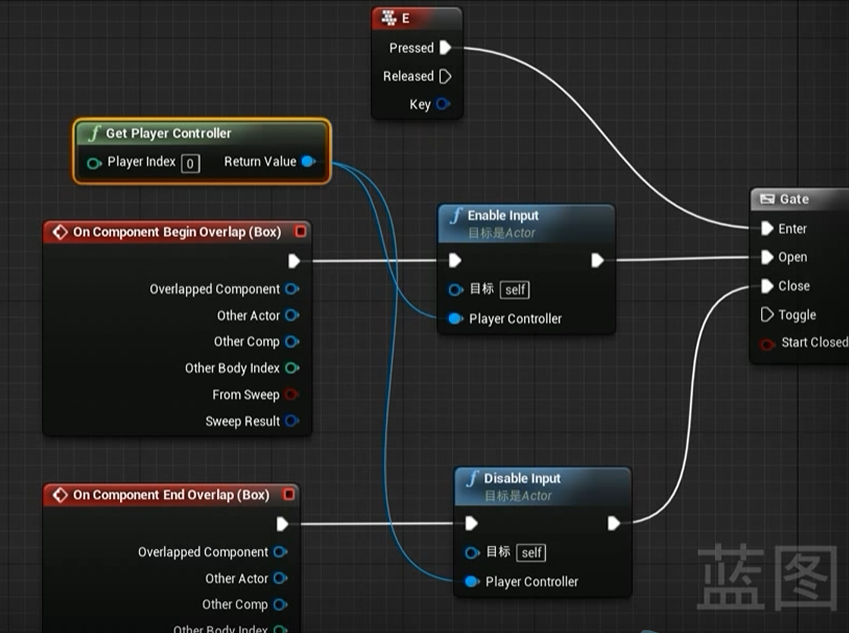
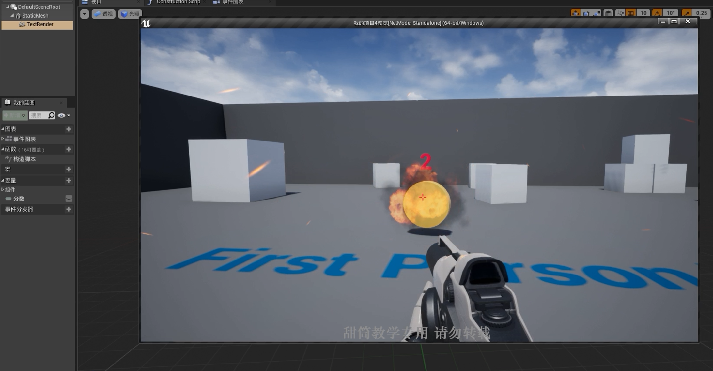

[toc]

UCLASS()
UFUNCTION()

## 蓝图

**蓝图 fenlei**

- 关卡蓝图：当前关卡的全局事件图
- 蓝图类
- 数据蓝图:仅包含代码（以节点图标的形式）、变量和从父类继承的组件的类的蓝图。
  蓝图接口
  蓝图宏库

**蓝图节点**

### 蓝图节点

### 解决方案

文件夹-engine
引擎自身的配置文件

games-
项目的配置文件

.build.cs
描述项目每个模块的环境信息
-unrealBUildTool -处理相关依赖 link

UHT
UE 头文件

.generate.h

### 每个头文件含义

#progma once
保护头文件只编译一次。

### 界面

### construction script / 事件图表区别

相当于构造函数作用

## 事件

### EventBeginPlay

### SpawnActor fromClass

actorBeginOverlap

新事件图表--把事件分类（移动类/ 攻击类）

**函数**

## 变量

**获取和设置变量**
获取：按住 ctrl 拖进来

设置：按住 alt 拖进来

### 变量类型

**bool**

**数值类型**
byte:0-255
interger:
float

**数值类型运算**

以 sum 为例

直接加常数

**文本类型变量**

字符串可拼接
右键-》附加-》工具集-》字符串-》附加

**向量**

向量相加

向量相乘

**旋转体 rotator**

**变换类型 transfrom**

location
/
rototian
/
scale

**通过变换操作关卡对象**

**变量的算术运算**

- / - / \* / "\/" / %

**比较预算符**

**局部变量**
事件中没有，在指定函数中有

### 获取按键输入

**获取键盘按键输入**

鼠标

## 蓝图节点

### 分支

### 序列节点

### for 循环节点

### forEachLoop -为数组调循环处理其中的每一个成员

### while 节点

### DO N / Do once 节点

**DO ONCE**

### Flip flop 节点

按左键单次 A 功能，再按执行 B 功能。

### Gate 节点

**MultiGate / MultiGate 节点**

**multigate 节点**

## 数组

### 创建数组-MakeArray

### 修改指定索引的数组的元素-SetArrayElem

### 调转指定数组下标的元素-Swap

### 随机数组元素-Shuffle

### 数组元素获取

**get(复制)**

**get(引用)**

### 查找数组元素 / 获取数组长度 / 获取数组的最后一个下标

### 数组元素添加 / 移除 / 是否包含

**移除数组元素**

**是否包含**

### 数组遍历

### 过滤数组中指定类型的 Actor 类-FilterArray

### 修改关卡对象的材质

**千万记住转换为参数！！**

创建数组遍历关卡对象

创建材质和材质实例

## **需要先点保存，再编译，再保存**

## 函数

### 事件和函数

**区别**

- 事件的执行可能涉及多线程，函数是单线程的。

每个事件触发以后，系统开一个线程执行此事件，所以可以使用 Delay。
而函数是单线程的，调用函数后该线程就等待函数的执行直到返回，函数内部无法停止，即函数不能使用 Timeline，Delay。

- 事件没有返回值
- 事件的意义是游戏中发生的事。

**适用**

- 需要町等时用 Event
- 需要返回值用 Function

### 局部变量

## actor / pawn / character --父子关系

面向对象

**Actor 演员 - 车**

可在世界中放置或动态生成的对象。

**Pawn 角色 - 火车**

可以被“控制"的 Actor,且可以接受来自 controller 的输入。

**character 有重力的角色 - 红色快速载客火车**

增加了可四处行走的功能。

放大镜直接跳转到内容浏览器资产

**对齐**
查看

更改 z 轴

骨骼：角色->骨骼->层级

### actor 和 actor 间的嵌套

actor 包括两种 component.

- sceneComponent ，带 transform ，能在场景中渲染，最重要能**嵌套**
- 普通 ActorComponent，不带 transform 在 Actor 中是平级的。

**actor 和 actor 间嵌套**
通过 `Child:AttachToActor`和 `Child:AttachToComponent`创建父子连接。

## 设置启动关卡

## 蓝图类

是一种允许开发者基于现有游戏类添加功能的资源。

创建蓝图类需要父类。

### 创建一个可用于修改材质的蓝图类

创建蓝图类，添加静态网格体，将网格体拖进场景

定义一个材质数组

框选可编辑实例，更改类别为材质。

### 创建第一人称蓝图

## varest

是一个 api 调用插件，支持访问 http/https 请求，也支持 json 文件读取。

**varest 发送 GET / POST 请求和读取 JSON 文件**

### varest 发送 get 请求

### varest 发送 post 请求

### varest 读取 JSON 文件

## 常用函数

## 常用属性

### 可编辑实例

可以在关卡中放置和复制静态网格体的实例，并且可以在实例之间共享网格体的属性和材质设置。这样可以大大提高关卡的构建效率和灵活性，同时减少资源的重复使用。

### 生成时公开

允许开发人员在关卡设计过程中，将一些实例化静态网格体的属性和参数暴露给关卡编辑器，以便在编辑器中进行调整和修改。这样可以方便地调整每个实例的位置、旋转、缩放、材质参数等，从而实现更加个性化和多样化的关卡设计。

## 蓝图通信

- 蓝图通信的首要任务：设法获得通信对象的引用（reference）
- 获得通信对象引用的方式：**指定 / 碰撞 / 创建 / get(all) + cast to**
- 蓝图通信三种方式：直接通信 / 蓝图接口 / 事件分发器
  
  三种通信方式：
  

### 直接通信

#### .1 在蓝图中直接拖 Actor

### .2 get actor of Class / get all actors of Class

- 利用 Get Actor of Class（获取类的 Actor）或 Get All Actors of Class（获取类的所有 Actors）这两个节点获得场景中的 Actor。
- 这两个节点的区别是一个获取一个 Actor（第一个实例化的 Actor），另一个是获取所有实例化的 Actor。
  **案例**：两个蓝图，一个是 BP_Pawn，一个是 BP_Door，BP_Pawn 需要调用 Door 蓝图中的 OpenDoor 函数，来实现开门的功能。
  

### 蓝图接口

**一对一通信**

- 当同样的操作，需要不同的响应，就可以使用蓝图接口（**类似 C++ 中的多态**）。例如子弹击中不同目标时响应不同，油桶会爆炸，NPC 会死亡等等。
- 是函数的集合体，只有函数名称，没有函数实现。（类似 C++ 的接口）
- **和 C++抽象类的区别**：子类继承一个蓝图接口后，不重写接口函数也可以实例化。

### 事件分发器 - 反向监听的机制

- 事件分发器（event dispatchers）可以实现一对多的蓝图通信方式，功能更强大。
- 类似 MFC 的消息/事件机制，QT 信号槽机制。
- 使用场景：在一个游戏关卡中，一个 BOSS 的死亡，往往会触发很多功能，例如，爆装备、打开隐藏机关、人物升级等等。这就是一个事件发生后触发很多其他事件。这个业务就能使用事件分发器来实现。
- 使用步骤：在 BOSS 蓝图中创建一个事件分发器（EP_BOSSDead），然后机关蓝图、人物蓝图等其他需要响应 BOSS 死亡事件的蓝图中，绑定 EP_BOSSDead 事件分发器。
  

## castto 类型转换-既蓝图通信

更改另一个类中的变量

## 对象

### 对象引用

右键-提升为变量

**产生了蓝图/ 。。。/ 记得提升为变量**

当一个类里面的函数比较多，并且使用比较频繁的时候，就要不断的从这个类节点往外拉线，从而获取不同的函数节点，这样的蓝图就会看起来比较乱，这时候，就可以将这个常用的类提升为变量。

## 布尔应用

### 获取类的 actor

## 角色动画重定向

## AI-行为树

## Traffic_AI_System

### Cine Camera

可以将交通生成中心位置设置为“电影摄像机”

可在父级车轮进行更改：

交通灯工作原理：交通灯被作为“父灯”，控制给定十字路口上所有其他交通灯。父灯在编辑器中发出绿光，所有“子灯”发红光。

## UMG- UI 控件

### slot - 插槽（容器）

设置为填充——适应垂直框大小

### 锚

- 设置锚点
  

 1.更改显示文本 2.更改字体颜色 3.更改尺寸 4.更改对齐方式

### 图像绘制类型

### 实现多个 UI 界面切换显示

#### 法 1

创建各 UI 页面，并提升变量，设置\_TargetWidget 为登录页面变量

在第二步创建的蓝图类中新增函数 ShowWidgets（），增加一个接口，用于待显示页面的索引，在函数中首先移除显示在屏幕上的图像，Switch 语句用于判断显示那个图像，然后用 AddToViewPort 函数添加当前待显示页面，如图

在其他控件蓝图中调用 Show 函数并传入要显示的 UI 索引即可。

#### 法 2 WidgetSwitcher

## varest JSON 解析请求回来的 JSON

## 案例-金币

金币的每帧旋转

第二种方法：

**castto**:后接 actor
castto 判断是否碰撞到，碰撞到则金币消失。
（中间类型转换为 casttoBP_ThirdPersonCharacter）

### 通过一个容器去储存得分

## 案例

### 案例-开关门

获取玩家按 E 开关门

### 点名系统

## 地理配准 georeference

## 案例-设计分数绑定

## 案例-持枪：了解封装和多态

### 封装

枪被拾取时类型转换为持枪者

**被拾取函数**

被拾取时，将枪（staticmesh）附加到组件（持枪者的 mesh2p 上）。

**被丢弃**

### 多态

## 与表格绑定 csv

新建结构体

## 案例-实现小气泡功能

