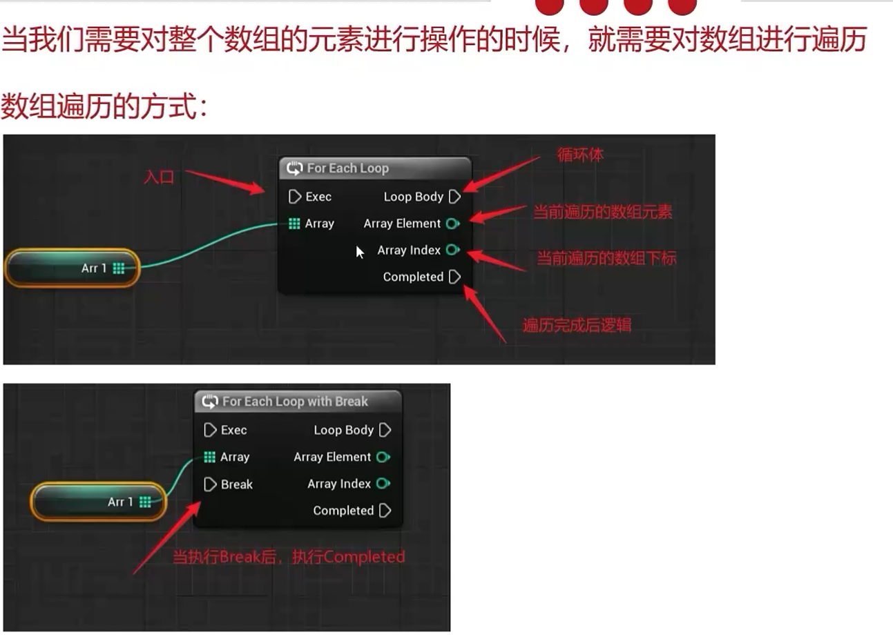

[toc]

UCLASS()
UFUNCTION()

### 蓝图

**蓝图 fenlei**

- 关卡蓝图：当前关卡的全局事件图

- 蓝图类
- 数据蓝图:仅包含代码（以节点图标的形式）、变量和从父类继承的组件的类的蓝图。
  蓝图接口
  蓝图宏库

**蓝图节点**

### 解决方案

文件夹-engine
引擎自身的配置文件

games-
项目的配置文件

.build.cs
描述项目每个模块的环境信息
-unrealBUildTool -处理相关依赖 link

UHT
UE 头文件

.generate.h

### 每个头文件含义

#progma once
保护头文件只编译一次。

### 界面

## 事件

### EventBeginPlay

### SpawnActor fromClass

###

actorBeginOverlap

新事件图表--把事件分类（移动类/ 攻击类）

**函数**

## 变量

**获取和设置变量**
获取：按住 ctrl 拖进来

设置：按住 alt 拖进来

### 变量类型

**bool**

**数值类型**
byte:0-255
interger:
float

**数值类型运算**

以 sum 为例

直接加常数

**文本类型变量**

字符串可拼接
右键-》附加-》工具集-》字符串-》附加

**向量**

向量相加

向量相乘

**旋转体 rotator**

**变换类型 transfrom**

location
/
rototian
/
scale

**通过变换操作关卡对象**

**变量的算术运算**

- / - / \* / "\/" / %

**比较预算符**

**局部变量**
事件中没有，在指定函数中有

### 获取按键输入

**获取键盘按键输入**

鼠标

### 分支

### 序列节点

### for 循环节点

### while 节点

### DO N / Do once 节点

**DO ONCE**

### Flip flop 节点

按左键单次 A 功能，再按执行 B 功能。

### Gate 节点

**MultiGate / MultiGate 节点**

**multigate 节点**

## 数组

### 数组元素获取

**get(复制)**

**get(引用)**

### 查找数组元素 / 获取数组长度 / 获取数组的最后一个下标

### 数组元素添加 / 移除 / 是否包含

**移除数组元素**

**是否包含**

### 数组遍历

### 修改关卡对象的材质

**千万记住转换为参数！！**

创建数组遍历关卡对象

创建材质和材质实例

## **需要先点保存，再编译，再保存**

## 函数

### 事件和函数

**区别**

- 事件的执行可能涉及多线程，函数是单线程的。

每个事件触发以后，系统开一个线程执行此事件，所以可以使用 Delay。
而函数是单线程的，调用函数后该线程就等待函数的执行直到返回，函数内部无法停止，即函数不能使用 Timeline，Delay。

- 事件没有返回值
- 事件的意义是游戏中发生的事。

**适用**

- 需要町等时用 Event
- 需要返回值用 Function

### 局部变量

## actor / pawn / character --父子关系

面向对象

**Actor 演员 - 车**

可在世界中放置或动态生成的对象。

**Pawn 角色 - 火车**

可以被“控制"的 Actor,且可以接受来自 controller 的输入。

**character 有重力的角色 - 红色快速载客火车**

增加了可四处行走的功能。

放大镜直接跳转到内容浏览器资产

**对齐**
查看

更改 z 轴

骨骼：角色->骨骼->层级

### actor 和 actor 间的嵌套

actor 包括两种 component.

- sceneComponent ，带 transform ，能在场景中渲染，最重要能**嵌套**
- 普通 ActorComponent，不带 transform 在 Actor 中是平级的。

**actor 和 actor 间嵌套**
通过`Child:AttachToActor`和`Child:AttachToComponent`创建父子连接。

## 设置启动关卡

## 蓝图类

是一种允许开发者基于现有游戏类添加功能的资源。

创建蓝图类需要父类。

### 创建一个可用于修改材质的蓝图类

创建蓝图类，添加静态网格体，将网格体拖进场景

定义一个材质数组

框选可编辑实例，更改类别为材质。

### 创建第一人称蓝图

## varest

是一个 api 调用插件，支持访问 http/https 请求，也支持 json 文件读取。

## 常用函数

### 获取类的 actor
