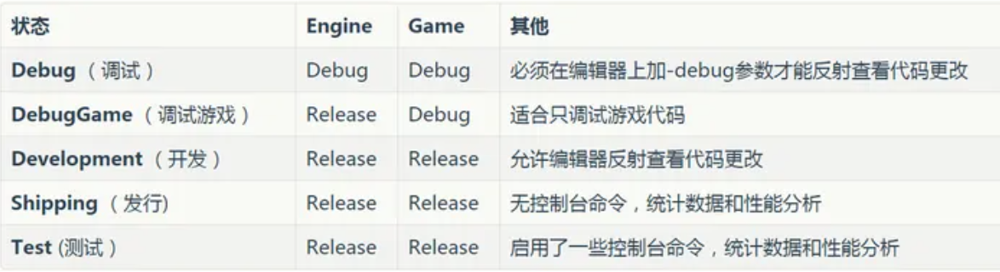
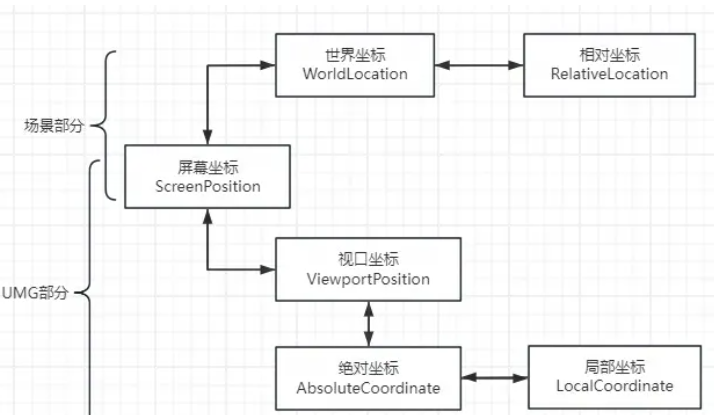
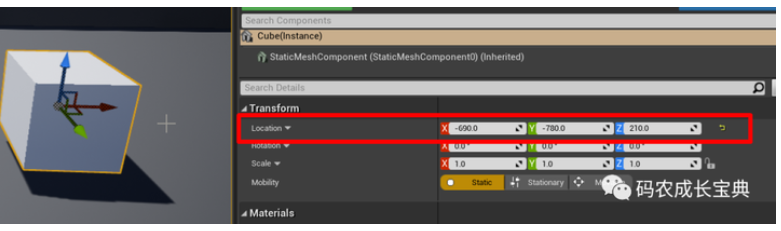
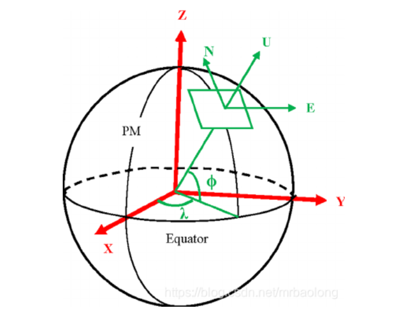
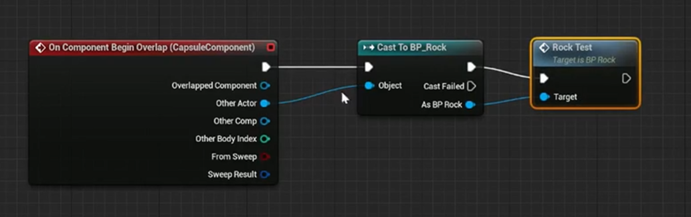

[toc]

## 摄影名词

**TGA**
高质量透明背景图

## 基础界面

设置——世界场景设置

lightmass

## ue5 文件结构

config - 包含项目设置，键盘输入之类的配置文件。
content - 存放引擎或游戏的内容，包括地图/贴图/材质/模型。
intermidiate - 包含再编译引擎或游戏时生成的临时文件。
saved - 包含自动保存内容，配置（\*.ini)文件及日志文件
.uproject - 项目启动程序，开启项目。

如果再场景中（资产位置）发生了变化，需要点重定向器。

## 编译类型

### 资产迁移量汇总方式和模型迁移两种方式

## actor

Acto5 是一种可在世界中放置或动态生成的对象

## 缓存配置

## 坐标系统

UE 中坐标系统是左手坐标系统。

**世界坐标**
场景中的对象以 Actor 作为基本操作单元。

当我们在编辑器的【PlaceActors 放置 Actor】窗口拖出一个【Actor】放置到场景中时，此时它没有【Attach 依附】其它场景对象（Attach 相关知识点在下面【相对坐标】中会进一步解释），即无【父对象】，那么此时它在【Transform 标签】中显示的坐标即为【世界坐标 WorldLocation】

### 场景对象 - 相对坐标 - relative location

需要子对象跟随父对象运动。

相对坐标中的(0, 0, 0)远点，对应的是父对象在世界场景中的位置。

**使用前提**：Attach 依附。

- AttachToActor
- AttachToComponent

**世界轴 / 本地轴**

**控制对齐表面**

### cesium for ue

使用地心空间直角坐标系(ECEF),WGS84 椭球体。

`cesium actor` 使用 `cesiumGeoreference Actor`将地心空间直角坐标系映射到虚幻引擎世界关卡。

## 如何正确类型转换 castto

### 1.getPlayerCharacter / getPlayerPawn

适用于单人游戏

### 2.利用重叠事件

### 3.getAllActorsOfClass 很消耗资源

### 4.间接引用——利用方便连接的蓝图搭桥
