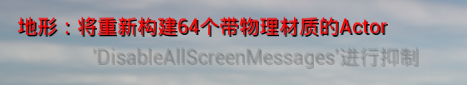
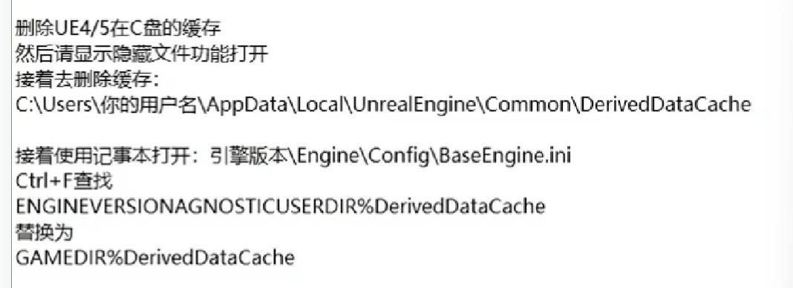
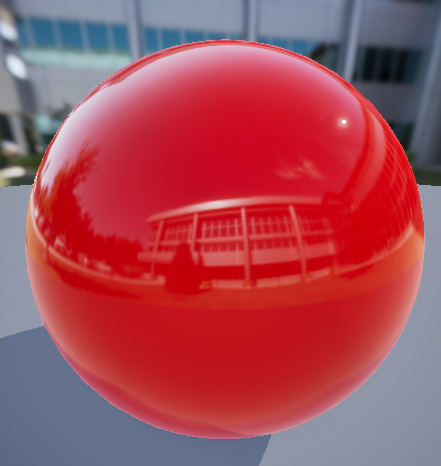
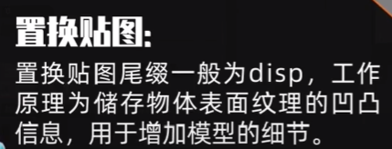

[toc]

## 摄影名词

**TGA**
高质量透明背景图

## 基础界面

设置——世界场景设置

lightmass

## ue5 文件结构

config - 包含项目设置，键盘输入之类的配置文件。
content - 存放引擎或游戏的内容，包括地图/贴图/材质/模型。
intermidiate - 包含再编译引擎或游戏时生成的临时文件。
saved - 包含自动保存内容，配置（\*.ini)文件及日志文件
.uproject - 项目启动程序，开启项目。

如果再场景中（资产位置）发生了变化，需要点重定向器。

### 资产迁移量汇总方式和模型迁移两种方式

## actor

Acto5 是一种可在世界中放置或动态生成的对象

## 缓存配置

## 坐标系统

**世界坐标**

**世界轴 / 本地轴**

**控制对齐表面**

### cesium for ue

使用地心空间直角坐标系(ECEF),WGS84 椭球体。

`cesium actor` 使用`cesiumGeoreference Actor`将地心空间直角坐标系映射到虚幻引擎世界关卡。

## 基本操作

### 创建和移动物体

~End 键
grid
**网格对齐值**
用处：批量摆放

**角度对齐**

**位移吸附**

F：聚焦当前物体
focus

按住物体+shift ：围绕物体拖拽

**复选模型**

ctrl 加选模型
也可加选复制

曝光问题：lumen 算法

EV 值：调小(-2/-4)

保存：
内容浏览器-》保存所有-》暂存盘

### 导入模型资产

坐标轴设为(0 , 0 ,0)

### 以 maya 为例导入模型

## 贴图导入

网站：polyhaven.com

### HDRI

high dynamic range image 高动态范围图像

**LDRI**
JPEG , PNG

.uassets 虚幻资产资源

### 资源包导入

**资产导入**

**导入其他工程 content 文件**

当前资产迁移：
右键——》资产操作——》迁移-》\*\* \*\*

**检查**

修复素材引用路径

### 静态网格体

### 导入 Bridge 资产包

## 材质基础

**PBR**

1+左键

常量

2+左键
向量

3+左键
3 维向量

颜色通过 3 维向量进行调节

金属度/粗糙度：通过 1 维常量烤制
0-镜面反射 / 1-漫反射
0

金属都：

1

diff/basecolor/albedo(反射率):diffuse:底色

**置换贴图 disp**

alt 断开链接
ctrl 更改连线位置

**法线贴图**

连接 3 通道

### 粗糙度计算

### 粗糙度更改

将母材质做好后，暴露为一个实例材质，在实例材质的模型上进行更改。

1.  **命名**：
    右键——转换为参数——写参数名
    （用于暴露参数）

2.  **创建一个实例材质**

### 密度计算

**UV**

## 光照系统

### 点光源

### 聚光源

### HDRI 背景

置换环境效果：

参数
**高级**
use camera projection

## 后期盒 post process volume

控制环境光的饱和度

在后期盒之内的范围会受到后期盒的影响。

### 人眼适应-自动曝光

选中后期盒-max_EV / min_EV 设置为 0

### 镜头

曝光/ 光晕

### 颜色分级

直观调整色调

### 电影

调整局部区域或整体区域明暗对比。

### 后期材质

如《无主之地》

## lumen

解决实时渲染中的全局光照问题。

## 环境

### expotionHeightFog

## 地形系统

### 创建地形模块

选项模式——地形

**斜坡创建**
ctrl+左键

### 制作地形软件

worldCreator
worldmachine
houdini
Gaea

## Nanite

实时同屏上亿三角形，准子像素级的几何渲染技术 Nanite。

## DataSmith

## arcgis maps sdk for unreal

在 map 中显示关卡

### display a map

了解如何设置底图/高程源和添加数据图层。

## 开发中常用的变量

# ue5 数字孪生

## 基础地理知识

### 坐标系

测量面积长度--投影坐标

经纬度--地理坐标

### GIS 数据获取和处理

- POI 数据获取
- 行政区域下载
- OSM 数据
- 建筑 shp 数据
- 天地图获取交通路网、水系、湖泊
- DEM 高程获取
- 卫星影像获取

DEM--凹凸法线

###
