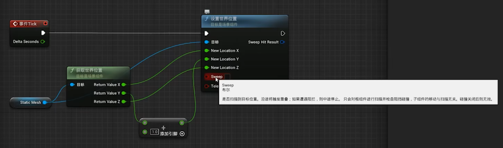

### 碰撞预设

3 种情况：

1.忽略 2.重叠
碰撞体积产生了交集。

3.阻挡

碰撞响应两种形式：

- [ ] 检测响应

如果是 pawn 形式， 则 visibility 设置为忽略，否则 pawn 的身后相机会被自身阻挡。

- [ ] 物理响应

**block all**
和任何的物体都会产生“阻挡”的碰撞判定。

**想要产生 组件命中 效果，必须双方 都设为阻挡**

