### 任务要求

1.还原车道信息、路面信息

具备车流基础导向，行道树适配、路灯适配

有纹理信息，准确的主车道信息（表达主车道数量）

示意的道路交通标线

适配库内道路交通标志、栏杆、红绿灯、路灯、公交站台等

（1）坐标精度：基于GIS数据源，坐标点偏差<= 5.2m.

（2）结构精度：还原20cm以上的结构模型

（3）纹理精度：5m >= 1024像素；纹理颜色接近真实色彩；
材质模拟材料属性（如油漆金属反光、颗粒细节）

## cityengine 每日进展

### 3.31

问题：
1.cityengine 导入道路平铺在平面上，无法创建高架立交。

### 4.01

1.高架桥在清理街道后，会直接消失；

### 规则文件关联shp数据属性

+ 规则定义：使用 `-->`定义规则
+ 属性定义：使用 `attr`定义属性
+ 条件语句：使用 `case`条件判断
+ 几何操作：`extrude` / `split` / `offset`等

### 项目操作

1.打包成外部能应用的文件
右键 - 共享为 - 勾选 Arcgis pro 兼容性

### 几何操作

| 函数    | 备注                   |
| ------- | ---------------------- |
| extrude | 将2D面拉伸为3D体       |
| split   | 将几何体分割为多个部分 |
| offset  | 偏移几何体边界         |
| rotate  | 旋转几何体             |
| texture | 应用纹理               |

## 场景对象

- 形状图层 - 静态形状
- 图形图层 - 包含街道网络和块、动态形状和生成的模型。
- 静态模型图层 - 包含静态模型
- 地图图层： 地图/图像 /场景地形

### 形状图层

来源：

- GIS面数据
- 程序生成的几何体

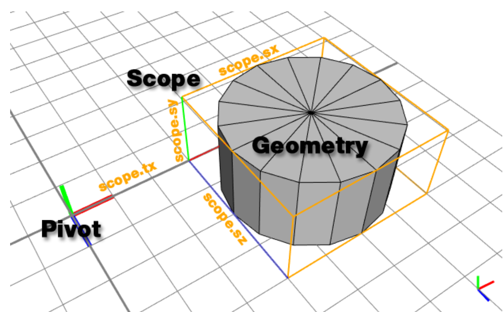
|形状符号|形状名称|
|---|---|
|枢轴|- 位置矢量p（pivot.px、pivot.py、pivot.pz  - 方向矢量 o（pivot.ox、pivot.oy 和 pivot.oz） |
|范围|- 平移矢量 t（scope.tx、scope.ty 和 scope.tz） - 旋转矢量 r（scope.rx、scope.ry 和 scope.rz） -大小矢量 s（scope.sx、scope.sy 和 scope.sz） |

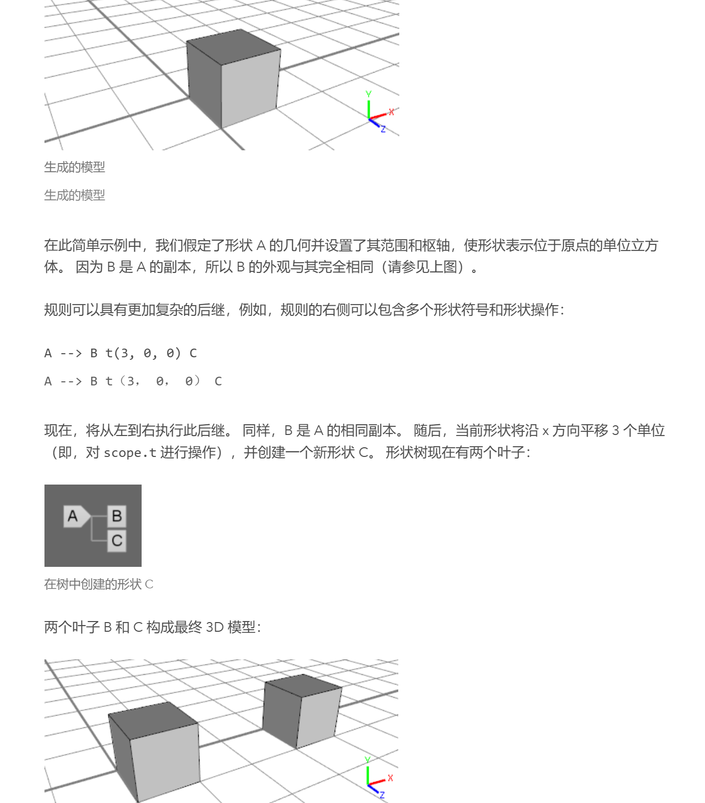

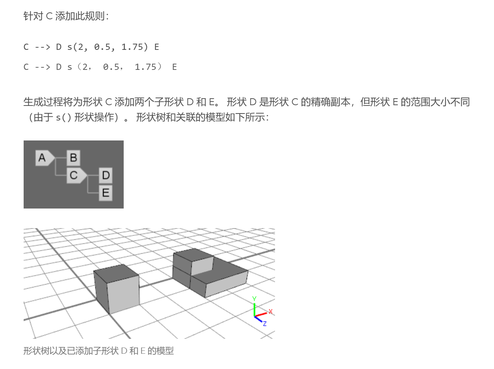
## Cityengine中四种属性

- Shapes 物体

### Blocks 块

- Blocks 块

道路相互连接形成快
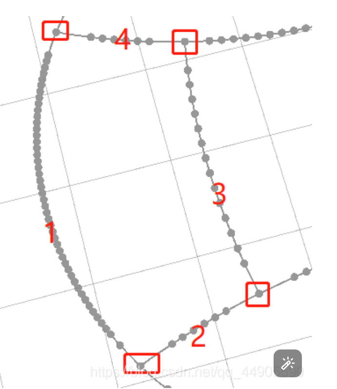
**形成街道的闭合环**

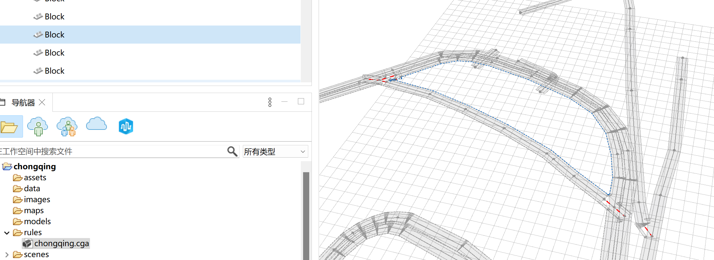

- Segments 街道部分
- Nodes 节点

## 街道形状默认初始规则

Street
Sidewalk
Crossing
Junction
Freeway
FreewayEntry
Roundabout
RoundaboutIsland
Joint

### 街道建模规则

1.区分出有路口道路、没有路口道路、一侧有路口一侧没有路口道路

### 接合点joint - 仅有两条相邻街道的点

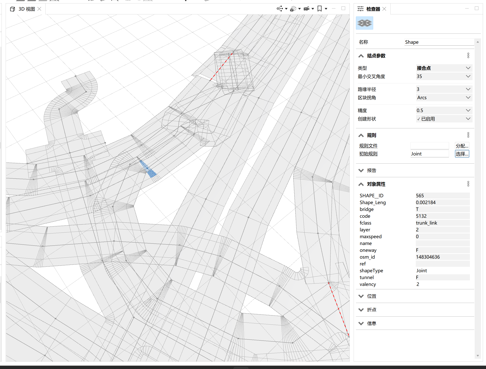

### 交汇点junction -

### 街道中心线规则

中心路线布局
选择**centre_type**

### 道路设置

- 道路平滑
  图形-曲线自动平滑

线段宽度
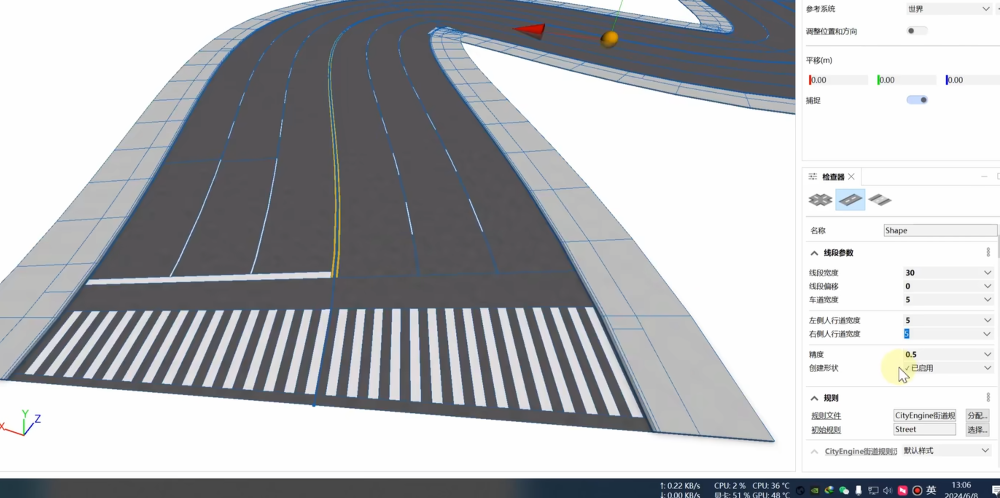

shift - 加选

节点参数 ： 类型：
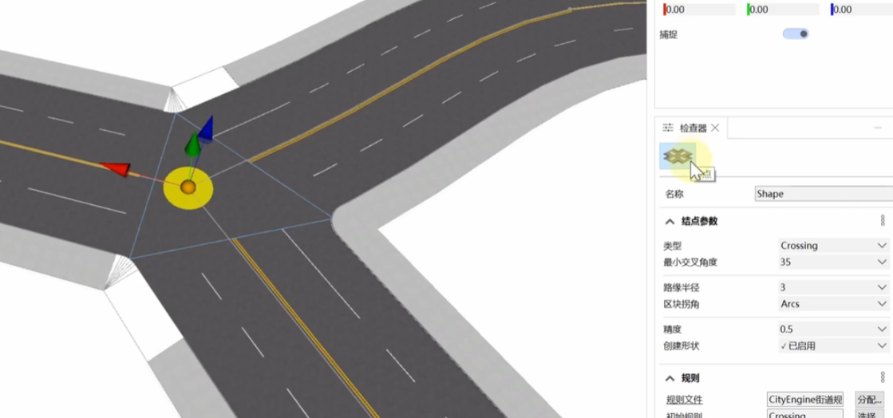

## 注意事项

### 初始规则

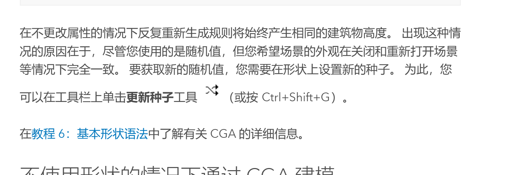

**需要设置初始规则**

## 建筑

### Lot 地块
二维的用地边界多边形

### facade  建筑立面

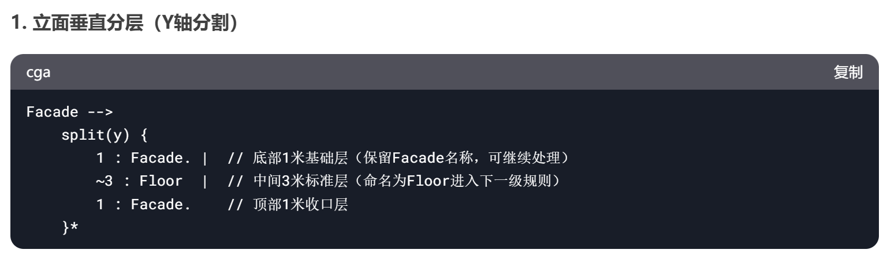
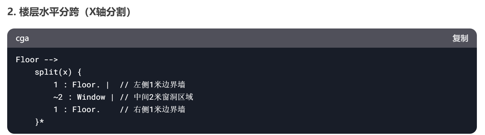
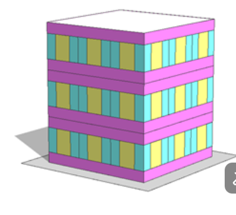

### Footprint 建筑基底/建筑轮廓

建筑物与地面接触的二维投影形状

