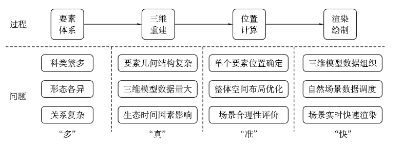

[toc]

## 摘要

- 使用高逼真的三维模型
- 能表现出自然环境要素的生长过程、结构组成和分布规律
- 满足不同尺度下的场景变换

- 本文从构造角度分析 4 个关键技术问题

## A natural scene construction method for digital twin cities

### 自然场景构造过程

- **基于模型的植物三维重建方法**
  通过植物主要器官的形态变化特征和相应的几何信息，提取植物生长过程规律，将特征参数化并动态模拟植物 i 形态结构变化过程的建模方法。
  （过程复杂，难以开展大规模三维重建）

- **基于图像的植物三维重建**

- **基于扫描数据集的植物三维重建**
  采用激光扫描、距离成像等方法多角度、跨时间地获取植物植株的位置信息，追踪植物生长过程的三维信息，后期通过自行通过自行处理或使用配套软件处理大量点云数据完成植物的三维重建。
  在基于三维点云进行植物三维重建时，需要有效处理噪声以及点云的稀疏性问题。
  （难点：对遮挡区域的枝干的重建）

### 场景要素位置确定

- **单元迭代法**

  - 通过模拟单个树木生长各个环节和个体的交互作用迭代生成森林场景。
    根据树的冠盖将单株树木抽象为圆形，按照一定速率模拟植物生长，当树冠范围内重叠时便发生资源竞争，根据竞争力确定植物位置。
    **植物种群聚集现象**植物会通过风力等生态因素将种子散播到临近区域。
  - 通过将研究区域进行规则划分（通常格网划分，适用于中小尺度森林场景的模拟）。

- **统计随机法**
  在点位数据的空间格局总体符合特征基础上，通过随机算法生成点位数据模拟植物分布。
  **Half-toning 半色调算法**使用植被分布和密度图作为全局约束条件，对研究区域进行格网划分，对密度图中像素值越高的单元树木数量越多，单元内随机生成点位赋值给单株数目模型。

## 面向数字孪生的城市自然场景构造

在空间上展现不同形态的基础地理空间要素，时间上融合历史、现状和动态监测数据，语义上集成地理实体的基本属性、实体间关系和其他社会经济信息。

## 基于深度学习的 mesh 建筑物实景三维

语义增强
纹理增强
结构增强

自然资源部 -- lod1.3

深圳市全市域诗经三位采集建模

意向公示--意见征集--招标公告--中标公示

# 数字孪生 / 时空智能 --李卫红

瓦片 GIS

倾斜摄影测量构成三角网

白膜

地理信息产业协会

时空大数据-一切和位置相关的数据

公共安全五要素——人 / 地 / 物 / 组织 / 事件 / 时空（轨迹）

下课去查查地理信息分类代码
怎么去分类/ 编码
大部分集中在地
忽略其他要素

### 人工智能

**机器学习**
机器学习针对结构化数据
公安厅犯罪预测

**知识图谱**

**大模型 GPT**

### 时空智能

空间位置 / 关系/ 网格 / 数学矩阵

### 时空人工智能

时空关系挖掘 / 知识发现 / 预测

## 数字孪生

虚实之间双向映射/ 动态交互 / 实时连接

### 主要特征

可假设性 / 可预测性 / 可解释性 / 可视性 / 可连接性

物理环境

物联设备

业务知识

模拟验证
预测预警
交互控制
智能应用

### 用什么支撑？

高效场景建模
物联感知
孪生引擎平台
**系统建模**

- 多因素
- 非线性
- 动态
- 自适应

**仿真评估**
事务仿真 解决常态化管理问题
事件仿真 解决突发事件处理
（假设发生火灾，设定行为逻辑）
社会仿真
多智能仿真

高精度室内定位
超宽带
UWP

城市天际线--符合多智能体

点云到

用计算实验代替
把人作为智能体

问题:怎么定义智能体

## 时空智能应用

课题 1：领域知识图谱
突发事件预案自动配置管理平台
**数字孪生三维仿真平台**
基础三维模型数据
数字孪生技术融合
可视化呈现

空间辅助决策平台

新疆反恐

### 公共安全方向

### 海洋风暴潮数字孪生与仿真关键技术

- 海洋风暴潮多源感知与风险建模
  海量观测数据 / 风暴潮模型
- 海洋风暴潮知识图谱和仿真推演
  知识图谱 / 推理引擎
- 海洋风暴潮数字孪生平台关键技术
  仿真计算 / 孪生环境

台风
海水倒灌

城市建构筑物 / 设施
人 / 车

好处：
台风登陆
假设知道风暴潮 ，城市模型 ， 都可进行防范仿真。

基于多智能体的城市规划仿真
马尔可夫模型 netlogo
多代理人模拟

地铁 anylogic 实现

模拟实训

### 基于多模态的数字孪生双碳测算预警管控平台研究应用

基于碳收支单元

困难
河南水利
突发事件

查规范

梳理行为准则

系统间协同仿真
