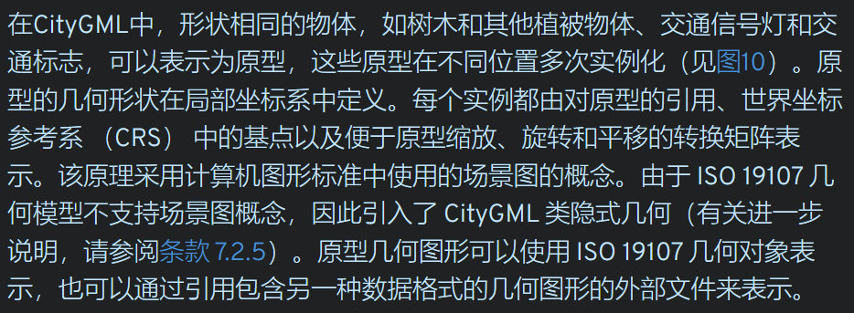
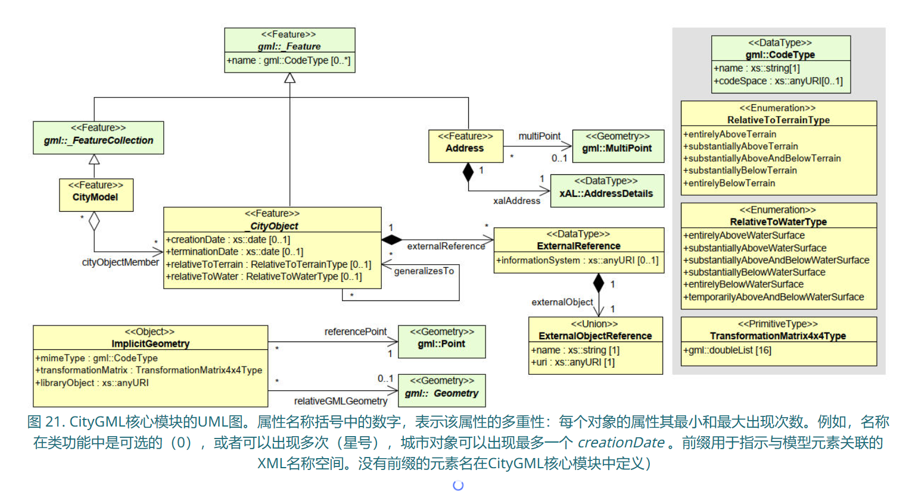
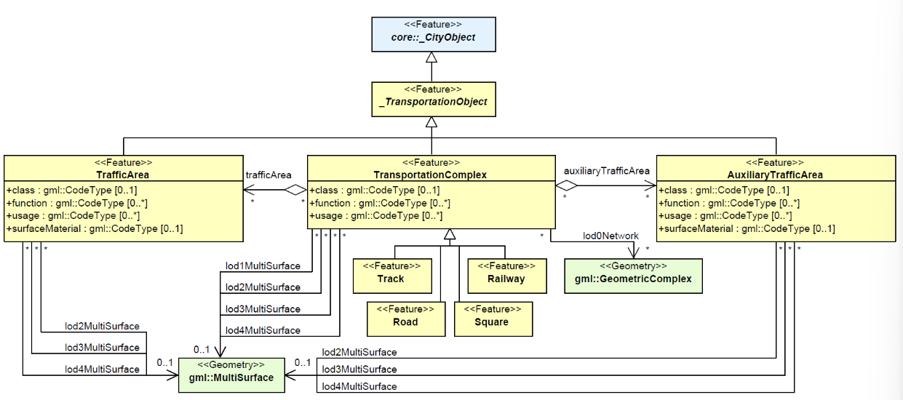
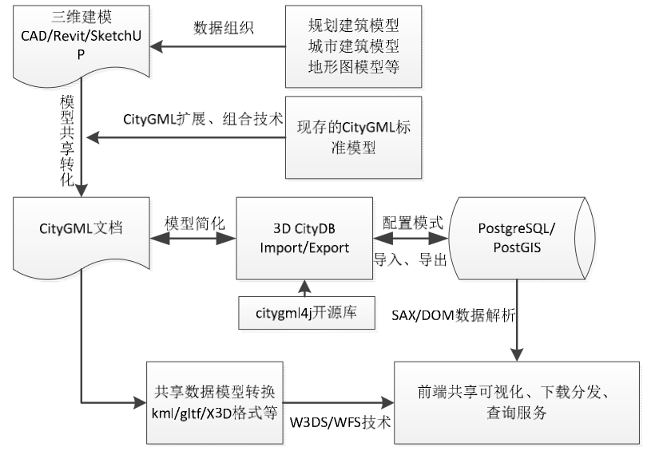

[toc]

# 基础地理信息要素分类和代码--GB/T 13923——2022

要素大类

## 1 定位基础

### 测量控制点

### 数学基础

## 2 水系

- 河流
  - 常年河
  - 时令河
- 沟渠
  - 运河
  - 干渠
  - 支渠
- 湖泊
- 水库
- 海洋要素
- 其他水系要素
- 水利及附属设施

## 居民地及设施

- 居民地
- 工矿及其设施
- 公共服务及其设施
- 农业及其设施
- 名胜古迹
- 宗教设施
- 科学观测站
- 其他建筑物及其设施

## 交通

- 铁路
- 城际公路
- 城市道路
- 乡村道路
- 道路构造物及附属设施
- 水运设施
- 航道
- 空运设施
- 其他交通设施

## 管线

- 长输输电线
- 长输通信线
- 长输油、气、水输送主管道
- 城市管道

## 境界和政区

- 国外地区
- 国家行政区
- 省级行政区
- 地级行政区
- 县级行政区
- 乡级行政区
- 其他区域

## 地貌

- 等高线
- 高程注记点
- 水域等值线
- 水下注记点
- 自然地貌
- 人工地貌

## 植被与土质

- 农林用地
- 城市绿地
- 土质

## 地名

- 居民地地名
- 自然地名

# BIM--IFC 工业基础类

## 感悟

cityGML 主要定义 5 级 lods 对建筑物外表、建筑物部件和附属设施进行多尺度表达。

## cityGML

定义了表示，存储和交换 3d 城市模型的概念模型和交换模式。通用语义信息模型

3.0 标准化了底层信息模型。

主要功能；定义建模数据对象的人工解释和其几何表示和关系。

允许 GML / XML 编码，也允许 JSON 或数据库编码。

和 BIM 继承，以不同层次（LOD）表示室内空间，支持传感器和模拟提供的动态数据。

关键词：
OGCdocument cityGML 3Dcity model

现在大多 3d 城市模型被定义为存粹图形或几何图形，忽略了语义和拓扑。

应用领域：

- 城市和景观规划
- 建筑设计
- 旅游
- 环境、能源和交通模拟
- 移动电信
- 灾害管理
- 国土安全
- 车辆和行人导航
- 培训模拟器和移动机器人

## cityGML 概念模型功能

基于 ISO 19100 系列的城市景观地理空间信息模型（本体）。
基于 ISO 3 模型的 19107D 几何图形表示，独立于数据编码以及 3D 点云。
分组到空间层次结构中，包括建筑物内楼层/楼层等概念。
表示对象表面特征（例如，纹理、材料）。
表示城市模型的动态属性，即时间相关属性。
分类和聚合包括：
数字地形模型作为不规则三角网 （TIN）、规则网格、断裂线和骨架线、质量点的组合;
场地（目前为建筑物、其他建筑、桥梁和隧道）;
植被（具有植被分类的区域、体积和孤立对象）;
水体（体积、表面）;
交通设施（图形结构、3D 空间和 3D 表面数据）;
土地利用（表示地球表面专门用于特定土地利用的区域）;
城市家具;
通用城市对象和属性;和
用户可定义的（递归）分组。
具有 4 个明确定义的连续细节层次 （LOD） 的多比例模型，适用于内部和外部：
LOD0 – 高度广义的模型;
LOD1 – 块模型/拉伸对象;
LOD2 – 现实但仍然是通用的模型;和
LOD3 – 高度详细的模型。
同时在不同 LOD 中的多个表示以及不同 LOD 中对象之间的概化关系。
能够组合不同的内部和外部 LOD，包括平面图的表示。
特征（子）几何之间的可选拓扑连接。
支持各种不同的编码规范，包括 GML 和 JSON。
通过代码列表、泛型对象和应用程序域扩展 （ADE） 扩展概念模型。
借助 CityGML 3.0，ADE 在概念层面上成为独立于平台的模型，可以映射到多个不同的目标编码。ADE 作为 UML 模型实现，扩展了本标准中的概念模型。这包括一种机制，该机制有利于通过要素子类型上的“钩子”将附加要素属性插入到任何定义的要素类中。这意味着可以使用现有要素类，并且可以在不同的编码中轻松支持一个或多个 ADE 中的其他属性。
能够指定可以进一步扩展的 ADE。

## 一致性

标准化目标：

- 概念模型
  标准化目的：
  - 省略一个或多个可选 UML 包
  - 减少属性或关联多重性
  - 对属性有效值限制
  - 通过 ADE 记录的其他概念 # 此步需要扩展 CITYGML 概念模型
- 实现规范

单词“应”（不是“必须”）是动词形式，用于表示为符合本标准而严格遵守的要求

### 术语

2d 数据
2.5d 数据--要素几何在三维空间中表示，约束条件：对每个(x , y)位置，只有一个 z。

UML 表示法

需求类

与黄色关联的需求类不同的类的表示
以蓝色绘制的类属于与黄色关联的要求类不同的要求类。为了显式指示这些类属于哪个要求类，它们的类名前面是该要求类的 UML 包名称。例如，在建筑要求类的上下文中，CityGML 核心和施工要求类中的类被涂成蓝色，其类名前面分别是核心和构造。

仅适用于类 AnyFeature。AnyFeature 是元类 FeatureType 的一个实例，充当 CityGML UML 模型中所有类的超类，构造型为 «FeatureType»。元类是其实例为类的类。

白色
用于 UML 图中提供的注释和对象约束语言

**示例**
黄色类与 CityGML 建筑模块相关联，蓝色类来自 CityGML 核心和构造模块，绿色类描述由 ISO 19107：2003 定义的几何元素

## GML3 几何拓扑模型

## 城市 GML

该标准定义了一个开放的 cityGML 概念模型

垂直框显示不同的主题模块。水平模块指定适用于所有专题模块的概念

三个模块建筑、桥梁和隧道对土木结构进行建模，并共享在施工模块中分组的通用概念

- appearance--城市对象外观（纹理和颜色）
- pointcloud
- generics 泛型--定义泛型对象、属性和关系概念
- dynamizer--按时间序列数据表示城市对象属性的概念，将其与传感器、传感器数据服务或外部文件链接的概念。
  

UUID 全局标识符

cityGML 可能出现属性：

- 限定属性值：如度量由值和对度量单位的引用组成。如相对高度和绝对高度级别，需命名引用（参考）级别
- 代码列表值——枚举形式，有效值在单独的寄存器中定义
- 由不同字段和值的元组组成的属性。如地址、空间占用等
- 由数字列表组成的属性。如表示坐标列表或矩阵。

双时态时间戳--支持功能历史记录。
validFrom / validTo

### 类层次结构

特定要素类型（建筑物 / 隧道 / 水体）被定义为更一般高级类的子类，

更专业的特征类型沿整个制图综合路径继承其所有超类的属性和关系，直至最顶层的特征类型 AnyFeature

要素间一般关系--关联到城市对象
使用 cityObjectGroup 的用户定义聚合（允许递归聚合）
外部参考--BIM / 地籍等外部资源的响应实体链接

### 空间属性表示

**几何和拓扑**
所有 CityGML 要素类型的空间属性均使用 ISO 19107 中定义的几何类表示。空间制图表达可以具有 0、1、2 或 3 维范围，具体取决于相应的要素类型和细节层次。
LOD

**所有几何必须使用 3D 坐标值。**
ISO 19107

\*\*允许通过递归聚合为相应维度的每个基元类型定义复合几何。

cityGML 虽然不适用 19107 的拓扑类，但可通过在不同几何对象间共享几何来建立几何间拓扑关系

### 原型对象 / 场景图

### 坐标参考系

与 CAD 或 BIM 相比，每个 3D 点都是绝对地理参考的，这使得 CityGML 特别适合表示地理上较大的扩展结构，如机场，铁路，桥梁，水坝，其中地球曲率对物体的几何形状有显着影响

可以通过从抽象 GML 超类 GML:\_Geometry 继承放入属性 srsName 指向其 CRS 定义

### 8.3 隐式几何

implicit geometry

一个几何对象，形状只作为原型集合体存储一次。
此原型集合体对象被多次重复使用或引用。
用一个基点和一个变化来表示。

与使用绝对世界坐标表达物体的显式建模比，更节省空间，加快可视化速度。

## 9 外观模型

## 10 主题模型

CityGML 数据模型中所有主题类的基类都是抽象类 \_CityObject。 \_CityObject 提供了创建日期与终止日期，用于管理特征的历史记录，以及在其他数据集中对同一对象的外部引用。

### 10.2 地形模型 - relief

### 10.3 建筑模型

### 10.6 水体模型

在 LOD1 中，水体通过 solid 形式建模。

如果水体由 LOD2 或更高细节级别的 gml:Solid 表示，则对应专题的 WaterClosureSurface，WaterGroundSurface 和 WaterSurface 对象的表面几何形状必须与 gml:Solid 的外壳重合。

WaterSurface 的可选属性 waterLevel 可用于描述水位，此时必须给定相应的三维表面几何形状。当水体受潮汐影响时，这一点尤其重要。

水体模型还隐含了 TerrainIntersectionCurves(TIC) 的概念。例如，为了指定 DTM 与 WaterBody 的三维几何图形的精确交集，或将 WaterBody 或 WaterSurface 调整到周围的 DTM 上（参见第 6.5 章）。此时 WaterSurface 多边形的环则暗示了水体与地形或盆地的交集。

### 10.7 transportation

surfaceMaterial 属性指定路面类型，且可用于 AuxiliaryTrafficArea（例如沥青，混凝土，砾石，土壤，铁路，草地）

## cityGML core model--空间概念 / 细节层次 / 特殊空间类型

### 空间和空间边界

占用空间代表在城市环境中占据空间的物理体积对象。占用空间的示例包括建筑物、桥梁、树木、城市家具和水体。

未占用空间的示例包括建筑房间和交通空间

### 通过空间组合对城市对象进行建模

- 空间分区：空间类型为“占用空间”或“未占用空间”的语义对象被细分为与父对象具有相同空间类型的不同部分。
- 交替控件类型的嵌套

### 细节层次

LOD-0
建筑平面图
体积真实世界对象（空间）可以在空间上由单个点、一组曲线或一组表面表示。区域真实世界对象（空间边界）可以在 LOD0 中由一组曲线或一组表面在空间上表示。LOD0 表面表示通常是将体积对象的形状投影到平行于地面的平面上的结果，因此表示覆盖区（例如，建筑物覆盖区或建筑物内房间的平面图）。LOD0 曲线表示是垂直表面（例如，墙面）的形状投影到接地平面上的结果，或者是纵向体积形状的骨架，例如道路或河段。
LOD-1
室内元素
体积现实世界的对象（空间）在空间上由垂直拉伸实体表示，即通过垂直拉伸从水平覆盖区创建的实体。区域真实世界对象（空间边界）可以在 LOD1 中由一组水平或垂直表面在空间上表示。
LOD-2
建筑物外壳
体积真实世界对象（空间）可以在空间上由一组曲线、一组曲面或单个实体几何体表示。区域真实世界对象（空间边界）可以在 LOD2 中由一组表面在空间上表示。现实世界物体的形状在 LOD2 中被概括，较小的细节（例如，凸起，凹痕，门槛，以及建筑物的阳台或天窗等结构）通常被忽略。LOD2 曲线表示是纵向范围的体积形状的骨架，如天线或烟囱。
LOD-3
体积真实世界对象（空间）可以在空间上由一组曲线、一组曲面或单个实体几何体表示。区域真实世界对象（空间边界）可以在 LOD3 中由一组表面在空间上表示。LOD3 是最高级别的细节，相应的几何图形包括所有可用的形状细节。

（和早期版本变化）：

- LOD4 删除
- 细节层次不再和城市对象的语义分解程度相关联，仅指空间表示
- **几何表示从主题模块移动到核心模块，现在和空间和空间边界的语义概念相关联。这大大简化了专题单元的模型。由于专题模块中的所有要素类型都定义为空间和空间边界类的子类，因此它们会自动继承几何类，因此不再需要与它们直接关联。这也导致了所有城市 GML 要素类型的统一 LOD 表示。**
-

## buildings

LOD1--

外立面
\_BoundarySurface / BuildingInstallation

- \_BoundarySurface
  墙 WallSurface / 屋顶 RoofSurface / 地面 GroundSurface / 外地面 OuterFloorSurface / 外部天花板 Outer-CeilingSurface / 封闭面 ClosureSurface

抽象建筑
structure
Construction::GroundSurface,
Construction::RoofSurface,
Construction::CeilingSurface,
Construction::OuterCeilingSurface,
Construction::FloorSurface,
Construction::OuterFloorSurface,
Construction::WallSurface,
Construction::InteriorWallSurface

- core::ClosureSurface
- Generics::GenericThematicSurface

ADE 中代码列表

## Bridges

类型分类
我国地理信息分类标准大中小
按环境
道路
建筑
水系
植被
农业
地貌
到平台内标准

每一类模型和数据表达方式

arcgis 超图
按后台加载能力 / 数据管理能力 / 数据分析能力 来进行选型。

anylogic--地理仿真

- 超图

**三维 GIS**
用 cesium 引擎作为基础开源

**后台加载**
配置服务地址

可知道服务的四至、中心点信息。

**数据分析**

- arcgis
  用 arcgis api for javascript / arcgis pro

## 植被对象

Vegetation

单个植被对象
SolitaryVegetationObject 类
property:

- class -- 包含对象或植物习性分类（树、灌木、草，且只能出现一次）
- function 可选属性 预期真实用途 可多次出现
- usage 可选属性 预期真实用途 可多次出现
- species
- height
- trunkDiameter 树干直径
- crownDiameter 冠直径

SolitaryVegetationObject 的几何图形可以在 lod1-4 中由具有绝对坐标值的 GML 几何图形明确定义，或通过*ImplicitGeometry*原型定义。

---

填充了特定植被的区域（会自动填充相应的（可能随机）混组的三维植物对象）
PlaneCover 类：
几何形态（取决于垂直范围）：

- MultiSurface
- MultiSolid
  
  property:
- class
- function
- usage
- averageHeight

## WaterBody

界——水面 / 水表面（表示水体和大气之间的上外部界面） / 水地表（表示水体淹没底部的外部边界表面（如 DTM 和 3D 盆地的地板））

**ADE data types**

国内简单标准
和国际标准比对

基于 GML 数据转换

市级国土空间总体规划数据库规范

新型基础测绘与实景三维中国建设技术文件

citygml

《基于 CityGML 三维建筑物模型共享技术研究》

- 研究异构数据源向 CITYGML 标准模型转换方法
- citygml 建筑物数据模型结构研究/基于 postgresql 管理
-

研究最多领域：IFC 和 CITYGML 标准间转换

与传统模型优势：

- 传统重集合拓扑外观表达，轻语义
- 传统缺乏拓扑结构明确的三维模型和数据结构，产品制作公司相互独立生产，数据结构和模型互操作性较低。
- 传统与算法结合浅，无法实现几何和语义联动。
-

- 对 XML / GML / CITYGML 标准间关系进行研究
  命名方式 / 命名空间引用规则， uuuuui

**citygml 模块分类**

### 语义--几何拓扑信息一致性

主要以语义嵌套关系聚合作为皮，以几何嵌套聚合层次作为骨架，几何嵌套层次中包含有模型空间拓扑关系。

### ADE CITYGML 扩展应用

扩展应用方式有两种：

- 不改变原有文件模式在对象类 genericAttributes(扩展 string , int , real , data , URL) 和 genericCityObjects 进行扩展。
- 利用 ADE 定义新的对象和属性 xsd 文件模式。

上两种方式都是利用 xml schema 的派生和继承机制。

《融合语义信息的水库大坝安全监测三维模型》

citygml -- citygml core

## 基于 citygml 的 LOD 多尺度三维语义模型构建方法

- LOD0
  使用含有高程坐标的建筑物底部轮廓或屋顶边缘形成的 2.5D 多边形表达，将采集的建筑物轮廓矢量数据叠加到数字高程模型（DEM）。
- LOD1}
  使用块状对象简单表示建筑物三维模型，通过建筑物二维轮廓数据结合建筑高度简单拉伸自动生成。
  arcgis / qgis 根据高度字段拉伸形成 lod1 模型，利用 arcgis 工具箱或插件转换为 citygml 模型；
  也可编程读取 shapefile / geojson 格式矢量数据，用代码输出 citygml lod1 块状模型。
- LOD2
  当前许 多部门已经积累了大量基于 SketchUp 和 Autodesk 3ds Max 等三维交互设计软件建立的建筑物格网 MESH 模型。
  几何精度较高，但缺乏语义信息。

法 1：计算法向量

法 2：基于点云数据三维重建。

- LOD3
  利用 FME feature manipulate engine 等空间数据软件编程实现。

FME 不仅支持 SketchUp，Collada，Autodesk 3ds Max， Autodesk Revit，IFC 和 CityGML 等各类三维模型 的读写，而且还可提供要素类型过滤 (FeatureTypeFilter)、几何图形过滤(GeometryFilter)、 几何图元提取(GeometryPartExtractor)、几何类型转 换 (GeometryCoercer) 和几何属性设置
(GeometryPropertySetter)等大量语义和几何处理函 数，有利于不同三维模型数据的快速转换。

## IFC 和 cityGML 数据标准对比

