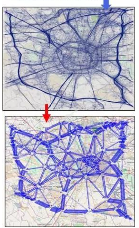
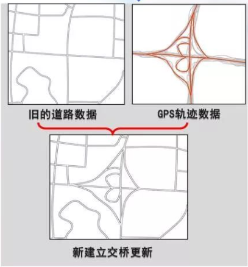
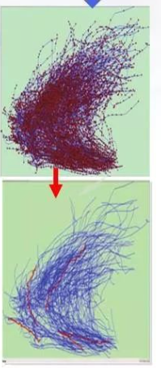
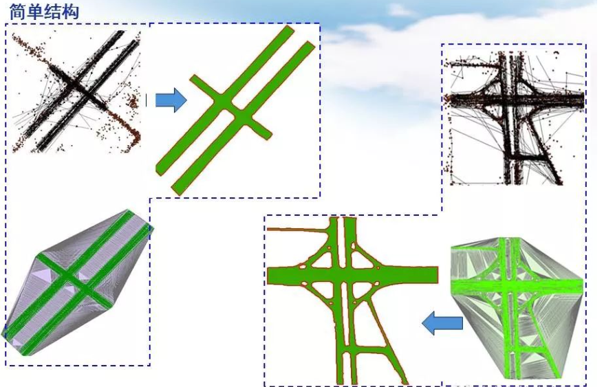
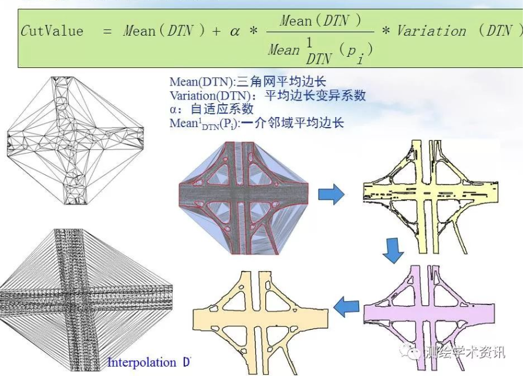

[toc]

### 空间大数据特征

见公众号测绘学术咨询

众源大数据：
签到轨迹数据
OSM数据
网民标注POI点数据
用户上传车载GPS轨迹

出租车OD数据揭示城市空间需求

城市实时人流量分布

POI发现 空间热点区域

更新道路、建筑、公共设施、POI点等（应用GPS轨迹数据更新车道）

### 众源轨迹线大数据地图综合
通过轨迹数据的抽象概括交通流量模式提取

最新道路设施更新

航行主航道分析

+ **将空间统计分析和尺度变换结合**

1.轨迹数据预处理
+ 噪音数据清洗
+ 基于移动特性的不确定性数据清洗
+ 轨迹点群的密度分析和边界识别

2.构建三角网，提取道路边界

3.边界控制性调整

4.中心线提取
道路面域中二次建DTN，从而提取道路中心线。

+ **同时顾及时间尺度和语义特征的影响**

### 空间认知
空间认知三阶段：
获取特征点标识
landmark knowledge

获取路径连接通道，将孤立的特征标识物通过有序的连通路径建立网络体系
route knowledge

获取二位延展区域上的空间布局、相互关系知识，在认知世界通过“路线绕道、街景、新建 导航路径”获得新知识。
survey knowledge

### 隐喻地图
对非空间信息（语义信息）的仿地图可视化表达。

语义相关性、层次性
因果联系
过程序列

生成原理：
语义的抽象概括（地图综合）
多维信息的降维和主成分提取（地图投影、合理几何构造）
语义到图形的映射（地图符号化）

PatentMap

