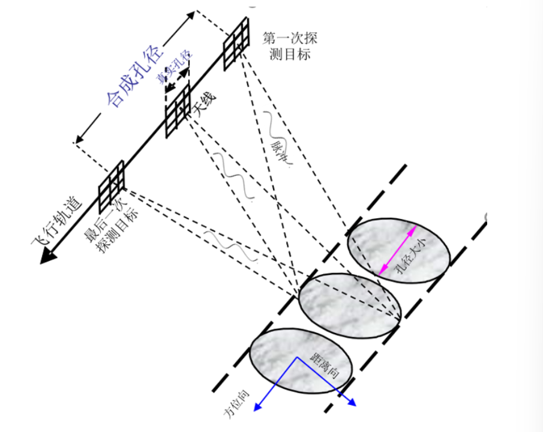
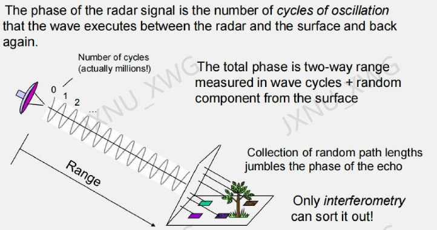
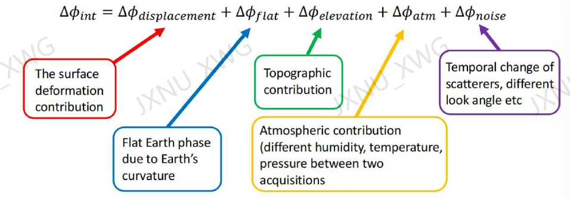
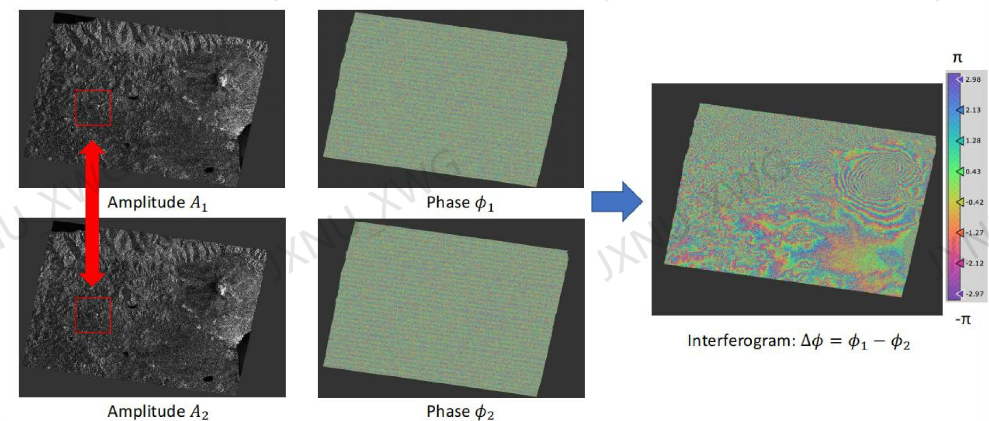

[toc]

## SAR

SAR 影像是复数影像，包括振幅图和相位图影像。

距离多普勒成像

合成孔径雷达干涉测量（Interferometric Synthetic Aperture Radar，InSAR)

配准 interferogram generation--
--filtering--phase unwrapping--geocode

平地相位、地形相位、形变相位、大气延迟相位以及噪声

### 1 配准

### 2 去除平地相位

通过减去 DEM 来得到差分干涉图

### 3 大气延迟相位

### 4 多视和滤波处理、去除散斑

### 5 解缠

### 6 地理编码

### decorrelation
