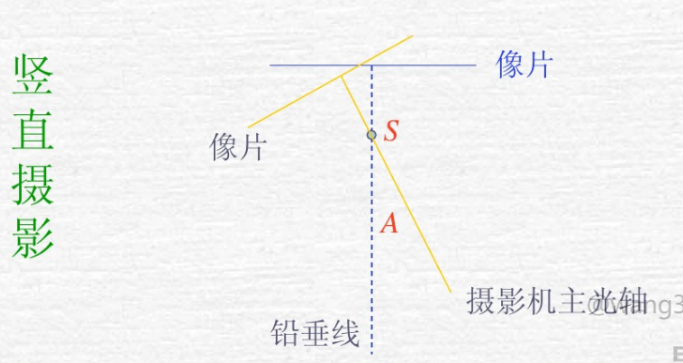
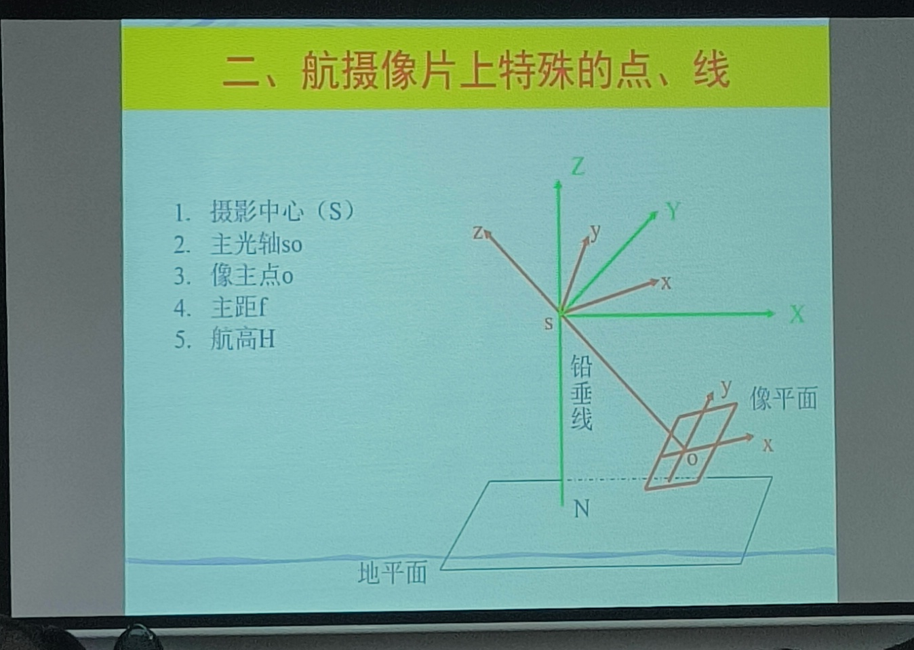
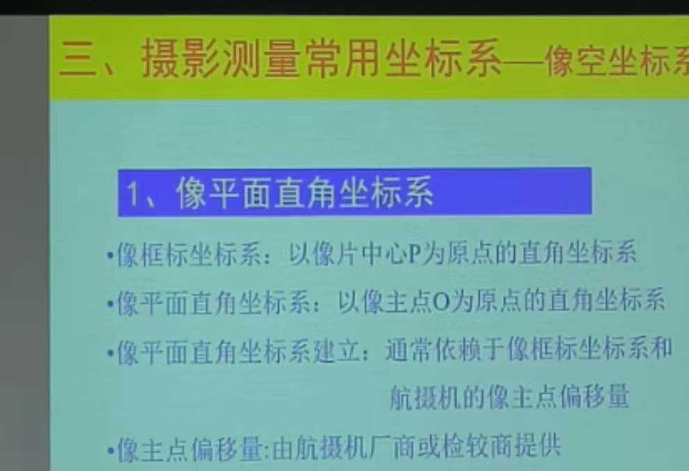
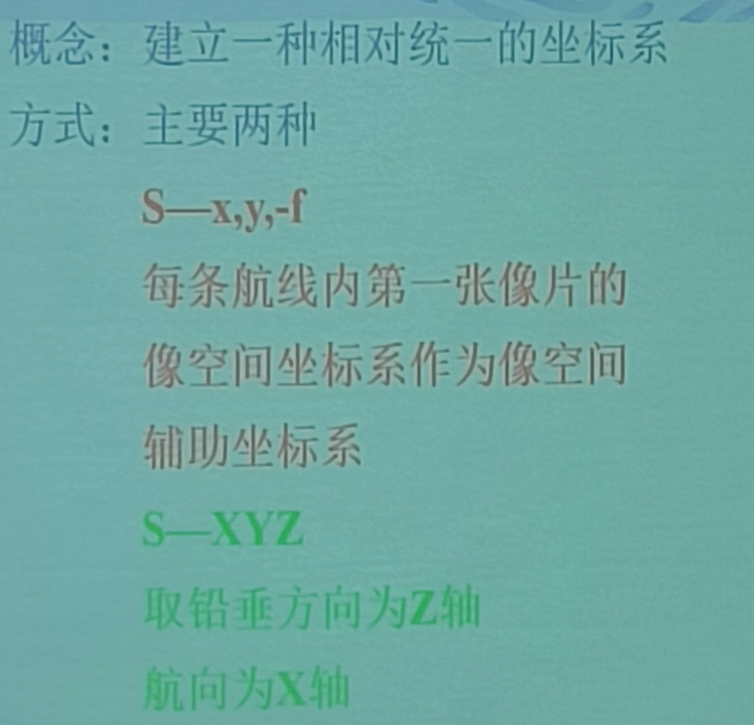
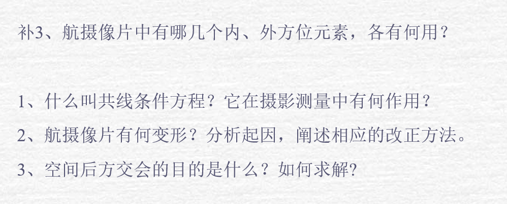
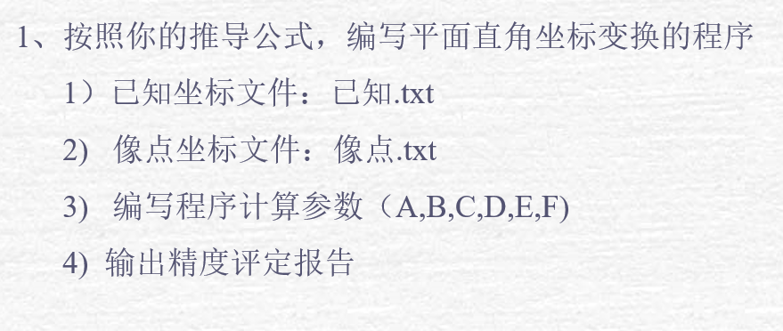
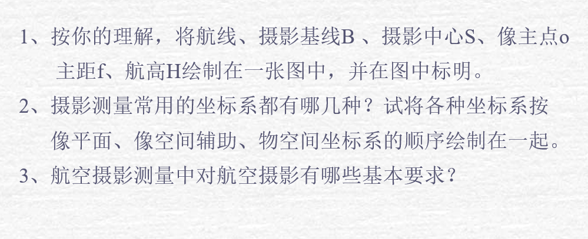
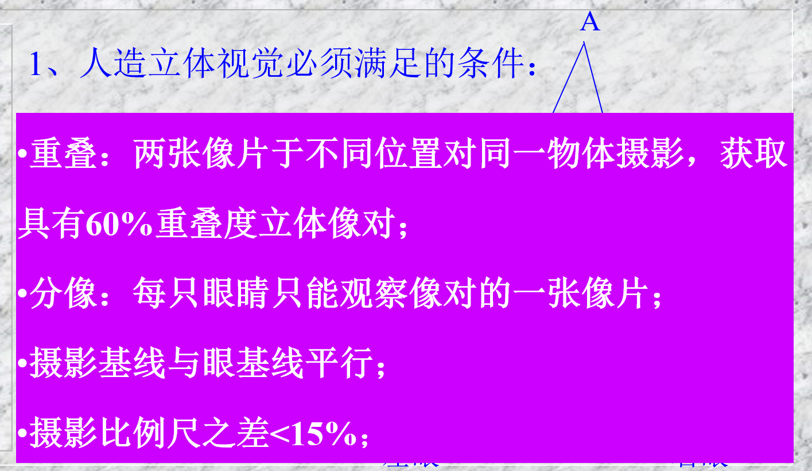
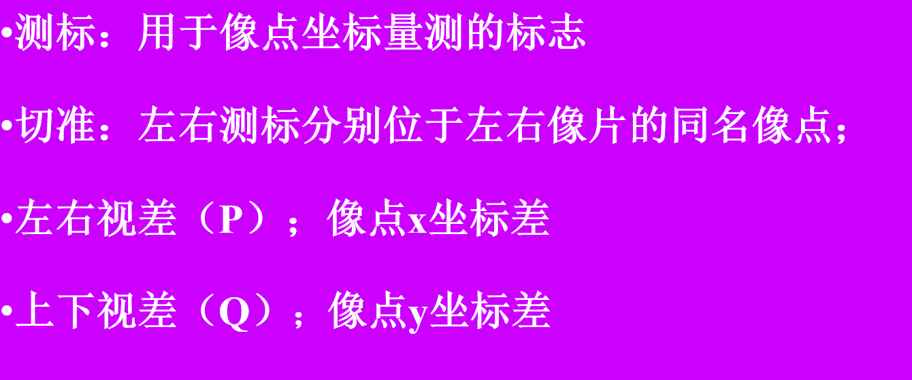

## 摄影测量基本概念

## 摄影测量常用坐标系

相片-- 左片 / 右片->立体像对

坐标系统：
实物坐标系统 / 相片坐标系统 / 模型坐标系统

实物-> 相片 -> 模型
建立关系

摄影测量学：
模拟摄图-解析测图-数字测图

**单张航摄像片解析**

## 摄影测量内外方位元素

转换参数

## 航空摄影基本知识

摄影物镜

物镜中心（摄影中心）

飞行
竖直摄影
像片倾角
摄影：竖直摄影，像片倾角<3°
航向重叠>60%
旁向重叠>30%
摄影基线：摄站的间距，通常用 B 表示。

 1.像框标坐标系:P 以像片中心 P 为原点的直角坐标系。

以像主点为原点可建立坐标系。

 2.像平面坐标系：以像主点 O 为坐标系

像平面找到后还要得到 z 轴，即主光轴

像空间坐标系。

反向延长焦距 f 得到摄影中心 s
即建立了像空间坐标系。

**像空间辅助坐标系（S-XYZ）**

目的：把两个像片的坐标系链接在一起

方式：两种

1-4 像方坐标系
物方坐标系

基线

5. 摄影测量坐标系
   把辅助坐标系 z 轴反向平移到地面建立的 P-XpYpZp 坐标系。

地面测量坐标系 t-XtYtZt

地面摄影测量坐标系 A-XtpYtpZtp

## 航摄像片的方位元素

用摄影测量方法研究被摄物体的几何信息和物理信息时，必须建立该物体和像片之间的数学关系。
**方位元素**
确定摄影时摄影物镜（摄影中心）、像片和地面三者之间的相关位置（姿态）的参数。
**内方位元素**
表示摄影中心和像片之间相关位置（姿态）的参数。
**恢复**-

- 恢复摄影时的摄影光束。
- 确立测图所需要的立体模型的基础。

**外方位元素**
表示摄影中心和像片在地面坐标系中的相关位置（姿态）的参数

## 像点坐标转换

## 共线条件方程

作业 3

作业 2（不做）

作业 1

## 双向解析摄影测量

左右视差会影像平面误差，上线视差会影像高程误差。

## 解析空中三角测量

借由测量目标点与固定基准线的已知端点的角度，测量目标距离的方法。

## 空间后方交会解求外方位元素

绪论 第二篇第 1 章 2 章 3 章 4 章 6 章
第一篇第 4 章 5 章 6 章
