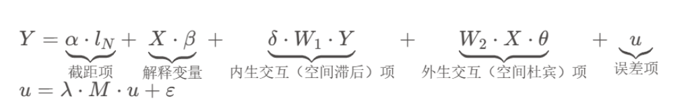
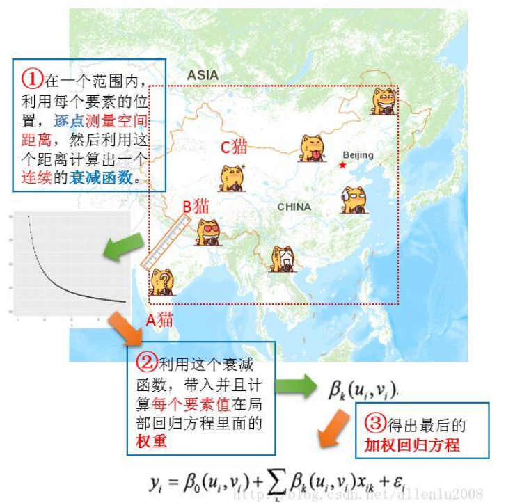
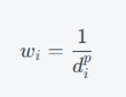

[toc]

感悟：
不要做传统回归分析，查看空间自相关分析。

2.衡量两个变量间相关关系时，先去掉滞后性。

宋涛--空间相关 / 空间回归

## 空间自相关

是一种地理学第一定律的表达，它主要描述的是空间样本(变量)间的相互依赖特性，即相关性。这种相互依赖性可能表现在不同的空间尺度上，如一个空间单元内的信息与其周围单元的信息有相似性。这也就是说，如果一个地点的某一属性值发生变化，那么在周围地点的同一属性值可能也会发生变化。例如，如果一个地区的犯罪率升高，那么在邻近地区的犯罪率也可能升高。这种相互依赖性是地理学的一个重要特征。

**自：**代表单类样本间的相关性。

## 空间异质性

指空间位置差异造成的观察行为不恒定现象，它源于生态学过程和格局在空分布上的不均匀性及其复杂性。在地理学中，它被广义地理解为空间样本格局分布和演化过程在空间上的不均匀 (质)性。具体来说，空间异质性可以理解为不同地区存在不同的次区域，且各区域间误差的变异不相等。例如，在研究犯罪率与教育程度的关系时，可能会发现不同地区 (如文教区、贫困区)的犯罪率可能存在差异，这就是空间异质现象的一种表现。

总的来说，空间自相关和空间异质性都是理解和解析空间数据的重要概念，也是地理学中的重要研究对象。

## 空间回归

在经典统计回归分析基础上考虑了空间的自相关性。

**根据回归模型“是否存在空间同质特征（或反之空间异质性）”，通常可以将空间回归模型划分为 全局空间回归模型 和 局部空间回归模型。**

### 全局空间回归模型

以**空间依赖性**为主体，研究不同变量、误差项键的空间交互效应。

广义嵌套模型：

### 变参空间回归

**地理加权回归**：

## 空间插值

### IDW inverse distance weighting

1.确定待插值位置和已知样点位置。 2.根据待插值位置与已知样点的欧几里得距离（或其他距离指标），计算每个样点的权重，一般权重与距离的倒数成正比。 3.使用每个样点的权重对其函数值进行加权平均，得到插值结果。

其中 wi​ 是第 i 个样点的权重，di​ 是该样点与待插值位置的距离，p 是一个可调参数，一般取值为 2 （欧几里得距离）或 3 （曼哈顿距离），也可以通过交叉验证等方法来确定最优的 p 值。

**优缺点：**

## 案例 1：基于空间相关分析和水质模型的面源污染评估

## 案例 2：基于空间相关分析的职住空间关系研究

### 案例 3：滑坡灾害分析

多元统计分析
