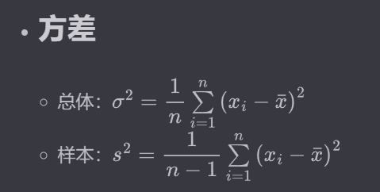
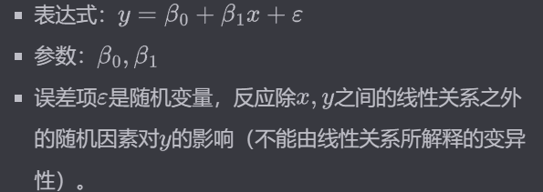
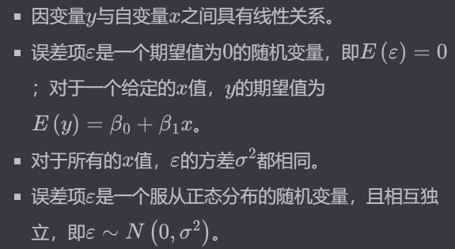
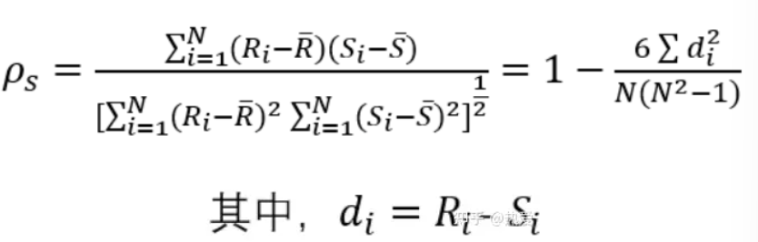
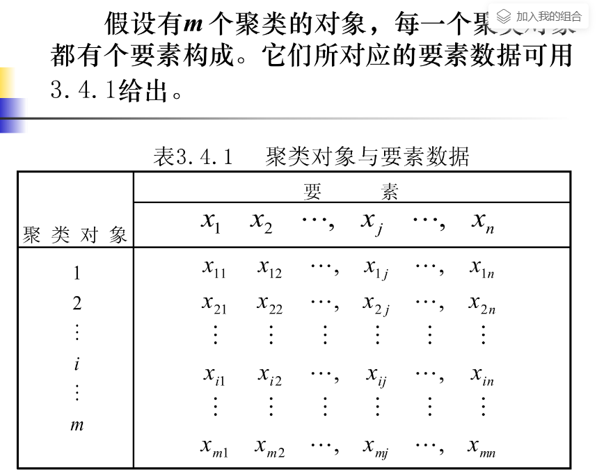
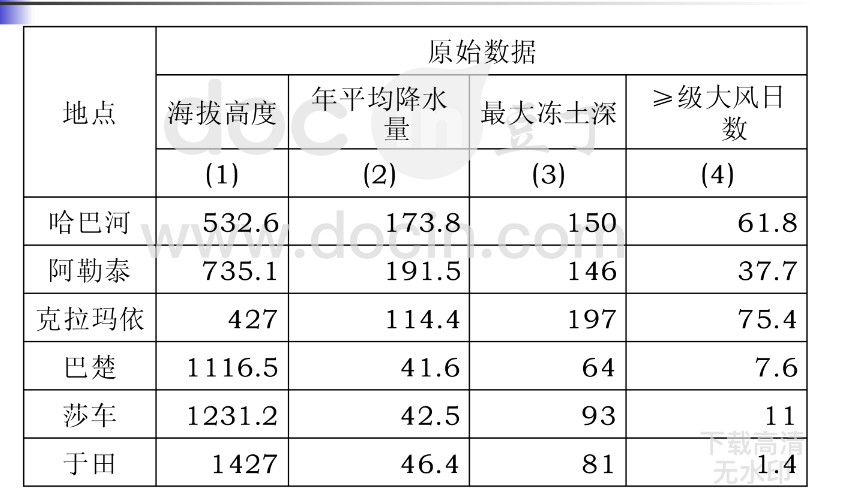

相关网站
https://myetyet.github.io/posts/af5b8159/

## 数学描述统计

**方差**

解释：
用样本推测总体

## 相关和回归分析

### 相关系数

- 若相关系数是根据总体全部数据计算而得，称为总体相关系数，记为 ρ。
- 若是根据样本数量计算，则称为样本相关系数，记 r。

### 显著性检验

目的：检验两个变量之间是否存在线性相关关系。

### 偏相关分析

在对其他变量的影响进行控制的条件下，衡量多个变量中某两个变量之间线性相关程度的指标称为偏相关系数。

### 一元线性回归

基本假定：

### spearman 秩相关系数

评估两个变量之间的单调关系。/
pearson 评估两个变量的线性关系。

## PCA 分析

用较少的几个综合指标来代替原来较多的指标，而这些较少的综合指标既能尽多地反映原来较多指标的有用信息，且相互之间又是无关的。

### 影响因子分析

因子分析就是将大量的彼此可能存在相关关系的变量，转换成较少的彼此不相关的综合指标的多元统计方法。

因子分析是**主成分分析的推广**，也是利用降维的思想，由研究原始变量相关矩阵或协方差矩阵的内部依赖关系出发，把一些具有错综复杂关系的多个变量归结为少数几个综合因子的一种多元统计分析方法。

**区别**
① 主成分分析模型是原始变量的线性组合，是将原始变量加以综合、归纳，仅仅是变量变换；而因子分析是将原始变量加以分解,描述原始变量协方差矩阵结构的模型；只有当提取的公因子个数等于原始变量个数时，因子分析才对应变量变换。

② 主成分分析中每个主成分对应的系数是唯一确定的；因子分析中每个因子的相应系数即因子载荷不是唯一的。

③ 因子分析中因子载荷的不唯一性有利于对公因子进行有效解释；而主成分分析对提取的主成分的解释能力有限。

## 聚类分析

### 系统聚类

开始时把每个样品作为一类，然后把最靠近的样品（即距离最小的群品）首先聚为小类，再将已聚合的小类按其类间距离再合并，不断继续下去，最后把一切子类都聚合到一个大类。

### 模糊聚类

模糊集理论的提出为软划分提供了有力的分析工具，用模糊数学的方法来处理聚类问题，被称之为模糊聚类分析。由于模糊聚类得到的样本属于各个类别的不确定性程度，表达了样本类属的中介性，更能客观地反映现实世界，从而成为聚类分析研究的主流。

### 地理数据的聚类分析处理

- 1. 地理数据的对数变换

使数据的变幅减小且变均匀。

对数变换处理

- 2.地理数据标准化
