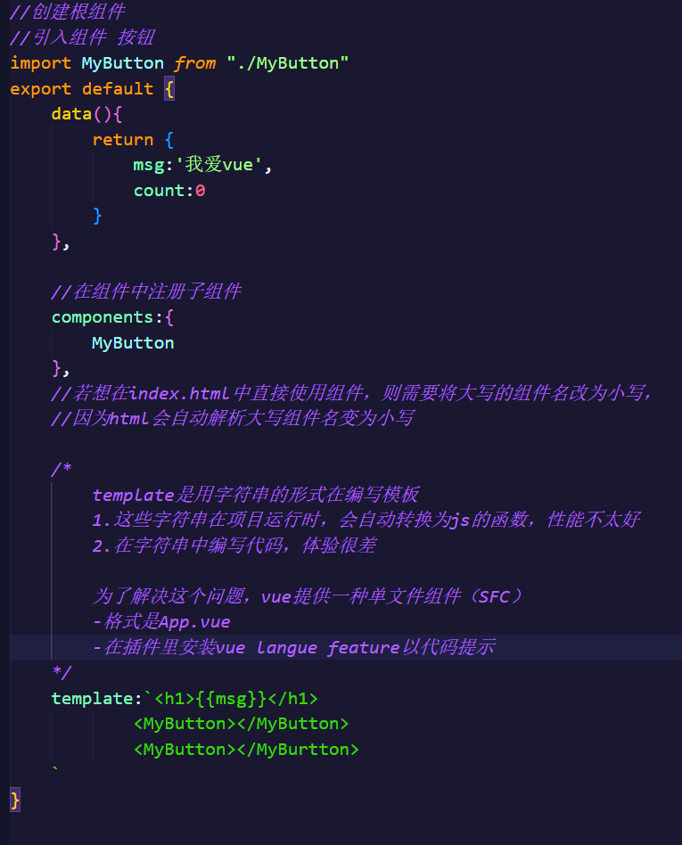

                               [toc]

# Vue

一套用于构建用户界面的渐进式Javascript框架

渐进式：Vue可以自底向上的逐层应用

```html
2013 seed

2014 Vue.js

2015 Vue1.0.0 Evangelion

2016 Vue 2.0.0 Ghost in the shell

2020 Vue 3.0.0 One Piece

```

## vue组件化

```javascript
组件就是一个普通js对象
const App={
    //...
}
创建应用
const app=createApp(App)

挂载到页面
app.mount("#root")


```



## vue生命周期


+ **beforeCreate（初始化界面前）**
+ **created（初始化界面后）**
+ **beforeMount（渲染dom前）**
+ **mounted（渲染dom后）**
+ **beforeUpdate（更新数据前）**
+ **updated（更新数据后）**
+ **beforeDestroy（卸载组件前）**
+ **destroyed（卸载组件后）**

### Vue 特点

1.采用组件化模式，提高代码复用率

2.声明式编码，让编码人员无序直接操作DOM，提高开发效率。

**命令式编码（如jquery)**

```javascript
//准备html 字符串
let htmlStr=''
//遍历数据拼接html字符串
persons.forEach(p=>{
    htmlStr+=`<li>${p.id}-${p.name}-${p.age}</li>`
});
//获取list元素
let list=document.gerElementById('list')
//修改内容（亲自操作DOM）
list.innerHTML=htmlStr

```

**声明式编码**

```html
<ul id='list'>
    <li v-for='p in persons'>
        {{p.id}}-{{p.name}}-{{p.age}}
    </li>
</ul>
```

3.使用虚拟DOM+优秀的Diff算法，尽量复用DOM节点。

原生JS(real-DOM):

```html
<ul id='list'></ul>

<script type='text/javascript'>
//一些人的数据
  
let persons=[
    {id:'01',name:'zhangsan',age:23},
    {id:'02',name:'lisi',age:33},
    {id:'03',name:'wangwu',age:43}
]
//准备html 字符串
let htmlStr=''
//遍历数据拼接html字符串
persons.forEach(p=>{
    htmlStr+=`<li>${p.id}-${p.name}-${p.age}</li>`
});
//获取list元素
let list=document.gerElementById('list')
//修改内容（亲自操作DOM）
list.innerHTML=htmlStr
  
</script>
```

虚拟DOM：

### 实例1 初识Vue

```html
    <div id="root">
      <h1>hello,{{name}}</h1>
    </div>

    <script type="text/javascript" src="../vue.js"></script>

    <script>
      const root = new Vue({
        el: "#root",
        data: {
          name: "yusiquweierwang",
        },
      });
    </script>
```

+ 想让Vue工作，必须创建一个Vue实例，且要传入一个配置对象。
+ root容器中的代码依然符合html规范，但混入了一些Vue特殊语法。
+ root容器中的代码被称为vue模板。
+ **vue实例和容器一一对应。**
+ 真实开发中只有一个vue实例，且会配合组件一起使用。
+ {{xxx}}中xxx写js表达式，且xxx可自动读取data中所有属性。
+ data 数据随模板数据自动更新。

### 区分js表达式和js语句

1.表达式：一个表达式会生成一个值，可放在任何一个需要值的地方

+ a
+ a+b
+ demo(1)
+ x===y?'a':'b'

2.js代码：

+ if(){}
+ for(){}

总结:js表达式是一种特殊的js代码，特殊在会生成一个值。

## 指令语法

+ 插值语法：

  + 功能：用于解析标签体内内容。
  + 写法：{{xxx}}
+ 指令语法：

  + 功能：用于解析标签（标签属性，标签体内容，绑定事件...)

### v-on

监听DOM事件，并在触发时运行js代码。

简写

```javascript
<input @onclick="事件名">
//
```

**方法**

+ `@submit.prevent`
  在表单中有提交或按钮，立马触发后面紧跟的方法。

:

### v-bind

### v-model

`v-model`**只能用在表单类/输入类元素上。**

输入类元素：input,radio,checkbox,select...特点：**都有value值**

**数据绑定**：

v-bind：`单向数据绑定`

v-model:`双向数据绑定`。

### $

用户可操作的Vue函数

1.el两种写法：

+ new Vue时配置el属性。
+ 先创建Vue实例，随后通过 `vm.$mount('#root')`指定el的值。

2.data两种写法：

+ 对象式
+ 函数式

学习到组件时，data必须用函数式，否则会报错。

3.重要原则：**由Vue管理的函数，一定不能写箭头函数，一旦写了箭头函数，this指向的就不是Vue实例了而是window.**

### $mount

`$mount`将容器里的模板交给Vue实例解析，解析之后将解析的内容挂载到容器中。

可替代Vue的el,比el更灵活。

```javascript
setTimeout(()=>{
    v.$mount('#root')
},2000)
```

### data 的两种写法

1.对象式

```javascript
data:{
      ...
}
```

2.函数式

```javascript
data:function(){
return{
    name:'阿克尚'
}}
```

## MVVM模型

+ M:模型(model)：对应data中的数据.
+ V：视图(View):模板.
+ VM:视图模型(ViewModel):Vue实例对象。


1.data中的所有属性，最后都出现在了vm身上。

2.vm身上的所有属性及Vue原型上的所有属性，在Vue模板中都可直接使用。


`Data Bindings`:

```html
<div id='root'>
    <h1>
        学校名称：{{name}}
    </h1>
</div>
<script>
	var vm=new Vue({
        el:'#root',
        data:{
            name:'fefe',
            address:'beijing'
        }
    })

</script>
```

`DOM Listeners`

### Object.defineProperty方法

为对象添加属性。

```javascript
Object.defineProperty(obj,prop,desc)
```

1.obj:需要定义属性的当前对象

2.prop当前需要定义的属性名

3.desc属性描述符

属性描述符：

+ 数据描述符（特有两属性(value,writable))

```javascript
let Person={}
Object.defineProperty(Person,'name',{
    value:'Jack',
    writable:true
})
```

默认规则：

| 属性名       | 默认值    |
| ------------ | --------- |
| value        | undefined |
| get          | undefined |
| set          | undefined |
| writable     | false     |
| enumerable   | false     |
| configurable | false     |

+ 存取描述符

  由一对 `getter`,`setter`函数功能来描述的属性。

```javascript
let Person={}
let temp=null
Object.defineProperty(Person,'name',{
    get:function(){
        return temp
    },
    set:function(){
        temp=val
    }
})
```

```javascript
let person={
    name:'zhangsan',
    sex:'male',
}

Object.defineProperty(person,'age',{

  
    //当有人读取person的age属性时，get 函数就会被调用，返回值时age的值
    get:function(){
    return 'hello'
      
    //当有人修改了person的age属性时，set函数会被调用，收到修改的具体值
}
})
```


### 数据代理

通过一个对象代理对另一个对象中属性的操作（读/写）

1.**vue中数据代理：**

用vm实例对象来代替data 对data 中的数据进行操作。

2.**vue中数据代理好处：**

更方便操作data中的数据

3.**基本原理：**

当把一个普通的javascript对象传入Vue实例作为 `data`选项，vue将遍历此对象所有property，并使用 `Object.definProperty`,把这些property全部转换为 `getter/setter`，在getter/setter内部去操作(读/写)data中对应的属性。


```javascript
      let obj = { x: 100 };
      let obj2 = { y: 200 };

      Object.defineProperty(obj2, "x", {
        get() {
          return obj.x;
        },
        set() {
          obj.x = value;
        },
      });
```

```javascript
vm._data===data //true
```


```javascript
//如果使用箭头函数，则无法通过this访问组件实例
  export default {
    data(){

      //直接向组件实例中添加的属性不会被vue所代理，不是响应式数据
      this.name='s1'
      
      return {
        msg:'ddd'
      }
    }
  }

</script>


<template>
  <h1>{{ msg }}</h1>
  <p>{{ name }}</p>
</template>
```

```javascript
<script>
import MyButton from '../../../hello-vue-2/src/components/MyButton.vue'


export default{
  components: { MyButton },
  data(){
    return {
      stu:{
        name:"孙悟空",
        age:20,
        gender:"男",
        firstname:"一万",
        lastname:"诺夫",
        },
      arr:['a','b','c','d']
    }
  },
  methods:{
    updateAge(){
      this.stu.age=17
    },
    triversal(...args){
    console.log(args)
    }
  },
  //计算属性，即get和set属性,只在其依赖的数据发生变化时才重新执行
  //会对数据进行缓存
  computed:{
    info:function(){
      return "hhh"
    },
    name:{
      get(){
        return this.stu.lastname+this.stu.firstname
    },

  }
}
}

</script>

<template>
  <h1>{{ stu.name }}--{{ stu.name }}--{{ stu.gender }}</h1>
  <h2>
    评语：{{ stu.age>=18?"你是一个成年人" :"你是一个未成年人"}}
  </h2>
  <button @click="updateAge()">减龄</button>
  <button @click="triversal()"></button>
  <h3>{{ info }}</h3>
  <h3>{{ name }}</h3>
  <h3>{{ arr[0] }}--{{ arr[1] }}--{{ arr[3] }}--{{arr[2] }}</h3>
  <MyButton>点我试试</MyButton>
  
</template>

```


### 数据劫持

`_data`

## 事件处理

使用 `v-on`指令监听DOM事件，在触发时运行javascript代码。

````html
<div id='example-1'>
    <button @click='counter+=1'>
        add 1
    </button>
    <div>
        the button above has been clicked{{counter}} times.
    </div>
</div>

<script type='text/javascript' src='https://cdn.jsdelivr.net/npm/vue/dist/vue.js'>
</script>


<script>
	var example1=new Vue({
        el:'#example-1',
        data:{
            counter:0
             }
    })
</script>
````


###　事件处理方法

事件的基本使用：

+ 使用v-on:xxx或@xxx绑定事件
+ 事件回调需要配置在methods对象中，最终会在vm上。
+ methods中配置的函数，不要用箭头函数，否则this就不是vm了
+ methods中配置的函数，都是被vue所管理的函数，this的指向是vm或组件实例对象。
+ `@click='demo'`和 `@click='demo($event)'`效果一样，但后者可以传参。

**内联处理器中的方法**

除直接绑定到一个方法，也可内敛Javascript语句中调用的方法：

```html
<div id='example-2'>
    <button @click='say('hi')'>
        say hi
    </button>
    <button @click='say('what')'>
        say what
    </button>
</div>

<script type='text//javascript' src='http://cdn.jsdelivr.net/npm/vue/dist/vue.js'></script>
<script>
	new Vue({
        el:'#example-2',
        methods:{
            say:function(message){
                alert(message)
            }
        }
    })

</script>
```

若需要在内联语句处理器中访问原始DOM事件，可用特殊变量 `$event`把它传入方法：

```html
<button v-on:click='warn('form cannot be submitted yet',$event)'>
    submit
</button>

```

```javascript
methods:{
    warn:function(message,event){
        //现在可以访问原生事件对象
        if(event){
            event.preventDefault()//取消一个目标元素默认行为
        }
        alert(message)
    }
}
```

### 事件修饰符

vue.js为 `v-on`提供了**事件修饰符:**

1.`.stop`组织单机事件继续传播

```html
<a v-on:click.stop='doThis'></a>
```

2.`.prevent`提交事件不再重载页面

````html
<form v-on:submit.prevent='onSubmit'></form>
<!--提交事件不再重载页面-->

<a v-on:click.stop.prevent='doThat'></a>
<!--修饰符可以串联-->
````

3.`.capture`添加事件监听器时使用事件捕获模式，即内部元素触发的事件先在此处理，然后再交由内部元素处理。

4.`.self`只有event.target是当前操作的元素时才触发事件

```html
<div class='demo1' @click='showInfo'>
    <button @onclick='showInfo'>
        点我提示信息
    </button>
</div>
//...
showInfo(e){
	alert('hello')
}
```

上式点击按钮会弹出两次'hello'.

```html
<div class='demo1' @click='showInfo'>
    <button @onclick='showInfo'>
        点我提示信息
    </button>
</div>
//...
showInfo(e){
	alert('hello')
	console.log(e.target)
}
```

上式点击按钮会弹出一次'hello',因为触发的是button按钮,而不会冒泡执行外层元素的'showInfo'。

5.`.once`事件只触发一次。

6.`.passive`事件的默认行为立即执行，无需等待事件回调执行完毕。

### 事件捕获和事件冒泡

`事件捕获`:从最特定的事件目标到最不特定的事件目标(document对象)的顺序触发，即事件从最上一级元素开始往下查找，直到捕获事件目标(`target`)

**事件触发顺序：父元素->子元素**

`事件冒泡`:从最不精确对象(document对象)触发，到最精确对象

**事件触发顺序：：子元素->父元素**

**使用 `addEventListener`可自由选择事件冒泡和事件捕获**

```javascript
element.addEventListener(event-name,callback,use-capture);
```

上式表示在element这个对象上添加一个事件监听器，当监听到有event-name事件发生的时候，调用callback回调函数。

`use-capture`表示该事件监听是在捕获阶段监听(设置为true)还是在冒泡阶段监听(设置为false).

### 键盘事件


## 响应式

### `reactive()`
局限性：
1.仅对**对象/数组**类型有效（对象/数组和Map/Set这样的集合类型），而对string/number/boolean这样的的原始类型无效。
2.因为vue的响应式系统是通过属性访问来追踪的，因此必须保持该响应式对象的相同引用。因此不能随意替换一个响应式对象，这将导致对初始引用的响应式连接丢失。
3.reactive响应式是深层次的，底层本质是将传入的数据转换为Proxy对象。

```javascript
let state = reactive({count : 0})


//上面的引用({count :0})将不再被追踪（响应式链接丢失）
state = reactive({count:1})
```
将响应式对象赋值或结构至本地对象时，或属性传入一个函数时，会失去响应式。
```javascript
const state = reactive({count : 0})

//n是一个局部变量，同state.count
//失去响应式链接
let n = state.count
//下面不影响原来的state
n++

//count 和 state.count也失去了响应式链接
let {count } = state
//不会影响原始的 state
count++

//该函数接受一个普通数字，且将无法跟踪state.count的变化
callSomeFunction(state.count)
```

### ref()定义响应式变量


### 区别
vue2响应式是通过`defineProperty`实现。
vue3响应式通过ES6的`Proxy`实现。
vue3实现响应式数据的方法是`ref`和`reactive`。


## 计算属性和监视

1.定义：要用的属性不存在，要通过已有属性计算得来。

2.原理：底层借助 `object.defineProperty`方法提供的 `getter`&`setter`.

3.get函数什么时候执行？

    (1)初次读取时会执行一次，再读就不调用了（因为有缓存）

    (2)当依赖的数据**发生改变**时会被再次调用。

4.优势：与methods实现相比，内部有缓存机制（复用），效率更高，调试方便。

5.备注：

    (1)计算属性最终会出现在vm上，直接读取使用即可。

    (2)如果计算属性要被修改，则必须写set函数去响应修改，且set中要引起计算时依赖的数据发生改变。

必要性：在模板中加入太多逻辑会使模板过重且难以维护。

```html
<div id='example'>
    {{message.split('').reverse().join('')}}
</div>
```

对于复杂逻辑，应当使用**计算属性**

例：

```html
<div id='example'>
    <p>original message:'{{message}}'</p>
    <p>computed reversed message:'{{reversedMessage}}'</p>
</div>
<script type='text/javascript' src='http://cdn.jsdelivr.net/npm/vue/dist/vue.js'></script>
<script>
	var vm=new Vue({
        el:'#example',
        data:{
            message:'hello'
        },
        computed:{
            //计算属性的getter
            reversedMessage:function(){
                //this指向vm实例
                return this.message.split('').reverse().join('')
            }
        }
    })
</script>
```

上式声明了一个计算属性 `reversedMessage`，提供的函数将用作property `vm.reversedMessage`的getter函数：


```javascript
console.log(vm.reversedMessage)//=>'olleh'
vm.message='goodbye'
console.log(vm.reversedMessage)//=>'eybdoog'
```

### 计算属性缓存 和 方法

````javascript
<p>Reversed message: "{{ reversedMessage() }}"</p>


// 在组件中
methods: {
  reversedMessage: function () {
    return this.message.split('').reverse().join('')
  }
}
````

**不同的计算属性是基于它们的响应式依赖进行缓存的**，只在相关响应式依赖发生改变时它们才会重新求值，即只要message还没有发生改变，多次访问reversedMessage计算属性会立即返回之前的计算结果，而不必再次执行函数。

下面的计算属性将不再更新，因为 `Date.now()`不是响应式依赖：

```javascript
computed:{
    now:function(){
        return Date.now();
    }
}
```

与之相比，每当触发重新渲染时，调用方法总会再次执行函数。

### 计算属性VS监听属性

监听属性用来观察和响应vue实例上的数据变动。

若有一些数据需要随着其他数据变动而变动，很容易滥用 `watch`,更好的做法是使用计算属性而不是命令式的watch回调。

如下例子：

```html
<div id='demo'>
    {{fullName}}
</div>

<script type='text/javascript' src='http://cdn.jsdelivr.net/npm/vue/dist/vue.js'></script>

<script>
	var vm=new Vue({
        el:'#demo',
        data:{
            firstName:'foo',
            lastName:'bar',
            fullName:'foo bar'
        },
        watch:{
            firstName:function(val){
                this.fullName=val+' '+this.lastName
            },
            lastName:function(val){
                this.fullName=this.firstName+' '+val
            }
        }
    })
</script>
```

上代码可转换为如下计算属性的版本：

```javascript
var vm=new Vue({
    el:'#demo',
    data:{
        firstName:'foo',
        lastName:'bar',
      
    },
    computed:{
        fullName:function(){
            return this.firstName+' '+this.lastName
        }
    }
})
```

### 监听器

```html
<div id='watch-example'>
    <p>
        ask a yes/no question:
        <input v-model='question'>
    </p>
    <p>
        {{answer}}
    </p>
</div>

<script type='text/javascript' src='http://cdn.jsdelivr.net/npm/vue/dist/vue.js'>
</script>

<script>
	var watchExampleVM=new Vue({
        el:'#watch-example',
        data:{
            question:'',
            answer:'I cannot give you a answer until you ask a question',
        },
        watch:{
            //如果question发生改变，这个函数会运行
            question:function(newQuestion,oldQuestion){
                this.answer='waiting for you to stop typing..'
                this.debouncedGetAnswer()
            }
        },
        created:function(){
            this.debouncedGetAnswer=_.debounce(this.getAnswer,500)
        },
        methods:{
            getAnswer:function(){
                if(this.question.indexOf('?')===-1){
                    this.answer='question usually contain a question mark :)'
                    return
                }
                this.answer='thinking'
                var vm=this
                axios.get('https://yesno.wtf/api')
                .then(function(response){
                    vm.answer=_.capitalize(response.data.answer)
                })
                .catch(function(error){
                    vm.answer='error!could not reach the API'+error
                })
            }
        }
    })
</script>
```

createApp方法可以返回一个提供应用上下文的应用实例，应用实例挂载的整个组件树共享同一个上下文。

## class 与 Style 绑定

### 第一种方式：可以为style标签添加`scope`属性，将成为局部样式，只对当前组件生效

当在组件中使用scope样式时，vue会自动为组件中所有元素随机生成一个随机属性。
`data-v-3k3jr3`
即样式只在当前组件生效的原因。


### `:deep()`深度设置样式

### 设置全局样式 `:global( )` 全局选择器
+ global


### 第二种方式： css模版   `style.类名`
自动对模块中类名进行hash化来确保类名的唯一性。
也可以通过module属性值来指定变量名
```javascript
<template>
  <div class="app">
    <div :class="classes.box1">app中的box1</div>
  </div>
</template>


<style module = "classes">
.box1 {
  background-color:antiquewhite
}

</style>
```

**注意**
随机生成的属性，除了会添加到当前组件所有元素上，
还会添加到当前组件引入的其他组件的根元素上，这样设计是为了可以通过父组件来为子组件设置属性。
（此行为只试用单根属性）


### 绑定html class

**对象语法**

可以传给 `v-bind:class`一个对象，以动态切换class：

```html
<div v-bind:class='{active:isActive}'>
  
</div>
```

以上语法表示active这个class存在与否将取决于数据property `isActive`的truthiness.

可在对象中传入更多字段来动态切换多个classs，另外，`v-bind:class`指令也可与普通class attribute共存。

下列模板

```html
<div class='static' v-bind:class='{active:isActive,'text-danger':hasError}'
```

和下列data:

```javascript
data:{
    isActive:true,
        hasError:false
}
```

结果渲染为：

```javascript
<div class='static active'></div>
```

**数组语法**

可把一个数组传给 `v-bind:class`，以应用一个class列表：

```html
<div v-bind:class='{activeClass,errorClass}'></div>
<script>
	...
    ...
    data:{activeClass:'active',
         errorClass:'text-danger'}
</script>
```

渲染为：

```html
<div class='active text-danger'></div>

<!--若想根据条件切换列表中的class，也可用三元表达式-->
<div v-bind:class='{isActive?activeClass:'',errorClass}'></div>
```

上三元表达式将始终添加 `errorClass`，但只有isActive是truthy时才添加activeClass.

### 绑定内联样式

**对象语法**`

`v-bind:style`

```html
<div v-bind:style='{color:activeColor,fontSize:fontSize+'px'}'>
</div>

<script>
    ...
    data:{
        activeColor:'red',
            fontSize:'30'
    }
</script>
```

或直接绑定到一个样式对象。

```html
<div v-bind:style='styleObject'>
  
</div>
<script>
    ...
    data:{
        styleObject:{
            color:'red',
                fontSize:'23px'
        }
    }
</script>
```

### 数组语法

\

## 组件

```javascript
// 定义一个名为 button-counter 的新组件
Vue.component('button-counter', {
  data: function () {
    return {
      count: 0
    }
  },
  template: '<button v-on:click="count++">You clicked me {{ count }} times.</button>'
})
```


组件是可复用的vue实例


可通过`new Vue`创建的vue根实例中，把此组件作为自定义元素使用。

```html
<div id="component-demo">
    <button-counter></button-counter>
</div>

<script>
 new Vue({
     el:'#component-demo'
 })
</script>
```


**data必须是一个函数**

定义<button-counter>组件时，data并不像下面一样直接提供一个对象：

```javasacript
data:{
	count:0
}
```

**而是一个组件的data选项必须是一个函数**，因此每个实例可维护一份被返回对象的独立的拷贝：

```javascript
data:function(){
    return{
        count:0
    }
}
```


如果vue无此规则，则点击一个按钮可能会像如下代码一样影响到其他所有实例：


## 组件的组织


嵌套的组件树：


### 通过`Prop`向子组件传递数据


prop是可以在组件上注册的一些自定义attribute.

作用是父组件向子组件单向传递数据


## Vue组件通信方式


父子组件：

>
>
>prop
>
>$emit
>
>[$root,
>
>$parent,
>
>$children]


## provide/inject 处理响应性

```javascript
const app = Vue.createApp({})

app.component('todo-list', {
  data() {
    return {
      todos: ['Feed a cat', 'Buy tickets']
    }
  },
  provide: {
    user: 'John Doe'
  },
  template: `
    <div>
      {{ todos.length }}
      <!-- 模板的其余部分 -->
    </div>
  `
})

app.component('todo-list-statistics', {
  inject: ['user'],
  created() {
    console.log(`Injected property: ${this.user}`) // > 注入的 property: John Doe
  }
})
```


### 动态组件
```html
<script setup>
import {ref} from "vue"
import A from "./components/A.vue"
import B from "./components/B.vue"

const isShow=ref(true)

</script>

<template>
  <button @click="isShow=!isShow">切换</button>
  <component :is="isShow ? A : B">
  <!-- 会决定呈现组件A还是组件B-->
  </component> 
</template>
```


## 异步组件

应用中，需要将应用分隔成小一些的代码块，只在需要的时候才从服务器加载一个模块。


## 条件渲染

### v-if

`v-if`指令用于条件性地渲染一块内容，此内容只会在指令的表达式返回truthy 值时被渲染。

在 `<template>`元素上使用v-if条件渲染分组。

v-if若想切换多个元素，可把 `<template`元素当作不可见的包裹元素，并在上面使用v-if。最终渲染结果将不包含template元素。

```html
<template v-if='ok'>
	<h1>
    title
    </h1>
    <p>
        paragraph1
    </p>
</template>
```

### v-else

使用 `v-else`指令表示v-if中的else块。

### 用 `key`管理可复用的元素

vue 通常会复用已有元素而非从头开始渲染，如下例可以允许用户在不同的登录方式之间切换：

```html
<template v-if='loginType==='username''>
    <label>username</label>
    <input placeholder='enter your username' key='user-input'>
  
</template>
<template v-else>
    <label>email</label>
    <input placeholder='enter your addresss' key='email-input'>
</template>
```

### v-show

带有 `v-show`的元素始终会被渲染并保留在DOM中，v-show只是简答切换元素的CSS property `display`

**v-if 与 v-show**

1.v-if是真正的条件渲染，它确保在切换过程中条件快内的事件监听器和子组件适当被销毁和重建。

2.v-show元素总是会被渲染，且只是简单基于CSS进行切换。

## 列表渲染

当想要显示一个数组经过过滤或排序后的版本，而不实际变更或重置原始数组，此时可以创建一个计算属性，来返回过滤或排序后的数组。

## Vue项目结构

+ `.eslintrc.js`管理校验规则
+ `babel.config.js`可以在开发中使用javascript新特性，将其转化为在生产环境中可以跨浏览器运行的旧语法代码。
+ `browserslistrc`控制需要对那些浏览器进行支持和优化；
+ `public`包含一些在[webpack]([webpack (docschina.org)](https://webpack.docschina.org/))


## 组合式API
在组合式API中直接声明的变量，就是一个普通变量，不是响应式属性，

想要用需要暴露出去。


## 模板语法
### {{}}

使用插值{{}},就是有返回值的语句。

插值实际上在修改元素的textContent。

`v-text`：将表达式的值作为元素的


