# TODO

3.17

1.也许应该感谢这段日子，能够以游离姿态寻找各种真正需要的东西。或者说不是被牵着鼻子在走路。不去想乱七八糟的考研复试，公务员省考，事业编考试...

前者在这两个月的获取信息的途中化为剑捅破我如白纸一般的地理信息系统专业认知，后两者，嗯，文字工作确实烦，也确实得做，但是现在不想做 XD。

2.windows.old 居然可以回滚以前的文件。

3.18

1.此回答不予展示

2.generating electricity with love.

3.22

1.postgresql sql 语法还是简单的。

2.去找邓小龙盖乘车证。

3.23

1.特别喜欢 scrolls back 这个主题在新建文件时的 animation.:happy:

4.人类大脑中，新皮层占据了整个脑容量的 2/3,分为左右两个半球。

右脑决定人的空间感，抽象思维，音乐感和艺术性，左脑控制人的线性逻辑，理性思考和言语能力。

3.24

1.上午找文献，翻译因为懒狗不想动。

2.postgresql 也许算学完了，不想动了。

3. 3.26

   1.昨天又是被浪费的一天，好心痛:(;

   2.学习 webgis 数据可视化

   3.我们怀揣优越感的灵魂天然被赋予对纯函数的追求，不屑于古旧 IE 的约束，钟情于强类型的芬芳。担当这种期望流于对过去观念不假思索的判断，乃至走到大道至简与类型体操时，便值得警惕。

比 for 循环的优雅，精妙想来不能为 forEach 的性能账张本，而纵然 javascript 已有鸿蒙一等公民的地位，仍不能自恃已在浪潮之巅立下了天下第一编程语言的沉锚。

4.测试属性，枚举属性。

5.对象定义访问器属性(accessor property) 中 的 get set

3.27

1.很想找到地理信息系统入门的好的入门博客。

2.把 python 工作自动化带了过来，希望能稍微看那么一点。（并没有 xD,蓝狗 property 了属于是）

3.没有想吃的想法。

4.函数这一章看完。

5.typescript 了解

6.闭包...感觉次次看，次次忘...XD

7.O'Reilly 动物书 hhh

8.公有，私有和静态字段

9.p218 typedMap

10.when to use delegation instead of inheritance?

11.抽象类（我要不要理解呢 L:(

3.28

1.WeakMap

2.json 复活函数

3.hash 表

3.29

1.昨天好像又没干什么：（今天也是

2.3.半到 5 点 maybe the task of javascritp，6 点到 9 点 maybe the discovery of vue

3.迭代器对象本身也是可迭代的：

[Symbol.iterator]{return this;}

4.君 GIS 本当上手

5.生成器斐波那契数

6.异步与堆栈

7.promise.all()

promise.race()

十天计划：C:\users\514866991\AppData\Roaming\Code\Service Worker\CacheStorageC:\users\514866991\AppData\Roaming\Code\Service Worker\CacheStorageC:\users\514866991\AppData\Roaming\Code\Service Worker\CacheStorage

每天看点面试经验，找下又没有面试八股文。

3.31

1.找了胡林，大致感觉写作方向有思路了。

2.定义“强”。

文无第一，无论公司职级，github stars,npm ,赚钱，

尤雨溪理解：制造 impact 的能力

3.脚本运行机制：async 和 defer

4.每一次都需要人把我骂醒

4.3

1.确实是三天来第一次更新

2.虚拟 dom 面试必问

3。删掉一些东西，，，，

4.proxy nginx

6.尤大纪录片

7.适合做倾听者而非领导者：了解知识时只明白大概或缺少实操，别人提出时能做到及时反馈却无法深入给出自己的理解。

4.4

1.占个坑（等下再写。。。）

4.5

1.漂流少年

2. 4.6

   1.sonny boy 的 bgm 确实很适合 coding ,在看项目的时候很容易沉迷进去。

   2.与人之间的差异根本上在认知能力上的差异，因为认知影响选择，选择改变命运，成长的本质就是让大脑的认知变得更加清晰 ；

   3.webpack 网站真的很好看

   4.12

   1.康康几天没写日记了

   2.没啥事做，就写 cesium 学习路线把

   4.13

   1.当红任务:把计算机毕业设计先做了（1：40-3：40）

完成地图的性能优化

4.14

1.node.js

html

css

javascript

浏览器中的 javascript

js 核心语法

webAPI

4.17

1.大概就是这种状态把，

2.再听 hey，想念以前的状态，好像现在失去了很多应该追求梦想的状态。

当时的梦想--在聚光灯下跳舞。like hozin....

4.18

1.javascript 调试

通过断点进行调试

module.exports={

confifureWebpack:{

devtool:'source-map'

}}

2.《three.js 从零上手》、

3.arcgis online

4.19

1.arcgis postgresql

看《wegbl 编程指南。

4.22

1.nginx 反向代理

2. 4.25

   1.三段表格式

   2.文献翻译

   3.添加天空盒

   4.考虑是否添加 DB 来存储城市数据。

   5.找参考论文。

23-0

8-11

13-17

18-24

7-12

data.

features

仿作 b 站的一个视频项目 3d 城市可视化的实现。哪个道路是在 github 上找的。openstreetmap 是开源地理数据库，有商业版权的数据。这个页面以后可以嵌入到自己的其他项目模板中，接口调用直接 Promisefetch().then

gltf 是以 Json 或二进制格式提供

其实做的也较多的是一个掉包的操作

利用点可创造一个面，利用面可拉起一个形。echarts 是借助模板实现的

选择 three.js,因为有详细的文档，和及时更新的 examples 库。

快速开发 3D 地图城市应用，展现某个区域所有房屋建筑，快速生成城市道路以及水系。loader 函数异步加载

不足

其实之前也是想着建一个数据库，

调用城市 json 数据

一个是管理人员可以获取后台数据库市民可以


主要是调用 three.js 里面的库。但是 forEach 在 vue 中添加 `<template>`模板各区显示数量三个渲染器分开设置

edge 浏览器泵，在 package.json 中切换为谷歌浏览器。

在 polygonMesh 函数中将形状拉伸为多边形

clock 的 getDelta()方法获得前后两次执行该方法的事件间隔

这几各辅助要素是觉得做得太单调了，想让页面丰富添加的

4.29

1.路径在 D 盘根目录下 NVM

5.3

1.复仇女神的居处，就在家家户户的镜中。即使是时间最清澈的水，那深潭亦可带来灭顶之灾。

——R.S.托马斯

5.4

1.青年节，

2. 5.5

   1.elementUI

   2.echarts

   3.vue 设计与实现

### 碰撞分析模块

以碰撞分析功能的数据预处理。

已有的管线数据属性字段不足以满足碰撞分析的需要。因此需对已有管线数据字段进行处理。

5.7

1.路由实现页面跳转

5.12

# June

## 1st

1.修改论文，查看

2.写自我总结，发现自己没啥可总结的，令人感叹。

## 5th

1.openlayers leaflet

2.javascript 权威指南

3.vue 设计和实现

## 6th

1.计算属性

2.emit 和 prop

3.英语及语法

1.对象扩展 Object.assign()

## 8th

1.computed & watch

## 9th

1.有种临渊而立的感觉

6.11

3-5 数学

6.22

1.一元函数微分学 9-10

2.行测 10-11

6.28

1.coreldraw 教会了我一些布尔逻辑运算的实际应用，比如绘制火箭时，用两圆求交

2.ps 学习

# January

## 18th

1.陪周宁采风七星公园，八路军街道办事处。看了下大疆的云台，价格令人感叹。

2.晚上造 🦏 书类型、值和变量。

3.查看 office viewer git 仓库

**4.office viewer 记得定期清理缓存，地址：C:\users\514866991\AppData\Roaming\Code\Service Worker\CacheStorage**

## 19th

1.学一下 B3log 网站的设计思路。timelinerender

::before ::after

2.less 预处理语言。

## 22th

1.删除对象属性——delete()

2.rest

3.可迭代对象 iterable objects

## 31th

想不到这么快就要结束一月了，令人感叹。。。

1.每天的游戏时间：3h

看公务员时间：8h 公务员视频（），行测试卷，申论试卷，答题规范。。

# January

## 2nd

1.**一直都无法通过 cmd 直接进入 vscode，想了想应该是更改了父文件夹中文为英文而没有在环境变量中更改。。。**

尝试了一下，和平解决。😀

看电视剧时间：3h

## 3th

1.把狂飙看到了 21 集。。

2.安装 pycharm

3.安装 arcgis 10.2

## 4th

必须得做点什么才行啊。。

### 5th

1.把 git 搞懂（pull gitbook)..

### 6th

1.webgis 中地数码视频教程。

### 7th

1.配置好 vue-router

2.写一下 vue 实现登录界面。

### 8th

1.学习一下 debugger 断点测试。

### 10th

1.看 es6

## March

### 1st

## April

### 18th

**daily plans**

英语翻译 translation 2phrases

## May

### 1st

**PBR**

### 13th

神中神，我配置好了 c/c++ 在 windows 下运行的环境变量。(mingw / gcc )

### 18 th

c++学到 struct / union /

想结合 earth empire II 看看普鲁士的历史。

### 20th

指针数组和数组指针反复看

### 21th

看到了夏老师，没有交流。。。
cpp 内存泄漏

### 22th

麦当劳学习

### 23th

在家躺了一天。。。
云顶冲上了铂金三

### 24th

- cpp 引用和 return
-

### 25th

- 实例化
- 函数指针
- 递归函数
-

### 28th

然而今天已经 28 号了，令人感叹

### 29th

- static 静态变量
- c++ this

### 30th

随便看看

## June

### 1st

看看 A\*算法
选择导师
自动驾驶 BEV 感知

### 2nd

- 学习 vite
- 代理写法

### 3rd

- 最终为 cnpm 付出了代价

导入 element-plus 时，
必须按照 npm 导入

### 4th

看白色巨塔 == 躺平的一天

### 10th

看看导师学生各研究方向
kenshi

## August

### 1st

### 8th

今天四喜临门

看了电影

吃了火锅

亚非登顶

微博进世界赛

### 15th

终于有一次来到图书馆

使用 proxy 代替 defineProperty()

)

组合式和选项式 API 中的侦听器

### 18th

来肯德基学习

### 19th

看摇曳露营

看齐木楠雄的灾难

组件 data 为什么用函数返回

## September

### 1st

wrb

高子健 护盾电池 瓦人

稿子吨 三叉戟 金手指

大笔 we 蓝

### 4th

- 学生卡
- 钥匙绳
- 充电头
- 校园网 电话卡
- 眼罩
- 宿舍水电费
- 饮用水
- 银行卡
- 付的 50 去哪了
- 垃圾桶
- 蚊帐
-

### 5th

天河基地组会

看了一下李老师发的公众号内容

张雪英老师的台风地理知识图谱

安装 matlab

用过 anaconda

ue 和 blender 下了没使用

sql 没有实际应用过

用过 three.js cesium 了解过

- 垃圾桶
-
- 填写研究生证和学籍表

### 6th

- 去看下电动车
- 照大一寸免冠照
- 晚上看奥本海默

### 7th

- 新生大会

### 8th

讲座一天

### 9th

- 学习 arcgis
- 学习 python
- 学习线性代数
- 学习插槽

看看初试题目

- 问问泓达学长

### 10th

石圣心大教堂
沙面
越秀公园
中山纪念堂
广东省博
永庆坊

问一下耀勇的方向

茶具

### 11th

犯罪地理、知识图谱：
窦振铎
巩成龙
任玲灵
陈洁莹

未来一周工作：
arcgis pro
mysql
vue 学到 pinia
nginx
计算机网络
ue4 着手启动 32
cesium

- 宿舍使用电器申请书
- 体检表
- 国家助学金
- 找找 navicat 包
- 银行卡
- 问问学校图书馆查文献的事

### 13th

- 照耀龙讲座
- 去时尚天河
- 练习多表查询
- MYSQL -- 时间函数
- GROUP BY HAVING
- 执行顺序

### 14th

- 班会
- 相关子查询

### 15th

- 体检
- 数据库训练

### 18th

- 奖学金
- 英语课
- book
  for one more day
  educated 你当像鸟飞向你的山
  born a crime
- foreign key
- 自增列

55 22

66 26

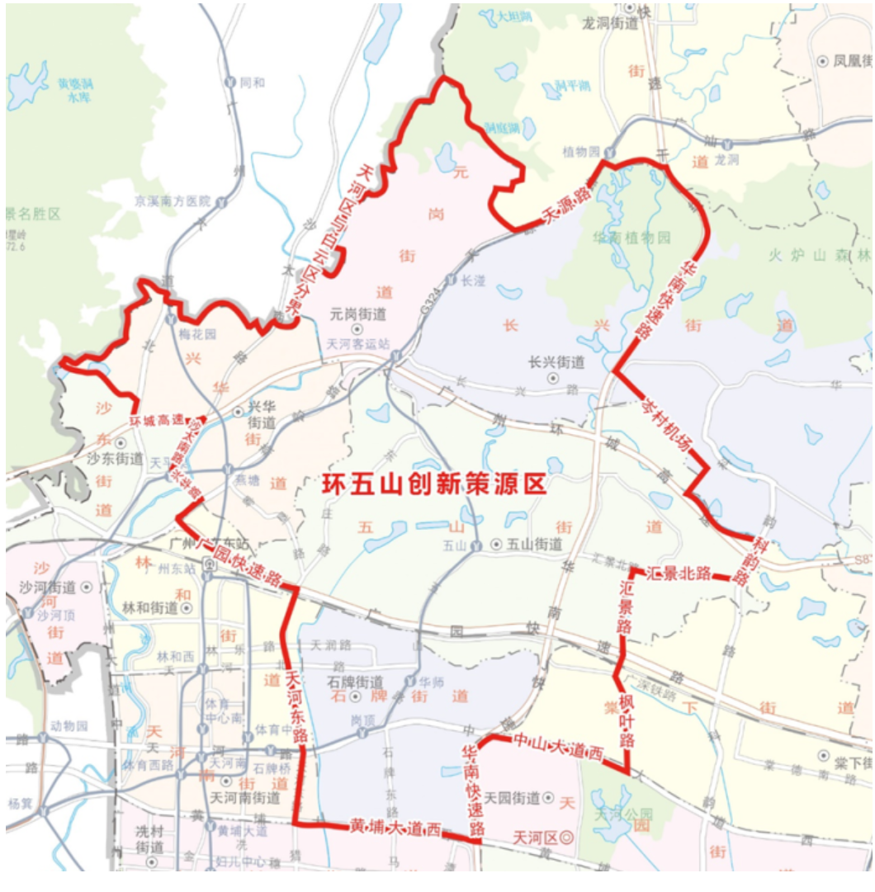

### 19th

- 数据库约束
-

### 20th

- 数据库--
- 付迎春--地学遥感进展
- 入党申请书
- 梦见 zx?d
- 遥感--空间统计--付迎春-罗文斐-刘亦书-胡伟平
  多元统计--植被反演

### 21th

- 机器学习书
- 入党申请书

### 22th

- 机器学习 -- 吴恩达
- python
-

### 23th

- 微积分
- 线性代数

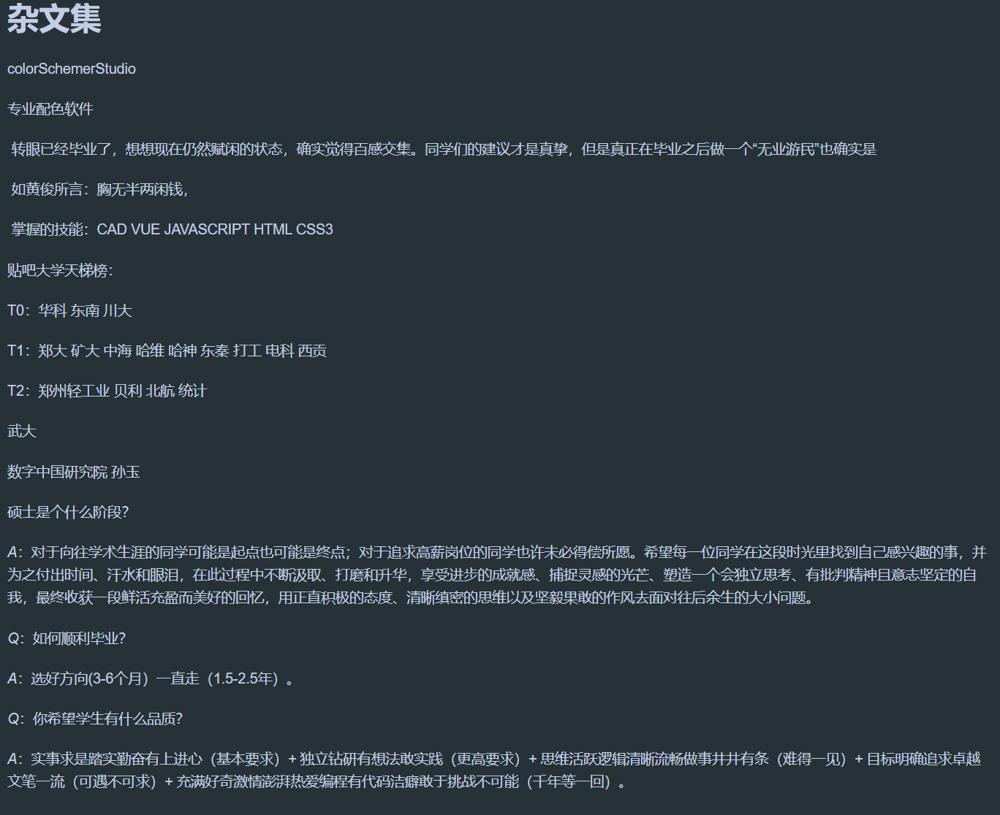
唉，这下拉了

### 24th

- 逛宜家

* 逛海珠

### 25th

- 学英语
- python 学到 import
- 机器学习了解--数学公式 7

what's the difference?
her daughter playing piano .
when people like Malaysians went into English conversations they were afraid of being judged by how many mistakes they were going to make .

2 , Some people have self-image . 网咖 玩的不好，身边有人但还要专心去玩，水平不行还是要专注去说。a person went to the Internet cafe
when Faizar goes into conversations , he is entirely focused on the person that he's speaking to and the result he wants to get . He's got no self-awareness . no thoughts of what he makes .

3 , by a true story hanppened in ted's speaker , to the pharmacy to buy omega ,
a sailors
两个 sailors ，一个解释了很久毫无头绪，一个简单
One talked at a high level , but totally focused on herself and getting it right , which results in ineffective conversations .
Another got no level , but focuesd on the person she's talking to and getting a result . effective .

4 , babecu talk between Francies , Korean and Japanese to tell us that English is just a tool to play around with to get a result like a computer game .
In schools , students are judged more on correctness than on clarity which is not a good way to buld the confidence

listening goes .
speaking goes .
confidence goes .

so the core point is , when you speak , don't focus on yourself , focus on the other person and the result you want to achieve .

smoothly , calmly confident .

### 27th

- 练习输出素数
- arcgis pro 安装和操作视频

* python 传参数--可变 / 不变
* 数据容器练习

### 28th

- 刘亦书--机器学习高数 / 线代 / 概率论
- 党的主题教育
- 看文献软件
- zotero

因为自己面对多线程时会束手无策。

醉鹅
乳鸽
煲仔饭

大良中楼--清晖园--华盖路步行街
--金榜--大良中楼--顺峰山公园--换了海岸

## October

### 8th

- 提交遥感开题报告--11th

* 机器学习作业--（概率论 / sklearn）
  - 贝叶斯定理
  - 求 x\*
  - 搭 python sklearn 平台--iris 数据集贝叶斯训练

- python --jupyter--pandas

### 9th

- 下午英语课 or

* 下午傅伯杰院士汇报

- arcgis --学校制图'''

### 10th

- ppt 做好
- 下午政治课

### 11th

- 下午建模仿真组单独汇报
- 搜集 4 校园标准地图数据
- 付遥感综述文献汇报

寻找的时候度没有把握好

林业生态估算

- 缴团费

anaconda 会覆盖 python 之前版本？

### 12th

- 决策树 review +
- anaconda 测试 iris 数据集
- python from 引用
- 下午听答辩
- 晚上讲座
- 建筑物面包围

* 校门画法
* 教学楼分法
* 知道学院
* python 自动化

德国 APS

三维数据交换格式
超图
智能体参数化设计、
超图后台服务和前端

国标大中小
城市大中小
GML 标准交换格式
归类
一个城市大中小多少类
大多少泪
cityGML

工具软件熟悉
数据表顺滑设计
文献阅读

arcgis 条件判断
arcpy

### 13th

广测院--李长辉 6

- arcgis 基本操作
- 最短路径算法
- 找泓达师兄要超图
- gis 国标
- 英语课文件打印
- 8 点去推优会

python

多传感器城市实景移动测量系统研制

### 14th

- 更新 python 解释器--conda 环境
- 看看 conda 是干啥的

### 15th

- 英语
- 看决策树
-

英语 grading criterial

### 17th

- 雨课堂

### 18th

- 问卷测评
- 配置超图
- lateX
- 概率论分布
- 回归树 / 最小二乘树
- 下午开组会
- sklearn 配置
- 解释 ADE
- 加卢工
- 把道路名称
- 钢笔上墨
-
- 整理地理信息要素分类标准

  - 难点：以什么形式 / 格式汇报

    1.校园道路和外部道路都添加了名称 2.建筑物打点并添加了名称 3.补画了运动场

### 19th

- 刘亦书机器学习
- 新生见面会
- 入党会
- 随机森林--
- endnote

### 20th

- 9:45 现代遥感技术
  22 号之前完成雨课堂学习
- 3 点基地碰面

* 缴纳
* citygml 文献

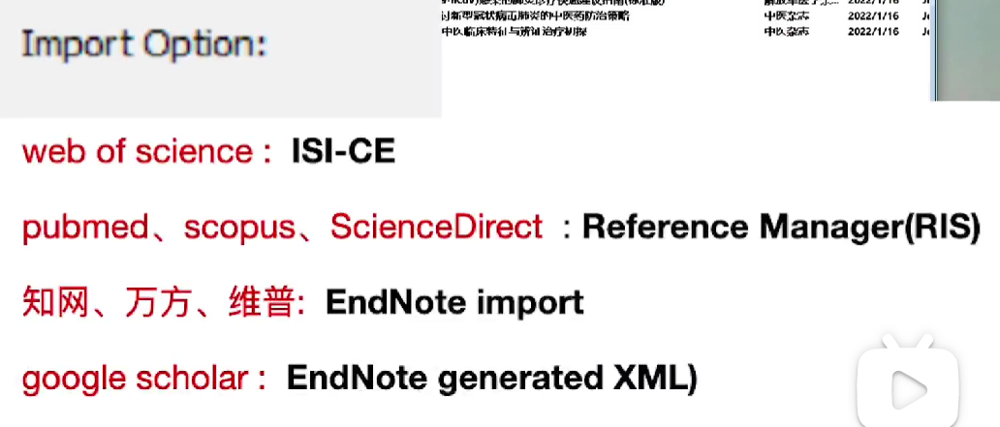

arcgis server 服务器

- MAE 图像修复
- XML 格式--

## 2 水系

- 河流
  - 常年河
  - 时令河
- 沟渠
  - 运河
  - 干渠
  - 支渠
- 湖泊
- 水库
- 海洋要素
  - 海域
  - 海岸线
  - 干出线
  - 干出滩、滩涂
  - 礁石
  - 危险区
  - 海岛
  - 暗沙
  - 暗滩
- 其他水系要素
- 水利及附属设施

## 居民地及设施

- 居民地
- 工矿及其设施
- 公共服务及其设施
- 农业及其设施
- 名胜古迹
- 宗教设施
- 科学观测站
- 其他建筑物及其设施

## 交通

- 铁路
- 城际公路
- 城市道路
- 乡村道路
- 道路构造物及附属设施
- 水运设施
- 航道
- 空运设施
- 其他交通设施

## 管线

- 长输输电线
- 长输通信线
- 长输油、气、水输送主管道
- 城市管道

## 境界和政区

- 国外地区
- 国家行政区
- 省级行政区
- 地级行政区
- 县级行政区
- 乡级行政区
- 其他区域

## 地貌

- 等高线
- 高程注记点
- 水域等值线
- 水下注记点
- 自然地貌
- 人工地貌

## 植被与土质

- 农林用地
- 城市绿地
- 土质

## 地名

- 居民地地名
- 自然地名

### 21th

- 安装 visual studio

### 22th

- 完成 gis 国标 xml 绘制

回去看文献

### 23th

- 超图和 arcgis 技术选型
- 数据库看完后面章节

### 24th / 25th

- [x] 继续看文献
- [x] 医保卡拍照
- [x] 人脸识别
- [x] 发组会纪要
- [x] API 架构风格
- [x] arcgis 完善地图
- [x] 日常考勤
- [ ] 我的疑问：
      citygml 针对建筑物有 4 个层次细节表达
      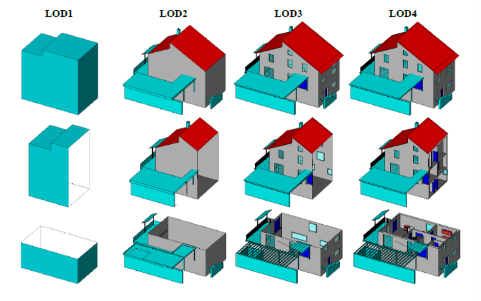
      我们需要做到什么程度
- [ ] 学习 c4d revit
- [ ] arcgis 和 超图 技术选型
- [ ] c++ 浅尝辄止
- [ ] python 补全计划
- [ ] 看看机器学习任务
- [ ] xml json7
- [ ] mysq 补全计划
- [x] 遥感概论作业
- [x] 请假条打印

### 26th

- [x] 机器学习课
- [x] 培训 geoscene
- [ ] 决策树剪枝 / k 近邻

### 27th

- [x] 中国历史地图集
- [x] 开组会
- [ ] 安装 c4d / revit

### 28th

- [x] 校运会彩排
- [x] 学姐传授经验
- [ ] c++指针 / 结构体
- [ ] 看下政治

### 29th

- [ ] 解释 LOD
- [ ] 确定在 ue5 中加载的是什么格式的模型，外观建模
- [x] 新一轮雨课堂
- [ ] 大部分观点参照武汉大学翻译 citygml,
- [ ] 关于地形在 ue 中是什么格式
- [x] 没有看 core xml 源码，实在太复杂。
- [ ] 和泓达师兄讨论 ue5 和 citygml 标准格式转换。
- [ ] 看李老师推送
- [ ] c++解决-
  - [ ] 统计输入数中每个数个数
  - [ ] 文件重定向
  - [ ] char 有无符号
  - [ ] 溢出
  - [x] 看计算机组成原理补码部分
  - [x] 含有无符号类型的表达式
- [x] 查找 arcgis 10.2 和 arcgis pro 默认工作目录
- [ ] 机器学习
  - [ ] b 站查 sklearn
  - [ ]
  - [ ] 吴恩达--
  - [ ] 决策树
    - [ ] K 近邻
  - [ ] 随机森林
  - [ ] 概率论

### 30th

- [x] 填写文献汇总
- [x] 遥感罗文斐作业
- [x] 遥感胡伟平作业
- [x] C++浮点数运算误差
- [ ] 阅读 arcgis 文档
- [ ] 了解 FME
- [ ] 视频--函数基础及其底层原理
- [x] postgresql 安装
  - [ ] postgis
- [ ] 胡伟平个人 PPT
  - [x] 胡伟平英文文献翻译
  - [x] 中文 / 英文文献阅读
- [ ] 胡伟平小组汇报
- [x] 社保卡申领
- [ ] 政治课 PPT
- [ ] 雨课堂
- [ ] python
  - [ ] pandas
  - [ ] numpy
  - [ ] matplotlib
  - [x] 使用 jupyter notebook
- [ ] K 近邻算法

### 31th

- [x] 英语作业 - 2:00
- [ ] vue
  - [ ] slot
- [x] 下周三入党申请考察表
- [x] 做英语 ppt -5:00
- [ ]

## November

阅读完《基督山伯爵》

### 1st

### 2st

- [x] 英语 news report
- [x] global mapper
      a- [x] 找到 tif 转 png 方法
- [ ] modeling our world
- [ ]

### 3rd

- [x] 明天找莎莎姐要回放

### 4st

- [x] 听晚会

### 7th

- [x] 个人自传

### 8th

- [x] 小组 ppt
- [x] 英语作业
- [x] 英语 news report
- [x] 数字孪生智慧园区文献综述
  - [ ] 时空智能预警体系
- [ ] 看 cppreference
- [x] 填入党培训表
- [ ] 开发文档

### 10th

- [x] 公司表

### 12th

- [x] 做英语 ppt -2:00
- [x] 组会预告 -4:30
- [x] 回来做 PPT -7:00
- [x] 排练 -9:00
- [x] 做遥感 PPT -11:00

### 13th

- [ ] 看卢工教程
- [ ] MongoDB
- [ ] ajax
- [ ] 遥感 ppt
- [ ] arcgis 操作
- [ ] 做个 python demo
      000

### 15th

- [x] 小组汇报 ppt

### 16th

- [ ] 线性代数对偶问题
- [ ] 机器学习 SVM 对偶
- [ ] 推导线性判别分析
- [ ] 特征值/特征向量/实对称矩阵对角化-->主成分分析

### 17th

- [ ] 组会
- [ ] 8-12 准备组会报告
- [ ] 看文献
- [ ] 学 UE5
- [ ] 学 C++
- [ ] c++
  - [ ] 数组越界

### 18th

- [x] 长江与课堂
- [ ] 线性代数
  - [ ] 正交矩阵
  - [ ] r(ab) r(b)

### 19th

- [x] 英语作业

### 20th

- [ ] 发展对象？
- [ ] 英语课

### 21th

- [x] 帮忙 arcgis
- [ ]

### 22th

- [x] 指针常量和常量指针
- [ ] 函数指针
- [ ] 分配内存
- [ ] geopandas 处理地理数据

### 23th

- [x] 周五课拿学术
- [ ] 支持向量机间隔最大化
- [ ] 卡方分布
- [ ] t-分布
- [ ] 核函数分离超平面
- [ ] 看机器学习史
- [ ] 帮文蒨看 arcgis
- [ ] 主成分分析
- [ ] **指针指向的内容，内容可以改变，但指针不会变**
- [ ]

### 24th

- [x] ppt-组会
- [x] 长江雨课堂
- [ ] 各种地理数据格式存储 mongodb
- [ ] 看 CMIP6
- [ ] 2223 / 2324 / 01

对接 mongodb 存储数据。

### 25th

- [ ] 看机器学习

### 26th

- [ ] C
  - [ ] extern 再探
  - [ ] 回调函数
  - [ ] 内存泄漏返回值的不正确处理
  - [ ] 避免内存泄漏
  - [ ] 求出矩阵最大值
  - [ ] 左值右值

### 27th

### 28th

- [ ] 实参形参
- [ ] 1418 论文写作

### 29th

- [ ] 传文件到服务器
- [ ] 看 CMIP6
- [ ] c++面向对象
- [ ] 结构体引用
- [ ] 联合体
- [ ] 黑马结构体案例 1 老师-学生
- [ ] 析构函数
- [ ] 项目-点和圆关系
- [ ]

### 30th

- [ ] VOSviewer
- [ ] CMIP6

## December

### 1st

MongoDB gridfs

- [ ] acccmip6 安装
- [ ] 城市天际线
- [ ] mongodb shell
- [ ] 现代测量与遥感技术
- [ ] 运算符重载
- [ ] 看 github 项目《代码随想录》
- [ ] 阿根廷总统

2224

### 2nd

- [ ] 隐式类型转换
- [ ] 正则表达式替换文本
- [ ] return \*this
- [ ] 虚函数

### 3rd

- [ ] 长江与课堂！
- [x] c++ 98->111
- [ ] 该看看机器学习了
- [x] 1416 pandas
- [x] 1620 sklearn
- [ ] 2024 自由发挥
- [ ] 机器学习 up 主——等等很简单
- [x] 决策树
  - [x] CART
- [ ] 说的对啊，脑袋 怎么跟浆糊一样

### 4st

- [ ] size_t
- [ ] c++边界检查
- [ ] 数组拷贝
- [ ] academic vocabulary p17
- [ ] 左移运算符重载我劝你多看
- [ ] 赋值运算符有空看完。。。
- [ ] 得闲把英语单词填上

### 5th

- [ ] 把概率论三大分布补上
- [ ] 宋涛空间相关/空间回归
- [ ] 数组指针
- [ ] 函数指针
- [ ] 思考政治与哲学
- [ ] 内存释放机制
- [ ] 数组作为形参传递

空间相关分析--考虑滞后

### 6th

- [ ] ue5
- [ ]

于佳志
1109~1110 BF 数字孪生素材汇总 3 小时
1123~1124 ArcGIS 处理风暴潮水深数据 3 小时

### 7th

开小组会

### 8th

- [x] 看地形模块视频

### 9th

- [x] Surface water modeling system 安装
- [x] 英语誊抄
- [ ] 遥感文献综述撰写
- [x] 有空看下英语作业
- [ ] geopandas 处理学习
- [ ] 学一下 git merge
- [x] 看学术交流英语
- [ ] 问莎莎姐要回放
- [ ] 处理海洋风暴潮数据

### 10th

- [ ] 看 geopandas
- [ ] 看 surface water modeling system 教程
- [ ] arcgis pro
- [ ] 长江与课堂

### 11th

- [ ] 遥感文献综述
- [x] 写团员评定
- [x] 不透水层-》不透水面

### 12th

- [ ] 双 12 看看能买啥

ADCIRC

### 14th

- [ ] youtube 看 cmip 6
- [ ] 处理耦合数据

10-12

### 16th

- [ ] 牵头和智晖一起看超图存储问题
- [ ] 摇曳露营
- [ ] 准备英语 representation
- [ ] 给夏老师和文蒨发数据
- [ ] 把 modelbuilder 转为 python
- [ ] 处理广州 cmip6 标准

### 17th

- [ ] 与课堂学习/考试

### 19th

- [ ] 找到 cmip 6 广州未来十年- 6-10 找 cmip6 download 视频
- [ ] 记得关加热垫
- [ ] 看刘三姐视频总结
- [ ] 看机器学习
  - [ ] 贝叶斯定理
- [ ] supermap 搭建 arcgis pro 平台

《乡土中国》

### 20th

- [ ] pangeo 云

gpt 写 水位变化

### 23th

- [ ] matlab 下载处理
- [ ] 购买神界原罪 2
- [ ] 写英语 representation
- [x] arcgis pro 下的 python 学习

### 24th

- [x] 6 点前搞 ppt
- [x] 6-7 吃饭 / 好特卖

### 25th

- [ ] 继续学习 arcpy

representation

- why you choose this movie as your introduction?

考虑了很多电影，觉得剧情片更适合。而且，这部电影反映了如今社会上很多人的心理。

### 26th

- [ ] 处理水位变化-excel

### 27th

- [ ] 问泓达找当时的技术支持
- [ ] 工程伦理快看
- [ ] cmip6 解决
- [ ] 每个文件添加 depth_diff 属性
- [ ]

### 28th

- [x] 把数据发给文蒨和 夏老师
- [ ] 地理坐标和 UE 坐标的转换（泓达/海宗）
- [ ] 工程伦理期末试题
- [ ]

这个是处理过的 216 个时段的水深 TIN 和栅格数据，depth_diff 属性是当前水深，其值是前一个时段水深 depth_diff 加当前时段水深 depth。第一个数据是模拟开始一小时后的数据。

### 29th

- [ ] 技术交流大会
- [ ]

29
30
31
1
2

3 出差
4 出差
5 现代测量报告
6
7 论文写作综述
8
9 英语考试 6-8
10 政治考试 7-9 / 自然辩证法作业 / 地信前言报告
20 机器学习 作业

## January

### 7th

- [ ] 论文写作
  - [ ] 摘要翻译
  - [ ]关键词
- [ ] 政治公共课背诵
  - [ ] 买红笔和记号笔

### 8th

- [ ] 填写月报

### 12th

- [ ] 利用 CMIP6 全球气候耦合模型，选择 100\*100km 空间分辨率以及 SSP585 气候（高温、高碳排放的未来发展 路径）按时序输出预测的中国每月的降水、气温栅格影像。
- [ ] 利用 SWMM 模拟台风山竹来临时水深数据在 ArcGIS 中进行每小时水深累计变化叠加处理，输出结果可为海洋风暴潮场景下模拟水位变化情况提供参考 。

### 13th

- [ ] 跑步
- [ ] popping 练习
- [ ] 1 点前睡
- [ ] 看 cpp 库/arcgis / gis 思维

### 14th

### 15th

- [ ] 看令文发的数据点
- [ ] 看地球科学数据库汇总
- [ ] 找夏老师讨论小论文定题
- [ ] 16-18 c++

### 16th

- [ ] 15-17

### 17th

- [ ] 11-12 跑通一个机器学习模型

### 18th

### 19th

**年度总结计划**
**李老师总结**

- 报告
  报告底层逻辑不是科研，而是项目。

读的文献需要写文献综述。
提笔不知写啥。

- 科研的逻辑完整性。
  研究方向是什么，根据研究方向展开哪些阅读，学会哪些实验。
- 计划
  目标：分科研、工作

做目标/任务/计划矩阵。

- 实际问题
  需要大模型的需要 GPT 培训。
- 用地标准
  于佳志、王思敏 资料共享。

陈洋老师 对接。

\*\*

### 20th

- [ ] 了解 jazz-hiphop

数据就在那，凭本事跑通和分析吧。

找老师之前，需要先把 python 的科学计算库搞懂（跑通一个小 demo）

- [ ] 编写 python 爬取天气项目源码并建库分析 （2 天）
- [ ] 和思敏交接-22 号前
- [ ] 发给陈洋老师-24 号前
- [ ] 找海宗跑通代码-23 号前

### 22th

- [ ] 以高德地图为例进行爬虫。

### 23th

- [ ]

### 24th

- [ ] 看乐理到一半

二次元确实虚无缥缈，早早认清自己是在和现实对线。

### 25th

- [ ] 看乐理后半部分
- [ ]

### 26th

### 31th

- [ ] 5-7 看看运行视频
- [ ] 7-10 尝试运行
- [ ]

### 2th

- [ ] datasmith 导出建模数据

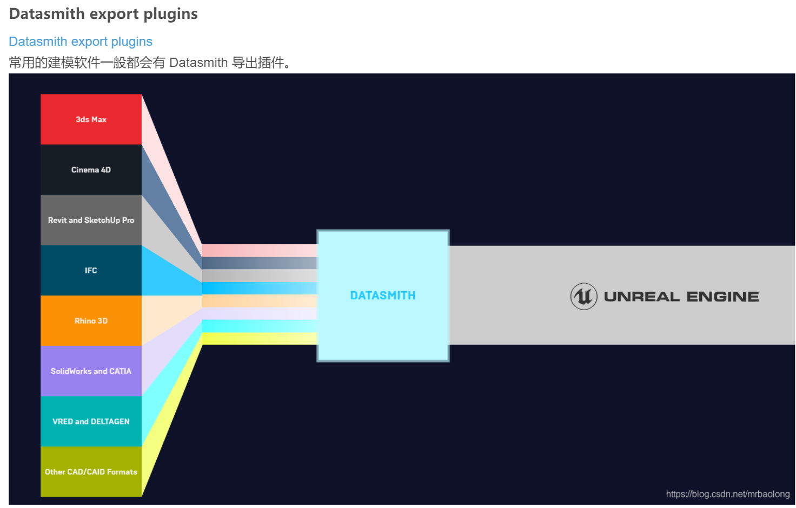

- [ ] 看超图开发教程
- [ ] 看卢工发的 ppt
- [ ] 尝试利用 arcgis sdk 往平台里加东西
- [ ] arcgis sde 数据库和平台接入
- [ ] 写纪要

### 3th

- [ ] 看看 tcp socket
- [ ] geo server 探寻
- [ ] 各种投影信息
- [ ] 地图瓦片和影像金字塔服务
- [ ] 看制作游戏风格地图
- [ ] 看 GIS 荟-FME
- [ ] 提防本科生进组带来的尴尬
- [ ] 地理数据库使用
- [ ] 银行卡

### 4th

- [ ] 出去玩
- [ ] 在随缘小馆吃饭

### 5th

- [x] 去象山区政府
- [x] 去万达小聚

### 6th

- [x] 去匹叔叔家


### 7th

- [ ] 南大姜燕燕算法

### 10th

- [ ] 东西巷

### 11th

- [ ] 来家里拜年

### 12th

- [ ] 废掉的一天。。

### 13th

- [ ] 魔法少女小圆
- [ ] 2-3 C++温习
- [ ] 3-5 跑项目
- [ ] 5-7 看 arcgis for ue
- [ ] 看 arcgis 存储数据库
- [ ] 7-10 休息
- [ ] 10-12 整合文献中信息数据
- [ ] 学习 ue
- [ ] C++接着弄
- [ ] 地理坐标到地心空间直角坐标转换。
- [x] 不要逃避 c++，必须得面对
- [ ] 必须意识到，刷贴吧是一个无聊浪费时间的消遣方式
- [ ] 看四叠半神话大系

### 14th

- [ ] 去看大爷爷

### 15th

- [ ] 最后的挣扎

### 16th

- [ ] 在家倒计时两天
- [ ] 看完 c++ basic

cpp 处了解 - 10h
上手 ue -10h

- [ ] 忧虑不过是自己造成的，多学知识，多锻炼，毕竟那是不可避免的事情。
- [ ] 这个时代是否每个人都能成为意见领袖

### 17th

### 18th

### 19th

### 20th

### 22th

- [ ] 9-11 部署
- [ ] arcgis maps sdk 是否行不通（api 问题），
- [ ] 寻找 cesium for unreal
- [ ] 11-13 匹配数据库
- [ ]

### 23th

cesium floatingpawn

- [ ] cesiumlab 注册下载

=- [ ] 当初为何要看 supermap 存储。

- [ ] cesium 往平台里加 osm building /

现在添加进去的是 cesium 的 bing 航拍图片。
地形不能再 ue5 中做，需要再上传到 ion 前再原始数据中修改。
安装了 cesiumlab 用以发布地形切片服务。

rootcomponent 是有起伏的地形瓦片， 可以在下面添加航拍影像文件，是一种 overlay，可以叠加在瓦片上，体现出起伏的影像。

另外，这个瓦片的地形貌似高度是比较真实的，但是我不知道如何获取高程。

我为他添加了在线的瓦片数据和影像数据，准备这周添加本地的影像数据试一下。

### 24th

- [ ] 开学购买清单：笔/茶
- [ ] 往平台添加环境实体
- [ ] 为实体添加属性
- [ ] 看完《杀人回忆》

### 25th

- [ ] 看完 c++
- [ ] 四叠半神话大系

### 26th

- [ ] 学习 revit，c4d for ue5
- [ ] cesiumlab 再登陆试一下
- [ ] csdn 上 ue5 for C++
- [ ] 用 C++创建基类，蓝图继承基类。
- [ ] 看 ue5 基础视频。
- [ ] cesium for unreal
- [ ] 什么是空气系
- [ ] git merge
- [ ] cpp 中静态数据成员
- [ ]
- [ ] 16-18 看完类和对象
- [ ] 18-20 看 STL
- [ ] 20-21 看 vector
- [ ] 21-22 写泓达的工作总结
- [ ] 22-23 调研和文蒨的交接内容
- [ ]

### 27th

### 28th

- [ ] 那么多复杂的数学 问题都解决 了，小小的工程问题无法解决嘛
- [ ] 悟已往之不谏，知来者之可追

### 29th

- [ ] 在 ue 中添加环境实体并为环境实体 赋予属性。
- [ ] 统计的环境实体参考 excel 表
- [ ] 从 cmip6 入手探讨天气效果。
- [ ] 看完 ue5 开发视频
- [ ] 虚析构和纯虚析构
- [ ] ue5 接入高德天气 api

### 30th

- [ ] 大组会

### 1st

- [ ] 开完大组会
- [ ] 看工作手册内容 （李老师最高指示）
- [ ] ue5 蓝图学习
- [ ] uint_8 / ...
- [ ] 月底交小论文题目
- [ ] 有空看行草
- [ ] 一周一个数据结构

### 2nd

- [ ] 看五子棋教程
- [ ] 看寄生虫

### 3rd

- [ ] 更衣室人偶坠入爱河
- [ ]

cesium 添加环境瓦片地形数据和影像数据调研。

### 4th

- [ ] 蓝图学习
- [ ] 在项目中添加环境

  - [ ]

- [ ] 容器嵌套容器
- [ ] vector 全学习
- [ ] string 全学习
- [ ] 对接内容:在蓝图中写的内容如何添加到编辑框。
- [ ] 了解数字摄影测量
- [ ] 认识立体影像，了解立体模型

### 5th

- [ ] 参考 varest
- [ ] 制作 ppt
- [ ] cesium sublevels
- [ ] python + gdal 读取 DEM tif 经纬度及高程。
- [ ] 参考https://github.com/HeZhang1994/digital-elevation-model
- [x] 写会议纪要
- [x] 问下脸解锁
- [ ] 写工作内容总结梳理
- [ ] 经常大脑宕机--查看解决方法
- [ ] 11-12 看 cpp stl vector deque list
- [ ] 14-17 学习蓝图
- [ ] 尝试联系跟换硬件
- [ ] 文蒨 push 一下进度
- [ ] 下载好 gdal 库使用-https://wenku.csdn.net/answer/ddcf5bc4149211eea6c2fa163eeb3507
      python 调用
      https://zhuanlan.zhihu.com/p/676770594
- [ ] cesium 和 udweather 进行天气交互过程
      https://www.bilibili.com/video/BV1zJ4m1W7bM/?spm_id_from=333.337.search-card.all.click&vd_source=27ddfa4bb65033775edb41a4b209d59d
- [ ] 问春雨哥（revit 版本问题）
- [ ] 买公司零食-（带茶 / 口香糖 / 枕头 / 耳罩）
- [ ] 看 vector / deque 案例

- https://zhuanlan.zhihu.com/p/129340367

### 6th

- [x] 领农行卡
- [x] list 还要继续看
- [ ] 和师兄对接地形工作 / 建筑白膜模型工作
- [ ] 使用 revit
- [ ] 问莎莎姐报销
- [ ] 6-8 set / map 结束 STL 学习。总结看下还有没有其他 stl / 比较一下和数据结构中的区别
- [ ] 8-10 学习蓝图
- [ ] 有空看一下 socket
- [x] 不学蓝图了，玩 gta5。
- [ ] 仿函数学习
- [ ] 看 gdal 库

点云数据(.LAS)
recap->(.RCS)格式点云
revit 根据.RCS 进行建模和组件定位
revit->(.FBX)
之后可以用 blender / c4d/ 3dsmax 建模。

### 7th

- [ ] 10-11 找师兄请教-对接到地形 / 编辑框
- [ ] 问一下有没有天地图开发者 api
- [ ] 卫星影像重投影--合并图层
- [ ] 加群找数字孪生行业知识
- [ ] 参考中华人民共和国公路等级
- [ ] 道路融合-按照布尔字段融合
- [ ] 群里精细化建筑
- [ ] 未来的未来，问问周宁选电脑
- [ ] 问莎莎姐配电脑的问题
- [ ] 下载 cityengine
- [ ] 晚上学习 cityengine
- [ ] 问卢工一些

### 8th

### 9TH

- [ ] 在项目环境中加一些环境交互功能。
- [ ] 看佐贺偶像是传奇
- [ ] 根据周报做一个小 demo。看看开发能力。
- [ ] 梳理框架文档。
- [ ] 写组会纪要
- [ ] 找师兄总结一下需要做的工作
- [ ] 思考李老师提的要求。

### 10th

- [ ] 去公司 / 看 ue for C++ 16-18
- [ ]
- [ ] 看下 revit
- [ ] 问下泓达 / 海宗当时学习 ue C++ 蓝图的方法。
- [ ] 岛原
- [ ] 黑猫警长
- [ ] 看一下文献
- [ ] 因为你时常无法触及事物的深层
- [ ] 继续看 ue5 数字孪生视频
- [ ]

### 11th

- [ ] 看 ue 蓝图
- [ ] 看 ue C++
- [ ] 找泓达开公司电脑

### 12th

### 13th

- [ ] 14：30 前找师兄查看解决办法
- [ ] UE for C++
- [ ] 尝试导入道路--通过编辑框
- [ ]

### 14th

- [ ] 16：00 前交会议纪要
- [ ] fstring 关键字找不到
- [ ] ue 把 tif 添加到 landscaping

### 16th

- [ ] 添加 cityengine 到 ue5 场景中

### 18th

- [ ]

  1.单独 BP_fluxModifier 2.哪些蓝图类是添加的
  （thirdPersonCharacter / fluxCar 没有蓝图 / 3.编辑框是通过 C++编写的吗，是那个文件内。

- [ ] 共线条件方程推导
- [ ] 地形纹理考虑用纹理数组实现
- [ ] **外方位元素计算过程必须掌握**

### 19th

- [ ] 2.30-4.30 项目文件结构学习
- [ ] 4.30-6.30 继续学习
- [ ] 6.30-8.30 尝试加东西
- [ ] 清理 C 盘缓存

### 20th

- [x] 填 2 月份进度
- [ ] dem 数据平滑处理

### 21th

- [x] 地形图转为 fbx 格式
- [ ] 超图许可更新

### 22th

- [x] 实现实时天气效果 API 可编辑
- [x] 先设置预设场景
- [x] 地形从本地下载
- [x] 学习 varest weather
- [ ] 之前气温和降雨数据导入--netcdf
- [ ]

### 23th

- [ ] 帮耀勇 / 铭杰 / 智晖 搞点位
- [ ] 思敏的标准和实景三维的标准结合制成 excel 表
- [ ] 看蓝图 for ue
- [ ] 学 C++ 11

### 24th

- [ ] 看春宵苦短
- [ ] 不要在团队里拖后腿啦 😔
- [ ] 过一遍 C++ index
- [ ] 9 点起来-香樟路 / 玉兰路
- [ ] 去拿书看
- [ ] 中午去剪头发
- [ ] 找宿管中心、
- [ ]
- [ ] 梳理一遍任务
- [ ] 下周把研究计划弄好
- [ ] 把 ue5 蓝图和 C++ 结合
- [ ] 做 stl 360 扫描
- [ ] 动态加载类
- [ ] 类对象作为其它成员的变量
- [ ] 深入浅出函数指针
- [ ] 14-24 10h
- [ ] ue 蓝图 数组--局部变量
- [ ]

此处为何用指针？
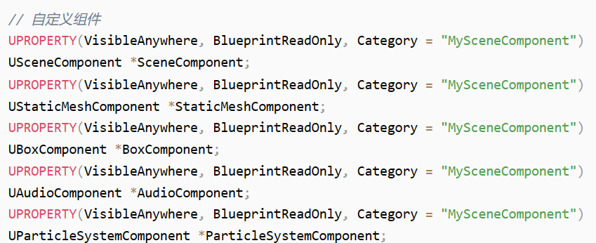
无法解析符号
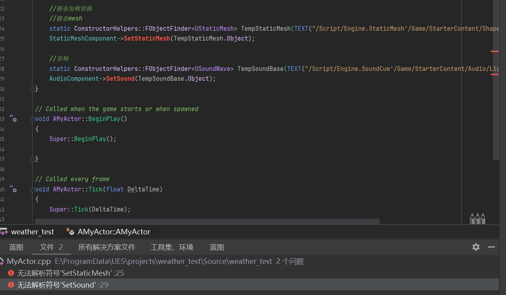

### 25th

- [ ] 虚继承
- [ ] 解决夏老师问题
- [x] 拍摄 孔子像 / 雕塑 / 下节课做 ppt 讲解

### 26th

- [x] 发组会纪要

### 27th

- [x] 必须开始 varest 了
- [x] 把照片导进去
- [x] 把 fbx 弄成小点导进去
- [x] 43 点云赋不上

### 28th

- [x] 青年大学习
- [x] 写智晖的组会纪要
- [x] 2 点前拟定 varest 制作流程
- [x] varest 问题

### 29th

- [x] 玩云顶之一
- [x] 完成 varest 后半部分
- [x] 这是一个蓝图 -
- [ ] get / set

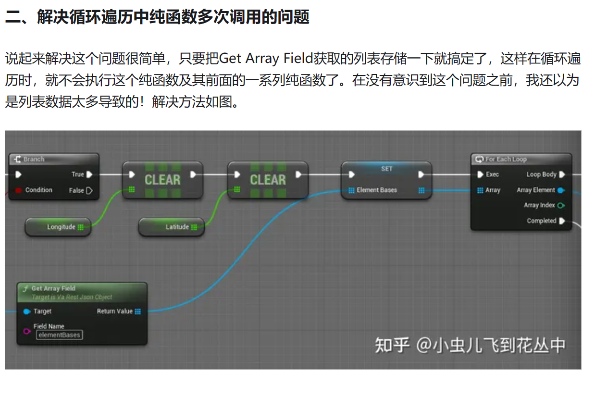

astolfo

此为使用风暴潮和海浪耦合模式 ADCIRC+SWAN 对 1822 山竹台风风暴潮进行模拟所得的相关数值结果在 arcgis 中进行水深变化计算所得的结果展示。

将 11 万个包含水深信息的节点在 arcgis 中输出，针对风暴潮来临时每小时水深变化信息利用 arcgis 中游标迭代函数计算得到每小时变化后的水深数据，插值转换为 TIN 和栅格。

### 30th

- [x] 14-16 ue for C++ 充电区
- [ ] C++ 其他知识 - 常见数据结构
- [x] 购买清单：
- [x] 排插/风扇/键盘
- [x] 尽量看 inside ue4
- [ ] 消化泓达的蓝图制作流程

### 31th

- [ ] 去车行弄掉后座
- [x] 剪头发
- [x] 看李老师说的实景三维大纲（梳理当时说的话）
- [x] 有空拍下双摄影测量照片

## April

又是一年 4 月 1 呀~\_~

- [ ] 2021《新型基础测绘与实景三维中国建设技术文件 1-4》总体设计
- [ ] 2022《新型基础测绘与实景三维中国建设技术文件 5-7》知道基础地理实体数据生产的采集处理类文件
- [ ] 找基础地理信息要素和基础地理实体分类代码分类区别

### 2nd

- [x] 看实景三维文件 4 5 6 7
- [ ] 映射转换
- [x] 语义化处理-添加空间身份编码规则
- [x] 4-6 看空间身份编码规则
- [x] 3 月工作：导入 FBX 地形进行预设场景搭建
- [x] 实现实时天气效果
- [ ] 下月计划：完善基础地理信息要素转换基础地理实体数据表，针对风暴潮场景下环境数据进行映射

### 3rd

- [x] 调整下心态
- [x] 梳理最近的工作
- [x] 语义化内容扩展属性获取
- [ ] 制作建筑物几何构成关系示意图
- [x] 语义化内容表达-定义概念层/建立语义描述规则并描述
- [ ] 目前发布的我搜集到的有 8 个文件，目前对每个文件大致内容做了梳理。对于每个文件中涉及到的跟地理信息要素和地理实体数据有关的表尝试放到了 excel 表中。目前准备做个关系图表示整个地理实体映射表中各部分的关联关系。

### 4th

- [ ] 做思维导图
- [ ] 再看 C++ for ue，实现对 C++的更进一步学习。
- [ ] dem 出现梯形问题：
      https://mp.weixin.qq.com/s/ebX7_yZnIZgpQVACWnxNDw
- [ ] 意识到李老师的任务推进的还算顺利——资料能找到且较全、整理方便、尽管较庞大复杂但可以梳理、暂时对应用方面较迷茫。

### 7th

- [x] 甲流真难受
- [x] 整理完新型基础测绘与实景三维中国建设技术文件，顺便看下文件夹里的其他附件。
- [x] 明早看下要不要去公司。
- [x] 看 C4D 视频

### 8th

- [x] 看下空间身份编码

### 9th

- [ ] 问下智晖超图许可
- [ ] 之前天气和降雨数据怎么导入 ue
- [x] 中午看大象无形
- [ ] spawnactor
- [ ] core 中 AgentSimMain / SimPawn / SimController
- [ ] cast<>用法
- [ ] 3-4 看源码
- [ ] 有空看一下蓝图
- [ ] 问一下什么时候用指针，什么时候用引用。
- [ ] 10-11 看 git 提交记录来熟悉项 x

### 13th

- [x] 做招聘会志愿者
- [ ] c4d 制作广告牌
- [ ] get / post

### 14th

- [ ] 看情况发 word
- [x] 看 OIer
- [x] 能不针对左值和右值了吗我能问问
- [ ] 看看 Cherno C++是否对胃
- [ ] 断点和读取内存
- [x] 类和结构体中的引用
- [x] 10-11 C++basic
- [x] cpp cast<>
- [x] 下午看看数据库
- [x] 7-next 出去玩玩/电单车充电
- [ ] 问一下志愿活动工时
- [ ] 看一下一些论文

### 15th

- [ ] c4d 需要完成工作：窗制作/天花板制作/门制作/广告牌制作
- [ ] 3h-数据库 3h-上课 3h-c4d 3h-ue
- [x] return \*this
- [ ] 逐渐参透指针和引用
- [x] 数组插入 C++实现
- [ ] 看数字孪生阿蛋老师
- [ ] 厘清一下最近的工作

  ### 16th

  - [x] 早上早点去，评估一下工作量（场景渲染—着色 2h/细节完善-3h/天花板-2h）
  - [ ] 看情况发 word
  - [ ] 看 simproject.h
  - [x] C++ 看不懂就转战蓝图
  - [ ] AgentActor 里面实现的是什么
  - [x] 看阿蛋老师 的蓝图教学视频
  - [ ] 30h
  - [x] 9:30 - 联系京东驿站 / 找上门安装师傅
  - [ ] ue 事件分发器和 castto

### 17th

- [ ] 开会-讨论场馆建模关键：要素设为组（方便高亮显示）/ 出入口 / 摄像头（先大致确定位置）/
- [ ] 看下陈家陈

### 18th

- [ ] 开始整理夏老师的任务
- [x] 有空做一下心理志愿者
- [ ] 马上就要迎新了，想想自己能做啥。
- [x] 青年大学习
- [ ] 记录：我与数据结构抗争的日子
      😩
- [ ] 200+700+1000
- [ ] 看鱼香肉丝
- [ ] 基础地理实体按 1/2/3 分类 参考 pdf
- [ ] 提升为变量的操作？？
- [ ] 地理实体数据元数据
- [ ] 3h 做统计
- [ ]

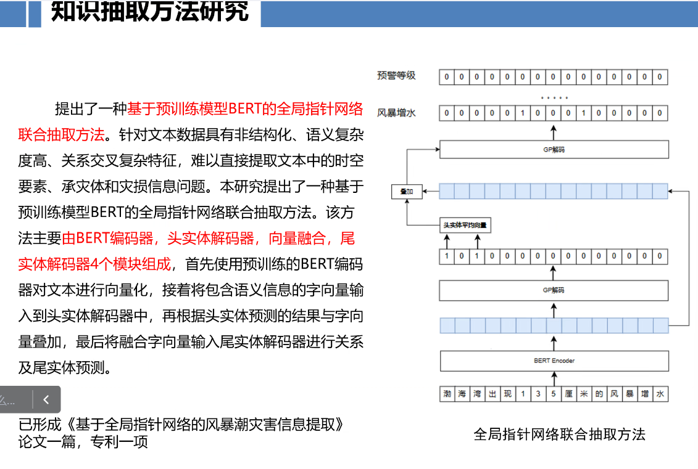

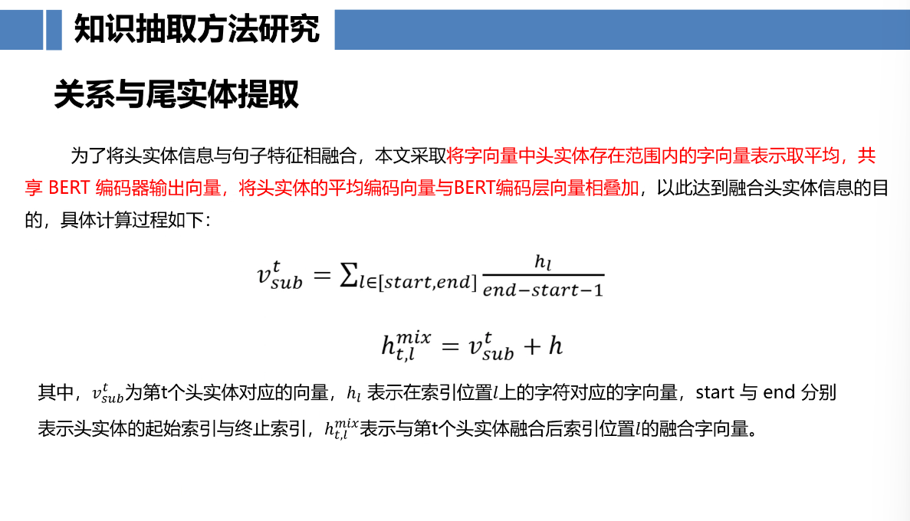

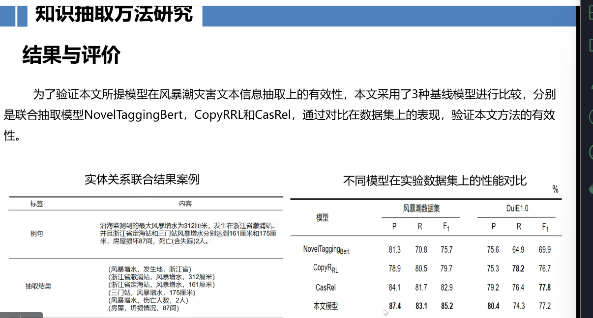

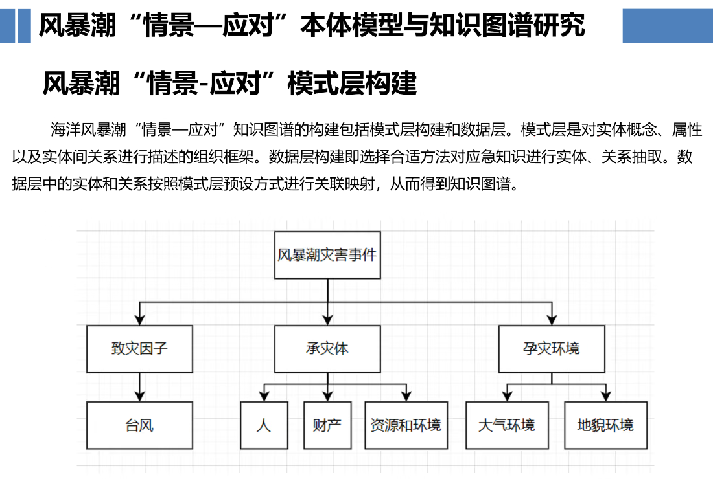

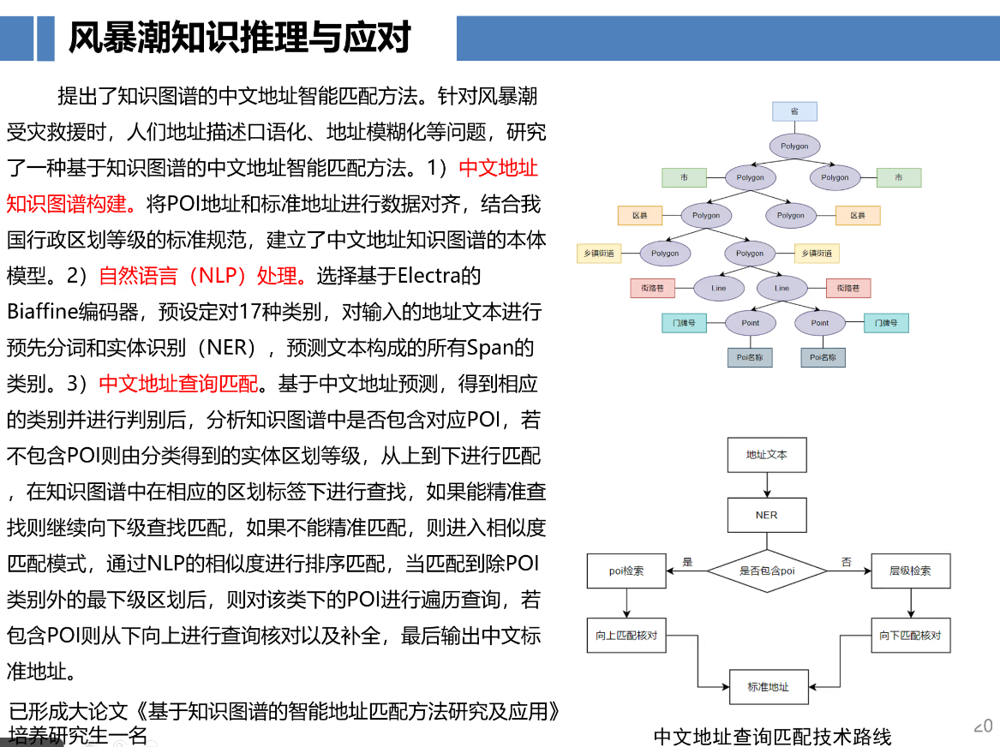

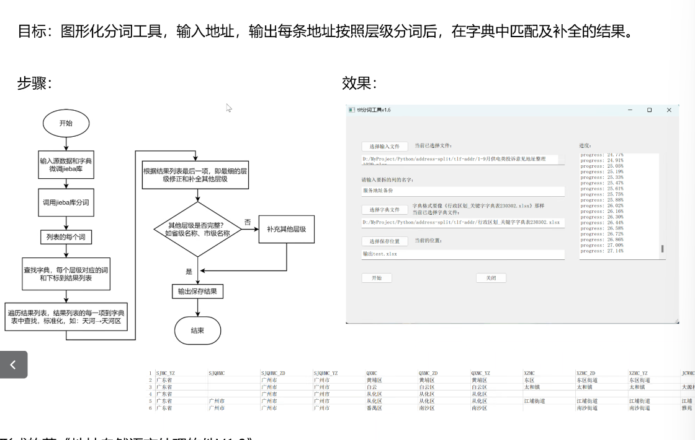

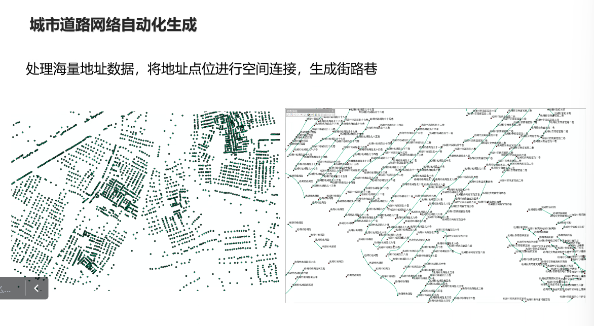

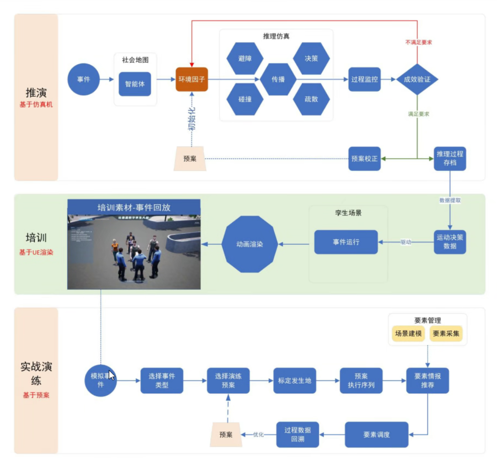

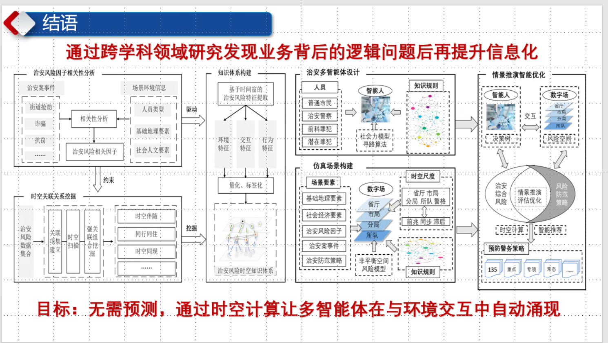

收集内涝预案可以建群

在数字孪生场景中，既有自主判断，也有避险。

不同角色有不同策略。

### 20th

- [ ] 可以看看 AI 行为树
- [ ] 先别好高骛远，先脚踏实地。
- [ ] 3h-看 arcgis 地理信息系统实验教程-巩固 gis 基础-防止丢脸
- [ ] 看 supermap 教程视频
- [ ]
- [ ] 看 python 高阶知识-和环境数据做交互
- [ ] 阅读 ue 的一天
- [ ] 问问智晖超图存储的问题
- [ ] 有空看一下摄影测量中算法
- [ ] ue 静态/动态加载类

### 22th

- [ ] 周末光顾着玩了
- [ ] 看完了孤独摇滚和恶魔人

### 24th

- [ ] 把场馆外的树木做完
- [ ] 先看强风吹拂-4:00
- [ ] 晚上看数据库实现逻辑 (超图？)
- [ ] 7 点跑步 5 公里
- [ ] 看看怎么把 c4d 导入到 ue5

### 25th

- [ ] 看语义化 7 文件中的示例
- [ ] 做语义化工作

### 26th

- [ ] 把学生证发给莎莎姐
- [ ] 看海宗发的 md
- [ ] 捋一遍 ue 制作 umg 流程

### 27th

- [ ] 去公司研究 c4d 怎么做模型
- [ ] 明天把模型发给鲁总

### 28th

- [ ] 和陈对接 c4d 平台
- [ ] 找数字孪生白皮书
- [ ] 找更精细化建模的数据标准
- [ ] 工作逻辑：先把规范找出来，做成逻辑表达的形式（PPT），再列出其中的具体内容。
- [ ] 制作一个 ppt 展示数据标准处理流程 20-22
- [ ] 找 ue5 楼层分层显示 / 摄像头 16-18
- [ ] 有空处理一下 ue5 制作 UI

### 29th

- [ ] 找跟三维相关的名词
- [ ] 回应杨光老师

### 30th

- [ ] 青年大学习
- [ ] 工程坐标系转 CGCS2000
- [ ] 问陈威
- [ ] 和思敏一起查找 CIM 规范

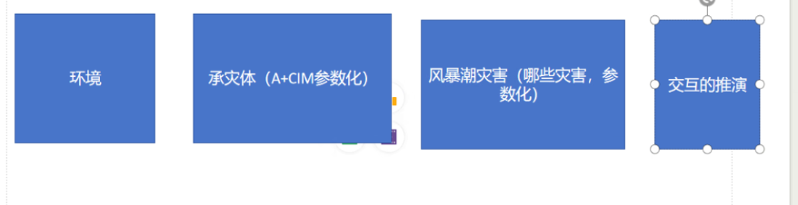
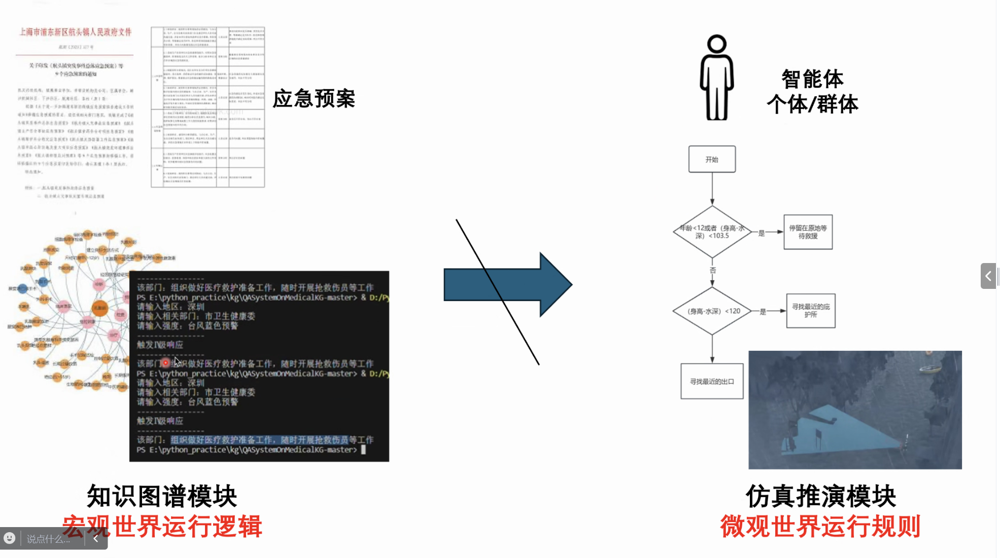

### 7th

- [ ] 2-5 杨光老师摄像头问题
  - [ ] 目标检测 triggerbox
  - [ ] triggerbox 做完二楼和三楼
  - [ ] 实现杨光老师说的：添加四个摄像头，实时显示行人的坐标位置
  - [ ] 问题：碰撞体问题（用 fbx 非常慢）
- [ ] 看 CIM 数据标准/city GML 数据标准
- [ ] 看 ue 的教程——碰撞体
- [ ] 把学 ue 当作玩游戏
- [ ] 10-11 看 ue 文档
- [ ]

### 8th

- [ ] 上午 10 点开会-重大活动安保
- [ ] castto / get all actors of class
- [ ] 2-4 整理 cityGML 和 CIM 标准；
  - [ ] 住房城乡建设部《城市信息模型应用统一标准》
  - [ ]
- [ ] 再熟悉蓝图
- [ ] 找个时间拉新代码跑通
- [ ] arcgis 基础操作都要会
- [ ] 注意做事的“轻重缓急”
- [ ] 6-10 整理完蓝图知识 - 能做基础操作
- [ ] 查看蓝图和 C++ 转换代码

### 9th

- [ ] 查看创建一个对象引用之后的操作
- [ ] 可以问问陈威如果导入为 fbx 格式会非常卡，但 c4d 格式.
- [ ] 数据表需要有属性值
- [ ] UE 创建宏
- [ ] cityengine 导出模型 he cesium 进行地理配准
      https://blog.csdn.net/hhw_hhw/article/details/135088583
- [ ] 找陈业滨师兄要深圳 CIM 标准
- [ ] 把辽宁省数据标准按 excel 表列出来

### 10th

- [ ] ue 数据表添加属性值-excel 表显示在 UI 上
- [ ] 寻找 BIM 数据标准规范
- [ ] 研读 CIM 标准，汇总 CIM 数据标准规范
- [ ] 发会议纪要

### 11th

- [ ] 发会议纪要
- [ ] 找春雨哥问：
- [ ] 回去拿三件套
- [ ] 帮谢铭杰拿书包
- [ ] 看 gis - ue - c4d 进阶 - c++
- [ ] 李老师要求：大中小类分类 - 江门体育馆周边
- [ ] 拼接 cityEngine 点云
- [ ] cityengine 的道路规则属性制作

### 13th

- [ ] 下载 revit?

### 14th

- [ ] 把标准网址整理成表发到研究群
- [ ] 下周交目标检测
- [ ] 等下把体育馆模型截图发给方丽
- [ ] 天河可以在周四对接建模
- [ ] 江门公安局调研

### 15th

- [ ] 下午问鸿铭道路的问题
- [ ] 添加属性？
- [ ] 想一下夏老师的需求 UI?

### 16th

- [ ] revit 视频
- [ ] 看辽宁省地方标准-11
- [ ] 看奥格的标准
- [ ] 交通属性可添加
- [ ] 找江门公安局要平面图
- [ ] 发仿真组会纪要？
- [ ] 卸载 ARCGIS ？

### 17th

- [ ] 为仿真平台的交通添加属性 8-12 预留两个小时
- [ ] 催江门公安局
- [ ] 报名蓝天中学
- [ ] 高德 API
- [ ] 看蓝图
- [ ] 骑行琶洲

### 18th

- [ ] 吃师烤

### 19th

- [ ] 蓝天中学监考

### 20th

- [ ] 写完触发盒事件
- [ ] 火电厂项目实施
  - [ ] 添加完所有触发器盒子
  - [ ] 想一下面对多人时的情况：
- [ ] 仿真平台的交通添加属性（看 CIM 属性表 8-10）
- [ ] 有空看文蒨论文
- [ ]

### 21th

- [ ] 看看 actor 相关的蓝图操作
- [ ] 智晖的策略：把代码放入 gpt 来解释
- [ ] 泓达的建议：多看 ue 文档
- [ ] wmts /
- [ ] 列一下暑假需要补足的技能点
- [ ] 确定江门项目要做的范围-排球馆/周边建筑/道路
- [ ] 有空翻翻 microsoft 账号

### 22th

- [ ] 看技术图
- [ ] 统计一下最近应该干的事
- [ ]

### 23th

- [ ] 给杨光老师看效果

### 25th

**工作**

- [ ] 整理各个要素的 CIM 标准
- [ ] 看看 git merge / git fetch
- [ ] c4d 为每个房间做细化
- [ ] 看思敏转的公众号https://mp.weixin.qq.com/s/nFD0rmhZ4_InllmgjgMg_g
- [ ] 处理杨光老师的问题

**学习**

- [ ] 读项目的源码，gpt 解释
- [ ] 蓝图精进
- [ ] 读一些文献：CIM / 社会力 /
- [ ] 看 ue 文档 -9
- [ ] C++
  - [ ] 模板
  - [ ] 数组作为左值
- [ ] 再看一些引用的示例
- [x] 计量地理学
  - [x] 影响因子分析

### 26th

174.0
**工作**

- [ ] 看杨光老师的任务：是否应该设置为 BP_triggerBox?
  - [ ] 前置：UE 学习
- [ ] 有可能的请客饭局
- [ ] - [ ] CIM 要解决的问题——标识码 / 添加到交通属性上 / 看完整个文档 /
        **学习**
- [ ] ue
  - [ ] 枪的封装和多态
  - [ ] 自定义函数
  - [ ] 以函数名设置定时器
- [ ] 从控制流循环开始看\*\*
- [ ] 蓝图通信

**生活**

- [ ] 18 游泳
- [ ] 20 攻壳机动队

### 27th

172.5

- [ ] 回去看他家的 ue 16-18

### 28th

171.0

- [ ] -12 看完 ue 这一点
      https://zhuanlan.zhihu.com/p/196363738
- [ ] -16 体育馆场景建模
  - [ ] 把体育馆每个馆标编号
  - [ ] 红色的承重柱？
- [ ] 18-20 CIM 标准

### 29th

170.4

- [ ] 问泓达有什么任务
- [ ] 建模部分收尾

### 30th

169.2

- [ ] 看 CIM 标准填到平台中
- [ ] 填房间序号对照表
- [ ] 把 C4D 中墙和门分类整理
- [ ] 门用布尔做成门洞
- [ ] -22 看 UI 蓝图教程
- [ ] 看 CIM 表格里面的东西 - 看标识码怎么表示

### 31th

- [ ] 设置画布大小
- [ ] 看分支的修改内容 -18

## June

### 1st

- [ ] 看下下午能不能游泳
- [x] 有空玩下哈迪斯
- [ ] 发会议纪要
- [ ] 整理最近的工作内容
- [ ] 火电厂：
  - [ ] 蓝图学习：triggerbox / 触发逻辑
- [ ] varest JSON 插件 学习 -17
- [ ] 看下最近有无 UE 相关的公共安全/自然灾害预案模拟仿真 / 。。 相关的论文。
- [ ] C++ JSON 库
- [ ] 学一下 GIS 科研技能
- [ ] 研一要来了，不能能开摆了。。。
- [ ] GIT 学习 -20
- [ ] 把平台的学习网站 汇总列出：
  - [ ] 微软 / 微信 / 本地（zotero / vs code
  - [ ] 必须想好如何及时止损
  - [ ] 于心不甘则更要好好看 BP

### 3th

- [ ] 杨光老师任务周三前做完
- [ ] -15 看城市信息模型
  - [ ] 查看分类标准 CJJ 157

### 4th

- [ ] 上午看中期答辩
- [ ] -20 听上午录音
- [ ] 准备明天开会内容
- [ ] 摄像头问题 - 学习蓝图 -18

### 5th

- [ ] 杨光老师摄像头问题 -20
- [ ] 二维地理网格属性分类
  - [ ] 面积占比法
  - [ ] 权重占比法
- [ ] 三维地理网格属性分类按什么进行分类作为研究目标 -15
- [ ] 把已经有的要素标出来
- [ ] -15 问问安保任务
- [ ] -18 看多尺度相关文献
- [ ] -14:30 把标准文件内容浏览完
- [ ] 回去听录音
- [ ] 找下标识码在哪（GB13923?）

### 7th

- [ ] 把每个要素的属性和方法列出来，如红绿灯要素有什么属性和方法。
- [ ] -23 看蓝图的逻辑

### 8th

- [ ] ue C++
- [ ] -8-9 深入蓝图

### 11th

- [ ] 获取 actor/ pawn / character
- [ ] git 学习https://blog.csdn.net/qq_43592352/article/details/132043150

### 12th

- [ ] 每个要素的属性和方法列出来，如红绿灯要素有什么属性和方法。
- [ ] 看一些要素的方法
- [ ] 蓝图
- [ ] git pull / git merge
- [ ] 看一下研究方向

### 13th

- [ ] CE 是什么
- [ ] 离正式出山还有两个月，想想该做什么。论文方向是什么。
- [ ] 不知道干啥的时候，可以看文献

### 14th

- [ ] 看桂工-融合 BIM 与 GIS 的社区给排水管网多尺度建模研究》
- [ ] 看微信公众号《城市级实景三维数据规范》
- [ ] 整理好表格后发给夏老师

### 15th

- [ ] 1.有没有异响
- [ ] 2.看下整车，看下车上有没有磕碰掉漆呀
- [ ] 变速刹车
- [ ] 3.拍一下
- [ ] 可不可以展开一下订单信息这里
- [ ] 你这个车是想升级出手的吗
- [ ] 问下在哪调的，收费合理吗

### 17th

- [ ] 去公司办的事：摄像头问题
- [ ] 中午吃：米粉
- [ ] 下午尽量五点下班，然后骑黄埔科学城 / 鱼珠 /
- [ ] 选购一个头盔
- [ ]

### 18th

- [ ] 15 点开始工作 - 看视频
- [ ] 龙洞吃东西

### 19th

- [ ] -24:00 看文倩论文  -20:00 梳理整个行文结构，试着找写作点 / 写提纲/ 初稿
- [ ] 尤启鸣
      — [ ] 去迪卡侬看一下？装后尾灯
- [ ] 有空看一下那个深圳标准
- [ ] 对整个论文的行文结构进行把握，看文倩小论文第四章节，志辉主要看社会力模型，这边主要看救援，看看有无可以挖掘的科研创新点 / 写作点。（看看 xhs 攻略）
        - [ ] 看知网论文
        - [ ] 行人反应时间 / 社会力模型的松弛时间
        - [ ] 重点在复杂场景环境设计？D*lite 算法
        - [ ] 查询社会力相关分力
        — [ ] 可以自己写一篇论文提纲
        - [ ] 问文倩的问题：主要参考文献
        — [ ] 仿真类设计行人参考参数看文献
        - [ ] 基于和顾及
        - [ ] 看了文倩不足展望部分，想到的可扩展的点
        - [ ] 顾及大模型？的疏散仿真策略
        — [ ] 看参考文献 6/7/8 /9 / 10 等，看各种仿真疏散模型。
        - [ ] 看 D*Lite 算法
        - [ ] 考虑地图的设计方案？从瓶颈效应考虑
        - [ ] 厘清社会力模型和疏散模型之间的关系

### 21th

### 25th - 一

- [ ] 4：30 看下目前的任务有哪些没完成 / 取快递
- [ ] 5：30 看夏老师任务 / 西瓜耶耶
- [ ] 6：30 看文献《典型危险场景行人疏散研究》 / 写初稿
- [ ] 7：30 出去玩
- [ ]

### 27th

- [ ] 可以讲基于 BIM 模型的地下空间三维洪水浸没模拟分析
- [ ] 17:00 收集好要看的论文
- [ ] 18:00 看完论文，写初稿要点：找参考文献
- [ ] 交通信号灯应用于大型活动结束后疏散仿真
- [ ] 突发事件下考虑救援行为的疏散仿真研究\_余荣付》中引入了健康点模型。
- [ ] 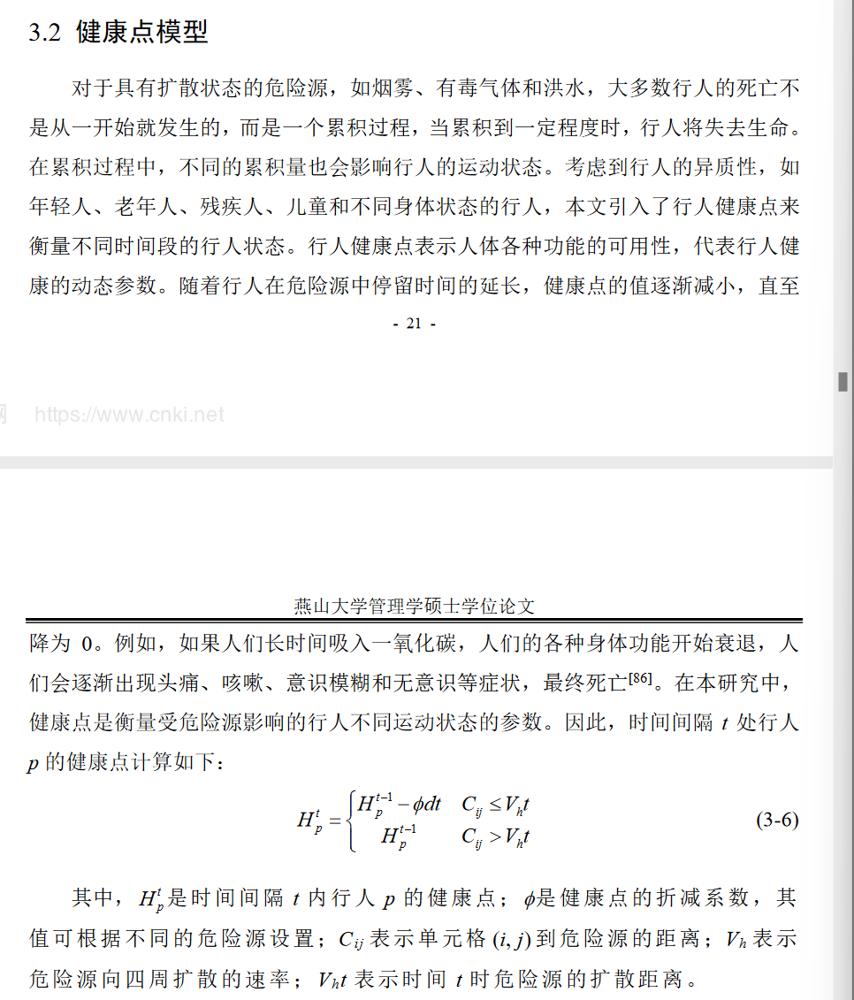
- [ ] 典型危险场景下行人疏散建模与仿真研究》-采用元胞自动机。引入了具体地铁站场景，设置了广告牌、屏蔽门、手扶栏杆等障碍物。

### 28th

- [ ] 看泓达发的 trafficAI

### 29th

- [ ] -18:00 看完 cpp index , 找出不懂的点。
  - [ ] cpp 拷贝数组
  - [ ] 结构体作为函数参数
  - [ ] nullPtr
  - [ ] 数组作为形参被传递
  - [ ] 静态成员变量必须在类外被初始化
- [ ] -20:00 解决不懂的点，看文倩的论文 / 遇见李白 / trafficAI

## July

### 1st

- [ ] 问一下每条路的偏移距离

### 2nd

- [ ] 15-17 看五子棋
- [ ] https://github.com/0voice/introduce_c-cpp_manual cpp 学习小经验
- [ ] 把项目蓝图看明白

### 4th

- [ ] 拉最新的合并代码，在这之前把江门交通提交
- [ ] 了解 UE 反射、垃圾回收-解决野指针、数组越界问题。

### 5th

- [ ] 想申请域名了。。。
- [ ] -15 看完 git
- [ ] git stash
- [ ] git rebase
- [ ] 深入 TMap

### 8th

- [ ] 看新建一个跑车类示例
- [ ] TSubClassOf()
- [ ] 看蓝图委托 / 事件分发器
- [ ] 听录音看
- [ ] ue5 中的继承 / 多态 /

### 9th

- [ ] -15:00 完成江门道路铺设
- [ ] -15:30 拉项目
- [ ] 回去看 gis 基础

### 10th

- [ ] -11:30 看 Cpp 记 xmind
- [ ] -12:30 做江门项目
- [ ] -13:00 看文倩代码
- [ ] -17:00 看懂行人智能体
  - [ ] volunteer

### 11th

- [ ] -10:30 听录音
- [ ] -16:00 看 cpp
- [ ]

### 12th

- [ ] -0:30 红星照耀中国
- [ ] --9:00 斯大林派 托洛茨基派
- [ ] -12:00 cpp
- [ ] -14:00 计算机网络
- [ ] -16:00 断点测试

### 22th

- [ ] -11 看合作群发的东
- [ ] -13 看论文 / 处理监控点采集
- [ ] -16 整理一下蓝图 / cpp 知识点，对接的内容 ， 看浏览器收藏的内容
- [ ] -22 看懂 cpp 中 人 / 车 / 道路 / 道路节点规则
- [ ] -24 看类型转换 cpp （以 citizen 为例）看 b 站视频
- [ ] 晚上在路上回听一下录音
- [ ] 科研和项目要分开
- [ ] 问一下更新了什么
- [ ] 看文章
  - [ ] 马 - 2019 - 基于多智能体的协作救援算法研究.pdf
  - [ ] 基于建筑信息模型的消防救援机器人路径规划研究
  - [ ] **甘 - 2022 - 基于人群仿真的场馆疏散策略优化方法研究.pdf**
  - [ ] 
- [ ] BIM - 面向多层空间
- [ ] 下午按期刊筛选论文

### 23th

- [ ] 梦的尽头 😔

### 24th

- [ ] 这边已经铺设完大部分外部道路，看下接下来可以做什么。
  - [ ] 人行道斑马线 - 需要小交通灯。
  - [ ] 停车场 -
- [ ] -22 看完 收藏夹的 UE
- [x] 问问为何有时候搜不到 RIDER 里的代码
- [ ] -20 补充完论文 / -22 制作好图标
- [ ] -15 看完蓝图基础/cpp 基础
- [ ] spline 样条曲线

### 25th

- [ ] -11 做好图
- [ ] 看蓝图转换
- [ ] 主要做不同地理场景 。
- [ ] 不是洪水场景 ： 设置其他场景。 回去再听录音。

### 26th

- [ ] 继续耕耘蓝图
- [ ] -12 整理好问题

### 27th

- [ ] 看掘金和收藏夹内容 -23:00
- [ ]


思路：写一个多播委托
遍历关卡中的所有车辆 Actor。执行 destroy

### 29th

- [ ] 理解：
      仿真结束逻辑：
      点击结束 button，
      使车辆停止运行并清除：
      遍历所有关卡场景中的车辆 Actor,执行 destroy self（如何在 car_source 中删除 cars？）
      getworldcontext -> get all actors of class -> destroy self
- [ ] 海洋风暴潮

- [ ] 19-20 看蓝图
- [ ] 20-21 看蓝图想想怎么做
- [ ] 21-23 看论文

- [ ] 看明白逻辑： -17
  - [ ] trafficSimulation
    - [ ]
  - [ ] traffic_path

### 30th

- [ ] 找林关平
- [ ] -8 到 看论文
- [ ] 路上听录音
- [ ] gizmo 移动 actor

盖码饭 可乐 800
之位源 兰芳园 800
牛肉粒 200

### 31th

- [ ] 论文思路
  - [ ] 选题：典型危险场景下行人疏散仿真

## August

### 1st

-11:30 改好标题

- [ ] 看各类路径规划算法（尤其是群体）的优越性
      

### 2nd

加姜文浩
找陈威问 agent 识别地理要素
周五前把地理要素表发给夏老师
帮陈威把 江门的场景完善。。
想下作为地理要素制作者在项目中负责什么，团队中负责什么
不要忘了夏老师有学生是专门做社会力模型的
在路径规划部分，重点可以放在如何改进 D\*lite 算法。如添加行人视野范围，多楼层复杂室内环境。

- [ ] 参考了 GIS 专业的论文
  - [ ] 统计疏散后期进行空间点模式分析判断疏散人员的空间分布特征
- [ ] 想好行人流的运动特征和运动方向是什么（在不考虑救援人员的情况下）
- [ ] 看下 anylogic 和 pathfinder 的客观条件
- [ ] 对于疏散人员怎么和周围环境交互，仍然存有疑惑，之前想到的办法是：基于安全标志来区分场景内不同要素，或者把安全标志转换为地理要素来处理，但这样就会让场景变得很宏观。但是在一个宏观场景中，分析行人疏散较为不适用，更加适合选取室内封闭环境来进行实验 。
- [ ] 可以不添加社会力模型，但是模拟不同的群体行为：行人自组织、出口成拱、从众抱团
- [ ] 行人运动采用元胞自动机模型模拟向四周的移动
- [ ] 对于李老师所说的增加场景复杂度的理解：可以采取一些途径： -[ ] 利用 BIM 制作复杂三维场景模型做测试，放到 PathFinder / Anylogic / 中使用。
  - [ ] 不同复杂地理场景的模拟软件不通用，如专门用于火灾模拟的 pyrosim / FDS。

夏老师，这是我的论文初步思路。下面是我针对论文的一些实验设计上的问题。

1.对于李老师所说的增加场景复杂度的理解，可以采取一些途径，如利用 BIM 制作复杂三维场景模型，放到 pathfinder / Anylogic 软件中模拟，后续的在 arcgis 中进行时空分析。

2.D\*lite 算法适用动态地图下行人改变疏散路径，目前没有想好怎么在一个既定场景下添加障碍物等更改路径的情况，所以在考虑是否添加灾害变化因素，如可以设置火灾场景？水淹场景？但是如果针对不同灾害场景，可能需要用到不同软件来进行相应环境下的分析。如专门用于火灾模拟的 pyrosim / FDS。

3.对于行人运动决策，如果在火灾场景中可能不适用，另外选取的场景是否有庇护所，才能采取不同的决策。

4.在没有社会力中的领导者 / 普通场景下的救援者参与的情况下，行人流的运动特征是沿着既定的疏散路线逃生。
行人的运动决策还需不需要添加：（逃亡避难所 / 等待救援）

暂时没有想好研究目的

对于第 3 章疏散仿真的模型构建部分，

初始化行人智能体随机生成位置：
针对不同职能的房间初始化智能体人数两种思路：
根据功能不同设置相应的房间拥堵级别，从而生成初始化房间人数；
根据室内房间面积大小来生成房间人数

实现队列行为

### 针对《多房间多出口场景下应急 苏三模型构建与应用 》

- [ ] 路径规划算法采用 RecastNavigation

### 4th

- [ ] -3 看《基于多智能体的地铁火灾和疏散仿真研究

### 5th

- [ ] -12:30 整理好文献
- [ ] -18:00 看《多房间多出口场景下应急疏散模型构建与应用》
- [ ] -24:00 写完论文初稿
- [ ] -1 制作 1

### 6th

- [ ] 疏散模拟以既定的疏散路线图进行
- [ ] -12 补充 D\*lite 算法在疏散中应用 / 吃饭
- [ ] -14 把地理实体补充完整
- [ ] -18 和师弟交接
- [ ]

### 8th

- [ ] 区公司交接

### 10th

- [ ] -20:00 看 UE 在收藏夹中的应用
- [ ] 豆瓣看类似蓝颜五十枚举

### 11th

- [ ] 看读书不如看 ue 文档

### 12tth

- [ ] 和陈威对接
- [ ] 好好思考下学期的任务
- [ ] -18:00 看 UE

### 13th

- [ ] -12:00 看文献
- [ ] -18:00 和陈威交接
- [ ] 兜兜转转，来到了李人龙的境遇
- [ ] 整理好属性表
- [ ] 看 AIcontroller
- [ ] UE5 CAST 用法

### 14th

- [ ] fe
- [ ] 想想要做什么
- [ ] 只给自己留 8-12 4 个小时去想对策
- [ ] 车辆的 AI 系统
      
      找到当时的辽宁信息管理表

既然李老师说重点放在地理要素设计上，先把项目搁置在一边。

这份工作最大的束缚是无头绪

在草地地表上，是 xx 参数，xx 决策；
在着火的建筑物中，是 xx 参数，xx 决策；
在活动中的运动场馆中，是 xx 参数，xx 决策；
把可以列举的地理场景都列上去。

### 讲什么

对于选择什么场景，有些疑惑。
还是选择不同的场景 0

### 21th

- [ ] -2:30-5:00 看文献
  - [ ] 回忆夏老师原话：
        流程图的思路就是夏老师希望的论文思路。
        把地理场景按照三维地理信息标准分为草地、公共设施用地、水利用地、等不同场景。
        把灾害场景分为火灾、洪水、这部分通读北交的博士论文。
        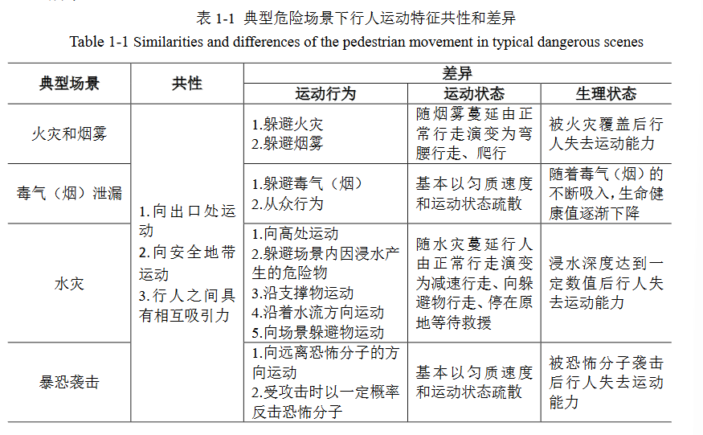
        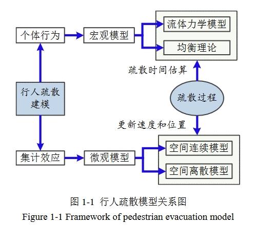
        接下来的工作思路：地理场景可以列成表放在论文中，

研究难点： 1.行人运动智能性、异质性、场景依赖性问题。 2.危险场景下危险源动态扩散的复杂性问题：
不同危险源的扩散规律不同，针对每类危险源扩散需要探索研究不同的建模方法。

- [ ] 泓达和夏老师原话：我的研究以不同地理场景下做的不同决策。

- [ ] 想想夏老师和李老师究竟想要的是什么：
      行人怎么去感知不同地理场景，在不同地理场景下怎么去做决策。
      比如草地、树木、运动场、地铁站，在不同的灾害场景下对行人产生的决策不同。
      文倩的场景较为简单，李老师希望实验场景是一个复杂的地理场景。

- [ ] -还要帮陈威把江门场景放进去。
- [ ] -还要跟姜文浩对接。
- [ ] -可以把北交的博士论文写作思路 po 上去。
- [ ] 明天组会制作 ppt
- [ ] 现在刷手机毫无意义，越看文献越多新想法。
- [ ] 晖在平台实现不同的行人运动行为
- [ ] 通读一篇文献大概花费 30min，加上发呆时间和查找时间看 3 篇回家
- [ ] 说到底，地理信息标准这一最关键的一步要打通
- [ ] 回家看这个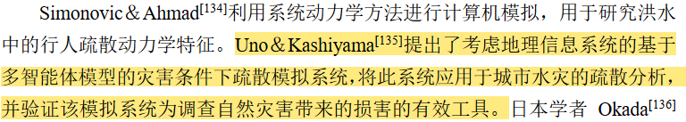
- [ ] 找一下北交博士的引用和被引

-12: 画好流程图
-13： 补充完成文献

最坏情况：统计不同场景行人运动决策、行人运动速度（照 gpt），利用 ppt 展示。
2：做出其他文献对比，如北交博士。
3：看考虑地理信息系统的基于多智能体模拟的灾害条件下疏散模拟系统。
4：把地理信息标准表补充完整。

- [ ] -8:00-12:00 看文献

### 22th

- [ ] 先找行人在不同地理场景下的运动决策、运动速度。

火灾场景疏散速度

地理场景：草地、体育馆、城市道路

灾害场景：火灾、洪水

怎么把多场景下行人疏散问题转换为一个研究问题，即研究这个问题是为了研究什么科学道理。

### 20th

- [ ] 首先确定不同场景的运动决策
- [ ]

## September

### 1st

-15:30 首先整理研究思路
思路：
制作一个不同场景，不同灾害模式下的决策、速度对照表。
用 AI 查找
-16:00 看 NPC 代码逻辑说明

找出模型 excel 表

### 2nd

- [x] 面试
- [ ] 报名志愿者
- [ ] 根据统计出的环境地理要素，放到场景中。
- [ ] 问查看蓝图修改哪里的步骤
- [ ] 看看提交前有什么需要改的步骤，保留这一版的蓝图。。。
- [ ] -20:00 整理地理数据表
- [ ] 看完 xmind

### 3rd

- [ ] 看 ue AI 系统
- [ ] 问王思敏整理的二维地理信息表相关的都发过来
- [ ] 三维的要做什么：对于三维地理要素，通过标识码识别这是什么，
- [ ] -15:30 解决冲突合并问题
- [ ] -16:30 文献阅读

### 4th

- [x] -10:00 跑通项目
- [ ] -12:00 准备周五 ppt
- [ ] -15:00 问问陈威是不是要把交通系统移植到智慧谷
- [ ] -17:00 准备周四 ppt ( 智慧谷项目移植 / 信息表 / 安保智能体表 )
- [ ] 问问泓达蓝图更改的地方
- [ ] 填写奖学金评审表
- [ ] -19:00 整理奖学金评审表证明材料
- [ ] 想好夏老师和李老师究竟想要什么：地理信息要素表，用于标识码和识别要素
- [ ] -20:00 做好淹水场景下流程图 / 看 web of science

- [ ] 对当前平台 cim 建设的说明：目前按照 cim 标准来规范平台内的城市信息模型要素，为未来更好服务于 cim 平台，方便未来与平台对接。

### 5th

- [ ] 分为室内和室外场景
      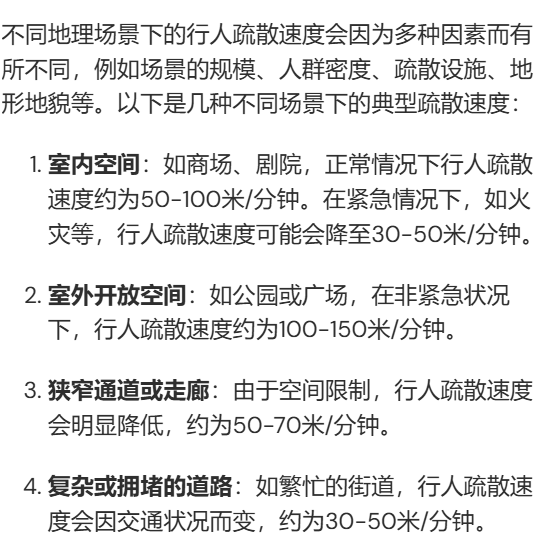
- [ ] -14:30 做完流程图
- [ ] -问一下住建部等目前三维地理模型主推的是什么标准/
- [ ] 尚需整理要素表
- [ ] 想知道师兄是对树木识别和方法做什么处理

### 6th

- [ ] 论文结构不急大改，会后再讨论。
- [ ] 看一下评分表怎么填写。

### 7th

- [ ] -20 看天国拯救背景

### 8th

- [ ] -12 吃完饭
- [ ] -14 休息
- [ ] -15 看论文结构和论文参数
- [ ] 不要被美好的天气蛊惑——结局：还是无所事事

### 9th

- [ ] -15:00 整理 C++ 知识
- [ ] -16:00 想好松夏老师礼物
- [ ] -17:00 查看各个场景所需的实验软件，实验参数。
- [ ] 自己想好实验场景选择什么
- [ ] 看 xmind ，回顾曾经整理的基础地理实体分类
- [ ] 帮杨光老师做东西
- [ ] -20:00 看标准

### 10th

- [ ] 学习 QGIS

### 11th

- [ ] -23:00 做做实验结果
- [ ] -24:00 看看 做不做的出来、想想实验软件、实验参数
- [ ] -11:00 看文献

### 12th

- [ ] -11:30 处理完数据
- [ ] -12:00 想好 pptfea
- [ ] -15:00 找夏老师问组会 fea
- [ ] -24:00 张艺川：games002/

### 13th

- [ ] -12:00 问夏老师和南海对接
- [ ] 和杨光老师开组会推进火电厂项目\探讨内容：
- [ ] -14:00 看 GAMES002
- [ ] -16:00 看 typescript
- [ ] 时祷书

### 14th

- [ ] 一人之下
- [ ] 张艺川发布任务： 1.做好 UE 内的开发工作； 2.利用 typescript / python 编写脚本语言算法。
- [ ] -12:00 看完远程控制工具+命令行环境
- [ ] -14:30 看完 git+github
- [ ] -15:00 看 gis 处理的 python 代码
- [ ] -16:00 问夏老师联系南海
- [ ] 学习 git 多人协作
- [ ] 看 cmake 用法。

### 17th

- [ ] 12:00 吃塔斯汀
- [ ] -14:30 金铲铲
- [ ] -16:00 重启人生

### 18th

- [ ] -11:00 处理 arcgis 问题
- [ ] -12:00 联系折叠床
- [ ] 14:30 开会
- [ ] 15:30 处理完 gis

### 19th

- [ ] -10:00 把软件的实验参数，实验条件列出来。
- [ ] 问夏老师对接南海
- [ ] -11:00 把论文 丢 AI 中润色，提炼开题报告的点
- [ ] 学习 Anylogic
- [ ] -23:00 看 阮一峰 typescript
- [ ]

### 20th

- [ ] 问南海对接
- [ ] -确实是一个顺势而为，自然而然 的事情。
- [ ] 夏老师：公司的资源很好，要多学习。
- [ ] -16:00 看完 typescript 数据章节

### 22th

- [ ] 一万年太久，只争朝夕
- [ ] 目前难点：
  - [ ] 夏老师：南海水深点位工作 / 宏泰智慧谷交通系统 / 论文：Anylogic 的使用 / 实验设计参数
  - [ ] 李老师：城市信息模型标准
  - [ ] 杨光老师：ue 的发电厂楼宇 学习 ue5
  - [ ] 艺川：typescript 之我见

### 23th

1h: -1 typescript 粗看，
1h: -10 typescript symbol()
1h: -11 typescript 查看与 javascript 异同，写到 xmind 中

- [ ] -15:00 看到泛型
- [ ] -16:30 跟泓达接风暴潮，问泓达几时有空来
- [ ] -18:00 看 anylogic
- [ ] this
- [ ] 类型断言

-24 10:00 完成 typescript 基础语法
-25 开题前准备

### 24th

- [ ] 问师兄交接代码
- [ ] 问夏老师风暴潮项目需要做什么工作
- [ ] -11:30 看 puerts 手册
- [ ] 12 看调试指南
- [ ] -14:30 看完知乎调试 - 在 ue 配置
- [ ] 14-16 看 anylogic
- [ ] 查看海宗的论文中的 - 开题报告的结构 / 论文
- [ ] 研究不透水面的数据结构
- [ ] 交接代码后，列出已经有的项目逻辑，
- [ ] -23：00 看 puerts 调试 / javascript 映射
- [ ] -24：00 看 anylogic

问泓达的问题： 1.水深数据在平台中的处理工作 2.风暴潮的项目代码交接 3.原型设计 4.海宗的论文结构

### 25th

- [ ] -20 把知乎的行人疏散轨迹复现一下

### 26th - 周四

- [ ] -11 看完 anylogic 教程
- [ ] -12 完成视频 2 示例
- [ ] -

汇报任务：

- 摩羯水数据处理
- anylogic 中修改
-

### 27th - 周五-

- [ ] -10 准备开题思路：
  - [ ] 准备材料
  - [ ] 流程图
  - [ ] 有空可以把开题报告补充一下
  - [ ] -15:00 看 puerts

### 28th

- [ ] 有空可以看陈威的 UE 视频
- [ ] -18:00 javascript 的 zotero 教程
- [ ] -20:00 vue 的 zotero 教程
- [ ] -24:00 把 javascript / typescript 的 xmind 整理好。

### 29th

- [ ] 看看犬夜叉戈薇与罪孽人的那一集
- [ ] -16 gpt 辅助学习 ue5 C++ typescript

### 30th

- [ ] 看虚拟机端口https://zhuanlan.zhihu.com/p/359598262
- [ ] -11 h 整理 typescript
- [ ] 15-18 看开题报告
- [ ] -21 听李老师的录音，解决论文题目和研究思路问题
- [ ]

## Octorber

### 1st

在佛山

### 2st

- [ ] 蓦然回首
- [ ] 22-22:30 听录音
- [ ] -23:30 罗列需要看的论文
- [ ] 不开始学习，则每次 开组会 / 公司上班 / 给艺川交差 / 做 UE/typescript/python 时都追悔莫及。

### 3rd

- [ ] -9:00 罗列需要看的论文
- [ ] -18:00 罗列实验的问题

### TODO

- [ ] UE5 for C++
- [ ] UE5 for typescript
- [ ] vue.js
- [ ] javascript
- [ ] 开题报告
- [ ] 虚拟机端口
- [ ] puerts csv 任务
- [ ] 水深数据导入平台
  - [ ] 水深数据重新处理一下
- [ ] 问南海的问题：数据是什么坐标系统的
- [ ] 周宁要来了，拿出点做 ue 的知识储备来/
- [ ] typescript
  - [ ] 实例类型和自身类型
  - [ ] ts 中的 static
  - [ ] 泛型类
  - [ ] 类型断言
  - [ ] 模块
  - [ ] declare
  - [ ] decorator

### 6th

### 7th

- [ ] 待解决：看建筑最小容量和 消防阈值标准
- [ ] 整理好标准
- [ ] 看智能体系统理论
- [ ] 还要不要把 BIM 融合进来

- [ ] 19-20 团员入团

### 10th


- [ ] 更改 UE 缓存路径
- [ ] 建立和 UE 场景的映射
- [ ] 看看怎么写 FOR 循环来得到数据映射到 UE 中（在 UE 里写）-22
- [ ] 看看 CIM 标准 / 灾情语义文献 以及参考的文献 -24
- [ ] 看录制的视频 -21
- [ ] -23:30 看预答辩录屏
- [ ] -24:30 粗看文献

### 11th

### 14th

- [ ] 打包工程 （慢，第一次打包失败）
- [ ] -11 看室内标准规范
- [ ] 问下艺川是不是对场景进行了优化，可以进深圳湾了
- [ ] -12 看师兄的 flux 插件
- [ ] 问李老师室内规范标准怎么买
  - [ ] 前提：1.整理好 CIM / BIM 标准 2.滤清论文中的问题
- [ ] 做一个文档，列举要完成毕业论文需要的技术
  - [ ] 了解： + UE5 中的导航系统
- [ ] 和师兄拉一个短会，评估毕业论文的可行性。
  - [ ] 前置条件：查看泓达的记忆系统
- [ ] 回去再把灾情语义论文拿出来读一遍，重点看其中的环境识别模块和导航网格构建模块。
- [x] 做一个标准统计
  - [ ] 回去查看室内/室外标准
        1.T/CECS 10192-2022
        2.GB/T 13923
        3.CJJ/T157
        4.GB/T 36625.1-2018
        5.T/CECS 1643-2024

### 15TH

- [ ] 听答辩组长智晖录音

### 16TH

- [ ] 10-11 标准
- [ ] 11-12 地理配准
- [ ] 14-16 问李老师
- [ ]
- [ ]

### 17th

- [ ] -14 把室内要素模型标准统计好
- [ ] 学习公司的组织架构
- [ ] -18 创建群聊，发布组会纪要
- [ ] -20 整理组会纪要和要做的工作
- [ ] 联系夏老师发室内地图草稿（OGC）
- [ ] 夏老师比较关心的事，场景已经换到风暴潮。查看项目有什么功能可以远程适用一下。
- [ ] 佳志和智晖将深圳示范点 有哪些功能，能看到什么东西，录个小视频，查看里面有什么实现的东西。
- [ ] 要记得录出来视频，夏老师心里有底。
- [ ] 每周要有 5-10 篇中文文献，3-5 篇英文文献阅读量。
- [ ] 定一个时间，让艺川和学生们讲一下“标准化、模板、入库”的问题。
- [ ] 和陈纯碰一下，看城市核心信息场景的标准化部分。
- [ ] 于在信息标准化部分找不到感觉
- [ ] 下一次李老师组会安排线下组会
- [ ] 每周组会若周四下午固定 4 点的话，则周三先给李老师、同学先过一下。
- [ ] 陈纯论文阅读偏重于 CIM/BIM，以及添加寻路部分。
      
- 22-23 整理 ZOTERO 中的城市信息模型到 1.excel 表中 ，2.尝试分类汇总

### 18th

- [ ] 找山体模型
- [ ] 回复陈纯
- [ ] 问数据部的人（林观平）：林观平不再，问一下还有哪些数据部的人。看了教学视频都是 bigemap 中
- [ ] 问下秋红，需要一个多少分辨率的山体 DEM 三维模型，因为更高精度的山体 DEM，需要倾斜摄影模型
      是不是只是需要一个示例，那是不是可以选一个虚拟的山体。
- [ ] 交医保

布置给陈纯的任务：

- [ ] 有空可以看一下 UE5 的教程：可以按照 UE5 基础
- [ ] 可以搜一下城市信息模型/建筑信息模型的一些国家/行业/地方 标准，

- [ ] 看文献—— 1.BIM/CIM 技术应用于应急疏散；
      2.D\*lite 算法应急疏散中应用；
- [ ] 找一找城市信息模型有没有和基础地理信息要素相似的地方
- [ ] 查看 A\*算法文章

### 20th

- [ ] 电动车

### 21th

- [ ] -11 开会
- [ ] 问泓达的问题：flux 是不是可以设置淹水的方向。
- [ ] 写一个蓝图来按照后台数据改变淹水的 intensity。
- [ ] 整理 项目的模块 ，需要在 11.15 前验收，要倒推开发进度。
- [ ] -15:30 把城市信息模型框架数据整理到 excel 表中
- [ ] 找姜文浩拿材料
- [ ] 18-21 看文献
- [ ] 21-22 查看断点操作
- [ ] 22-24

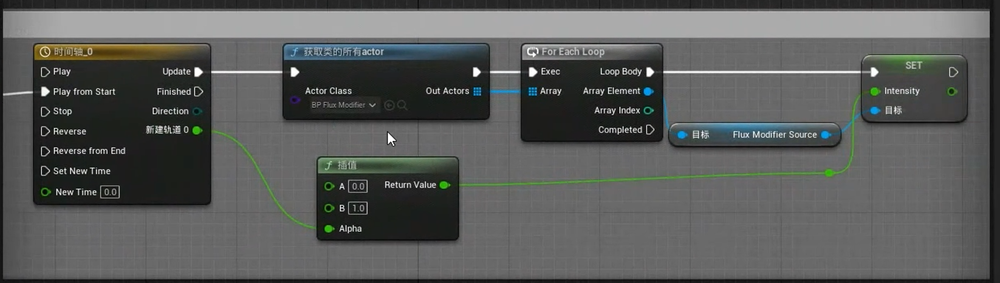

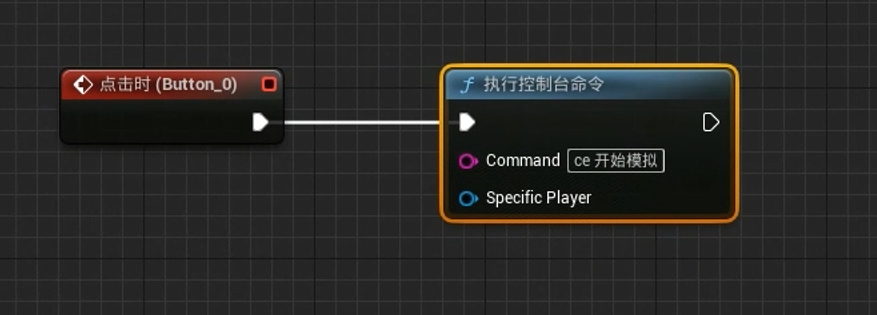

设置每个 tick 给予一个不同的淹水强度

实现思路：

### 23th

- [ ] 问下思敏有没有地理信息兴趣点分类与编码的 excel 整理版
- [ ] 看文献 5-10 篇中文文献，3-5 篇英文文献

汇报内容：

### 24th

- [ ] -9:30 把辽宁省 CIM 整理
- [ ] -10:30 看路径规划文献
- [ ]

### 25th

- [ ] 9-10 处理风暴潮后台数据。
- [ ] 10-15 看 rider 项目源码

### 26th

- [ ] 14-16 看 xmind 蓝图和 ue5 C++-
- [ ] 16-16:30 看 typescript
- [ ] 16:30-17:00 看录屏 整理 标准
- [ ] 18-20 整理标准内容 /
- [ ] 19:10-19:30 辽宁省内容
- [ ] 19:30-20:30 查看 lod 内容
- [ ] 20:30-21:00 对比《国土空间调查、规划、用途管制用地用海分类指南（试行）》和自己整理的标准的区别
- [ ] 以及查看城市信息模型的指导原则
- [ ] 主要还有一个标识码的问题
- [ ] 20-22 整理标准内容
- [ ] 22-23 回去
- [ ] 23-24 洗澡
- [ ] 15:20 回答陈纯问题：
  - [ ] 学校里哪里可以讨论问题的：肯德基/瑞幸
  - [ ] 问题解决：听录屏，查找方案需求，寻找解决方法。
  - [ ] 整理需要做的需求：做一个标准，尽快可以应用到项目中，可以根据地理标准中的要素往场景中放东西。
  - [ ] 夏老师要求：对之前的标准做一个梳理，做一套我们自己的（可以简化的）标准。
  - [ ] 之前做了一套标准，但是做了一半没推进，这个版本要和陈纯推进，有缺漏也没关系，尽量规范标准能用。后台也要地物，跟着这个标准往平台里加东西。后面往里面添加地物，地表类型按照这个标准添加。表述不一样的选取表述比较好的。有开发经验后，这些东西指导加对象。
  - [ ] 佳志做标准化这一块做了一年，尝试把这些汇总成自己的标准，整理了 excel 表格，但是现在有点乱，用不了，所以陈纯讨论怎么把这张表做出来。做出来后，再布置一下 UE 的任务。
  - [ ] 陈纯的工作内容：深圳三区的预案提取
  - [ ] 问下他：统计了标准后，有没有对标准中的内容做梳理（比如提取其中的内容到 excel 表中，根据表归纳总结各个表格内容的标准规范的共性）
  - [ ] 可以讨论每个标准放在场景中可以有什么共通的属性（地理坐标/是否可通行/

所以要思考：怎么把自己的标准转化到适用于平台的标准。

### 27th

- [ ] UI 制作：可以参考：泓达的制作的 securityUI
- [ ] 其实**挺想看一下 CIM 的行业实例**奥格科技
- [ ] 16-17 整理地理信息要素分类表
- [ ] 18—19 去吃东西

### 28th

- [ ] 和陈纯讨论
- [ ] 1400-1500 看泓达制作的 UI
- [ ] 看文献：
  - [ ] 《
- [ ] 看这一部分三维室内外路网构建研究方法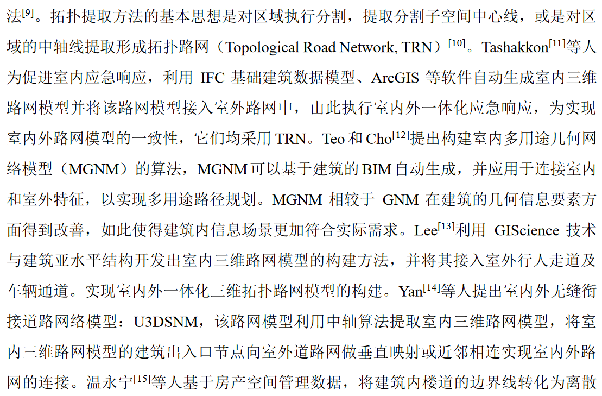
- [ ] fluxfluid 增加了横截面材质
- [ ] fluxsection
- [ ] 替代方案：water plugin / niagara fluids
- [ ] Consideration of flood evacuation behavior through the creation of "timeline maps
- [ ] 看海宗工作梳理- 1024·

### 29th

- [ ] -10 把 generate 给弄出来
- [ ] fluxsimulationdomain 解析碰撞 ， 启用重力

### 30th

- [ ] 实现点击事件：点击观潮站 list，跳转到观潮站
- [ ] 没事的时候想想说话的方式是否需要改变

### ask

- [ ] traffic_AI_system 是否和 自己写的 caragent 冲突
- [ ] AED 是什么东西

- [ ] agent 和 traffic 两个文件夹中都有 boat，有什么区别
- [ ] 没看懂 ABoatCharacter 的 OnClickMesh(primitivecomponent)

- [ ] 还是得看 tsubclassof
- [ ] 看 getallactorsofclass
- [ ] 定时器 setTimer

运行时更 intensity 对于有无影响

### 31th

- [ ]

- [ ] 陈纯说明天发布 CECS 1963 2024 标准

#### 项目

这周主要在处理一个是观潮站点第二个是受灾统计信息的制作

受灾统计信息的话，这个我在这个组件
但是这个插件不能返回数据。

我在这上面投入了很多时间但是没看到效果，所以考虑了艺川给我的另一个思路

#### 文献阅读

## November

### 1st

- [ ] 看录屏

### 2nd

- [ ] 问问 simpawn 是什么，额

### 7th

- [ ]

### 8th

- [ ] 看堆栈文章https://blog.csdn.net/yingms/article/details/53188974

  1.受灾统计信息：

统计风暴潮影响的地理范围（反映为流水水淹面积），建筑、人员、车辆（三维场景高亮，右上角显示文字信息），但是目前没有实现思路。

2.行人应该能读到水插件的深度，然后做出决策，这部分还在弄

### 13th

### **项目待解决**

- [ ] 观测站点 UI 制作 2h-3h -12
- [ ] 我的后台数据要绑定到推演的 UI , 2h
- [ ] 风暴潮点位要对应（从坐标映射生成 ACTOR）
- [ ] 受灾统计信息制作 ： 生成淹没面积 ，getinteraction 是在和 capture 碰撞就触发，而不是和水接触后触发。

- [ ] 风暴潮部分陈威解决
- [ ]

### 18th-

- [ ] 控件复用参考

### 19th

- [ ] 组会汇报内容：修改弘达 车辆 拥挤度 判断逻辑 -- 交通拥堵延时指数
- [ ] 智晖已有成果：行人可以读取水深，做出不同行为决策。

- [ ] 想一想那些逻辑应该放在 CONTROLLER 里

### 22th

- [ ] 听李老师讲座 - 李德仁
      我国 GNSS 比美国多了通信功能

手机定位两种方式 - 蜂窝网 / 室外通过 GNSS
室内定位

### 25th

- [ ] 修改停车场保留两位小数
- [ ]

### 27th

###

## December

### 4th

- [ ] 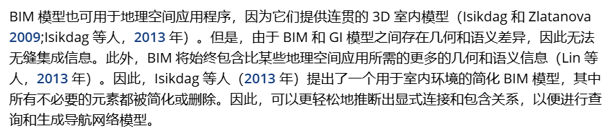 看这部分论文
- [ ] sO-空间和 O-空间主要来自道路和绿地。
- [ ] U3DSNM 的 UML 模型被映射到表中，并保存在内存中。相同的内存数据结构可以在关系数据库管理系统（RDBMS）中实现。
- [ ] 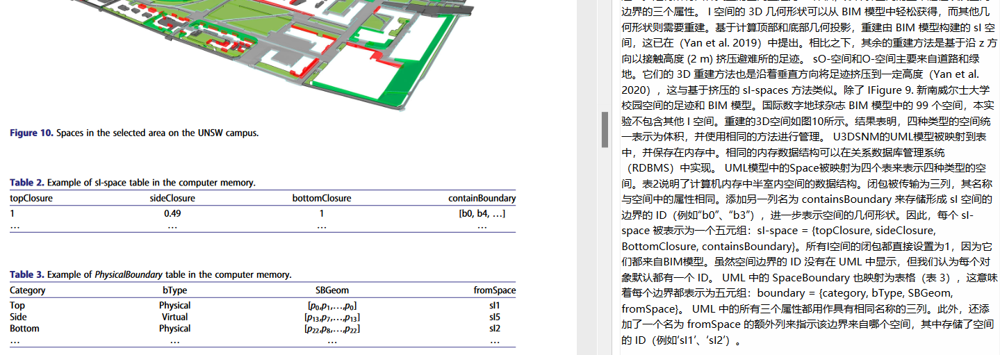
- [ ] 子模块作为 专利

### 5th

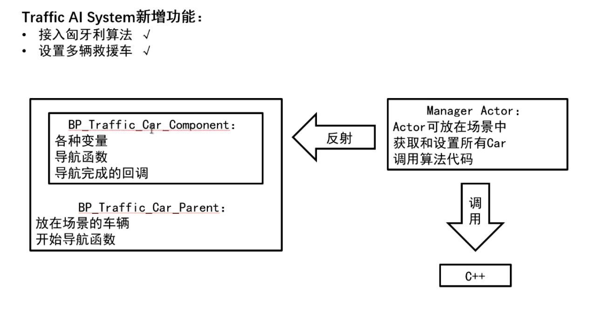

- [ ] 沿海五省土石方工程 海滨旅游公路土石方建设工程
- [ ] 最终可能在广东省布设十几个点，每个点上 1000 人，50 台挖机工作，挖山，广东省提供小山头，提供红线挖土方，
- [ ] 找广东最好，找数据，要一个山的三维模型，放到原型中。
- [ ] 问一下数据部 的 陈嘉鸿 或 林观平 。 要广东省 的 DEM 。
- [ ] 原型：让整一座山，这个山把它分成几块，三维模型找多几张图，先是一座山，后面是挖开的，无人机飞过后，计算没做山挖开了多少。
- [ ] 找土石方计算的原始算法。
- [ ] 看 A\*算法在 DEM 地形中的实现-https://blog.csdn.net/vertex_mfx/article/details/113480476
      社保卡

标准问题：


### 6th

- [ ] 智能体行为
      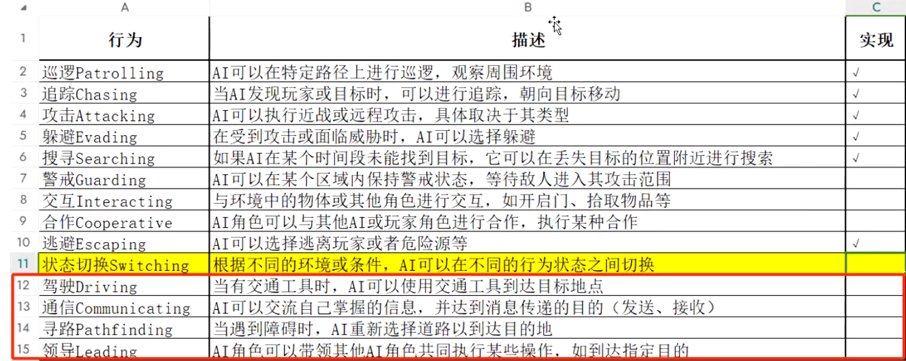

- [ ] Si-Flo Agents
      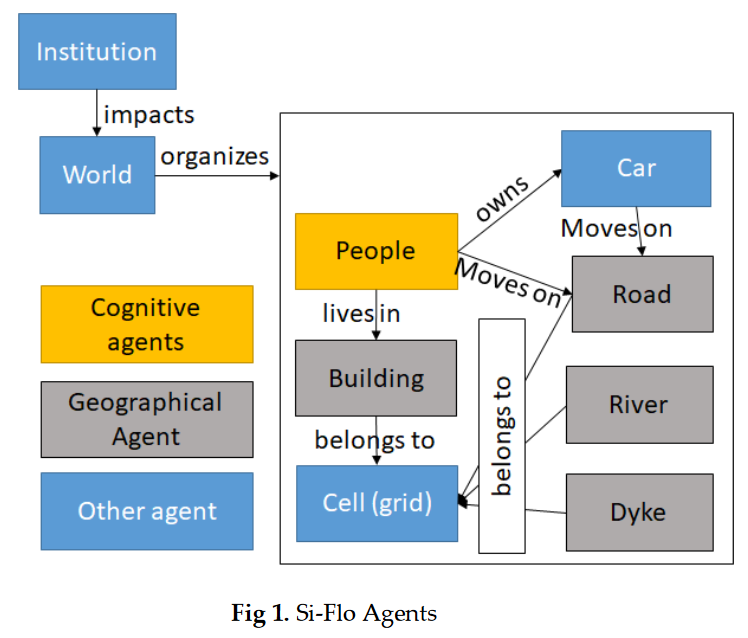

**People**

是模型中唯一的认知主体。
建立在 BEN 架构之上。

提供 BDI（信念-欲望和意图）。

**Grid**
提供直接从 GIS 数据导入的地形信息。

**Buildings**
改 Agent 所考虑区域内的建筑物和所有家具，在模拟开始时根据 GIS 数据（位置和形状）定义。

**Road**
该 Agent 也是根据 GIS 数据构建。构成了居民出行（驾车或步行）的网络。道路上积水会导致道路交通速率降低，甚至无法使用。

**River**
是在模拟开始时根据直接导入的 GIS 数据（OSM）定义的。除了导入的地理数据外，还添加了一些与领土管理相关的信息，例如直接影响水流的河床状况。

**Dyke 堤坝**
对应于所有旨在阻止或限制水通过的结构。在流动过程中，堤坝限制了水从一个细胞流向另一个细胞。在模型中，堤坝的特征在于其位置、高度、强度和状态。水压可能会导致它们破裂，导致水溢出下游。

**Car**
每个家庭可以拥有一辆或多辆汽车（也可以没有）。它是人们移动的主要方式，而步行始终是可能的。我们假设在飞路事件期间，被洪水淹没的地区没有公共交通工具可用。汽车不仅是一种快速出行的方式，而且可能是风险的来源。事实上，当人们试图保护自己的汽车或在洪水期间使用汽车时，可能会发生事故。在他们对洪水灾害死亡原因和情况的分析中（Jonkman 和 Kelman，2005）表明，在所分析的洪水事件中，车内溺水是主要的死亡情况。

**World(全局 Agent)**
通过确定进入系统的雨水和水以及组织单元之间的流动来启动洪水过程。

- [ ] 回顾当时的需求
      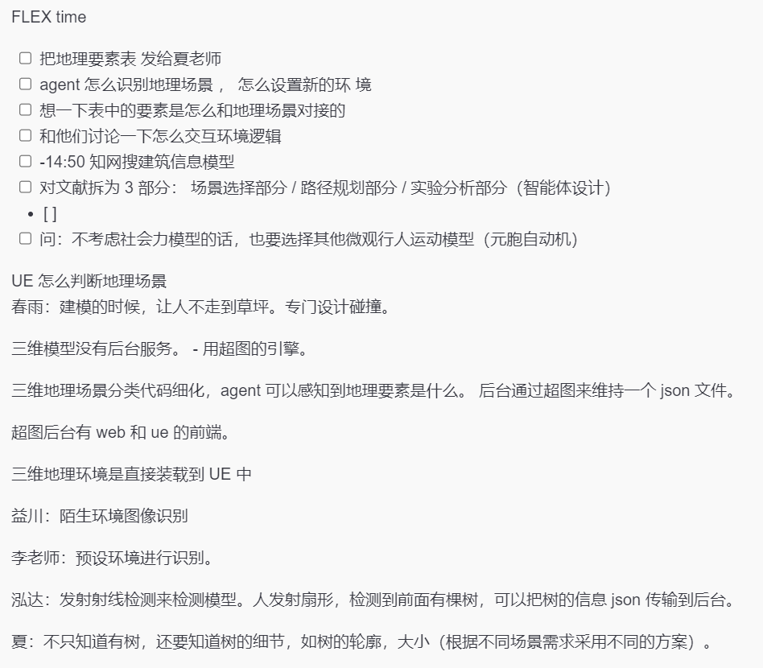/

### 8th

- [ ] 记住：需要把基础再过一遍。

### 8th

- [ ] 重新看一遍 1822 山竹台风风暴潮数据
      、
      **数据结构**

for.14：水深地形文件。

fort_s1822.22：根据中央气象台的台风历史路径转换后生成的模型输入文件。

- water 文件夹 为总水位的模拟，即在模型区域海洋开边界处加上潮汐边界后使用大气强迫（台风）模拟的过程总水位；
- tide 文件夹 是仅在海洋开边界出加上潮汐边界后模拟得到的天文潮结果。
- pic 为根据结果简单绘图，包括沿岸典型潮位站的总潮位、天文潮和两者相减后的天文潮的模拟和观测结果对比图。

* [ ] 论文解读：《基于栅格与点云模型的风暴潮洪水风险模拟评估方法——以珠海市香洲区为例》

**受灾影响损失估算**

- 经济损失估算——根据土地利用类型
  《基于栅格与云模型的风暴潮洪水风险模拟评估方法——以珠海市香洲区为例》

土地利用类型主要包括耕地、林地、水域、城市建成区和开发区五类。
耕地、林地与水域三种土地利用类型主要考虑减产造成的经济损失；
城市建成区主要考虑家庭财产损失、房屋和基础公共设施的破坏；
开发区主要考虑房屋和基础公共设施的破坏。

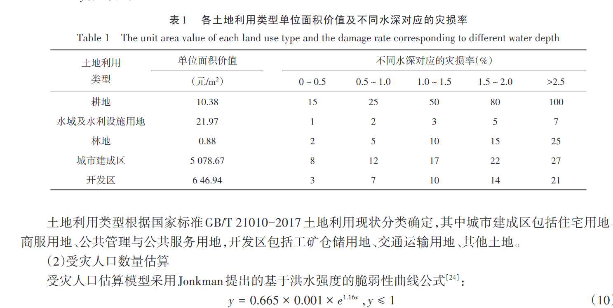
土地利用类型根据 GB/T 21010-2017 土地利用类型

- 受灾人口数量估算——根据 Jonkman 提出的基于洪水强度的脆弱性曲线公式：


y 为 洪灾伤亡率， x 为 淹没水深。

文章通过土地利用类型提取城市建成区和开发区用地，结合人口统计资料及不同区域人口密度分布规律得到区域人口空间分布，根据洪灾伤亡率估算伤亡人口。

**基于云模型的灾害风险多属性评价方法**
参考《海洋灾害等级标准》（DB21T 1715-2009）及洪水淹没风险等级划分为特别重大 ， 重大 ， 较大， 一般。

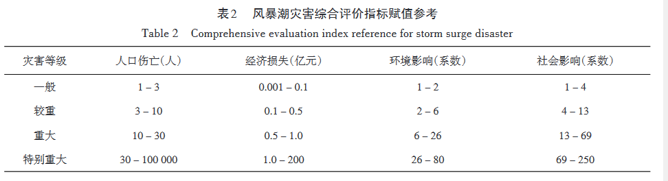

### 19th

- [ ] 回去重新看了一下山竹的数据格式以及给的说明。

### 26th

- [ ] 缺少救援内容
- [ ] 最重要应急指挥救援：指挥调度内容 - 灾害评估
- [ ] 做平台的目的：做一个指挥系统。
- [ ] 需要新增应急指挥系统
- [ ] 全生命周期可视化也需要有仿真 - 风暴潮来临时，过程中，灾害后
- [ ] 风暴潮情景应对：
- [ ] 跟芳丽沟通清楚
- [ ] 每个课题按照申报书要求总结： 1.专利、论文（不管） 2.系统贡献度（明确在系统中提供的内容）
- [ ] 课题一：《基于智能时空模型的海洋风暴潮风险评估体系》
- [ ] 课题二：按照规范标准来用数据库
- [ ] 课题三：融合课题一，课题二内容到课题三。
- [ ] 星期一每个课题组总结。
- [ ] 测试往后。
- [ ] 下周叫弘达 海宗
- [ ] 叫春雨导入阳江
- [ ] 导入整个广东省的沿海三维模型 - 找林观平。
- [ ] 在深圳湾和阳江是三维模型应急救援，在广东省是摩羯和山竹。
- [ ] 需要考虑风暴潮和降水，降水数据从哪里来。
- [ ] 之前在考虑风暴潮淹没实验 和 流水插件的结合， 一直行不通， 所以 现在两套实验， 在广东省 用摩羯和山竹 用风暴潮淹没实验， 在深圳湾和阳江 用 流水插件应急仿真。
- [ ] 降雨量 ， 涨潮的水位高度， 假设室外 x 人数 -> 指挥：x 去救 x。
- [ ]

单独每个学生录一个 demo , 每个同学录自己的功能出来。

周一海宗弘达回来 ， 集成到一起。

### 项目简介

多源感知与风险建模——知识图谱与仿真推演——数字孪生平台。

### 解决的问题

1.风暴潮风险因子建模。
风险因子：风暴强度、发生频率、海绵温度、台风轨迹、台风强度、承载体强度及其分布。

2.海洋风暴潮知识图谱构建和仿真推演。
考虑灾害形成和防灾规划。
传统静态风暴潮管理 -> 知识智能驱动下动态情景应对方案：灾害发生**前中后**全过程应急响应。

3.数字孪生平台：风暴潮全生命周期映射、动态模拟数据、沿海城市三维数据、环境数据。

### 主要研究内容

1.海洋风暴潮风险因子分析与建模
利用海洋站长时间序列潮位观测数据进行风暴潮灾害特征分析——\*\*时空分布特征、风暴潮增减水的

2.海洋风暴和曹模拟仿真与情景推演

- 涵盖**海洋气候、沿海城市、人员、预案**等多种业务信息的**海洋安全领域知识图谱和本体模型**；
- 风暴潮仿真推演和应急决策体系，实现**具体环境、角色状态、行为、情景应对关系**的预案配置；

  3.数字孪生平台与应用示范
  **海洋环境、沿海城市、自然场景、感知信息**等不同实体的可视化特征；

# 2025

## January

### 5th

- [ ] 17083 434.27 col37
- [ ] 0.168507 0.164534
- [ ] 1.单位 2.坐标

预报
预警
预演
预案

### 6th

- [ ] 待提问的问题
- [ ] 1.坐标系
- [ ] 2.单位
- [ ] 3.尚还有其他 DEM 数据，需要结合起来做淹没分析。

### 13th

- [ ] 淹没分析
- [ ] 补办身份证
- [ ] 1.截取深圳湾附近的点来生成 DEM 2.将 作为平均高程

步骤：

- [x] 利用山竹点数据构建 DEM

- [x] 处理叠加水位值和初始地形高度

- [x] 处理成 dem

- [ ] 根据 asgtgm 生成 DEM

准备好数据源
南海地形水深数据：E:\data\2412Storm

每小时变化潮位高度数据：
E:\data\data_2024\shenzhen\fort1216\

一个一个导进去已经不现实了，就取最后一个小时的 dem 数据来测试。

Extract_ras01
Extract_ras02

镶嵌至新栅格

value(rasmerge) - value(Con1) > 0 - > 输出栅格

重采样得到新栅格
Con_ASTGTMV01_Resample

输入要素表
part51

根据 part51 - 裁剪

生成 point51_clip 和 point51_clip2

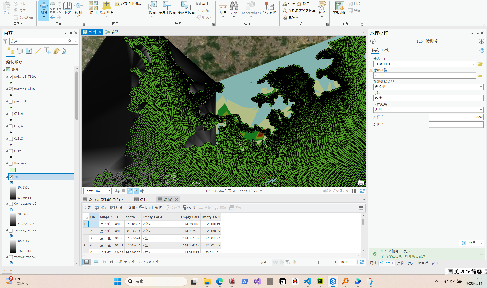

part51 生成栅格数据：
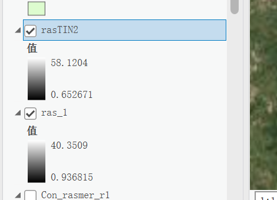

part51 掩膜提取数据
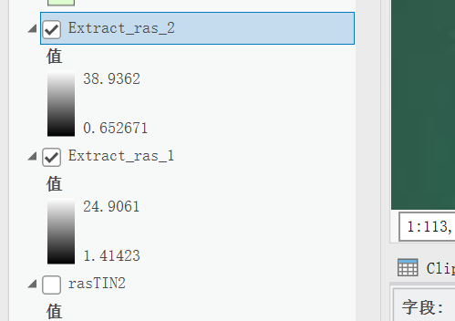

重采样结果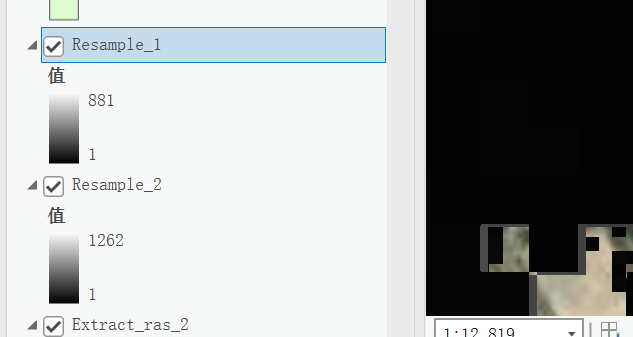

人口分辨率数据
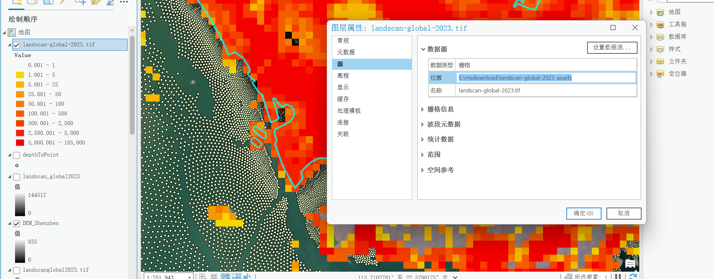

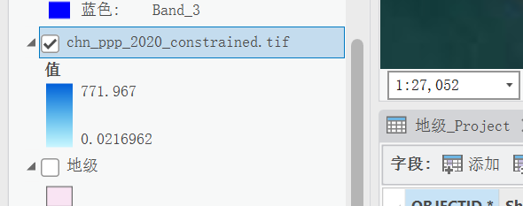

重采样 Con_extracPlus3 / Con_extracPlus3_2 到人口分辨率数据 的 分辨率

人口分辨率数据分辨率
x
0.008333333333
y
0.008333333333

point51 栅格计算器得到相减栅格图
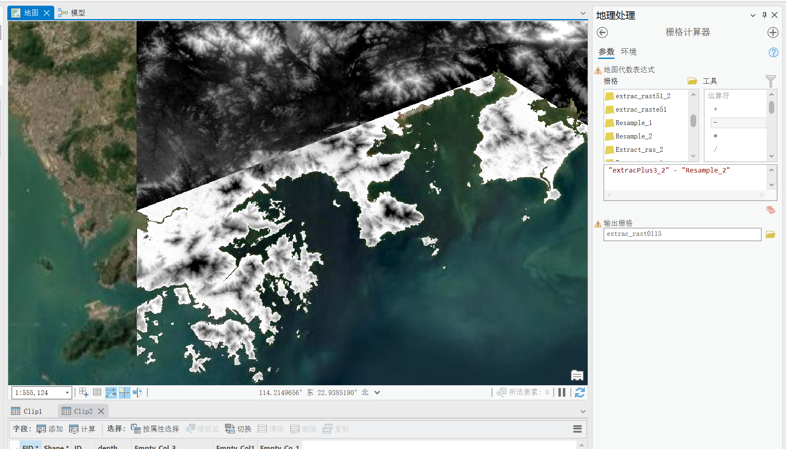
point51 大于 0 的 淹没范围图像

point51>0 的淹没影像图
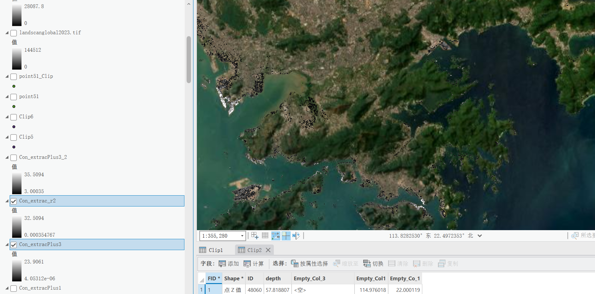

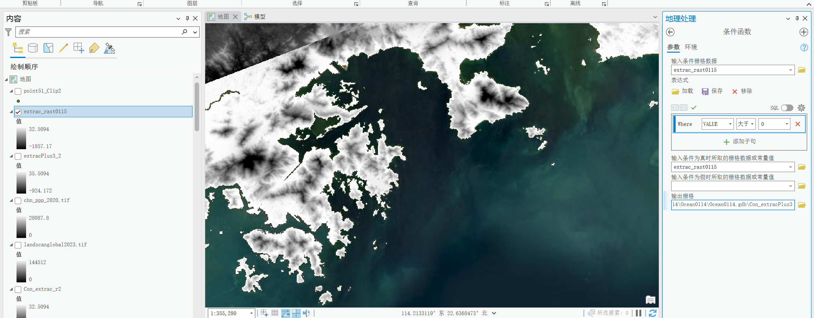

point51 重采样至人口分辨率后淹没范围图
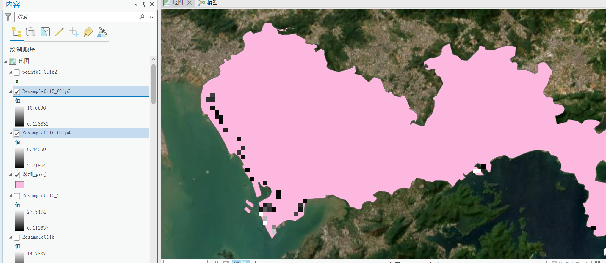

得到 Con_popu 筛选的人口分辨率图
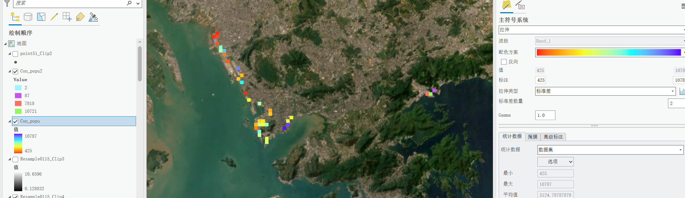

年终总结：

接受一切批评指正

受灾人数统计
山竹
4,621,185

摩羯
4,495,330

受灾面积统计
山竹
3,683,930,714.411342

摩羯
3,807,434,597.858294

0.0009892390790000008
0.0009892390790000002

water 110073 -0.5431417054E+00
tide 110073 -0.4226666979E+00

2 10.76442327

0.7282685157E+00
10.03615475 10.03615475

20.64318035

20.12813568
0.5150446672E+00

outputAdd/110.xlsx
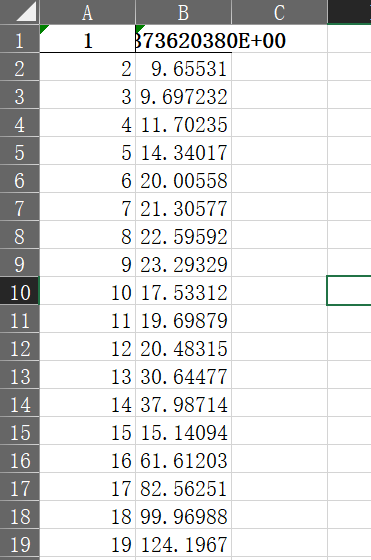
output/110.xlsx
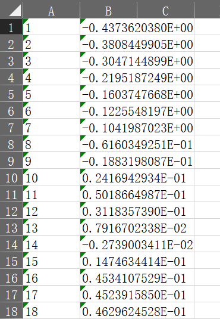

1216.xlsx
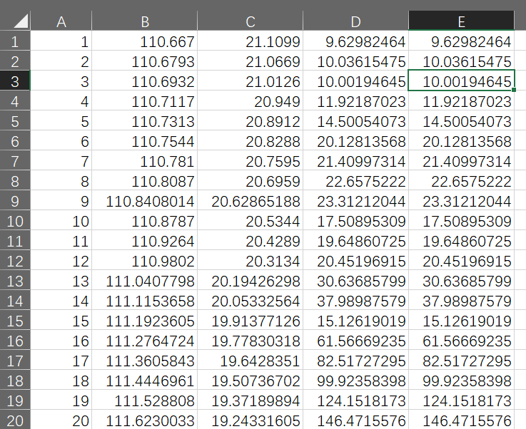

记录所有问题

- [ ] 1.切换关卡后，仍保留大型活动安保

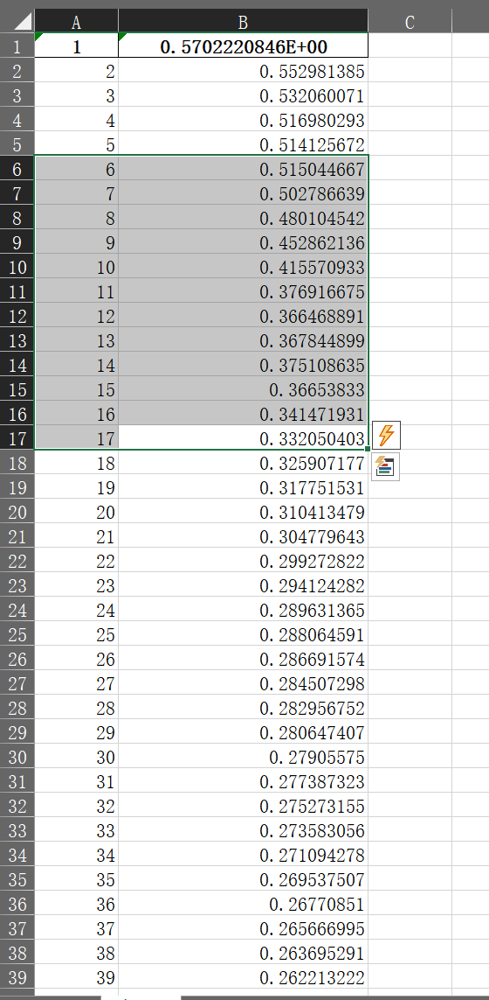


### 25th

**Bug 修复问题**

受灾统计信息：点击影像评估的时候建议就可以统计出受灾面积，不用再点击受灾面积


## Febrary
### 20th
- [ ] 台风“山竹”数据处理文件
  点文件 "%名称%Point.shp"
  data2024/2311/typhoon/

### 22th
- [ ] 

### 南海资源调查中心报告笔记

主要内容：广东省沿海风暴潮时空变化影响因子及演变规律。

### 开题存在问题反思

- [ ] 各个部分缺乏连贯逻辑，如标准怎么和路径规划结合器来。

### 提的问题

文字：
加粗、放大、标红

字体：最小 20 号，18 号

间距：1.3-1.5

研究内容：先总体，后细节

涉及到系统开发部分：可以用流程图。

每个同学

研究区多房 间的特征，基于构建的疏散环境空间模型以点集合的方法来表达不规则房间，提 出一种改进的疏散人员初始随机分布方法，以拥堵级别（如表 3-2）作为初始输 入参数[75]，来满足本文仿真模拟的需要。具体方法步骤如下：

人员疏散问题的关键在于找到最佳的撤离路线，使疏散人群从危险区到安全区所需 要的时间以及在疏散过程中造成的人群拥堵程度最小化。故而，在疏散问题中应将人员 的疏散移动时间和人群拥挤程度作为重要的考虑因素。本
在发生事故后，疏散者通常会选择离自己较近的出 口、楼梯或是在自己视线范围内的出口、楼梯、通道等进行疏散

### 对李老师提的问题

- [ ] 场景选择室内建筑场景，不选择室外的场景，做一个建筑的空间结构和属性图
- [ ]

### 对摩羯数据的处理工作

解压文件夹里的
fort14 是
fort63 是对本次风暴潮数据的水位变化模拟，前 134673 行是

### 李老师原话要求

研二的同学请注意，国庆后开题，请同学们这周把相关开题资料、选题（可以先自己做 2-3 个选题）和研究方法图准备好，周五我出差回来请上导师们一起给同学们讨论一下选题和研究方法图

固定时间：
5h - 对接泓达风暴潮平台
4h - 处理摩羯数据 - 放到 ue 平台
4h - 处理 anylogic

18h - 论文开题准备 -

FLEX time

- [ ] 把地理要素表 发给夏老师
- [ ] agent 怎么识别地理场景 ， 怎么设置新的环 境
- [ ] 想一下表中的要素是怎么和地理场景对接的
- [ ] 和他们讨论一下怎么交互环境逻辑
- [ ] -14:50 知网搜建筑信息模型
- [ ] 对文献拆为 3 部分： 场景选择部分 / 路径规划部分 / 实验分析部分（智能体设计）
- [ ]
- [ ] 问：不考虑社会力模型的话，也要选择其他微观行人运动模型（元胞自动机）

UE 怎么判断地理场景
春雨：建模的时候，让人不走到草坪。专门设计碰撞。

三维模型没有后台服务。 - 用超图的引擎。

三维地理场景分类代码细化，agent 可以感知到地理要素是什么。 后台通过超图来维持一个 json 文件。

超图后台有 web 和 ue 的前端。

三维地理环境是直接装载到 UE 中

益川：陌生环境图像识别

李老师：预设环境进行识别。

泓达：发射射线检测来检测模型。人发射扇形，检测到前面有棵树，可以把树的信息 json 传输到后台。

夏：不只知道有树，还要知道树的细节，如树的轮廓，大小（根据不同场景需求采用不同的方案）。

下周有开发者培训

### 问题

- [ ] rider 如何搜索代码 以 Tsubclassof / delegate
- [ ] spline 样条曲线
- [ ] cast 转换问题
- [ ] 打包到宏 / 打包到函数
- [ ] 以事件设置定时器 / 以函数名设置定时器
- [ ] ./->
- [ ] 查找怎么在 traffic_path 中找到 cars - trafficCarComponent / BP_Sedan

### 蓝图问题


为什么碰到门能类型转换为 ThirdPersonCharacter

spawn cars?


initial vehical?


把事件结束运行设置为一个接口实现？

先把速度设为 0，再把 drive 取消掉。

就是 D\*Lite 算法
就是寻路算法可以设计智能体，主要功能是智能体怎么寻路

在文倩师姐的 D\*lite 基础上怎么把地形 ， 地理场景做复杂些。

1.1 1.3 跟洪水无关。

论文跟洪水无关，主要是寻路。只是考虑 1.2

题目：不同地理场景下 ， 可以设置两个地理场景，D\*lite 如何在多个地理场景下实现。
李（论文先看题）

包括
在 3 维地理场景下，地理要素是怎么设计的，分类标准，代码是怎么设计的
基于此设计，D\*lite 算法进入怎么识别这些地理要素，

夏：
地理场景，风暴潮场景作为一个，另外可以多设计一个，

### 问题

如果是做不同地理场景，怎么模拟。
如火灾场景一般用 pathfinder.
需要考虑路径上的温度以及烟气浓度等。

思路：

- [ ] 一是从被救人员角度，二是从救援人员/机器人角度。
- [ ] 转换为安全指示标志引导下的行人群体疏散。
- [ ]
- [ ] 按照构建不同地理场景的角度切入论文，更多要借鉴 robocup 救援仿真 系统 。

栅格法重构地图，为地图场景要素添加标识，危险程度。

没有领导者的情况下，是否添加救援人员


对于类型转换一直不是很懂，此处 citizen 和 citizencharacter 不是继承关系，为何可以转换。

```cpp
DECLARE_DYNAMIC_MULTICAST_DELEGATE[_RetVal, ...]( DelegateName )
```

\*\*\*

创建一个地理场景，其中包含很多地理相关模型，利用地理信息系统中的地理要素标准为每个模型添加标签和属性。研究点 1.
在场景中，被救人、施救人员和车可被视为智能体，智能体是能够感知环境变化，并对这些变化自发做出决策，或者由我们设置好的决策规则来执行一些动作，比如说：
在自然灾害场景中，突发火灾，水灾时，地理场景中的要素是如何变化，如房屋倒塌、道路淹水、在地下封闭场景遭遇水灾，此时普通人或车作为智能体一是逃避水灾，二是避开倒塌的区域寻找避难所救援点，而救援人员救援被困人员。研究点 2.
在如运动会等人为大型活动场景中，突发拥挤、踩踏事件时，人员和车又是如何决策的。
这里我们如何指定决策规则呢，我们一种方法是根据现有资料预设一些行为决策规则、第二种思路是参考 gpt。研究点 3.

这里人、车的运动路径需要有一个路径规划算法，目前我的小论文在这个方向。研究点 4.

###

- [ ]文倩提供了 github 代码水
- [ ] 女性速度放在后面部分洪
- [ ] 水灾改为洪水 ， 封闭场景中
- [ ] 考虑行人特征与领导者角色的改进社会力模型-考虑添加了行人情绪值，d

###

/


**行人疏散模型：**为研人将行
宏观模型以行人流整体特征究对象，人流看作可压缩的实体或连续 流动的介质，对行人流三要素特征进行分析，重点研究行流分布及时空演化规 律，分析拥堵和集群现象机理及疏散过程中的自组织现象。

离散空间模型：元宝自动机
连续：社会力模型

### 危险场景行人疏散建模

### 研究难点

### 主要工作

### 地下

停车场、地下商场、地铁站台等城市地下活动空间越来越多，当突发大雨、 洪涝等灾害时，地下空间易产生大量积水，造成经济损失

地下空间发生洪涝特点：

- 地下空间较为封闭
- 30-50-70cm 逃生极限情况
- 其他此生灾害，造成恐慌心理。

### 躲避物设置

对于论文的思路

- 听录音
- 写提纲
  再通读一遍：找参考文献中关于：D\*lite 救援 / 地理场景要素

## 论文

- [ ] 对行人运动规则从微观角度建模，针对水灾场景进行相应修改（水灾场景下寻路算法和疏散决策模型进行改进）。
      **改进 D\*lite 寻路导航算法和改进社会力微观模型**的有效性，以及行人年龄、场景有无引导者、引导者数量对疏散效率的影响。

## 第一章

**行人疏散模型**
**行人最短疏散路径规划**
环境建模——拓扑路网 / 栅格模型

### 研究内容

- [ ] 改进社会力模型，引入洪水排斥力、不同水深下异质行人预期速度研究、增加引导者和引导者与疏散者间作用力
- [ ] 改进行人路径规划算法及决策机制
- [ ] 地下洪水场景下行人疏散仿真
      

## 第二章

**行人行为分析和建模**
普适性群体行为-快即是慢/从众现象/瓶颈效应/湍流现象
特异性个体行为-

## 第三章 改进行人社会力模型

**社会力模型**

- [ ] 行人自身驱动力
      
      表达体重为 mi 的行人倾向于以与其速度 v 沿预期移动方向 e 移动。

- [ ] 行人与行人间作用力-心理层面排斥力 / 物理层面挤压力和摩擦力
- [ ] 行人与墙壁或障碍物间的力

**不同水深情况下行人速度**


**加入洪水排斥力的社会力改造模型**


行人作为圆柱体的半径也会影响阻力


**加入领导者参与的社会力改进模型**

## 第四章

**人群仿真系统设计：模拟人群在不同场景下的行为** / **基于仿真的疏散策略优化方法：对比实验，通过分析疏散效率、疏散安全性、总疏散人数评估方法的有效性**

### 行人智能体设计

行人分类（年龄 / 身高 / 性别）影响期望速度


#### 行人感知参数设计-感知范围确定（视野角度、视野距离） / 行人反应时间确定

视野角度：通常 180°。
视野距离：所在地图栅格中心为中心，边长为视野距离。

#### 行人行为和状态设计-初始状态、应急疏散状态、疏散成功状态、疏散失败状态

- [ ] 初始状态-性别、身高、年龄、初始位置
      — [ ] 应急疏散状态-决策与行路行为、行走行为。
      — [ ] 疏散成功状态-行人为引导者、跟随者。
- [ ] 疏散失败状态-水深超过 70cm 后未到达 exit。

### 仿真系统设计

#### 仿真类设计

- [ ] Person:Leader/follower
      sex
      age
      weight
      height
      影响预期速度
      radius
      exit
      移动目标点
      max_speed:大小和方向
      velocity
      position:(x,y)

- [ ] Group
- [ ] obstacle
- [ ] map:available / inavailable
- [ ] shelter
- [ ] path_planner（导航类）：Astar / D-lite

#### 仿真参数和实验场景设计

**

**定义水灾蔓延过程 water_depth\*\*


#### 仿真系统功能-地图添加导入、行人疏散过程演示、行人疏散仿真数据分析功能

### 数值分析

#### 有无水灾对比分析

#### 行人年龄影响分析

#### 行人视野半径分析

#

### 原型设计

**环境设计**
场景设计
**赛事设计**

**预案设计**
突发事件等根据预案指引模板部署预案执行在场景模型中呈现出来。

**模拟仿真**
添加调参模板
交通仿真/
车道点/停车场/红绿灯设计。
**事件仿真**
人员设计：多智能体（观众）设计/ 单智能体设计（安保人员）

## 内部讨论会

业务问题-技术问题

课题分为三部分：
监控视频联网；
预案仿真；
数字孪生，仿真推演；

多智能体参数化仿真推演

天河体育中心
全部外部道路、模型、内部模型、IOT 设备（视频/门禁/卡口） 2.江门保利体育馆
全部外部道路、模型、内部模型；
IOT 设备（视频、门禁、卡口）
建模包括场馆建模和角色建模

场馆建模-王春雨 / 杨鸿铭 / 李育俊/ 于佳志

知识构建-正文 黎耀勇 / 谢铭杰 / 王思敏

仿真设计-周泓达 / 陈海宗 / 黄智晖

系统开发- 陈威 / 周泓达/ 陈海宗 / 黄智晖 / 郑文 / 后台开发

总计划：6 月 15 日

每个组之后单独开小会

知识推理/情景推演/时间评估 / 视频融合

### 本周工作重点

- [ ] 天河体育馆模型构建
- [ ] 拉更新代码
- [ ] 江门体育馆周边场景细节完善
- [ ] 海洋风暴潮 UI 完善
- [ ] 三维数据规范-基于 CIM/cityGML
- [ ] 新疆火电厂摄像头和区域目标检测

（1）（1）实景三维数据标准规范汇报

（二）王思敏学生汇报 1.汇报内容概要
（1）土地利用现状数据标准汇报
（三）王春雨汇报 1.汇报内容概要
（1）师大位置建模工作标准技术流程汇报
（四）李卫红老师反馈 1.汇报内容概要
（1）希望融合春雨和思敏的数据标准
王春雨从 L1 模型参考国标。
L2 到 L3 有资产。
夏老师：路灯，消防栓等小设施能否添加进平台？
李老师：仿真做白膜即可，添加 IOT。
春雨共享国标。
（2）定义好环境模型的标准规范，做成知识库，未来在室内或室外皆可提取代码。
（3）室内可参考夏老师的 ISO 国标定义室内空间：如家具/智能设备等。
室外没有国际标准，参考王思敏标准。

拓展 POI 规范，定义到每栋建筑。
把 CITYGML 和土地利用分类表结合，不仅确定是建筑，还要确定是社么类型建筑。

春雨哥模型参考 BIM 模型，
从 BIM 基础拓展为 CIM 标准，于佳志和王思敏负责查找 CIM 标准。
最好应用可行性更好的 CIM 标准。
查找 CityGML 标准以及可行性更好的 CIM 标准，另外重点参考深圳等试点城市。

（三）陈业滨师兄反馈 1.汇报内容概要
（1）风暴潮“情景-应对”本体模型与知识图谱研究汇报 2.李老师反馈
（1）预案，风暴潮灾害（哪些灾害），承灾体（Agent 和城市 CIM），

逻辑：仿真平台通过环境数据的搭建，承灾体和灾害等级的设置（进行参数化设置），进行交互推演，得到优化细化预案。
（2）确定试点城市模型

3.夏老师反馈
（1）应急预案方面，将知识图谱模块通过专家知识约束与智能体行为决策进行联系，可采取在大模型训练阶段或大模型检索阶段介入两方案。

李老师希望做成精细化模型的数据标准形式，所以需要找精细化模型的数据标准规范。

**摄像头**

- 高度门沿：不低于 2.2-2.4m 最佳；
- 位置：出入口；
- 方向：里面对着外面（优先小空间对着大空间）；
- 角度：>= 45°，俯仰角不高于 20°；
- 距离：>= 3m；

  2.逻辑

- 人进入摄像头视野范围获得：
  - 摄像头照射范围
  - 区域范围

灯光-制作默认灯光效果
获取真实效果：渲染设置-全局光照

区域光

材质编辑器：
颜色
反射：添加 GGX（金属质感反射）

层-层菲涅尔：反射周围物体

打包/拖进空白：ctrl+G

实时选择 9
框选 0
t 缩放

w 世界坐标切换
鼠标中键 滚轮 切换 3 视图
r 旋转
r+shift 按照一定度数旋转
e 移动
ctrl+拖 复制 放射复制

成三角形：进入可编辑状态。

绿点 / 红点 / 灰点。

M—B 边模式-桥接


制作动画
点击移动上的小红点，
为保证渲染不出错，把对象偏移一小段。

可以采用时间帧

连接对象-删除：可以把对象变为一个整体

扫描-
保存-布局-保存为启动布局

按 space 或 esc 推出编辑模式

D 挤压
I 内部挤压

细分曲面

布尔-A-B

FFD


一 10
二 10
三 10
四 10

捧场亏
模唱还
梁江森
郭浩一
成双
俞造杰
陈楚楚
张晓兰
封单和
刘奕轩

- [ ] 看四叠半神话
- [ ] 工程方面 之前泓达师兄帮我申请了一台公司的电脑，然后这两天就是在新电脑做一些软件和数据的迁移交接。，第一个就是在新电脑那边搭 ue5 环境遇到了一些问题，可能后续要直接在服务器上拉项目下来。
- [ ] 第二个就是之前利用 cityengine 利用道路编写规则，然后本来想回来远程控制一下公司那边电脑，但是昨天好像在那边把远程软件关掉了，所以现在只能演示导入到 cityengine 之前在 arcgis 中的处理。
- [ ] 在 arcgis 里掩膜提了一下深圳的 dem。
- [ ] 将影像文件叠加在地形上。
- [ ] 另外这个数据是 osm 数据，第一个问题可能分级是按国外的标准，和国内的标准是有些不同的，可能到时候要做一些属性的映射。第二个问题是道路属性比较杂乱，有些道路分类是放在 highway 属性中，有些是放在 other_tags 属性中。第三个问题是对于不同等级的道路，比如这种城市主路，也就是一级公路二级公路还有少量的一些 tertiary 也就是三级道路中都是用双线表示的，这个需要把道路添加一些拓扑规则，或者重新绘制成一条线再导入到 cityengine 中制作。第四个就是也是这些道路也是不能全部导入 cityengine 中的，跟海宗那个情况 E
- [ ] 所以这里我更多的是做参考，如果有其他的更好的道路数据就可能更好一些。
- [ ] 我现在在做道路根据字段融合的步骤。
- [ ] 如果你是在用 Arcgis 打开，首先一定要对 OSM 数据进行“修复几何”操作，这样可以避免后续处理计算中出问题，另外，为了让数据更为规则，例如数据索引更加完整，建议再把数据导出到 GDP 或者 MDB 数据库中。

### 研一工作

- 完成学分，
- 小论文（月底交小论文题目，研究方法/思路/摘要）
- 科研细化
- 安排分配工程实现

李老师意见：

泓达海宗工作：制作智能体仿真

工作：

思敏统计二维地理环境下数据标准。

负责三维地理环境下数据标准。

主要工作：
实景三维场景下地理要素分类标准不统一，需要汇总多种 来源数据。

先列成 excel 表 ，未来进行三元化/三元映射。

例如江门体育馆内部篮球场，在未来虚拟环境 场景导入时，应把它作为：
”城市公共设施-体育馆-篮球场“
编码 A41
导入。

virtuozo
dpgrid 教育版
张祖勋编写

打开 hammer.blk

把 hammer 路径拷到 c 盘根下

编号组成：
01-157 -- hammers/images/

155 / 156 是一个立体像对‘
156/157 是一个立体像对

打开.mdl 数据

打开测区->打开模型

.grd

相机参数

生成核线

DLG 生产--> IGS
点打开-> 选 xyz.文件
点装载-> 立体模型
点

装载--> 立体模型

按住 shift 按左右在高程变化。

这周投入了比较大的时间看 C++标准库。
想做 ue 项目的时候碰到了编译错误的问题，当时调试了蛮久。

下周我请教怎么把这些蓝图 资产和编辑框绑定。

先把这个当作对于 ue5 蓝图的学习。

ue5 接入高德天气 API 实现实时动态天空的效果。

因为这个动态天空提供的类型有 13 种，所以就把这些很多天气类型归到 13 个类型里。

用返回值里面是什么 weather 去遍历这个数组，对应到 udweather 里。

每一个值和 weathretype 类型值比较。

这个数据是每半个小时返回一次的

{
"晴":["晴"],
"少云":["少云"],
"多云":["多云","晴间多云"],
"雾":["雾","浓雾","强浓雾","轻雾","大雾","特强浓雾"],
"中雨":["阵雨","中雨","大雨","强阵雨","中雨-大雨","雨夹雪","阵雨夹雪","冻雨"],
"小雨":["小雨","雨","毛毛雨/细雨","小雨-中雨","雨雪天气"],
"雷雨":["雷阵雨","雷阵雨并伴有冰雹","暴雨","大暴雨","特大暴雨","强雷阵雨","极端降雨","大雨-暴雨","暴雨-大暴雨","大暴雨-特大暴雨"],
"阴":["阴"],
"雾霾":["霾","中度霾","重度霾","严重霾","浮尘"],
"沙尘暴":["扬沙","沙尘暴","强沙尘暴"],
"小雪":["小雪","小雪-中雪"],
"中雪":["雪","阵雪","中雪","中雪-大雪"],
"暴雪":["大雪","暴雪","大雪-暴雪"]

}

小论文可能就放在研究地理格式对接方面。

空间维度粒度

把时间维度分为时刻参量、时序参量、时常参量、速度参量等对风暴潮属性进行更细致划分。

其实这一部分在讨论符号参量化表达时应考虑的要素。但是我想就将其应用于我的地理场景的参数化表达中，以及未来可能也可以建一个符号库。

把环境模块分为地形数据、材质数据、道路数据、建筑数据等；
场景参数模块分为各种天气状况、自定义场景时间、突发事件的类型、场景的规模相关参数来进行情景 仿真。

另外我看文章中有些到对于场景中的大范围三维地形材质贴图的场景渲染效率提供了优化策略，让用户在可视范围内看到的场景保留细节和深度，处于可视范围外的场景只保留基本贴图，可能文章里也会考虑对这一点的研究。

因为这篇文章对于灾害情景的仿真流程和目前我做的项目有很多相似的参考点，所以我可能着重偏向对于这方面的研究。

重大安保活动我之前是参与了三维建模外业工作，未来我要进行三维体育馆场景建模，未来可能参与到数字孪生体融合测试和情景推演和平台测试。

需要解决的问题：往平台里添加环境实体，同时为环境实体添加属性。
前置工作：
UE5 使用
地形添加
C++

## 假期计划

- [x] C++ / UE 项目跑通 ， 检查里面的属性。
- [ ] CMIP6 任务

  - [ ] 根据 CMIP6 中找到 UE 属性对应上，天气效果模拟。

- [ ] 瘦 7.5 斤
- [ ] 把整个项目流程弄懂
- [ ] 自信点
- [ ] 坚持跑步
- [ ] 有空 popping
- [ ] （如果有机会）配个台式
- [ ] 了解音乐/ 乐理
- [ ] 找到对计算机的热爱
- [ ] 学习 c4d，revit，cesium for UE
- [ ] 每天保持至少 3 小时学习时间--（沉淀......）
- [ ] 旅行商问题

·····································

主要职责：负责道路、建筑、水系、植被、农业、地貌等影响风暴潮下智能体决策的环境因素的参数化。

重大安保活动开展三维建模外业工作，三维建模内业处理，未来可能参与到数字孪生体融合测试和情景推演和平台测试。

学习情况部分这一学期主要是在进行计算机方面的学习。

首先是海洋风暴潮项目搭建的平台基于 UE5。UE5 的开发基于蓝图和 C++，所以这一学期我在补充 C++的基础。

在海洋风暴潮数字孪生项目中，利用 CMIP6 全球气候耦合模型，选择 100\*100km 空间分辨率以及 SSP585 气候（高温、高碳排放的未来发展 路径）按时序输出预测的中国每月的降水、气温栅格影像。

利用 SWMM 模拟台风山竹来临时水深数据在 ArcGIS 中进行每小时水深累计变化叠加处理，输出结果可为海洋风暴潮场景下模拟水位变化情况提供参考 。

结合 cityGML 地理标准与实景三维中国地理要素参考国家标准，目前主要是完善了水体、道路和地形地貌部分环境要素的参数化。这部分未来的工作是可以接入预案，连接地理环境和多智能体交互部分的参数设置。

存在问题

1.
2. 地理标准格式存储和转换。
   存储目前李老师是希望用超图来存储，和智晖一起看超图存储问题。我对超图软件目前是处于简单了解熟悉了一些简单操作的阶段。

   3.环境数据的来源不只 CMIP6，得到的空间分辨率较低。
   需要找到其他可靠的数据来源来更好服务海洋风暴潮项目。

态度问题。

文献阅读量不够。

目前总结保存了一些文献，但是只细看了其中的几篇。所以目前还没有定题。

抓住任务的主线。

UE5.3 中学习了

把团队代码拉下来了，但是还没有

工作计划：
使用 FMEworkbench 软件，进行 BIM 格式对 CITYGML 的转换。

另外可能还会了解一下 cesium。

寒假过后接触到代码层面。

地理信息中，尺度有空间、时间、语义三个维度，由广度、粒度、频率等要素组成。


空间维度的粒度：描述空间对象的最小几何尺寸。

时间维度的粒度：描述对象现象过程的最小采样时间。

语义维度粒度：描述对象分类特征的语义层次级别。

文章研究内容：

- 从多个角度定义地理场景的分类，依据符号设 计理论和地图符号化原则归纳地理场景下的符号的设计要点。
- 梳理地理场景符号表达的参量体系模型
- 构建符号在地理场景中的多粒度表达方案。
- 设计多粒度符号管理软件。
- 以自然冰川场景 为例进行多粒度符号表达应用实践。

**创新点：采用了一套符号库管理地理地理场景下的地理要素，发挥“作”设计制作。“用”应用操作的两个环节的过程作用**

其实这一部分在讨论符号参量化表达时应考虑的要素。但是我想就将其应用于我的地理场景的参数化表达中，以及未来可能也可以建一个符号库。

也可能可以在我们的海洋风暴潮场景中将符号库中的符号直接添加到场景中。

以地理场景这个地图的新形式和对象，研究其符号表达过程的多粒度理论和方法。

因为李老师说到时候要建立一套针对这个项目的地理要素格式存储及转化标准体系，所以我就觉得可以参考这个符号模型组件中的组织编码结构，针对 LOD0-1 采用层次结构进行分级组织管理，

某一尺度下选取识别的对象大小由当前的粒度决定，从不同的粒度完成对现 实世界的空间、时间、语义抽象的过程就是多粒度表达的过程。

要根据 NetCDF 变量创建 NetCDF 栅格图层，则各个 x 坐标之间的间距必须相等，同时各个 y 坐标之间的间距也必须相等。如果各坐标的间距不等，则需创建一个 netCDF 要素图层，然后插值为栅格。


这份数据的每个数据 depth 属性是每小时的水深变化（m）。

我在找办法把他变为每小时的水位数据，想迭代初始水位减去每小时水深变化。

good afternoon , everyone . Today I'm pretty honored to invite our representors, liyaoyong .

he's a student of surving and mapping engineering at the school of geography .
Today he's gonna take a topic about a phenomenon, or called a trend happened in our daily life as he gives a topic entitled "a new trend : stooping "..
Now,let's turn to our representer,liyaoyong.

Ok,thank you liyaoyong for your sharing.Now it's time for Q&A .
I'll invite three members to take part in this segment.
Anyhow,who want to ask li the fist question.

和智晖探讨 JSON 格式点位数据的属性，进行格式转换。

和知识图谱组 对接工作

在公路上参考国内标准

本月进展： 1.完善国标和 cityGML 数据转换标准。 2.对接 ArcGIS 数据和 MongoDB 转换。

下月计划： 1.对接风暴潮项目场景搭建。 2.继续补充风暴潮环境数据属性标准。

```python
::查找数据的关键语法（S即search）
acccmip6 -o S
::根据需要可添加参数，例如
acccmip6 -o S -m MIROC6 -v vas -f mon -r atmos

acccmip6 -o S -m CESM2 -v ts -e ssp245 %用于案例分析的命令%
```

CMIP 国际耦合模式比较计划
由世界气候研究计划（WCRP）耦合模拟工作组对全球海气耦合模式性能进行比较。

解决的问题：


回答的科学问题：


CMIP 试验设计总体框架：


### **重大活动安保视频数据智能联网与数字孪生融合技术研究即应用示范**

- 基于 AR 视频的多为数据只能联网关键技术研究及应用示范
- AR 视频
- 视频图像与
- 完善场地布设
  2-3 个月
- 开展三维建模外业工作，内业处理
  2-3 个月，具体由现场调研后确认。
  预期成效：构建示范场地的三维模型。
- 数字孪生体融合测试
  3 个月
- 情景推演和平台测试
  4 个月

进行扫描
场景扫描——三维建模

IOT /

预案：谢铭杰

周泓达：负责
陈海宗：填写申报书

以课题为主导

黄智晖：工作重点放到视频识别上。


-m：参与 CMIP6 模型名称。
-e:采取的实验名称

-r:realm:所在领域，11 种，如气溶胶、大气、土地、海洋。

RTK:工程放样


获取数据外包络面
描绘 TIN 数据


在公路上参考国内标准
地形计算和水体相交

李
主要属性 J:
function
水面高度-DEM

尽可能先把可能的属性列出（国标/citygml 的转换），当在 UE5 里使用时，直接用。

89
910
111

周泓达
三种类型
淹水或暴雨下有些路段走不通--定 30cm

把三种类型规则改成决策树

- 智能体--水/ 智能体导到卢工平台
  算不出水深，算哪些路段超过 30m。

定的规则对智能体的属性进行拓展。

上周开会，对接接口问题，先加个属性，或水平面减 DEM

李老师：
把论文数据用数据库或 excel 表存进去。
除了建智能体还要有知识库支撑。

文蒨：
水深在平台里实时计算

决策树将水深和身高比作为一个决策树条件

巩成龙海洋风暴潮应急预案

UE 里有决策树模型

于：

CITYGML 里想建立水体类似建立静态水体。
UE5 里面没有水面高度的属性

waterLevel 作为水面高度属性

确定水的属性
列成一张表
分的太细或者从仿真的角度意义不大

夏：
体系用国标体系；
针对国标里的每一个元素，可以再 citygml 里找到 1.基本逻辑 2.有哪些属性或重要的逻辑
列出来针对每一条进行讨论；

李：
让负责仿真里面的地形；
地理环境里的地可参考夏老师所说国标里面分成多少大类，大类多少中类，每一个类型带什么属性——作为未来仿真体系里地理环境的数据的标准和格式，接受什么样的模型导进去。

因此需要对每一类进行主题讨论。

夏：
重点先看水。

李： 1.看地形/地貌/水； 2.每次组会 PPT 参考文献打包，在科研网集中放在科研服务器上。
记录下公式 / 量化的指标。 3.如果写程序，需把程序的开发的设计文档写出来。（标准化/方便后来同学） 4.卢工发放开放文档，按 CMM3?的逻辑来写。

卢： 1.实现了一些基础的可以跑的功能，总结现有功能的模块，以思维导图/流程图的方式。
如道路：由哪些元素组成/道路间关系/他们如何运行，整理成文档，在下周组会前发出来参考。


新疆项目的申报书


s3m 标准


关闭 iserver 服务：
./bin/shutdown.bak


fluidflux

BP_modifierActor

BP_fluxSurface
