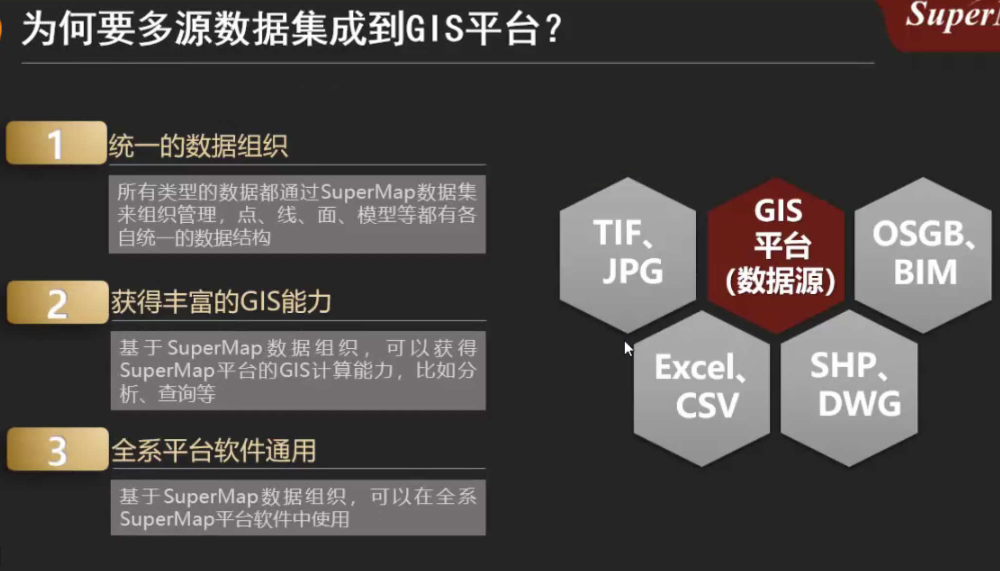
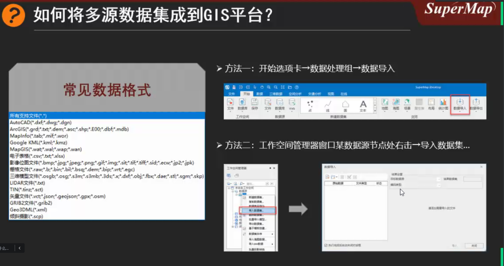

# TODO

3.17

1.也许应该感谢这段日子，能够以游离姿态寻找各种真正需要的东西。或者说不是被牵着鼻子在走路。不去想乱七八糟的考研复试，公务员省考，事业编考试...

前者在这两个月的获取信息的途中化为剑捅破我如白纸一般的地理信息系统专业认知，后两者，嗯，文字工作确实烦，也确实得做，但是现在不想做 XD。

2.windows.old 居然可以回滚以前的文件。

3.18

1.此回答不予展示

2.generating electricity with love.

3.22

1.postgresql sql 语法还是简单的。

2.去找邓小龙盖乘车证。

3.23

1.特别喜欢 scrolls back 这个主题在新建文件时的 animation.:happy:

4.人类大脑中，新皮层占据了整个脑容量的 2/3,分为左右两个半球。

右脑决定人的空间感，抽象思维，音乐感和艺术性，左脑控制人的线性逻辑，理性思考和言语能力。

3.24

1.上午找文献，翻译因为懒狗不想动。

2.postgresql 也许算学完了，不想动了。

3. 3.26

   1.昨天又是被浪费的一天，好心痛:(;

   2.学习 webgis 数据可视化

   3.我们怀揣优越感的灵魂天然被赋予对纯函数的追求，不屑于古旧 IE 的约束，钟情于强类型的芬芳。担当这种期望流于对过去观念不假思索的判断，乃至走到大道至简与类型体操时，便值得警惕。

比 for 循环的优雅，精妙想来不能为 forEach 的性能账张本，而纵然 javascript 已有鸿蒙一等公民的地位，仍不能自恃已在浪潮之巅立下了天下第一编程语言的沉锚。

4.测试属性，枚举属性。

5.对象定义访问器属性(accessor property) 中 的 get set

3.27

1.很想找到地理信息系统入门的好的入门博客。

2.把 python 工作自动化带了过来，希望能稍微看那么一点。（并没有 xD,蓝狗 property 了属于是）

3.没有想吃的想法。

4.函数这一章看完。

5.typescript 了解

6.闭包...感觉次次看，次次忘...XD

7.O'Reilly 动物书 hhh

8.公有，私有和静态字段

9.p218 typedMap

10.when to use delegation instead of inheritance?

11.抽象类（我要不要理解呢 L:(

3.28

1.WeakMap

2.json 复活函数

3.hash 表

3.29

1.昨天好像又没干什么：（今天也是

2.3.半到 5 点 maybe the task of javascritp，6 点到 9 点 maybe the discovery of vue

3.迭代器对象本身也是可迭代的：

[Symbol.iterator]{return this;}

4.君 GIS 本当上手

5.生成器斐波那契数

6.异步与堆栈

7.promise.all()

promise.race()

十天计划：C:\users\514866991\AppData\Roaming\Code\Service Worker\CacheStorageC:\users\514866991\AppData\Roaming\Code\Service Worker\CacheStorageC:\users\514866991\AppData\Roaming\Code\Service Worker\CacheStorage

每天看点面试经验，找下又没有面试八股文。

3.31

1.找了胡林，大致感觉写作方向有思路了。

2.定义“强”。

文无第一，无论公司职级，github stars,npm ,赚钱，

尤雨溪理解：制造 impact 的能力

3.脚本运行机制：async 和 defer

4.每一次都需要人把我骂醒

4.3

1.确实是三天来第一次更新

2.虚拟 dom 面试必问

3。删掉一些东西，，，，

4.proxy nginx

6.尤大纪录片

7.适合做倾听者而非领导者：了解知识时只明白大概或缺少实操，别人提出时能做到及时反馈却无法深入给出自己的理解。

4.4

1.占个坑（等下再写。。。）

4.5

1.漂流少年

2. 4.6

   1.sonny boy 的 bgm 确实很适合 coding ,在看项目的时候很容易沉迷进去。

   2.与人之间的差异根本上在认知能力上的差异，因为认知影响选择，选择改变命运，成长的本质就是让大脑的认知变得更加清晰 ；

   3.webpack 网站真的很好看

   4.12

   1.康康几天没写日记了

   2.没啥事做，就写 cesium 学习路线把

   4.13

   1.当红任务:把计算机毕业设计先做了（1：40-3：40）

完成地图的性能优化

4.14

1.node.js

html

css

javascript

浏览器中的 javascript

js 核心语法

webAPI

4.17

1.大概就是这种状态把，

2.再听 hey，想念以前的状态，好像现在失去了很多应该追求梦想的状态。

当时的梦想--在聚光灯下跳舞。like hozin....

4.18

1.javascript 调试

通过断点进行调试

module.exports={

confifureWebpack:{

devtool:'source-map'

}}

2.《three.js 从零上手》、

3.arcgis online

4.19

1.arcgis postgresql

看《wegbl 编程指南。

4.22

1.nginx 反向代理

2. 4.25

   1.三段表格式

   2.文献翻译

   3.添加天空盒

   4.考虑是否添加 DB 来存储城市数据。

   5.找参考论文。

23-0

8-11

13-17

18-24

7-12

data.

features

仿作 b 站的一个视频项目 3d 城市可视化的实现。哪个道路是在 github 上找的。openstreetmap 是开源地理数据库，有商业版权的数据。这个页面以后可以嵌入到自己的其他项目模板中，接口调用直接 Promisefetch().then

gltf 是以 Json 或二进制格式提供

其实做的也较多的是一个掉包的操作

利用点可创造一个面，利用面可拉起一个形。echarts 是借助模板实现的

选择 three.js,因为有详细的文档，和及时更新的 examples 库。

快速开发 3D 地图城市应用，展现某个区域所有房屋建筑，快速生成城市道路以及水系。loader 函数异步加载

不足

其实之前也是想着建一个数据库，

调用城市 json 数据

一个是管理人员可以获取后台数据库市民可以


主要是调用 three.js 里面的库。但是 forEach 在 vue 中添加 `<template>`模板各区显示数量三个渲染器分开设置

edge 浏览器泵，在 package.json 中切换为谷歌浏览器。

在 polygonMesh 函数中将形状拉伸为多边形

clock 的 getDelta()方法获得前后两次执行该方法的事件间隔

这几各辅助要素是觉得做得太单调了，想让页面丰富添加的

4.29

1.路径在 D 盘根目录下 NVM

5.3

1.复仇女神的居处，就在家家户户的镜中。即使是时间最清澈的水，那深潭亦可带来灭顶之灾。

——R.S.托马斯

5.4

1.青年节，

2. 5.5

   1.elementUI

   2.echarts

   3.vue 设计与实现

### 碰撞分析模块

以碰撞分析功能的数据预处理。

已有的管线数据属性字段不足以满足碰撞分析的需要。因此需对已有管线数据字段进行处理。

5.7

1.路由实现页面跳转

5.12

# June

## 1st

1.修改论文，查看

2.写自我总结，发现自己没啥可总结的，令人感叹。

## 5th

1.openlayers leaflet

2.javascript 权威指南

3.vue 设计和实现

## 6th

1.计算属性

2.emit 和 prop

3.英语及语法

1.对象扩展 Object.assign()

## 8th

1.computed & watch

## 9th

1.有种临渊而立的感觉

6.11

3-5 数学

6.22

1.一元函数微分学 9-10

2.行测 10-11

6.28

1.coreldraw 教会了我一些布尔逻辑运算的实际应用，比如绘制火箭时，用两圆求交

2.ps 学习

# January

## 18th

1.陪周宁采风七星公园，八路军街道办事处。看了下大疆的云台，价格令人感叹。

2.晚上造 🦏 书类型、值和变量。

3.查看 office viewer git 仓库

**4.office viewer 记得定期清理缓存，地址：C:\users\514866991\AppData\Roaming\Code\Service Worker\CacheStorage**

## 19th

1.学一下 B3log 网站的设计思路。timelinerender

::before ::after

2.less 预处理语言。

## 22th

1.删除对象属性——delete()

2.rest

3.可迭代对象 iterable objects

## 31th

想不到这么快就要结束一月了，令人感叹。。。

1.每天的游戏时间：3h

看公务员时间：8h 公务员视频（），行测试卷，申论试卷，答题规范。。

# January

## 2nd

1.**一直都无法通过 cmd 直接进入 vscode，想了想应该是更改了父文件夹中文为英文而没有在环境变量中更改。。。**

尝试了一下，和平解决。😀

看电视剧时间：3h

## 3th

1.把狂飙看到了 21 集。。

2.安装 pycharm

3.安装 arcgis 10.2

## 4th

必须得做点什么才行啊。。

### 5th

1.把 git 搞懂（pull gitbook)..

### 6th

1.webgis 中地数码视频教程。

### 7th

1.配置好 vue-router

2.写一下 vue 实现登录界面。

### 8th

1.学习一下 debugger 断点测试。

### 10th

1.看 es6

## March

### 1st

## April

### 18th

**daily plans**

英语翻译 translation 2phrases

## May

### 1st

**PBR**

### 13th

神中神，我配置好了 c/c++ 在 windows 下运行的环境变量。(mingw / gcc )

### 18 th

c++学到 struct / union /

想结合 earth empire II 看看普鲁士的历史。

### 20th

指针数组和数组指针反复看

### 21th

看到了夏老师，没有交流。。。
cpp 内存泄漏

### 22th

麦当劳学习

### 23th

在家躺了一天。。。
云顶冲上了铂金三

### 24th

- cpp 引用和 return
-

### 25th

- 实例化
- 函数指针
- 递归函数
-

### 28th

然而今天已经 28 号了，令人感叹

### 29th

- static 静态变量
- c++ this

### 30th

随便看看

## June

### 1st

看看 A\*算法
选择导师
自动驾驶 BEV 感知

### 2nd

- 学习 vite
- 代理写法

### 3rd

- 最终为 cnpm 付出了代价

导入 element-plus 时，
必须按照 npm 导入

### 4th

看白色巨塔 == 躺平的一天

### 10th

看看导师学生各研究方向
kenshi

## August

### 1st

### 8th

今天四喜临门

看了电影

吃了火锅

亚非登顶

微博进世界赛

### 15th

终于有一次来到图书馆

使用 proxy 代替 defineProperty()

)

组合式和选项式 API 中的侦听器

### 18th

来肯德基学习

### 19th

看摇曳露营

看齐木楠雄的灾难

组件 data 为什么用函数返回

## September

### 1st

wrb

高子健 护盾电池 瓦人

稿子吨 三叉戟 金手指

大笔 we 蓝

### 4th

- 学生卡
- 钥匙绳
- 充电头
- 校园网 电话卡
- 眼罩
- 宿舍水电费
- 饮用水
- 银行卡
- 付的 50 去哪了
- 垃圾桶
- 蚊帐
-

### 5th

天河基地组会

看了一下李老师发的公众号内容

张雪英老师的台风地理知识图谱

安装 matlab

用过 anaconda

ue 和 blender 下了没使用

sql 没有实际应用过

用过 three.js cesium 了解过

- 垃圾桶
-
- 填写研究生证和学籍表

### 6th

- 去看下电动车
- 照大一寸免冠照
- 晚上看奥本海默

### 7th

- 新生大会

### 8th

讲座一天

### 9th

- 学习 arcgis
- 学习 python
- 学习线性代数
- 学习插槽

看看初试题目

- 问问泓达学长

### 10th

石圣心大教堂
沙面
越秀公园
中山纪念堂
广东省博
永庆坊

问一下耀勇的方向

茶具

### 11th

犯罪地理、知识图谱：
窦振铎
巩成龙
任玲灵
陈洁莹

未来一周工作：
arcgis pro
mysql
vue 学到 pinia
nginx
计算机网络
ue4 着手启动 32
cesium

- 宿舍使用电器申请书
- 体检表
- 国家助学金
- 找找 navicat 包
- 银行卡
- 问问学校图书馆查文献的事

### 13th

- 照耀龙讲座
- 去时尚天河
- 练习多表查询
- MYSQL -- 时间函数
- GROUP BY HAVING
- 执行顺序

### 14th

- 班会
- 相关子查询

### 15th

- 体检
- 数据库训练

### 18th

- 奖学金
- 英语课
- book
  for one more day
  educated 你当像鸟飞向你的山
  born a crime
- foreign key
- 自增列

55 22

66 26


### 19th

- 数据库约束
-

### 20th

- 数据库--
- 付迎春--地学遥感进展
- 入党申请书
- 梦见 zx?d
- 遥感--空间统计--付迎春-罗文斐-刘亦书-胡伟平
  多元统计--植被反演

### 21th

- 机器学习书
- 入党申请书

### 22th

- 机器学习 -- 吴恩达
- python
-

### 23th

- 微积分
- 线性代数


唉，这下拉了

### 24th

- 逛宜家

* 逛海珠

### 25th

- 学英语
- python 学到 import
- 机器学习了解--数学公式 7

what's the difference?
her daughter playing piano .
when people like Malaysians went into English conversations they were afraid of being judged by how many mistakes they were going to make .

2 , Some people have self-image . 网咖 玩的不好，身边有人但还要专心去玩，水平不行还是要专注去说。a person went to the Internet cafe
when Faizar goes into conversations , he is entirely focused on the person that he's speaking to and the result he wants to get . He's got no self-awareness . no thoughts of what he makes .

3 , by a true story hanppened in ted's speaker , to the pharmacy to buy omega ,
a sailors
两个 sailors ，一个解释了很久毫无头绪，一个简单
One talked at a high level , but totally focused on herself and getting it right , which results in ineffective conversations .
Another got no level , but focuesd on the person she's talking to and getting a result . effective .

4 , babecu talk between Francies , Korean and Japanese to tell us that English is just a tool to play around with to get a result like a computer game .
In schools , students are judged more on correctness than on clarity which is not a good way to buld the confidence

listening goes .
speaking goes .
confidence goes .

so the core point is , when you speak , don't focus on yourself , focus on the other person and the result you want to achieve .

smoothly , calmly confident .

### 27th

- 练习输出素数
- arcgis pro 安装和操作视频

* python 传参数--可变 / 不变
* 数据容器练习

### 28th

- 刘亦书--机器学习高数 / 线代 / 概率论
- 党的主题教育
- 看文献软件
- zotero

因为自己面对多线程时会束手无策。

醉鹅
乳鸽
煲仔饭

大良中楼--清晖园--华盖路步行街
--金榜--大良中楼--顺峰山公园--换了海岸

## October

### 8th

- 提交遥感开题报告--11th

* 机器学习作业--（概率论 / sklearn）
  - 贝叶斯定理
  - 求 x\*
  - 搭 python sklearn 平台--iris 数据集贝叶斯训练

- python --jupyter--pandas

### 9th

- 下午英语课 or

* 下午傅伯杰院士汇报

- arcgis --学校制图'''

### 10th

- ppt 做好
- 下午政治课

### 11th

- 下午建模仿真组单独汇报
- 搜集 4 校园标准地图数据
- 付遥感综述文献汇报

寻找的时候度没有把握好

林业生态估算

- 缴团费

anaconda 会覆盖 python 之前版本？

### 12th

- 决策树 review +
- anaconda 测试 iris 数据集
- python from 引用
- 下午听答辩
- 晚上讲座
- 建筑物面包围

* 校门画法
* 教学楼分法
* 知道学院
* python 自动化

德国 APS

三维数据交换格式
超图
智能体参数化设计、
超图后台服务和前端

国标大中小
城市大中小
GML 标准交换格式
归类
一个城市大中小多少类
大多少泪
cityGML

工具软件熟悉
数据表顺滑设计
文献阅读

arcgis 条件判断
arcpy

### 13th

广测院--李长辉 6

- arcgis 基本操作
- 最短路径算法
- 找泓达师兄要超图
- gis 国标
- 英语课文件打印
- 8 点去推优会

python

多传感器城市实景移动测量系统研制

### 14th

- 更新 python 解释器--conda 环境
- 看看 conda 是干啥的

### 15th

- 英语
- 看决策树
-

英语 grading criterial

### 17th

- 雨课堂

### 18th

- 问卷测评
- 配置超图
- lateX
- 概率论分布
- 回归树 / 最小二乘树
- 下午开组会
- sklearn 配置
- 解释 ADE
- 加卢工
- 把道路名称
- 钢笔上墨
-
- 整理地理信息要素分类标准

  - 难点：以什么形式 / 格式汇报

    1.校园道路和外部道路都添加了名称 2.建筑物打点并添加了名称 3.补画了运动场

### 19th

- 刘亦书机器学习
- 新生见面会
- 入党会
- 随机森林--
- endnote

### 20th

- 9:45 现代遥感技术
  22 号之前完成雨课堂学习
- 3 点基地碰面

* 缴纳
* citygml 文献


arcgis server 服务器

- MAE 图像修复
- XML 格式--

## 2 水系

- 河流
  - 常年河
  - 时令河
- 沟渠
  - 运河
  - 干渠
  - 支渠
- 湖泊
- 水库
- 海洋要素
  - 海域
  - 海岸线
  - 干出线
  - 干出滩、滩涂
  - 礁石
  - 危险区
  - 海岛
  - 暗沙
  - 暗滩
- 其他水系要素
- 水利及附属设施

## 居民地及设施

- 居民地
- 工矿及其设施
- 公共服务及其设施
- 农业及其设施
- 名胜古迹
- 宗教设施
- 科学观测站
- 其他建筑物及其设施

## 交通

- 铁路
- 城际公路
- 城市道路
- 乡村道路
- 道路构造物及附属设施
- 水运设施
- 航道
- 空运设施
- 其他交通设施

## 管线

- 长输输电线
- 长输通信线
- 长输油、气、水输送主管道
- 城市管道

## 境界和政区

- 国外地区
- 国家行政区
- 省级行政区
- 地级行政区
- 县级行政区
- 乡级行政区
- 其他区域

## 地貌

- 等高线
- 高程注记点
- 水域等值线
- 水下注记点
- 自然地貌
- 人工地貌

## 植被与土质

- 农林用地
- 城市绿地
- 土质

## 地名

- 居民地地名
- 自然地名

### 21th

- 安装 visual studio

### 22th

- 完成 gis 国标 xml 绘制

回去看文献

### 23th

- 超图和 arcgis 技术选型
- 数据库看完后面章节

### 24th / 25th

- [x] 继续看文献
- [x] 医保卡拍照
- [x] 人脸识别
- [x] 发组会纪要
- [x] API 架构风格
- [x] arcgis 完善地图
- [x] 日常考勤
- [ ] 我的疑问：
      citygml 针对建筑物有 4 个层次细节表达
      
      我们需要做到什么程度
- [ ] 学习 c4d revit
- [ ] arcgis 和 超图 技术选型
- [ ] c++ 浅尝辄止
- [ ] python 补全计划
- [ ] 看看机器学习任务
- [ ] xml json7
- [ ] mysq 补全计划
- [x] 遥感概论作业
- [x] 请假条打印

### 26th

- [x] 机器学习课
- [x] 培训 geoscene
- [ ] 决策树剪枝 / k 近邻

### 27th

- [x] 中国历史地图集
- [x] 开组会
- [ ] 安装 c4d / revit

### 28th

- [x] 校运会彩排
- [x] 学姐传授经验
- [ ] c++指针 / 结构体
- [ ] 看下政治

### 29th

- [ ] 解释 LOD
- [ ] 确定在 ue5 中加载的是什么格式的模型，外观建模
- [x] 新一轮雨课堂
- [ ] 大部分观点参照武汉大学翻译 citygml,
- [ ] 关于地形在 ue 中是什么格式
- [x] 没有看 core xml 源码，实在太复杂。
- [ ] 和泓达师兄讨论 ue5 和 citygml 标准格式转换。
- [ ] 看李老师推送
- [ ] c++解决-
  - [ ] 统计输入数中每个数个数
  - [ ] 文件重定向
  - [ ] char 有无符号
  - [ ] 溢出
  - [x] 看计算机组成原理补码部分
  - [x] 含有无符号类型的表达式
- [x] 查找 arcgis 10.2 和 arcgis pro 默认工作目录
- [ ] 机器学习
  - [ ] b 站查 sklearn
  - [ ]
  - [ ] 吴恩达--
  - [ ] 决策树
    - [ ] K 近邻
  - [ ] 随机森林
  - [ ] 概率论

### 30th

- [x] 填写文献汇总
- [x] 遥感罗文斐作业
- [x] 遥感胡伟平作业
- [x] C++浮点数运算误差
- [ ] 阅读 arcgis 文档
- [ ] 了解 FME
- [ ] 视频--函数基础及其底层原理
- [x] postgresql 安装
  - [ ] postgis
- [ ] 胡伟平个人 PPT
  - [x] 胡伟平英文文献翻译
  - [x] 中文 / 英文文献阅读
- [ ] 胡伟平小组汇报
- [x] 社保卡申领
- [ ] 政治课 PPT
- [ ] 雨课堂
- [ ] python
  - [ ] pandas
  - [ ] numpy
  - [ ] matplotlib
  - [x] 使用 jupyter notebook
- [ ] K 近邻算法

### 31th

- [x] 英语作业 - 2:00
- [ ] vue
  - [ ] slot
- [x] 下周三入党申请考察表
- [x] 做英语 ppt -5:00
- [ ]

## November

阅读完《基督山伯爵》

### 1st

### 2st

- [x] 英语 news report
- [x] global mapper
      a- [x] 找到 tif 转 png 方法
- [ ] modeling our world
- [ ]

### 3rd

- [x] 明天找莎莎姐要回放

### 4st

- [x] 听晚会

### 7th

- [x] 个人自传

### 8th

- [x] 小组 ppt
- [x] 英语作业
- [x] 英语 news report
- [x] 数字孪生智慧园区文献综述
  - [ ] 时空智能预警体系
- [ ] 看 cppreference
- [x] 填入党培训表
- [ ] 开发文档

### 10th

- [x] 公司表

### 12th

- [x] 做英语 ppt -2:00
- [x] 组会预告 -4:30
- [x] 回来做 PPT -7:00
- [x] 排练 -9:00
- [x] 做遥感 PPT -11:00

### 13th

- [ ] 看卢工教程
- [ ] MongoDB
- [ ] ajax
- [ ] 遥感 ppt
- [ ] arcgis 操作
- [ ] 做个 python demo
      000

### 15th

- [x] 小组汇报 ppt

### 16th

- [ ] 线性代数对偶问题
- [ ] 机器学习 SVM 对偶
- [ ] 推导线性判别分析
- [ ] 特征值/特征向量/实对称矩阵对角化-->主成分分析

### 17th

- [ ] 组会
- [ ] 8-12 准备组会报告
- [ ] 看文献
- [ ] 学 UE5
- [ ] 学 C++
- [ ] c++
  - [ ] 数组越界

### 18th

- [x] 长江与课堂
- [ ] 线性代数
  - [ ] 正交矩阵
  - [ ] r(ab) r(b)

### 19th

- [x] 英语作业

### 20th

- [ ] 发展对象？
- [ ] 英语课

### 21th

- [x] 帮忙 arcgis
- [ ]

### 22th

- [x] 指针常量和常量指针
- [ ] 函数指针
- [ ] 分配内存
- [ ] geopandas 处理地理数据

### 23th

- [x] 周五课拿学术
- [ ] 支持向量机间隔最大化
- [ ] 卡方分布
- [ ] t-分布
- [ ] 核函数分离超平面
- [ ] 看机器学习史
- [ ] 帮文蒨看 arcgis
- [ ] 主成分分析
- [ ] **指针指向的内容，内容可以改变，但指针不会变**
- [ ]

### 24th

- [x] ppt-组会
- [x] 长江雨课堂
- [ ] 各种地理数据格式存储 mongodb
- [ ] 看 CMIP6
- [ ] 2223 / 2324 / 01

对接 mongodb 存储数据。

### 25th

- [ ] 看机器学习

### 26th

- [ ] C
  - [ ] extern 再探
  - [ ] 回调函数
  - [ ] 内存泄漏返回值的不正确处理
  - [ ] 避免内存泄漏
  - [ ] 求出矩阵最大值
  - [ ] 左值右值

### 27th

### 28th

- [ ] 实参形参
- [ ] 1418 论文写作

### 29th

- [ ] 传文件到服务器
- [ ] 看 CMIP6
- [ ] c++面向对象
- [ ] 结构体引用
- [ ] 联合体
- [ ] 黑马结构体案例 1 老师-学生
- [ ] 析构函数
- [ ] 项目-点和圆关系
- [ ]

### 30th

- [ ] VOSviewer
- [ ] CMIP6

## December

### 1st

MongoDB gridfs

- [ ] acccmip6 安装
- [ ] 城市天际线
- [ ] mongodb shell
- [ ] 现代测量与遥感技术
- [ ] 运算符重载
- [ ] 看 github 项目《代码随想录》
- [ ] 阿根廷总统

2224

### 2nd

- [ ] 隐式类型转换
- [ ] 正则表达式替换文本
- [ ] return \*this
- [ ] 虚函数

### 3rd

- [ ] 长江与课堂！
- [x] c++ 98->111
- [ ] 该看看机器学习了
- [x] 1416 pandas
- [x] 1620 sklearn
- [ ] 2024 自由发挥
- [ ] 机器学习 up 主——等等很简单
- [x] 决策树
  - [x] CART
- [ ] 说的对啊，脑袋 怎么跟浆糊一样

### 4st

- [ ] size_t
- [ ] c++边界检查
- [ ] 数组拷贝
- [ ] academic vocabulary p17
- [ ] 左移运算符重载我劝你多看
- [ ] 赋值运算符有空看完。。。
- [ ] 得闲把英语单词填上

### 5th

- [ ] 把概率论三大分布补上
- [ ] 宋涛空间相关/空间回归
- [ ] 数组指针
- [ ] 函数指针
- [ ] 思考政治与哲学
- [ ] 内存释放机制
- [ ] 数组作为形参传递

空间相关分析--考虑滞后

### 6th

- [ ] ue5
- [ ]

于佳志
1109~1110 BF 数字孪生素材汇总 3 小时
1123~1124 ArcGIS 处理风暴潮水深数据 3 小时

### 7th

开小组会

### 8th

- [x] 看地形模块视频

### 9th

- [x] Surface water modeling system 安装
- [x] 英语誊抄
- [ ] 遥感文献综述撰写
- [x] 有空看下英语作业
- [ ] geopandas 处理学习
- [ ] 学一下 git merge
- [x] 看学术交流英语
- [ ] 问莎莎姐要回放
- [ ] 处理海洋风暴潮数据

### 10th

- [ ] 看 geopandas
- [ ] 看 surface water modeling system 教程
- [ ] arcgis pro
- [ ] 长江与课堂

### 11th

- [ ] 遥感文献综述
- [x] 写团员评定
- [x] 不透水层-》不透水面

### 12th

- [ ] 双 12 看看能买啥

ADCIRC

### 14th

- [ ] youtube 看 cmip 6
- [ ] 处理耦合数据

10-12

### 16th

- [ ] 牵头和智晖一起看超图存储问题
- [ ] 摇曳露营
- [ ] 准备英语 representation
- [ ] 给夏老师和文蒨发数据
- [ ] 把 modelbuilder 转为 python
- [ ] 处理广州 cmip6 标准

### 17th

- [ ] 与课堂学习/考试

### 19th

- [ ] 找到 cmip 6 广州未来十年- 6-10 找 cmip6 download 视频
- [ ] 记得关加热垫
- [ ] 看刘三姐视频总结
- [ ] 看机器学习
  - [ ] 贝叶斯定理
- [ ] supermap 搭建 arcgis pro 平台

《乡土中国》

### 20th

- [ ] pangeo 云

gpt 写 水位变化

### 23th

- [ ] matlab 下载处理
- [ ] 购买神界原罪 2
- [ ] 写英语 representation
- [x] arcgis pro 下的 python 学习

### 24th

- [x] 6 点前搞 ppt
- [x] 6-7 吃饭 / 好特卖

### 25th

- [ ] 继续学习 arcpy

representation

- why you choose this movie as your introduction?

考虑了很多电影，觉得剧情片更适合。而且，这部电影反映了如今社会上很多人的心理。

### 26th

- [ ] 处理水位变化-excel

### 27th

- [ ] 问泓达找当时的技术支持
- [ ] 工程伦理快看
- [ ] cmip6 解决
- [ ] 每个文件添加 depth_diff 属性
- [ ]

### 28th

- [x] 把数据发给文蒨和 夏老师
- [ ] 地理坐标和 UE 坐标的转换（泓达/海宗）
- [ ] 工程伦理期末试题
- [ ]

这个是处理过的 216 个时段的水深 TIN 和栅格数据，depth_diff 属性是当前水深，其值是前一个时段水深 depth_diff 加当前时段水深 depth。第一个数据是模拟开始一小时后的数据。

### 29th

- [ ] 技术交流大会
- [ ]

29
30
31
1
2

3 出差
4 出差
5 现代测量报告
6
7 论文写作综述
8
9 英语考试 6-8
10 政治考试 7-9 / 自然辩证法作业 / 地信前言报告
20 机器学习 作业

## January

### 7th

- [ ] 论文写作
  - [ ] 摘要翻译
  - [ ]关键词
- [ ] 政治公共课背诵
  - [ ] 买红笔和记号笔

### 8th

- [ ] 填写月报

### 12th

- [ ] 利用 CMIP6 全球气候耦合模型，选择 100\*100km 空间分辨率以及 SSP585 气候（高温、高碳排放的未来发展 路径）按时序输出预测的中国每月的降水、气温栅格影像。
- [ ] 利用 SWMM 模拟台风山竹来临时水深数据在 ArcGIS 中进行每小时水深累计变化叠加处理，输出结果可为海洋风暴潮场景下模拟水位变化情况提供参考 。

### 13th

- [ ] 跑步
- [ ] popping 练习
- [ ] 1 点前睡
- [ ] 看 cpp 库/arcgis / gis 思维

### 14th

### 15th

- [ ] 看令文发的数据点
- [ ] 看地球科学数据库汇总
- [ ] 找夏老师讨论小论文定题
- [ ] 16-18 c++

### 16th

- [ ] 15-17

### 17th

- [ ] 11-12 跑通一个机器学习模型

### 18th

### 19th

**年度总结计划**
**李老师总结**

- 报告
  报告底层逻辑不是科研，而是项目。

读的文献需要写文献综述。
提笔不知写啥。

- 科研的逻辑完整性。
  研究方向是什么，根据研究方向展开哪些阅读，学会哪些实验。

- 计划
  目标：分科研、工作

做目标/任务/计划矩阵。

- 实际问题
  需要大模型的需要 GPT 培训。

- 用地标准
  于佳志、王思敏 资料共享。

陈洋老师 对接。

\*\*

### 20th

- [ ] 了解 jazz-hiphop

数据就在那，凭本事跑通和分析吧。

找老师之前，需要先把 python 的科学计算库搞懂（跑通一个小 demo）

- [ ] 编写 python 爬取天气项目源码并建库分析 （2 天）
- [ ] 和思敏交接-22 号前
- [ ] 发给陈洋老师-24 号前
- [ ] 找海宗跑通代码-23 号前

### 22th

- [ ] 以高德地图为例进行爬虫。

### 23th

- [ ]

### 24th

- [ ] 看乐理到一半

二次元确实虚无缥缈，早早认清自己是在和现实对线。

### 25th

- [ ] 看乐理后半部分
- [ ]

### 26th

### 31th

- [ ] 5-7 看看运行视频
- [ ] 7-10 尝试运行
- [ ]

### 2th

- [ ] datasmith 导出建模数据


- [ ] 看超图开发教程

- [ ] 看卢工发的 ppt
- [ ] 尝试利用 arcgis sdk 往平台里加东西

- [ ] arcgis sde 数据库和平台接入
- [ ] 写纪要

### 3th

- [ ] 看看 tcp socket
- [ ] geo server 探寻
- [ ] 各种投影信息
- [ ] 地图瓦片和影像金字塔服务
- [ ] 看制作游戏风格地图
- [ ] 看 GIS 荟-FME
- [ ] 提防本科生进组带来的尴尬
- [ ] 地理数据库使用
- [ ] 银行卡

### 4th

- [ ] 出去玩
- [ ] 在随缘小馆吃饭

### 5th

- [ ] 去象山区政府
- [ ] 去万达小聚

### 6th

- [ ] 去匹叔叔家


### 7th

- [ ] 南大姜燕燕算法

### 10th

- [ ] 东西巷

### 11th

- [ ] 来家里拜年

### 12th

- [ ] 废掉的一天。。

### 13th

- [ ] 魔法少女小圆
- [ ] 2-3 C++温习
- [ ] 3-5 跑项目
- [ ] 5-7 看 arcgis for ue
- [ ] 看 arcgis 存储数据库
- [ ] 7-10 休息
- [ ] 10-12 整合文献中信息数据
- [ ] 学习 ue
- [ ] C++接着弄
- [ ] 地理坐标到地心空间直角坐标转换。
- [x] 不要逃避 c++，必须得面对
- [ ] 必须意识到，刷贴吧是一个无聊浪费时间的消遣方式
- [ ] 看四叠半神话大系

### 14th

- [ ] 去看大爷爷

### 15th

- [ ] 最后的挣扎

### 16th

- [ ] 在家倒计时两天
- [ ] 看完 c++ basic

cpp 处了解 - 10h
上手 ue -10h

- [ ] 忧虑不过是自己造成的，多学知识，多锻炼，毕竟那是不可避免的事情。
- [ ] 这个时代是否每个人都能成为意见领袖

### 17th

### 18th

### 19th

### 20th

### 22th

- [ ] 9-11 部署
- [ ] arcgis maps sdk 是否行不通（api 问题），
- [ ] 寻找 cesium for unreal
- [ ] 11-13 匹配数据库
- [ ]

### 23th

cesium floatingpawn

- [ ] cesiumlab 注册下载

=- [ ] 当初为何要看 supermap 存储。

- [ ] cesium 往平台里加 osm building /

现在添加进去的是 cesium 的 bing 航拍图片。
地形不能再 ue5 中做，需要再上传到 ion 前再原始数据中修改。
安装了 cesiumlab 用以发布地形切片服务。

rootcomponent 是有起伏的地形瓦片， 可以在下面添加航拍影像文件，是一种 overlay，可以叠加在瓦片上，体现出起伏的影像。

另外，这个瓦片的地形貌似高度是比较真实的，但是我不知道如何获取高程。

我为他添加了在线的瓦片数据和影像数据，准备这周添加本地的影像数据试一下。

### 24th

- [ ] 开学购买清单：笔/茶
- [ ] 往平台添加环境实体
- [ ] 为实体添加属性
- [ ] 看完《杀人回忆》

### 25th

- [ ] 看完 c++
- [ ] 四叠半神话大系

### 26th

- [ ] 学习 revit，c4d for ue5
- [ ] cesiumlab 再登陆试一下

需要解决的问题：往平台里添加环境实体，同时为环境实体添加属性。
前置工作：
UE5 使用
地形添加
C++

## 假期计划

- [x] C++ / UE 项目跑通 ， 检查里面的属性。
- [ ] CMIP6 任务
  - [ ] 根据 CMIP6 中找到 UE 属性对应上，天气效果模拟。
- [ ] 瘦 7.5 斤
- [ ] 把整个项目流程弄懂
- [ ] 自信点
- [ ] 坚持跑步
- [ ] 有空 popping

- [ ] （如果有机会）配个台式
- [ ] 了解音乐/ 乐理
- [ ] 找到对计算机的热爱
- [ ] 学习 c4d，revit，cesium for UE
- [ ] 每天保持至少 3 小时学习时间--（沉淀......）
- [ ] 旅行商问题

·····································

主要职责：负责道路、建筑、水系、植被、农业、地貌等影响风暴潮下智能体决策的环境因素的参数化。

重大安保活动开展三维建模外业工作，三维建模内业处理，未来可能参与到数字孪生体融合测试和情景推演和平台测试。

学习情况部分这一学期主要是在进行计算机方面的学习。

首先是海洋风暴潮项目搭建的平台基于 UE5。UE5 的开发基于蓝图和 C++，所以这一学期我在补充 C++的基础。

在海洋风暴潮数字孪生项目中，利用 CMIP6 全球气候耦合模型，选择 100\*100km 空间分辨率以及 SSP585 气候（高温、高碳排放的未来发展 路径）按时序输出预测的中国每月的降水、气温栅格影像。

利用 SWMM 模拟台风山竹来临时水深数据在 ArcGIS 中进行每小时水深累计变化叠加处理，输出结果可为海洋风暴潮场景下模拟水位变化情况提供参考 。

结合 cityGML 地理标准与实景三维中国地理要素参考国家标准，目前主要是完善了水体、道路和地形地貌部分环境要素的参数化。这部分未来的工作是可以接入预案，连接地理环境和多智能体交互部分的参数设置。

存在问题

1.

1. 地理标准格式存储和转换。
   存储目前李老师是希望用超图来存储，和智晖一起看超图存储问题。我对超图软件目前是处于简单了解熟悉了一些简单操作的阶段。

   3.环境数据的来源不只 CMIP6，得到的空间分辨率较低。
   需要找到其他可靠的数据来源来更好服务海洋风暴潮项目。

态度问题。

文献阅读量不够。

目前总结保存了一些文献，但是只细看了其中的几篇。所以目前还没有定题。

抓住任务的主线。

UE5.3 中学习了

把团队代码拉下来了，但是还没有

工作计划：
使用 FMEworkbench 软件，进行 BIM 格式对 CITYGML 的转换。

另外可能还会了解一下 cesium。

寒假过后接触到代码层面。

地理信息中，尺度有空间、时间、语义三个维度，由广度、粒度、频率等要素组成。


空间维度的粒度：描述空间对象的最小几何尺寸。

时间维度的粒度：描述对象现象过程的最小采样时间。

语义维度粒度：描述对象分类特征的语义层次级别。

文章研究内容：

- 从多个角度定义地理场景的分类，依据符号设 计理论和地图符号化原则归纳地理场景下的符号的设计要点。
- 梳理地理场景符号表达的参量体系模型
- 构建符号在地理场景中的多粒度表达方案。
- 设计多粒度符号管理软件。
- 以自然冰川场景 为例进行多粒度符号表达应用实践。

**创新点：采用了一套符号库管理地理地理场景下的地理要素，发挥“作”设计制作。“用”应用操作的两个环节的过程作用**

其实这一部分在讨论符号参量化表达时应考虑的要素。但是我想就将其应用于我的地理场景的参数化表达中，以及未来可能也可以建一个符号库。

也可能可以在我们的海洋风暴潮场景中将符号库中的符号直接添加到场景中。

以地理场景这个地图的新形式和对象，研究其符号表达过程的多粒度理论和方法。

因为李老师说到时候要建立一套针对这个项目的地理要素格式存储及转化标准体系，所以我就觉得可以参考这个符号模型组件中的组织编码结构，针对 LOD0-1 采用层次结构进行分级组织管理，

某一尺度下选取识别的对象大小由当前的粒度决定，从不同的粒度完成对现 实世界的空间、时间、语义抽象的过程就是多粒度表达的过程。

要根据 NetCDF 变量创建 NetCDF 栅格图层，则各个 x 坐标之间的间距必须相等，同时各个 y 坐标之间的间距也必须相等。如果各坐标的间距不等，则需创建一个 netCDF 要素图层，然后插值为栅格。


这份数据的每个数据 depth 属性是每小时的水深变化（m）。

我在找办法把他变为每小时的水位数据，想迭代初始水位减去每小时水深变化。

good afternoon , everyone . Today I'm pretty honored to invite our representors, liyaoyong .

he's a student of surving and mapping engineering at the school of geography .
Today he's gonna take a topic about a phenomenon, or called a trend happened in our daily life as he gives a topic entitled "a new trend : stooping "..
Now,let's turn to our representer,liyaoyong.

Ok,thank you liyaoyong for your sharing.Now it's time for Q&A .
I'll invite three members to take part in this segment.
Anyhow,who want to ask li the fist question.

和智晖探讨 JSON 格式点位数据的属性，进行格式转换。

和知识图谱组 对接工作

在公路上参考国内标准

本月进展： 1.完善国标和 cityGML 数据转换标准。 2.对接 ArcGIS 数据和 MongoDB 转换。

下月计划： 1.对接风暴潮项目场景搭建。 2.继续补充风暴潮环境数据属性标准。

```python
::查找数据的关键语法（S即search）
acccmip6 -o S
::根据需要可添加参数，例如
acccmip6 -o S -m MIROC6 -v vas -f mon -r atmos

acccmip6 -o S -m CESM2 -v ts -e ssp245 %用于案例分析的命令%
```

CMIP 国际耦合模式比较计划
由世界气候研究计划（WCRP）耦合模拟工作组对全球海气耦合模式性能进行比较。

解决的问题：


回答的科学问题：


CMIP 试验设计总体框架：


### **重大活动安保视频数据智能联网与数字孪生融合技术研究即应用示范**

- 基于 AR 视频的多为数据只能联网关键技术研究及应用示范
- AR 视频
- 视频图像与
- 完善场地布设
  2-3 个月
- 开展三维建模外业工作，内业处理
  2-3 个月，具体由现场调研后确认。
  预期成效：构建示范场地的三维模型。
- 数字孪生体融合测试
  3 个月
- 情景推演和平台测试
  4 个月

进行扫描
场景扫描——三维建模

IOT /

预案：谢铭杰

周泓达：负责
陈海宗：填写申报书

以课题为主导

黄智晖：工作重点放到视频识别上。


-m：参与 CMIP6 模型名称。
-e:采取的实验名称

-r:realm:所在领域，11 种，如气溶胶、大气、土地、海洋。

RTK:工程放样


获取数据外包络面
描绘 TIN 数据


在公路上参考国内标准
地形计算和水体相交

李
主要属性 J:
function
水面高度-DEM

尽可能先把可能的属性列出（国标/citygml 的转换），当在 UE5 里使用时，直接用。

89
910
111

周泓达
三种类型
淹水或暴雨下有些路段走不通--定 30cm

把三种类型规则改成决策树

- 智能体--水/ 智能体导到卢工平台
  算不出水深，算哪些路段超过 30m。

定的规则对智能体的属性进行拓展。

上周开会，对接接口问题，先加个属性，或水平面减 DEM

李老师：
把论文数据用数据库或 excel 表存进去。
除了建智能体还要有知识库支撑。

文蒨：
水深在平台里实时计算

决策树将水深和身高比作为一个决策树条件

巩成龙海洋风暴潮应急预案

UE 里有决策树模型

于：

CITYGML 里想建立水体类似建立静态水体。
UE5 里面没有水面高度的属性

waterLevel 作为水面高度属性

确定水的属性
列成一张表
分的太细或者从仿真的角度意义不大

夏：
体系用国标体系；
针对国标里的每一个元素，可以再 citygml 里找到 1.基本逻辑 2.有哪些属性或重要的逻辑
列出来针对每一条进行讨论；

李：
让负责仿真里面的地形；
地理环境里的地可参考夏老师所说国标里面分成多少大类，大类多少中类，每一个类型带什么属性——作为未来仿真体系里地理环境的数据的标准和格式，接受什么样的模型导进去。

因此需要对每一类进行主题讨论。

夏：
重点先看水。

李： 1.看地形/地貌/水； 2.每次组会 PPT 参考文献打包，在科研网集中放在科研服务器上。
记录下公式 / 量化的指标。 3.如果写程序，需把程序的开发的设计文档写出来。（标准化/方便后来同学） 4.卢工发放开放文档，按 CMM3?的逻辑来写。

卢： 1.实现了一些基础的可以跑的功能，总结现有功能的模块，以思维导图/流程图的方式。
如道路：由哪些元素组成/道路间关系/他们如何运行，整理成文档，在下周组会前发出来参考。


新疆项目的申报书


s3m 标准







关闭 iserver 服务：
./bin/shutdown.bak


fluidflux

BP_modifierActor

BP_fluxSurface
