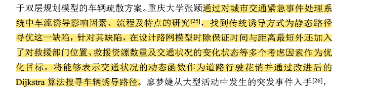
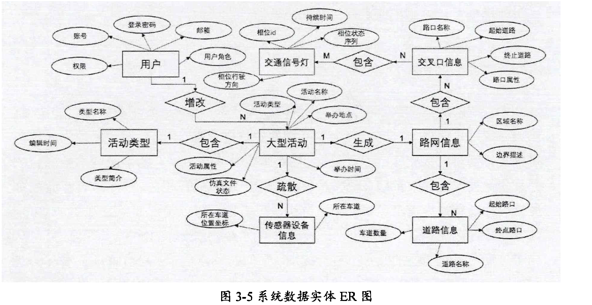
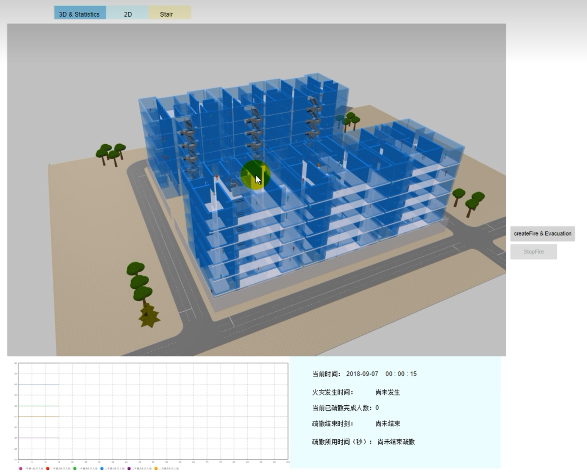
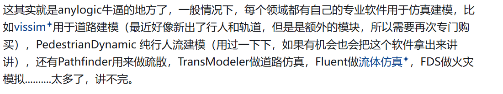

## 地理网格属性分类

- [ ] 二维地理网格属性分类

  - [ ] 面积占比法
  - [ ] 权重占比法

- [ ] 三维地理网格属性分类按什么进行分类作为研究目标 -15

## 空间数据多尺度表达

## 大型活动疏散仿真

将大型活动周边区域分为四级分区，分别为封闭区、交通管控区、交通疏导区、交通分流区。

疏散方案：交通疏导方案、信号灯配置方案。

## anylogic行人疏散仿真

