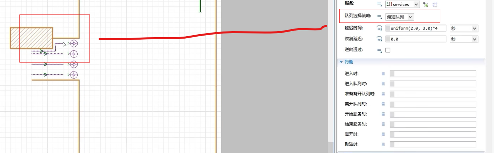
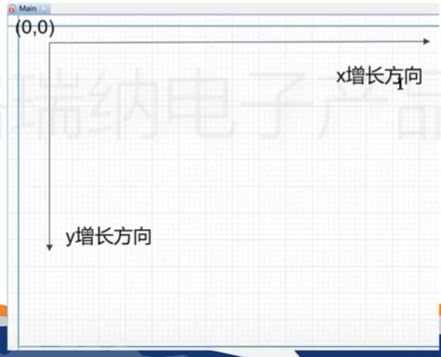
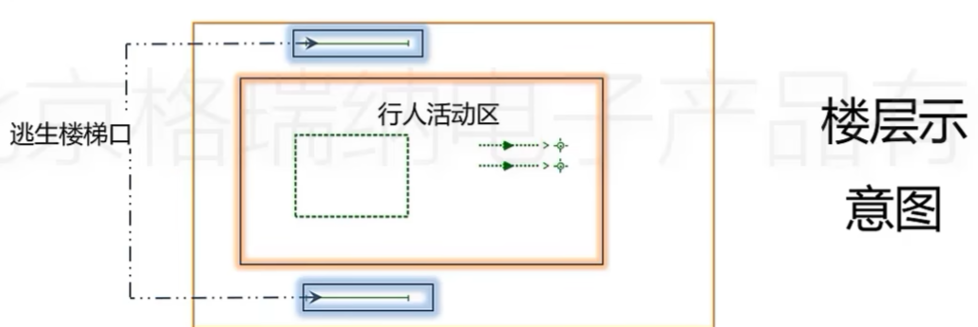

### anylogic 建模

- 基于智能体
- 离散建模
- 系统动力学建模

### 输出行人轨迹坐标

用于计算行人运动距离、速度、密度，
甚至可以利用坐标在图纸上画出行人运动轨迹，观察不同情况下的某些特征

### Agent类

### collection 集合

选择不同队列的行人策略：

限制队列人数

## 行人仿真空间逻辑

 

## 多层建筑行人疏散仿真

## anylogic行人疏散仿真

## 

