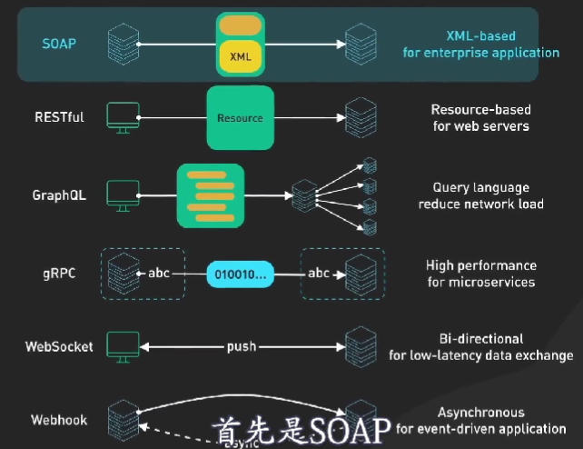
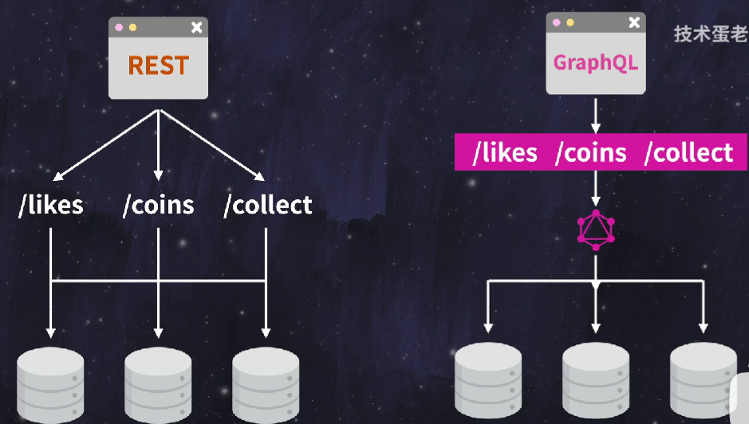
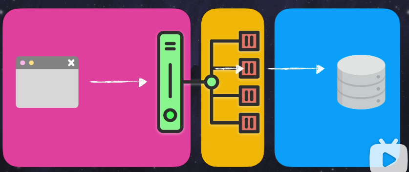
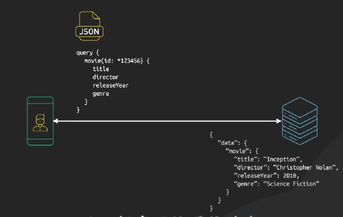

[toc]

SOAP
client

## REST API

RESTFUL API

representational state transfer
资源表示性 状态 传输

服务端不保存状态

### 6 个约束

**客户端服务端**

**统一接口**

- GET 设置为默认缓存
- POST 一般不缓存
- PUT
- PATCH
- DELETE

**无状态**

**缓存**

**分层系统**

**按需代码**

Graphql

gRPC

websocket
实时聊天和实时游戏

webhook
