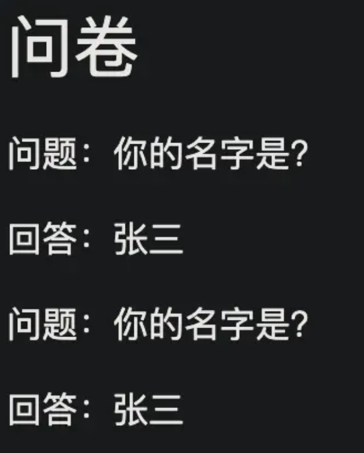

### css权重（优先级）
下面优先级递增：

类型选择器（`h1`或伪元素 `::before`）
类选择器（`.example`属性选择器`[type = 'radio']`伪类`:hover`
ID选择器（#example）


### 伪类

`:link`
`:hover`
`:active`
`:first-child`

### 伪元素

`::before`用于在元素内容前插入一些内容

`::after`用于在元素内容后插入一些内容

`::first-letter`为文本首字母添加特殊样式，只适用块级元素。

`::first-line`向文本首行添加特殊样式，只适用块级元素。

`::selection`匹配鼠标滑动选中的部分的设置样式
可以设置属性：

+ color
+ background
+ cursor
+ outline

```javascript

<div class = 'class1'>
    <p class = 'q'>你的名字是</p>
    <p class = 'a'>张三</p>
    <p class = 'q'>你的性别是</p>
    <p class = 'a'>男</p>
</div>

.class1 :before{
    content:'问卷';
    font-size:30px;
}

.class1 .q::before{
    content:'问题';

}

.class .a::before{
    content:'回答',
}

```


