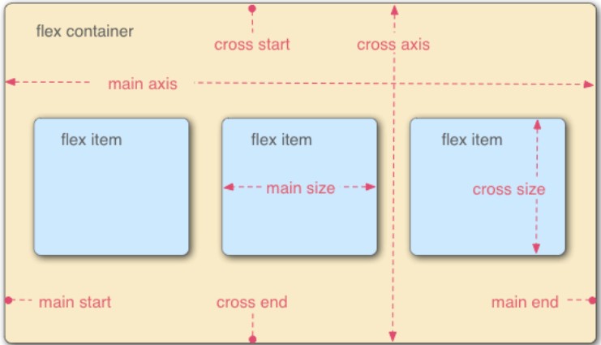
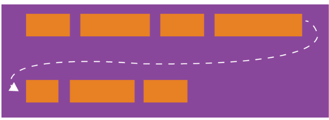
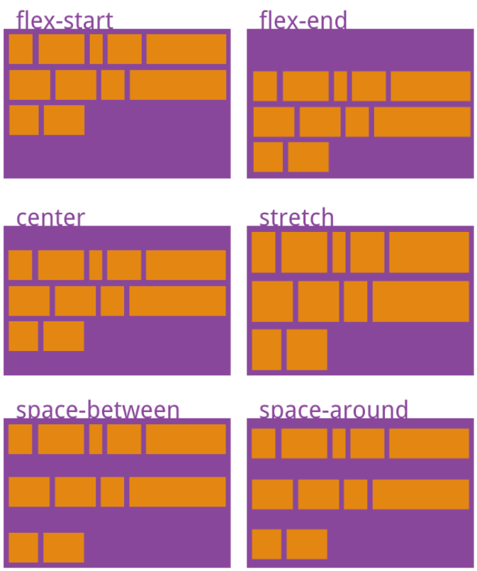

[toc]

传统布局方案，依赖display+position+float属性，对于垂直居中等布局不易实现。

```css
.box{
    display:flex;
}
```

**设为flex后，子元素的float/clear/vertical-align属性都将失效。**



### 1 容器属性

+ flex-direction
  决定主轴方向。
  row/row-reverse
  column/column-reverse
+ flex-wrap
  一条轴线排不下，如何换行。
  
  nowrap/wrap/wrap-reverse
+ flex-flow
  是flex-direction 和 flex-wrap 的简写形式。
  默认值 `row nowrap`.
+ justify-content
  定义项目在主轴上对齐方式。
  flex-start/flex-end/center/space-between/space-around
+ align-items
  定义项目在交叉轴上如何对齐
  flex-start/flex-end/center/baseline/stretch
+ align-content
  定义了多根轴线的对齐方式，若项目只有一根轴线，该属性不起作用。
  

### 2 项目属性
+ order
定义项目排列顺序

+ flex-grow
定义项目放大比例。

+ flex-shrink
定义空间不足时项目缩小比例。

+ flex-basis
+ flex
flex-grow flex-shrink flex-basis简写，默认0 1 auto

+ align-self


