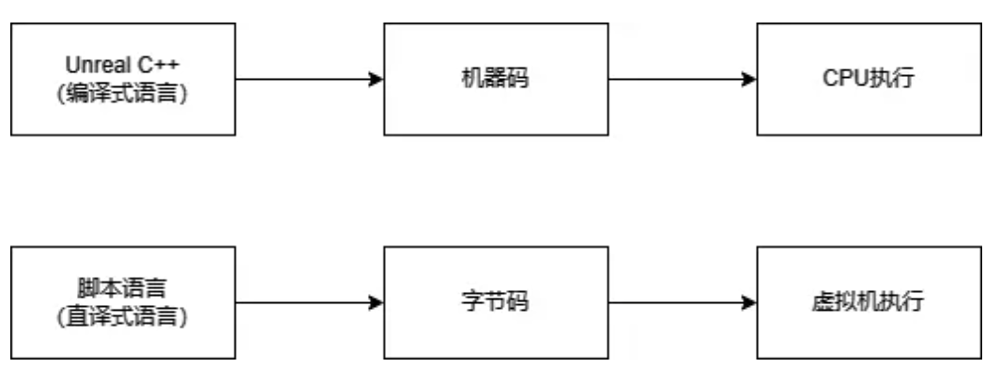
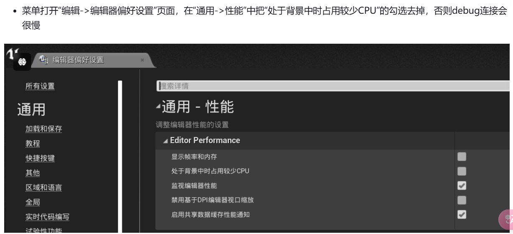

## puerts 入门



本质：

- 在 ue 提供 js 虚拟机环境
- 让 ts / js 和引擎交互，即能调用 C++ 或蓝图 api , 也能被 C++ 或蓝图调用。

- puerts 默认导入所有反射 API（UCLASS / UPROPERTY / UFUNCTION / USTRUCT / UENUM 的 C++类及所有蓝图）
- 对非反射 API 进行手动封装成反射后蓝图也可以访问（推荐基于模板的静态绑定 / 目前不太推荐的拓展函数）

## 调试
### puerts:FJsEnv - 代表一个虚拟机实例（类似一个 nodejs 进程）-初始化puerts环境


- 1.ts 和 ue 相互调用

- 2.蓝图 mixin 功能
  把一个 ts 类 mixin 到一个蓝图类

- 3.继承引擎类功能


```C++
GameScript = MakeShared<puerts::FJsEnv>(std::make_unique<puerts::DefaultJSModuleLoader>(TEXT("JavaScript")), std::make_shared<puerts::FDefaultLogger>(), 8080);
GameScript->WaitDebugger();

//...

GameScript->Start("QuickStart", Arguments);
```





## puerts开发指南
在Editor中新建C++类：PuertsGameinstance.h


## 基于模板的静态绑定-适用UCLASS/USTRUCT下未标记UROPERTY / UFUNCTION的属性和方法，以及c++ CLASS/STRUCT。


