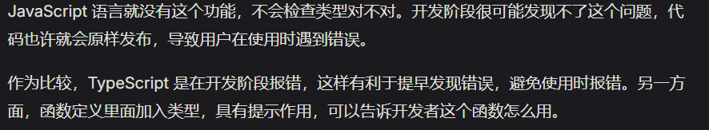
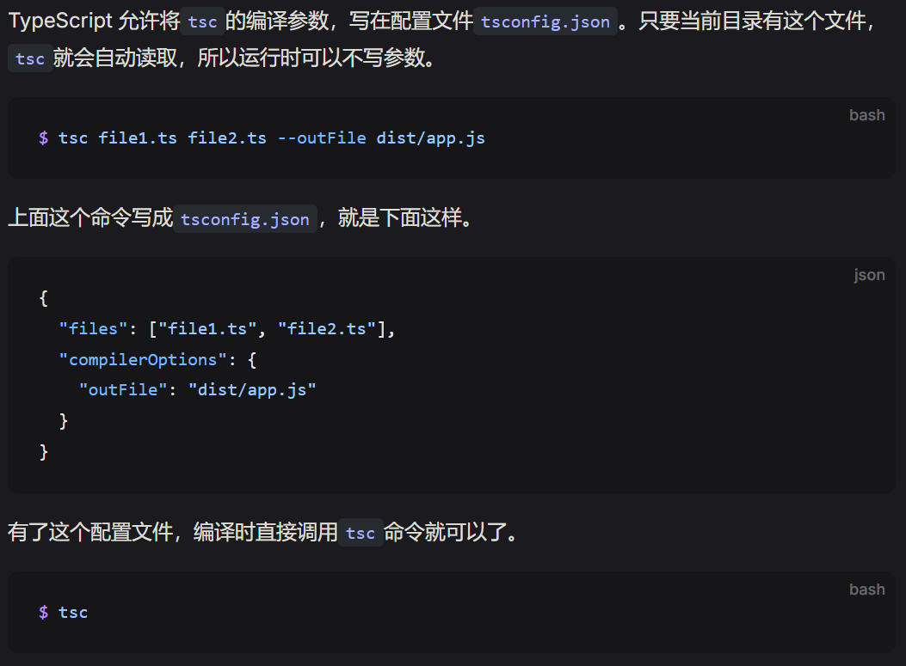
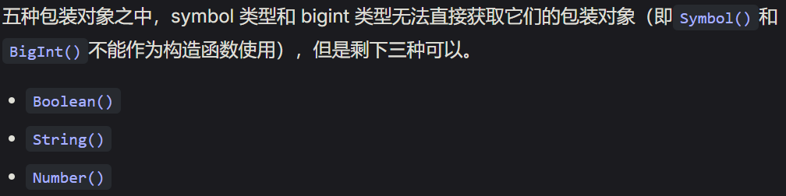
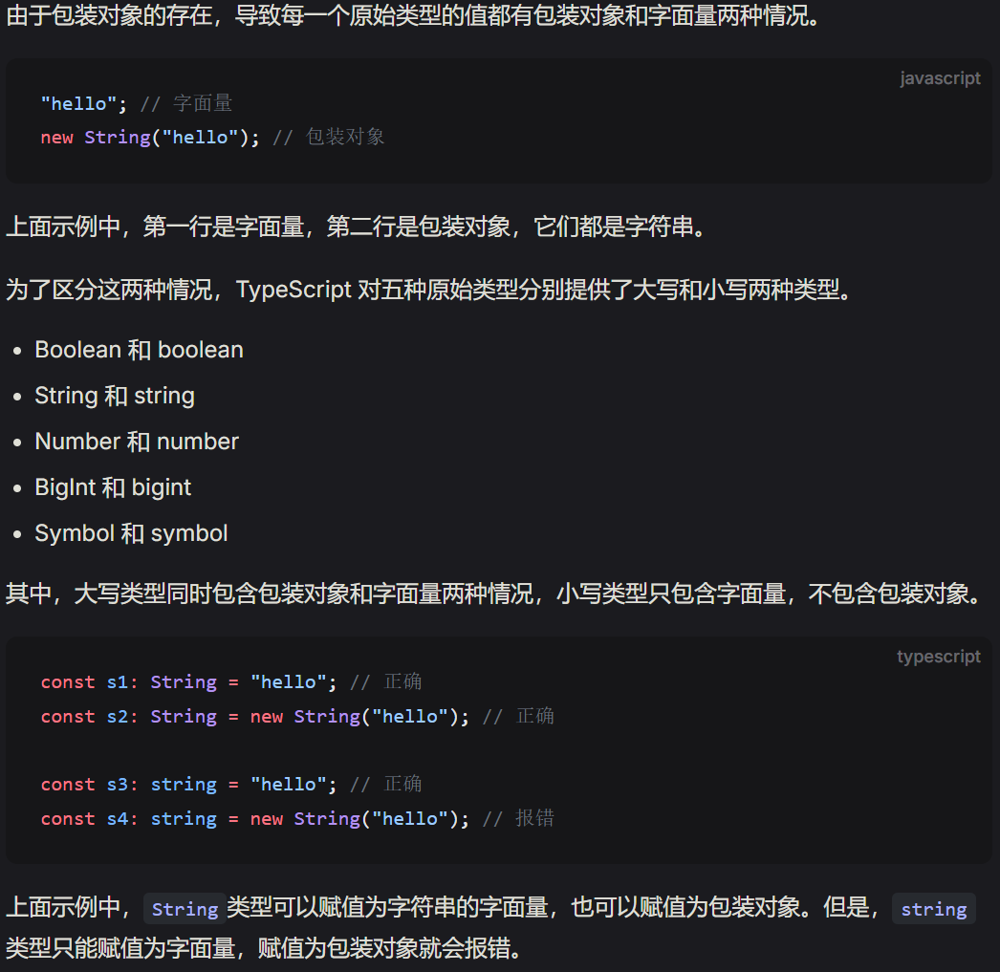

### 类型

```typescript
function addOne(n: number) {
  return n + 1;
}
//表明n只能用number数值，传入其他类型 的值会报错
addOne("hello"); //error
```



### 静态类型

```typescript
let x = 1;
x = "fpp"; //error，typesciript已经推断了类型，后面不允许修改

let x = { foo: 1 };
delete x.foo; //error
x.bar = 2; //error。对象的属性是静态的，不允许随意增删
```

**希望一旦报错就停止编译，不生成编译产物**
`--noEmitOnError`

```js
tsc --noEmitOnError app.ts
```

### 类型声明

在 javascript 变量上添加了类型声明：

```javascript
let foo: string;

//1.函数参数和返回值，也是这样来声明类型
function toString(num: number): string {
  return String(num);
}

//2.变量只有赋值后才能使用
let x: number;
console.log(x); //error
```

## 编译

### typescript 编译成 javascript - tsc 编译器

```js
//安装(全局)，也可以在项目中 将tsc安装为一个依赖模块
npm install -g typescript

//检查版本
tsc -v

//编译脚本
tsc app.ts

//一次编译多个,在当前目录生成3个脚本文件
tsc app.ts bpp.ts cpp.ts

//将多个typescript脚本编译成javascript文件
tsc file1.ts file2.ts --outFile

//将结果保存到其他目录
tsc app.ts --outDir dist

//指定编译后的javascript版本
tsc --target es2015 app.ts
```

### tsconfig.json 存储配置文件



### ts-node 模块直接运行 typescript 代码

```js
//全局安装
npm install -g ts-node

//安装完可以直接运行ts脚本
ts-node script.ts

//

```

## any 类型 / Unknown 类型 / never 类型 / 联合类型

关闭类型检查，尽量不用

### 类型推断

没有指定类型，则认为该变量类型为 any

```javascript
function add(x, y) {
  return x + y;
}

add(1, [2, 3]);
//terrible！尽量不用，一定要显式声明
```

**`unknown`**与 any 类似，区别：

- 不能直接调用 unknown 类型的变量的方法和属性

```js
let v: unknown = 11;

let v1: boolean = v; //error
```

- 不能直接调用 unknown 类型变量的方法和属性

```js
let v1: unknown = { foo: 123 };
v1.foo; // 报错

let v2: unknown = "hello";
v2.trim(); // 报错

let v3: unknown = (n = 0) => n + 1;
v3(); // 报错
```

**never 类型**
空类型

**联合类型**
如果一个变量有多种类型，需要使用分支处理每种类型
此时，处理所有可能的类型后，剩余的情况就属于 never 类型。

```js
function fn(x:string | number){
    if(type x === "string"){

    }
    else if(type x === "number"){

    }
    else {
        x
    }
}
```


## 类型系统

js 值 8 种类型

```javascript
//下面5个是原始类型Primitive value
boolean;
string;
number;
bigint;
symbol;

object;
//特殊值
undefined;
//复合类型
null;
//特殊值
```

### 包装对象类型

上面 5 种原始类型值，会产生包装对象(wrapper object)。

```js
"hello".charAt(1);
//e
```



### 字面量类型



### Object 类型和 object 类型

**Object 类型**
