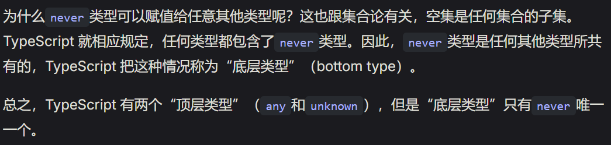

### 类型

```typescript
function addOne(n: number) {
  return n + 1;
}
//表明n只能用number数值，传入其他类型 的值会报错
addOne("hello"); //error
```


### 静态类型

```typescript
let x = 1;
x = "fpp"; //error，typesciript已经推断了类型，后面不允许修改

let x = { foo: 1 };
delete x.foo; //error
x.bar = 2; //error。对象的属性是静态的，不允许随意增删
```

**希望一旦报错就停止编译，不生成编译产物**
`--noEmitOnError`

```js
tsc --noEmitOnError app.ts
```

### 类型声明

在 javascript 变量上添加了类型声明：

```javascript
let foo: string;

//1.函数参数和返回值，也是这样来声明类型
function toString(num: number): string {
  return String(num);
}

//2.变量只有赋值后才能使用
let x: number;
console.log(x); //error
```

## 编译

### typescript 编译成 javascript - tsc 编译器

```js
//安装(全局)，也可以在项目中 将tsc安装为一个依赖模块
npm install -g typescript

//检查版本
tsc -v

//编译脚本
tsc app.ts

//一次编译多个,在当前目录生成3个脚本文件
tsc app.ts bpp.ts cpp.ts

//将多个typescript脚本编译成javascript文件
tsc file1.ts file2.ts --outFile

//将结果保存到其他目录
tsc app.ts --outDir dist

//指定编译后的javascript版本
tsc --target es2015 app.ts
```

### tsconfig.json 存储配置文件


### ts-node 模块直接运行 typescript 代码

```js
//全局安装
npm install -g ts-node

//安装完可以直接运行ts脚本
ts-node script.ts

//

```

## any 类型 / Unknown 类型 / never 类型 / 联合类型

关闭类型检查，尽量不用

### 类型推断

没有指定类型，则认为该变量类型为 any

```javascript
function add(x, y) {
  return x + y;
}

add(1, [2, 3]);
//terrible！尽量不用，一定要显式声明
```

**`unknown`**与 any 类似，区别：

- 不能直接调用 unknown 类型的变量的方法和属性

```js
let v: unknown = 11;

let v1: boolean = v; //error
```

- 不能直接调用 unknown 类型变量的方法和属性

```js
let v1: unknown = { foo: 123 };
v1.foo; // 报错

let v2: unknown = "hello";
v2.trim(); // 报错

let v3: unknown = (n = 0) => n + 1;
v3(); // 报错
```

**never 类型**
空类型



## 类型系统

js 值 8 种类型

```javascript
//下面5个是原始类型Primitive value
boolean;
string;
number;
bigint;
symbol;

object;
//特殊值
undefined;
//复合类型
null;
//特殊值
```

### 包装对象类型

上面 5 种原始类型值，会产生包装对象(wrapper object)。

```js
"hello".charAt(1);
//e
```


### 字面量类型


### Object 类型和 object 类型

**Object 类型**

- 除了 `undefined`和 `null`类型，其他类型都可以赋值给 `Object`对象。
- 空对象 `{}`是 Object 类型的简写形式，所以使用 Object 时常常用空对象代替.

```js
let obj: Object;
//等价于 let obj: {};

obj = {1};

obj = true;

obj = "hi";
obj = [1, 2];
obj = (a: number) => a + 1;
//correct

obj = undefined;//error
obj = null;//error
```

**object 类型**
代表 js 中的狭义对象，即可以用字面量表示的对象。
：对象字面量：在代码中直接定义和初始化一个对象的方式。
只包含**对象、数组、函数**


### null / undefined 类型

### 值类型

ts 规定：单个值也是一种类型

```js
let x: "hello";
x = "hello"; //co'r

x = "bye"; //error
```


### const 关键字


### 联合类型

多个类型组成一个新类型，符号"|"

```js
let x: string | number;

x = 123; // 正确
x = "abc"; // 正确
```

如果一个变量有多种类型，需要使用分支处理每种类型
此时，处理所有可能的类型后，剩余的情况就属于 never 类型。

```js
function fn(x:string | number){
    if(type x === "string"){

    }
    else if(type x === "number"){

    }
    else {
        x
    }
}
```

### 交叉类型

交叉类型 A&B 表示，任何一个类型必须同时属于 A 和 B，才属于交叉类型 A&B，即交叉类型同时满足 A 和 B 的特征。

```js
let x: number & strin;
```


### type 命令-定义一个类型的别名

```js
type Age = number;

let age: Age = 55;
```

### 块级类型声明

## 数组

- 所有成员类型必须相同。

```js
//两种写法
let arr: number[] = [1, 2, 3];

let arr: Array<number> = [1, 2, 3];
```

**typescript 数组成员数量可以动态变化，所以 typescript 不会对数组边界进行检查，越界访问数组并不会报错**

```js
let arr: number[] = [1, 2, 3];
let foo = arr[3]; // 正确
```

### 数组类型推断

```JS
// 推断为 any[]
const arr = [];

arr.push(123);
arr; // 推断类型为 number[]

arr.push("abc");
arr; // 推断类型为 (string|number)[]
```

### 只读数组，const 断言

在数组类型前面加上 `readonly`关键字

```js
const array: readonly number[] = [0, 1];

arr[1] = 2;//error
arr.push(3);//error
```

### 多维数组


## 元组

```js
const s: [string, string, boolean] = ["a", "b", true];

//与数组区别：
成员类型写在方括号中
let a: [numbe] = [1];

//元组成员类型可添加后缀"?"，代表该成员可选，且问好只能用于元组的尾部成员
let a: [ number,number?] = [1];
```


**扩展运算符 `...`表示不限于成员数量的元组。**

```js
type NamedNums = [string, ...number[]];

const a: NamedNums = ["A", 1, 2];
const b: NamedNums = ["B", 1, 2, 3];
```

### 只读元组

```js
type t = readonly[number, string];
//写法 1

type t = Readonly<[number, string]>;
//写法二· 是一个泛型，用到了工具类型Readonly<T>P
```

## symbol

Symbol 值通过 Symbol()函数生成。

```js
let x: symbol = Symbol();
let y: symbol = Symbol();

x === y; // false
```

### unique symbol


## typescript 函数类型

typescript 的函数的类型声明，需要在声明函数时，给出参数的类型和返回值的类型（返回值类型通常可以不写，靠 ts 推断

```js
function hello(a: string): void {
  console.log(a + "txt");
}
```

- 函数类型中的参数名可以和实际参数名不一致：

```js
let f: (x: number) => number;

f = function (y: number) {
  return y;
};
```

- js 函数在声明时可以有多余的餐宿，实际使用时之传入一部分参数。
  

/  |

- 解决方法：
  

### Function 类型

不建议使用

### 箭头函数

### 可设置参数默认值

```js
function createPoint(x: number = 0, y: number = 0): [number, number] {
  return [x, y];
}

createPoint(); // [0, 0]
```

### 参数解构

- \*\*对象解构，允许直接从对象中提取属性值。

```typescript
interface User {
  name: string;
  age: number;
  email?: string;
}

const user: User = {
  name: "Alice",
  age: 30,
  email: "alice@example.com",
};

//可以定义一个函数，使用对象解构访问name / age属性
function greet({ name, age }: User) {
  console.log("hello,${name},you are${age}years old");
}

greet(user);

//可以提供默认值
function greet({ name, age = 18, email = "n/a" }: User) {
  console.log(
    `Hello, ${name}! You are ${age} years old. Your email is ${email}.`
  );
}

greet({ name: "Bob" }); // 输出：Hello, Bob! You are 18 years old. Your email is n/a.

//可选属性
function logUserDetails({ name, age, ...otherDetails }: User) {
  console.log(`Name: ${name}, Age: ${age}`);
  console.log("Other details:", otherDetails);
}

logUserDetails({
  name: "Diana",
  age: 35,
  email: "diana@example.com",
  phone: "123-456-7890",
});
// 输出：
// Name: Diana, Age: 35
// Other details: { email: "diana@example.com", phone: "123-456-7890" }
```

- **数组解构**

```ts
const numbers = [10, 20];

function sum([a, b]: [number, number]) {
  return a + b;
}

console.log(sum(numbers)); // 输出：30
```

### rest 参数

表示函数剩余的所有参数。。
可以是数组：剩余参数类型相同
可以是元组：剩余参数类型不同。
**元组需要声明每一个剩余参数的类型。如果元组里面的参数是可选的，则要使用可选参数"?"。**

```js
function joinNumbers(...nums: number[]){

}
//数组

function joinTurples(...args:[boolean, numebr?]){}
```

**rest 参数可以与变量解构结合使用**

```ts
function repeat(...[str, times]: [string, number]): string {
  return str.repeat(times);
}

// 等同于
function repeat(str: string, times: number): string {
  return str.repeat(times);
}
```

### readonly 只读参数

```js
function arraySum(arr: readonly number[]) {
  // ...表示函数内部不能修改某个参数
  arr[0] = 0; // 报错
}
```

### void 类型表示函数无返回值

void 类型允许返回 undefined / null.
如果打开了 strictNullChecks 编译选项，那么 void 类型只允许返回 undefined。如果返回 null，就会报错。这是因为 JavaScript 规定，如果函数没有返回值，就等同于返回 undefined。

```js
function f(): void {
  return 123; // 报错
}

function f(): void {
  return undefined; // 正确
}

function f(): void {
  return null; // 正确
}
```


### never 类型

用于表示肯定不会出现的值。
表示某个函数肯定不会有返回值，即函数不会正常执行结束。

两种情况：

- 抛出错误的函数：

```js
function fail(msg: string): never {
  throw new Error(msg);
}
//函数fail()会抛错，不会正常退出，所以返回值类型是never

//注意，只有抛出错误，才是 never 类型。如果显式用return语句返回一个 Error 对象，返回值就不是 never 类型。
function fail(): Error {
  return new Error("Something failed");
}
```

- 无限执行函数

```js
const sing = function (): never {
  while (true) {
    console.log("sing");
  }
};
```

**注意，never 类型不同于 void 类型。前者表示函数没有执行结束，不可能有返回值；后者表示函数正常执行结束，但是不返回值，或者说返回 undefined。**

### 局部类型

只在函数内部有效

### 高阶函数

一个函数的返回值还是一个函数，那个前一个函数称为高阶函数（higher-order function）。

如箭头函数返回的仍然是箭头函数；

```typescript
(someValue: number) => (multiplier: number) => sommeValue * multiplier;
```

### 函数重载

根据参数类型不同，执行不同逻辑

```js
function reverse(str: string): string;
function reverse(arr: any[]): any[];
function reverse(stringOrArray: string | any[]): string | any[] {
  if (typeof stringOrArray === "string")
    return stringOrArray.split("").reverse().join("");
  else return stringOrArray.slice().reverse();
}

reverse("abc");
//cba
reverse([1, 2, 3]);
//[3, 2, 1]
```

### 构造函数

```js
class Animal {
  numLegs: number = 4;
}

type AnimalConstructor = new () => Animal;

function create(c: AnimalConstructor): Animal {
  return new c();
}

const a = create(Animal);
```

## 对象

可以使用方括号读取属性的类型

```js
type User = {
  name: string,
  age: number,
};
type Name = User["name"]; // string
```

**`interface`**命令可以把对象类型作为一个接口：

```js
// 写法一
type MyObj = {
  x: number,
  y: number,
};

const obj: MyObj = { x: 1, y: 1 };

// 写法二
interface MyObj {
  x: number;
  y: number;
}

const obj: MyObj = { x: 1, y: 1 };
```

### 可选属性

```js
const obj: {
  x: number,
  y?: number,
} = { x: 1 };
```

所以，读取可选属性之前，必须检查一下是否为 undefined。

```js
const user: {
  firstName: string,
  lastName?: string,
} = { firstName: "Foo" };

if (user.lastName !== undefined) {
  console.log(`hello ${user.firstName} ${user.lastName}`);
}
```

### 只读属性 readonly / 只读断言 `as const`

```js
type Point = {
  readonly x: number;
  readonly y: number;
};

const p: Point = { x: 0, y: 0 };

p.x = 100; // 报错
```

- **如果属性值是一个对象，readonly 修饰符并不禁止修改该对象的属性，只是禁止完全替换掉该对象。**

```js
interface Home {
  readonly resident: {
    name: string;
    age: number;
  };
}

const h: Home = {
  resident: {
    name: "Vicky",
    age: 42,
  },
};

h.resident.age = 32; // 正确
h.resident = {
  name: "Kate",
  age: 23,
}; // 报错
```

- **如果一个对象有两个引用，即两个变量对应同一个对象，其中一个变量是可写的，另一个变量是只读的，那么从可写变量修改属性，会影响到只读变量。**

```js
interface Person {
  name: string;
  age: number;
}

interface ReadonlyPerson {
  readonly name: string;
  readonly age: number;
}

let w: Person = {
  name: "Vicky",
  age: 42,
};

let r: ReadonlyPerson = w;

w.age += 1;
r.age; // 43
```

如果希望属性值只是只读的方法： 1.声明时加入 readonly 关键词； 2.赋值时，在对象后面加上只读断言 `as const`;

```js
const myUser = {
  name: "Sabrina",
} as const;

myUser.name = "Cynthia"; // 报错
```

### 解构赋值

### 解构类型原则

只要对象 B 满足 对象 A 的结构特征，TypeScript 就认为对象 B 兼容对象 A 的类型，这称为“结构类型”原则（structual typing）。

### 空对象

空对象只能使用继承的属性，即继承自原型对象 `Object.prototype`的属性：

```js
const obj = {};

obj.toString(); //cor
```

### 使用扩展运算符（...）合成一个新对象

```JS
const p1=  {};
const p2 = {x:3};
const p3 = {y:4, z：5}；

const p = {
  ...p1,
  ...p2,
  ...p3
}
```

## interface 接口

看作**对象的模板**。

```js
interface Person {
  firstName: string;
  lastName?: string;//？表示属性可选
  age: number;
  readonly sex:boolean;//readonly表示属性只读
}

//[]可以取出接口某个属性的类型
type A = Person[firstname];//string
```

**实现接口**
指定他作为对象的类型。

```js
const p: Person = {
  firstName: "John",
  lastName: "Smith",
  age: 25,
}; //变量p的类型就是接口Person
```

**对象的属性索引**
属性索引有 string / number / symbol 三种类型

数值索引必须兼容字符串索引的类型声明：

```js
interface A {
  [prop: string]: number;
  [prop: number]: string; // 报错
}

interface B {
  [prop: string]: number;
  [prop: number]: number; // 正确
}
```

### 对象方法的 3 种表达方式

```js
/
interface A{
  f(x: boolean): string;//1

  g(y:boolean) => string;//2

  h:{(z:boolean): string};//3

}
```

### interface 的函数重载


### interface 继承

- **interface 继承 interface**
  如果子接口与父接口存在同名属性，那么子接口的属性会覆盖父接口的属性。注意，子接口与父接口的同名属性必须是类型兼容的，不能有冲突，否则会报错。

```js
interface Shape {
  name: string;
}

interface Circle extends Shape {
  radius: number;
}

//子接口和父接口同名属性必须互相兼容
interface Foo {
  id: string;
}

interface Bar extends Foo {
  id: number; // 报错
}
```

- **interface 继承 type**

```js
interface Foo {
  id: string;
}

interface Bar extends Foo {
  id: number; // 报错
}
```

- **interface 继承 class**

```js
class A {
  x: string = "";

  y(): boolean {
    return true;
  }
}

interface B extends A {
  z: number;
}

//实现B接口的对象
const b: B = {
  x: "",
  y: function () {
    return true;
  },
  z: 123,
};
```

### 接口合并

多个同名接口会合并成一个接口。
作用：

```js
interface A {
  height: number;
  width: number;
}
interface A {
  length: number;
}
```


### interface 和 type

## class 类

### 方法的类型

```js
class Point {
  x: number;
  y: number;

  constructor(x: number, y: number) {
    this.x = x;
    this.y = y;
  }

  add(point: Point) {
    return new Point(this.x + point.x, this.y + point.y);
  }
}
```

### 存取器方法

accessor:
getter / setter

- 如果某个属性只有 get()方法，没有 set()方法，则该属性自动成为只读属性：

```js
class C {
  _name = "foo";

  get name() {
    return this._name;
  }
}

const c = new C();
c.name = "bar"; // 报错
```

- set()需兼容 get()的参数类型
- 可访问性必须一致

### 类的 interface 接口

**implements 关键字**
用于指定一个类实现了某个接口。

```js
interface Animal {
  name: string;
  age: number;
  speak(): string;
}

interface Swimmer {
  swim(): void;
}

class Dog implements Animal, Swimmer {
  name: string;
  age: number;

  constructor(name: string, age: number) {
    this.name = name;
    this.age = age;
  }

  speak(): string {
    return `${this.name} says Woof!`;
  }

  swim(): void {
    console.log(`${this.name} is swimming.`);
  }
}

// 创建类的实例
const dog = new Dog("Buddy", 3);
console.log(dog.speak()); // 输出：Buddy says Woof!
dog.swim(); // 输出：Buddy is swimming.
```

**实现多个接口（并不是好写法）**
同时实现多个接口容易使代码难管理，替代方法：

- 类的继承

```js
class Car implements MotorVehicals {}

class SecretCar extends Car implements Flyable, Swimmable {}
```

- 接口的继承

```js
interface A {
  a: number;
}

interface B extends A {
  b: number;
}
```

### 类合并接口

如果一个类和一个接口同名，则接口会被合并进类。

### Class 类型

**实例类型**
Ts 的类本身就是一种类型，代表该类的实例类型，而不是 class 的自身类型。

```JS
class Color{
  name: string;

  constructor(name: string){
    this.name = name;
  }
}

const green: Color = new Color("green");
```


### 类的自身类型 - 使用 typeof 运算符

类的自身类型就是一个构造函数，可以单独定义一个接口来表示。

```js
class Point {
  x: number;
  y: number;

  constructor(x: number, y: number) {
    this.x = x;
    this.y = y;
  }
}

// 错误
function createPoint(PointClass: Point, x: number, y: number) {
  return new PointClass(x, y);
}

function createPoint(PointClass: typeof Point, x: number, y: number): Point {
  return new PointClass(x, y);
}
//正确
```

### class 的结构类型原则

一个对象只要满足 Class 的实例结构，就跟该 Class 属于同一个类型。

### 类的继承

- 子类可以覆盖基类的同名方法

```js
class B extends A {
  greet(name?: string) {
    if (name === undefined) {
      super.greet();
    } else {
      console.log(`Hello, ${name}`);
    }
  }
}
```

- 子类的同名方法不能和基类的类型定义冲突。

### typescript 中的静态成员 - static

### 泛型类

```js
class Box<Type> {
  contents: Type;

  constructor(value: Type) {
    this.contents = value;
  }
}

const b: Box<string> = new Box("hello");
```

**静态成员不能使用泛型的类型参数**


### 抽象类

表示该类不能被实例化，只能作为其他类的模板。

```js
abstract class A{
  id = 1;
}

class B extends A{};

const a = new A();
//error
const b = new B();//correct
```

### this - 表示该方法当前所在的对象

## 泛型

泛型主要用在四个场合：
函数 / 接口 / 类 / 别名

- **多个类型参数**
  如果有多个类型参数，则使用 T 后面的 U、V 等字母命名，各个参数之间使用逗号（“,”）分隔。

```js
function map<T, U>(arr: T[], f: (arg: T) => U): U[] {
  return arr.map(f);
}

// 用法实例
map < string, number > (["1", "2", "3"], (n) => parseInt(n)); // 返回 [1, 2, 3]
```

### 函数的泛型

```js
function id<T>(arg: T): T {
  return arg;
}

//对于变量形式定义的函数，有两种泛型写法
// 写法一
let myId: <T>(arg: T) => T = id;

// 写法二
let myId: { <T>(arg: T): T } = id;
```

### 接口的泛型

```js
interface Box<Type> {
  contents: Type;
}

let box: Box<string>;

//第二种写法
interface Fn {
  <Type>(arg: Type): Type;
}

function id<Type>(arg: Type): Type {
  return arg;
}

let myId: Fn = id;
```

### 类的泛型写法

```js
class Pair<K, V> {
  key: K;
  V: value;
}
```

**泛型类描述的是类的实例，不包含静态属性和静态方法，因为这两者是定义在类的本身。所以，他们不能引用类型参数**

```js
class C<T> {
  static data: T; // 报错
  constructor(public value: T) {}
}
```

### 类型别名的泛型

```ts
type Nullable<T> = T | undefined | null;
```

### 数组的泛型

```js
interface Array<Type> {
  length: number;

  pop(): Type | undefined;

  push(...items: Type[]): number;

  // ...
}
```


ts 默认提供 `ReadonlyArray<T>`接口，表示只读数组。

## ENUM


**keyof**可以取出 ENUM 结构的所有成员名，作为联合类型返回。

```js
enum MyEnum {
  A = "a",
  B = "b",
}

// 'A'|'B'
type Foo = keyof typeof MyEnum;
```

## 类型断言

## 模块


相较 ES6 特别之处：**允许输出和输入类型**


### import type

## namespace

将相关代码组织在一起。

它出现在 ES 模块诞生之前，作为 TypeScript 自己的模块格式而发明的。但是，自从有了 ES 模块，官方已经不推荐使用 namespace 了。

## 装饰器 Decorator - @后接一个函数（或执行后可以得到一个函数）

用来在定义时修改类的行为

```js
function simpleDecorator(target: any, context: any) {
  console.log("hi, this is " + target);
  return target;
}

@simpleDecorator
class A {} // "hi, this is class A {}"
```

## declare 关键字

告诉编译器，某个类型存在，可以在当前文件中使用。

```js
x = 123;//error

declare let x: number;
x = 123;
```

可以描述下面类型：
变量（const、let、var 命令声明）
type 或者 interface 命令声明的类型
class
enum
函数（function）
模块（module）
命名空间（namespace）

## 运算符

### keyof - 单目运算符

接受一个对象类型作为参数，返回该对象的所有键名组成的联合类型。
用于精确表达对象的属性类型。

```js


interface T {
  0: boolean;
  a: string;
  b(): void;
}

type KeyT = keyof T; // 0 | 'a' | 'b'
//由于 JavaScript 对象的键名只有三种类型，所以对于任意对象的键名的联合类型就是string|number|symbol。


//应用于数组或元组类型
type arr = keyof["a" , "b" , "c"];
// 返回 number | "0" | "1" | "2"
// | "length" | "pop" | "push" | ···
```

**由于 JavaScript 对象的键名只有三种类型，所以对于任意对象的键名的联合类型就是 string|number|symbol。**

- 对联合类型返回成员共有键名


- 对交叉类型返回所有键名


### in 运算符

确定对象是否包含某个属性名

```js
const obj = { a: 23 };
if ("a" in obj) console.log("found a");
```


### [ ]

取出对象的键值类型

```js
type Person = {
  age: number,
  name: string,
  alive: boolean,
};

// Age 的类型是 number
type Age = Person["age"];
```

### extends...?: 条件运算符

### 类型映射

mapping
将一种类型按照映射规则，转换成另一种类型。


**为了增加代码复用性，可以把常用的映射写成泛型**：

```js
type ToBoolean<Type> = {
  [Prop in keyof Type]: boolean;
}
```

### 映射修饰符 - readonly

### 键名重映射 - 允许修改键名

```js
type A = {
  foo: number;
  bar: number;
};

type B = {
  [p in keyof A as `${p}ID`]: number;
};

// 等同于
type B = {
  fooID: number;
  barID: number;
}；
```

## 类型工具

## tsconfig.json

放在项目的根目录
\*\*可以不必手写，使用 `tsc --init`参数自动生成 tsconfig.json

反过来说，如果一个目录中有 tsconfig.json，ts 就认为这事项目的根目录。

```js
tsc --init
//自动生成tsconfig.json

tsc -p ./dir
//指定tsconfig.json的位置


//tsconfig.json的文件格式示例
{
  "compilerOptions": {
    "outDir": "./built",
    "allowJs": true,
    "target": "es5"
  },
  "include": ["./src/**/*"]
}

```

- include：指定哪些文件需要编译。
- allowJs：指定源目录的 JavaScript 文件是否原样拷贝到编译后的目录。
- outDir：指定编译产物存放的目录。
- target：指定编译产物的 JS 版本。

### extends

tsconfig.json 可以继承另一个 tsconfig.json 文件的配置。如果一个项目有多个配置，可以把共同的配置写成 tsconfig.base.json，其他的配置文件继承该文件，这样便于维护和修改。

extends 属性用来指定所要继承的配置文件。它可以是本地文件。

```js
{
  "extends": "../tsconfig.base.json"
}
```

### files

指定编译的文件列表

```js
{
  "files": ["a.ts" , "b.ts"];
}
```

如果文件较多，建议使用 include 和 exclude 。

### include

指定所要编译的文件列表，即支持逐一列出文件和支持通配符。

```js
{
  "include" : ["src/**/*", "tests/**/*"]
}
```

支持三种通配符：

- `?`:指代单个字符
- `*`：指代任意字符，不含路径分隔符
- `**`：指定任意目录层级

### reference

## tsc

tsc 默认使用当前目录下的配置文件 tsconfig.json，但也可以接受独立的命令行参数。命令行参数会覆盖 tsconfig.json，比如命令行指定了所要编译的文件，那么 tsc 就会忽略 tsconfig.json 的 files 属性。

```js

# 使用 tsconfig.json 的配置
tsc

//只编译 index.ts
tsc index.ts

//编译 src 目录的所有 .ts 文件
//tsc src/*.ts

# 指定编译配置文件
tsc --project tsconfig.production.json

# 只生成类型声明文件，不编译出 JS 文件
tsc index.js --declaration --emitDeclarationOnly

# 多个 TS 文件编译成单个 JS 文件
tsc app.ts util.ts --target esnext --outfile index.js
```
