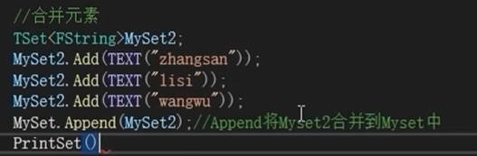
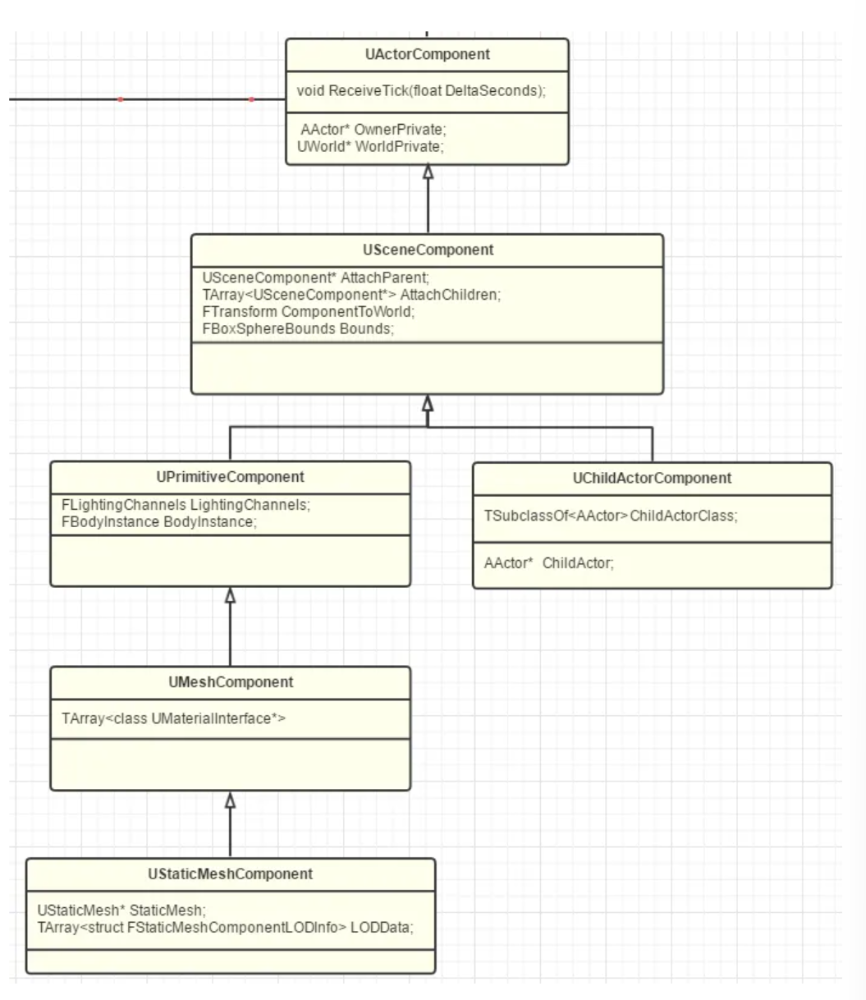
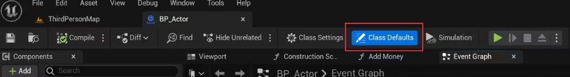
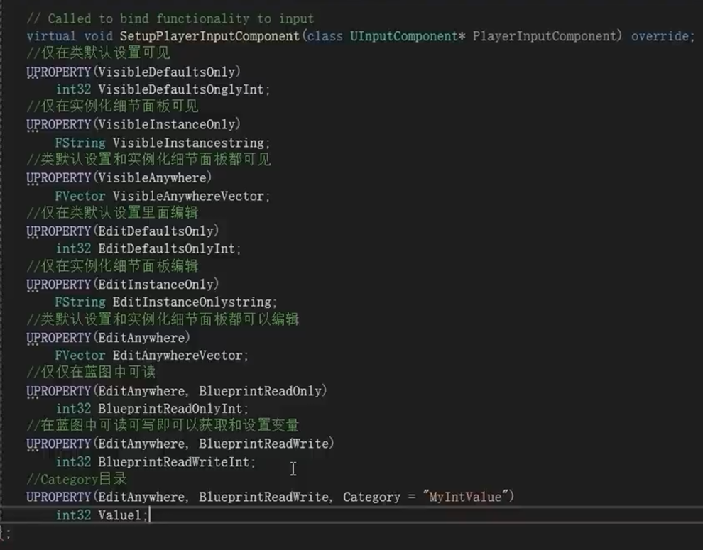
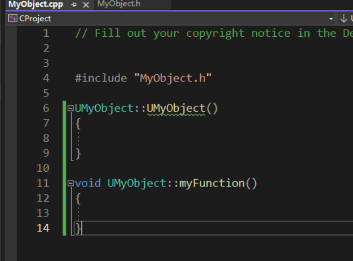
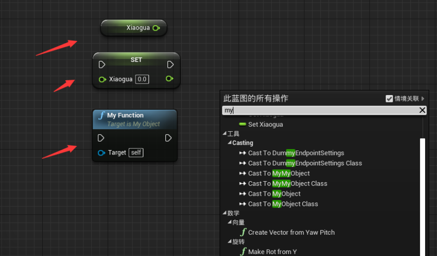

## 注意事项

### 改缓存！！


（忘记该缓存）


### 常见前缀

- F-纯 C++类
- U-继承自 UObject
- A-继承自 Actor
- S-Slate 控件相关类
- H-HitResult 相关类

## 项目结构


[1] 存放平台编译代码生成的 dll 文件
[2] 存放配置文件


[3] 存放项目资源，如贴图/材质/模型/蓝图
[4] 存放 C++代码源文件

## 游戏架构--GameMode

worldSettins-> GameMode

**架构关系**


**AGameMode**
AGameMode 是 AGameModeBase 的子类，拥有一些额外的功能支持多人游戏和旧行为。
所有新建项目默认使用 AGameModeBase。


## 文件 介绍

.h
包含函数声明 、类定义、宏定义
.cpp
包含头文件中声明的函数和类的具体实现。


启动时强制编译

### UE_LOG

用于输出日志的宏


### 变量 / 常量


### 关键字


不能以系统关键字 作为变量名或常量名进行定义。

### 标识符


### 数据类型 整形 / 浮点型


### 字符型


### 字符串型


## 运算符


## TArray

C++中的动态数组，所有元素为相同类型。


蓝图中

C++中


## TMap

## TSet


合并元素




## 结构体-USTRUCT

注：定义结构体名称前要加 F 前缀，否则编译报错。

```cpp
USTRUCT(BlueprintType)
struct FMyCustomStruct
{
	GENERATED_USTRUCT_BODY()

	UPROPERTY(EditAnywhere, BlueprintReadWrite, Category = "MyStructType")
	FString ID;
	UPROPERTY(EditAnywhere, BlueprintReadWrite, Category = "MyStructType")
	FString Name;
	UPROPERTY(EditAnywhere, BlueprintReadWrite, Category = "MyStructType")
	int32 Age;
	UPROPERTY(EditAnywhere, BlueprintReadWrite, Category = "MyStructType")
	float Height;
	UPROPERTY(EditAnywhere, BlueprintReadWrite, Category = "MyStructType")
	bool IsMan;
};
```

声明结构体：

```cpp
UPROPERTY(EditAnywhere , BluePrintReadWrite,Category = "MyCustomStruct")
FMyCustomStruct MyCustomStruct;
```

之后可以在蓝图中看到：


### 利用结构体创建一个数据表格

## UE - UObject / UGameInstance 实例化

## 提升代码编译速度


## Object / Actor / Pawn / Character 类的继承结构


这些基本类又派生出了很多子类，比如：


## Actor

AActor 是所有 Actor 的基类。
**总结**


### 为 Actor 添加组件


## Component



SceneComponent 提供两个功能：

- Transform
- SceneComponent 的互相嵌套


### Actor & Component

`TSet<UActorComponent*> OwnedComponents` 保存着这个 Actor 所拥有的所有 Component.
一般其中会有一个 `SceneComponent`作为 `RootComponent`。

`TArray<UActorComponent*> InstanceComponents`中保存着实例化的 Components。

一个 Actor 若想被放进 level 里，必须实例化 USceneComponent\* RootComponent。

**Actor 中的 SceneComponent 设计哲学**


关键在于怎样划分要操作的实体的粒度。


### ChildActorComponent

## Pawn

代表游戏世界中的可控制角色或物体的基类。
继承自 Actor 类。

可通过 Controller 控制 Pawn 的移动和行为。


### DefaultPawn / SpectatorPawn / Character


### AController


### Controller 和 Pawn 必须 1：1 吗？


### Controller 的位置和移动的意义

Controller 本身有位置信息，就可以利用该信息更好的控制 Pawn 的位置和移动。


### 哪些逻辑放在 Pawn，哪些逻辑放在 Controller?


### APlayState


### **APlayController**

在多人联机对战中。
PlayController 不仅能控制本地 Pawn，还能控制远程 Pawn（实际是通过 Server 上 PlayController 控制 Server 上的 Pawn，然后再复制到远程机器上的 Pawn 实现）。


### 哪些逻辑放在 PlayController 中？


### **AAIController**


区别：
与 PlayController 比，缺少了 Camera/Input/Uplay 关联/HUD 显示/voice/Level 切换接口。

增加了一些 AI 需要的组件：

- Navigation，用于智能根据导航寻路，如 MoveTo 接口。再移动时，因为少了玩家控制的来转向，所以多了 SetFocus 来控制当前的 Pawn 视角朝向哪个位置。
- AI 组件，运行启动行为树，使用黑板数据，探索周围环境，以后如果有别的 AI 算法方法实现成组件，也应该再本组件内组合启动。
- Task 系统，让 AI 完成一些任务

### CapsuleComponent 胶囊体

是虚幻引擎中的一种碰撞组件。它是一种用于代表角色或物体碰撞形状的组件，通常用于处理角色的碰撞检测以及角色间的交互。CapsuleComponent 的形状类似于一个胶囊，即上下两个半球连接的形状。通过调整 CapsuleComponent 的高度和半径，可以根据角色或物体的尺寸来定义其碰撞区域。CapsuleComponent 还可以设置碰撞响应和碰撞消息的处理方式，以便在碰撞发生时执行相应的操作。


## UPlayer

AActor 必须在 world 中才能存在，而 Player 可以在游玩过程中 LevelWorld 不停切换，玩家模式不变。


### ULocalPlayer

## 重写 beginplay() / tick() / endPlay()

.h 中

.cpp 中


## UPROPERTY

UPROPERTY()宏用来修饰 C++中的变量。

使用 UPROPERTY 说明符赋予属性特性。

- visible



```cpp
public:
	//class defaults可见不可写入,其他地方不可见,不可读写
	UPROPERTY(VisibleDefaultsOnly, Category ="TestVisible|VisibleDefaultsOnly")
	int32 VisibleDefaultsValue;
```

**Category**是分类的意思，可以在蓝图调用的时候去显现出来将想要的东西挂载到此分类下面。

- edit
- read / write



## UFUNCTION

**设置变量和函数到蓝图中**：


运行后，写的数据就可以到 UE 的蓝图类中使用：


## 静态/动态加载类和资源

### 静态加载资源

静态加载资源：
复制静态资源引用


无法解析符号？


### 静态加载类

```cpp
UPROPERTY(VisibleAnywhere ,BlueprintReadOnly, Category = "MyClass");
TSubclassOf<AActor> MyActorClass;

```

**加载静态类时，在引用资源类的末尾需要 加上\_C，否则编译时会报错。**

```cpp
	// 静态加载类  加载静态类时，在引用资源类的末尾需要加上 _C，否则编译时会报错
	static ConstructorHelpers::FClassFinder<AActor> TempActorClass(TEXT("/Script/Engine.Blueprint'/Game/StarterContent/Blueprints/Blueprint_CeilingLight.Blueprint_CeilingLight_C'"));
	MyActorClass = TempActorClass.Class;
	UE_LOG(LogTemp, Warning, TEXT("MyActorClass is %s"), *MyActorClass->GetName());

```

### 动态加载类

## UI 编辑

创建 UI 控件蓝图：
内容浏览器右键--用户界面--控件蓝图 widget blueprint

## 反射机制

反射数据描述了类在运行时的内容。

包括
类名
类中数据成员
每个数据成员类型
每个成员位于对象内存映像的偏移 offset
类的所有成员函数信息。

例如：
创建了一个 Actor 类，有一个 Actor 类型指针去指向此 Actor 类，若指针被销毁了，则此 Actor 类 UE 系统会判断为垃圾，参与反射和垃圾回收系统后，UE 会在适当时机销毁此 Actor。

- 使用宏进行标识，UE 的 UHT 系统会帮忙进行垃圾回收。


## 自定义 C++类派生蓝图类

## 一些 function 用法

### Format Text


### 函数和纯函数

pure function calls （纯函数调用）不会直接影响世界或世界中 的对象。

**这些函数一般执行类似于这样的事情: 输出一个属性值、数学运算操作(比如两个值间的加减乘除等)， 所产生的结果不会对任何事物造成影响。 只有将该结果进行赋值或使用该结果，才能对世界产生影响。**

## 坐标系统

在源码实现中，在场景中可移动的【Actor】都拥有【USceneComponent 组件】，【世界坐标】的信息是存储于【USceneComponent 组件】中的一个【FTransform】类型的名为【ComponentToWorld】的三维变换矩阵中，除此之外，该三维矩阵也保存了场景对象旋转与缩放的信息：


### 相对坐标

用 `FVector`类型成员变量存储于 `SceneComponent`组件的 RelativeLocation 中。

## Level


**Level 层次的控制**：


**ALevelScriptActor**
允许在关卡里编写脚本。

**AInfo**
记录本 level 各种规则和属性

### AWorldSettings

与**AInfo**直接相关

AWorldSettings 要放进 Actors[0]的位置。

## World

- 可以使用 SubLevel 的方式拼装


- 也可以使用 WorldComposition 的方式自动把项目中的所有 Level 组合起来，设置摆放位置。
  

UE 中每个 World 支持一个 PersistentLevel 和多个其他 Level。

## WorldContext

UE 中 World 不只一种类型，如编辑器本身也是一种 World，里面显示的游戏场景也是一个 World。
点播放时，引擎可以生成新的类型 World 供我们测试。

以下是一些世界类型：


管理和跟踪这些 World 的工具：WorldContext


WorldContext 既负责 World 之间切换的上下文，也负责 Level 之间切换的操作信息。

### GameInstance


GameInstance 中会保存着当前 WorldContext 和其他整个游戏的信息。

独立于 Level 的逻辑或数据要在 GameInstance 中存储。

## GameMode（理解为 WorldController）、

一个 World 的 Controller 不需要展示渲染，因为直接从 AInfo 派生。
笼统来说，一个 World 就是一个 Game，把玩法叫做 Mode。


GameMode 主要功能：

- **Class 登记**
  登记游戏里基本需要的类型信息，需要的时候通过 UClass 的反射自动 Spawn 出响应的对象添加到关卡中。
- **游戏内实体的 Spawn**
  游戏加载释放过程中涉及到的实体的产生，包括玩家 Pawn / PlayerController / AIController
  最主要的 SpawnDefaultPawnFor、SpawnPlayerController、ShouldSpawnAtStartSpot 这一系列函数都是在接管玩家实体的生成和释放，玩家进入该游戏的过程叫做 Login（和服务器统一），也控制进来后在什么位置，等等这些实体管理的工作。GameMode 也控制着本场游戏支持的玩家、旁观者和 AI 实体的数目。
- **游戏的进度**
- **Level 的切换**
- **多人游戏的步调同步**

### 多个 Level 配置不同的 GameMode 时采用的是哪一个 GameMode?


### 哪些逻辑应该写在 GameMode 中？哪些应该写在 LevelBluePrint 中？


### GameState - 保存游戏状态

APlayerState 用来保存玩家的游戏数据集，对于一场游戏，需要一个 State 保存当前游戏的状态数据，如任务数据等。


## Engine


