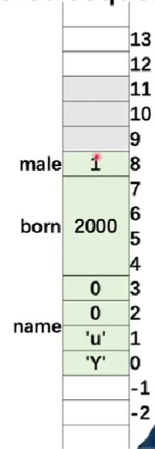

[toc]

## c++四维度

### c 语言的超集

顺序/分支/循环/预处理器/内置数据类型/数组/指针
皆来自 c.

### 面向对象

c with class

### template C++

C++泛型编程

### STL

包括容器/迭代器/算法及函数对象等。

## 现代 c++

### 资源和智能指针

C 编程的 bug 类型之一是内存泄漏。
泄露通常由未能为使用`new`分配的内存调用`delete`导致。

C++标准库提供了三种智能指针类型：
`std::unique_ptr`
`std::shared_ptr`
`std::weak_ptr`

可处理对其拥有的内存的分配和删除。

### std:: / 何时用？

是个名称空间标识符，C++标准库中函数或对象都是在命名空间 std 中定义的。

**当要调用 c++标准库时，要写上 std::
若使用非标准库文件如 iostream，不写**

**更简单方法**

```c++
using namespace std;
```

### std::string & std::string_view

### std::vector & 其他标准库容器

### 标准库算法

- `for_each`默认遍历算法
- `transform`用于对容器元素进行非就地修改
- `find_if`默认搜索算法
- `sort/lower_bound`和其他默认排序和搜索算法。

### 用 auto 替代显示类型名称

### 基于范围的 for loop

### 用 constexpr 表达式替代宏

### 统一初始化

### 移动语义

### lambda 表达式

### 异常

### std::atomic

### std::varient(C++17)

## 常用操作

### 小命令

```c
g++ init.cpp&& ./a.out
//&&代表前一个命令编译成功就执行后一个命令。

```


### 进制转换

## basic

### 历史

早期：打孔带

二进制指令

汇编语言
10110000 01100001
对应
MOVE AL

应用：操作系统的底层代码

C:1973
C++ : 1979

难点：内存管理

java:自动申请内存。不用去申请内存，手动申请和手动释放。有自己的内存管理机制。

write once , run anywhere !
not
"write once , compile anywhere"

c/c++可直接生成可执行程序

java 生成`*.class`文件，不是可执行文件。java 虚拟机去运行。

python 是脚本语言。
与其他语言区别：脚本语言不需要更严格的语法。

**development language of most fundamental compter systems**

- Linux
- MySQL
- OpenCV
- TensorFlow , PyTorch
  ...

**high efficiency**

- widely optimized compilers
- access memory directly
- excellent on computing

### compiler and link

```c++
#include <iostream>
using namespace std;

int mul(int a , int b){
    return a * b;
}
//函数mul

int main(){
    int a , b;
    int result;
    cout << "pick two integers";
    cin >> a;
    cin >> b;

    result = mul(a , b);

    cout << "the result is " << result << endl;
    return 0;

}
//主函数中调用mul函数

```

**一般把函数的声明放在头文件里。
`*.h ; *.hpp`
把函数的实现/定义放在源文件。
`*.c *.cpp`**


main.cpp


mul.hpp


mul.cpp


```c
g++ -c main.cpp
g++ -c mul.cpp
//编译
g++ main.o mul.o -o mul
//链接

./mul
//please pick two nums
//2 3
//6
```

### errors

**链接错误**

```c
#include "mul.cpp"

int Mul(int a , int b){
    return a * b;
}
//symbol not foudn
//Function mul() is misspelled to Mul()
//此时在main.cpp找不到链接mul()，因为大小写
```

**运行错误 runtime error**

```c
#include "mul.cpp"

int mul(int a , int b){
    int c = a / b;
    return a * b ;
}
//抛出异常
```

### 预处理 preprocessor


PI 不是一个变量，而是一个宏。

### 宏

理解：文字替换。
类似通过源代码的全文检索，进行全文替换。

### input & output

what is cout ?

```c
std::ostream cout;
```

- std 是一个命名空间（name space）。

```c
南方科技大学::黎明
深圳大学::黎明
```

**cin / cout**
c++风格的输入输出
operator

```c
cout << "hello" << endl
//endl 结束换行符
```

在 c 中：

```c
int v;
int ret = scanf("%d" , &v);
//&v取地址
```

————————分割线———————

### 为什么没有 GUI?

graphical user interface

- GUI is for human beings to interact with computers.
  not all programs interact with human beings.
  like DATABASE

---

**command line arguments**

```c
int main(int argc , char **argv){
    //argc 参数个数
    // **argv参数数组
}
```

**每个变量声明时必须初始化变量**

## interger numbers

**overflow**

```c
int a = 56789;
int b = 56789;
int c = a * b;
cout c << endl;
//the output is a negative number!
//-1069976775
```

_why?_

**运算时一定要了解数值的取值范围**

### different data type for integer

### char

8-bit integer

- signed char
- unsigned char
- char

```c
char.cpp
char c1 = 'C';
char c2 = 80;
char c3 = 0x50;
//3个变量表达一样
```

**Chinese characters?**

- char16
- char32

### bool

```c
bool b1 = true;
int i = b1;
bool b2 = -256;
//b1 = true;
//i = 1;
//b2 = 1 (非0 即1)
```

- 第一种 -老的类型定义#define

```c
typedef char bool;
#define true 1;
#define false 0;
```

- 第二种 - 引`<stdbool.h>`库

**size_t**库

**fixed with integer types**
(since c++11)

defined in `<cstdint>
int8_t
int32_t
uinit16_t
...

**使用宏**

### floating point

浮点数运算一直会带来微小误差。

处理误差 in range


```c
precision.cpp

float f1 = 2.34E+10f;
float f2 = f1 + 10;
//f1 - f2 = 0 (true)
```

原因：采样精度不够。
在取值范围内间隔采样。

**inf & nan**
无穷大和 not a number

## arithmetic operators

**constant number**

```c
84// decimal
0135//octal
0x4F//hexadeximal
```

十六进制对程序员友好。

整数

```c
54//int
43u//unsigned int
43l//long
43ul//unsigned long
43lu//unsigned long
```

浮点数

```c
3.43//3.43
3.2e23//3.2 x 10^23
```

**constant type qualifier 常数限定符**

必须在初始化时定义

```c
const float PI = 3.32f;
PI += 1;//ERROR!
```

**auto(在 C 语言中可以，在 c+中不建议做）**
不是数据类型，是一个 placeholder。

输入后自动变成相应类型

```c
auto c = 2 ; //type of a is int
auto be =  2.3 //type of be is double
```


**floating-point VS integers**

- double operations is slower than float
- lost precision

## if statement

### if & if-else

```c
if num  = 10;
if(num < 5){
    cout << "the number is less than 5" << endl;
}
if(num == 5){
    cout << "the num is 5" <<endl;
}
else
    cout << "the num is in range [4,10]" << endl;
```

**else 跟最近的 if 配对**

### ? : operator

```c
bool isPositive = true;
int factor = 0;
//some operations may change isPositive's value
factor = isPositive ? 1 : -1;
```

**condition**
what should be a condition?

```c
int num  = 10;
if(num < 5){
    cout << "the num is less than 5" <<endl;
}
```

**the condition should be a expression which is convertible to bool !**

- its value can be **bool/char/int/float**
- **关系表达式**
  

  **逻辑表达式**
  

  **precedence**
  ! > && > ||

不确定时，加括号（优先级最高）

- pointers are also frequently used as conditions

```c
int * p = new int[1024];
if(!p){
    cout << "memory allocation failed" <<endl;
}
```

### while loop

syntax:

```c
while(expression){
    //...
}
```

```c
size_t num = 2;
while (num >= 0){
    cout << num << endl;
    num--;
}
//2
//1
//0
//18446744073708458...
```

原因：size_t 是一个无符号数，当 num = 0 时再--会变成 range 内最大的数死循环。
写成 int ，问题解决。

```c
bool flag = true ;
int count = 0 ;
while(flag = true){
    cout << count++ <<endl;
    //and do sth
    if(count = 10)
    flag = false;
}
```

---

**注意 = & ==**

---

### for loop

- syntax

```c
for(init-clause;cond-expression;iteraion-expression)
{
    loop-statement;
}
```

## arrays

### arrays

```c
int num_arr1[5];
int num_arr2[5] = {0 , 1, 2, 3, 4};
//对数组进行了初始化
//未初始化可能会出现随机值
```

**arrays of unknown size**

```c
int num_arr[] = {1, 2, 3, 4};
//the number is not specified in the declaration

float arr_sum(float values[] , size_t length);
float arr_sum(float *values , size_t length);
//the arguments of a function

```

```c
int arr1[4] = {9，8，7，6};
int arr2[4] = {};
arr2 = arr1;//error
```


**再 c++中一般没有边界检查，越界了依然会操作且没有警告！**


**python 中`arr[-1]`是数组最后一个元素**

不进行边界检查：
优点-程序运行块，效率高
缺点-容易出错

### 多维数组 multidimensional arrays

```c++
int mat[2][3] = {{11, 22, 33},{44 , 55, 66}};

for(int r = 0; r < rows; r++){
    for(int c = 0; c < cols; c++){
        cout << mat[r][c] <<endl;
    }
}
```

- **arrays of unknown bound**

```c++
void init_2d_arr(float mat[][3],
size_t rows , size_t cols)
//correct

void init_2d_arr(float mat[][3],
size_t rows , size_t cols)
//error:没有指定多少列
```


如上图，如果没有指定列，则不知道第二列从哪开始访问。

### const arrays

```c++
const float PI = 3.14;
PI = 1.f + PI;//error
const float values[4] = {1.1f , 2.2f , 3.3f}
values[0] = 1.0f;//error
```

### 数组拷贝

可以通过循环遍历拷贝，也可使用标准库函数 memcpy()进行拷贝。

```c++
for(int i = 0; i < n; i++){
    b[i] = a[i];
}
//循环拷贝

memcpy(b , a , n * sizeof(int));
//使用memcpy()拷贝
```

**memcpy()**
第一个参数：目标数组的指针；
第二个参数：原数组的指针；
第三个参数：拷贝的字节数；

### array-style strings

**警惕数组越界**
**数组类型字符串后面必须加 0**

### 字符串 string literal


一共 5 个，字符串需要一个'0'作为一个结束标志。

可以使用`std::string`文本

```c++
using namespace std::string_literals;
```

**string manipulation and examination**

- copy

```c++
char * strcpy(char* dest , const cahr * src);
//safer
char * strncpy(char *dest , const char * src , size_t count);

```

### string class

string 类也没有越界检查。

- strcmp

- str

## structures , unions and emenurations 结构体，联合体，枚举类型

### struct

- a struct is a type consisting of a sequence of members.
- the members are allocated in an ordered sequence.

```c++
struct Student{
    char name[4];
    int born;
    bool male;
}

struct Student stu;
strcpy(stu.name , "yu");
stu.born = 2000;
stu.male = true;


```



**struct padding**
**结构体需要对齐！**


一般系统 4 个字对齐

### union

共享内存

the storage of members overlaps/shared:

```c
union ipv4address{
    std::uint32_t address32;
    std::uint8_t address8[4];

};

//sizeof(union ipv4address) is 4;
```

**互斥赋值**
在任意时刻，联合中只能有一个数据成员可以有值，当给联合中某个成员赋值之后，该联合中其他成员就编程未定义状态了。

**在 C++17 后，`std::variant`class 是 union 的一个类型安全替代项。**

所有成员都共享同一个内存位置。

### typedef

- can create an alias for a type
  创建一个类型的别名

- typedef struct
  定义 结构名。

```c++
typedef 结构名{

} 对象名;
```

- 为复杂的声明定义一个简单别名

```c++
typedef int myint;

typedef unsigned char vec3b[3];

myinit num = 32;

unsigned char color[3];
vec3b color = {255 , 255 , 255};
```

在一些系统头文件中经常见到。


## pointers

```c
int num = 10;
int * p1 = null,* p2 = null;
//declaration two pointers
p1 = &num;
//take the address of num , assign to p1
p2 = &num;
//take the address of num , assign to p2

*p1 = 20;
//assign 20 to num
*p2 = 30;
//assign 30 to num
```


### structure member accessing

- p-> member
- (\*p).member

```c
struct Student
{
    char name[4];
    int born;
    bool male;
};

Student stu = {"yu" , 2000 , true};
Student * pStu = &stu;
```


完整

```c
#include <iostream>
#include <cstring>
using namespace std;
struct Student
{
    char name[4];
    int born;
    bool male;
};
int main()
{
    Student stu = {"Yu", 2000, true};
    Student * pStu = &stu;
    cout << stu.name << " was born in " << stu.born
         << ". Gender: " << (stu.male ? "male" : "female") << endl;
    strncpy(pStu->name, "Li", 4);
    pStu->born = 2001;
    (*pStu).born = 2002;
    pStu->male = false;
    cout << stu.name << " was born in " << stu.born
         << ". Gender: " << (stu.male ? "male" : "female") << endl;
    printf("Address of stu: %p\n", pStu); //C style
    cout << "Address of stu: " << pStu << endl; //C++ style
    cout << "Address of stu: " << &stu << endl;
    cout << "Address of member name: " << &(pStu->name) << endl;
    cout << "Address of member born: " << &(pStu->born) << endl;
    cout << "Address of member male: " << &(pStu->male) << endl;
    cout << "sizeof(pStu) = " << sizeof(pStu) << endl;

    return 0;
}
```


### pointer-pointer


### constant pointers 常熟指针

```c++
int num = 1;
int another = 2;
//cannot change the value the p1 points to through p1
//指针本身地址不能修改，但是可以直接修改值修改
const int * p1 = &num;
* p1 = 3;//error
num = 3;//okey
```

### pointers and arrays

- use & operator to get the addresses of elements

```c++
#include <iostream>
using namespace std;
struct Student
{
    char name[4];
    int born;
    bool male;
};
int main()
{
    // Part One
    Student students[128];
    Student * p0 = &students[0];
    Student * p1 = &students[1];
    Student * p2 = &students[2];
    Student * p3 = &students[3];
    printf("p0 = %p\n", p0);
    printf("p1 = %p\n", p1);
    printf("p2 = %p\n", p2);
    printf("p3 = %p\n", p3);
    //the same behavior
    students[1].born = 2000;
    p1->born = 2000;
    // Part Two
    printf("&students = %p\n", &students);
    printf("students = %p\n", students);
    printf("&students[0] = %p\n", &students[0]);

    Student * p = students;
    p[0].born = 2000;
    p[1].born = 2001;
    p[2].born = 2002;
    printf("students[0].born = %d\n", students[0].born);
    printf("students[1].born = %d\n", students[1].born);
    printf("students[2].born = %d\n", students[2].born);
    return 0;
}

```


16 进制的每 6 个代表 128

### 数组指针和指针数组

**数组指针**
形式：

```c
int (*p)[3];

//p是一个指针，指向一个数组，数组内是3个整型数据
```

**指针数组**
形式：

```c
int *(p[3])
//p是一个数组，数组内有3个元素，每个元素都是指针，指向整型数组
```

### function-pointers

函数三要素：

- 返回值类型
- 函数名
- （函数的参数）

```c
void *func(void)
//返回值 函数名 参数
```

### 指针的代数操作 pointer arithmetic

```c
int nums[4] = {0, 1, 2, 3};
int * p = nums + 1;
//p此时是nums[1]地址，即偏倚了一个元素
p++
//p[2]地址，真实物理地址加8


```

### difference between a pointer and an array

数组是一个常量指针

```c++
int numbers[4] = {0, 1, 2, 3};
int * p = numbers;
cout << sizeof(numbers) << endl; //4*sizeof(int)
cout << sizeof(p) << endl; // 4 or 8
cout << sizeof(double * ) << endl; // 4 or 8
```

## allocate memory:C style

大部分情况下，指针指向的内存是动态存储的。


五段：

- code / text 只读
- data 初始化的静态变量
- bss 未初始化时放此地
- heap 动态申请内存放堆里
- stack 临时变量放栈里

malloc 最后一位要对齐

### memory allocation

再 c 语言中，用 size_t 表达一个最大的大小。

```c
void* malloc(size_t size)

//allocate 4 bytes and convert the pointer to (int*) explicity
int * p1 = (int*) malloc (4);
//申请4个字节转成整数类型的指针

int * p1 = (int*) malloc(3);
//会越界
```

释放内存

```c
void free(void * ptr);
```

**在 c 和 c++中申请的内存必须手动来释放，因为 c/c++中没有内存回收机制**

```c
p = (int*) malloc(4*sizeof(int));
//...
p = (itn*) malloc(8*sizeof(int));
//...
free(p);
```

此时第一个 p 内存回收不了了；

```c
for(int i = 0; i < 1024; i++){
    p = (int*) malloc(1024 * 1024 * 1024)
}
printf("end\n");

//在一些系统里会崩，但在windows里作为无效内存申请没有崩掉

```

## memory allocation-CPP

### operator new and new[]

`new[]`&`malloc()`都是用于动态分配内存的函数。

**和 malloc()区别：**

- new[] 是 c++中的运算符，malloc()是 c 中的运算符；
- new[] 会调用对象的构造函数，malloc()只是简单地分配内存，不会调用构造函数；
- new[] 可以自动计算所需的内存大小，malloc()需要手动指定所需的内存大小；
- new[] 返回的指针是类型安全的， malloc()返回的指针需进行强制类型转换；
- new[] 可以抛出异常，malloc()不能；

```cpp
//allocate an int , default initializer(do nothing)
int * p = new int ;

//allocate an  int  ,default initialized to 5
int * p = new int(5);

//allocate 16 int , the first 3 elements are initialized to 1, 2, 3, the rest 0
int *p = new int[16]{1,2,3}

//allocate a Student object , default initializer
Student * ps1 = new Student[16];

//allocate memory for 16 Student objects, the fist two are
Student * ps1 = new Student[16]{{"li" , 2000 ,1},{"yu" , 1888 , 0}};

```

### operator delete and delete[]

```cpp
delete ps1;
//释放析构函数

delete ps1;
//释放所有函数，应该常用此种
```

## memory leak

3 中情况：

- 指针重新赋值
- 错误的内存释放
- 返回值的不正确处理

### 指针重新赋值

```c
char * p = (char * ) malloc(10);
char * np = (char * ) malloc(10);

p = np;
```

上述 p 和 np 分别被分配了 10byte 内存。
当指针变量 p 被 np 重新赋值，p 以前所指向的内存位置变成了孤立的内存，无法释放。因为没有指向该位置的引用，导致 10byte 的内存泄漏。

### 错误的内存释放


当执行

```c
free(p);
```

则 np 指针因此变得无效。

\*\*每当释放结构化的元素，而该元素又包含指向动态分配的内存位置的指针时，应首先遍历子内存位置，并从那里释放，然后再遍历回父节点：

```c
free(n -> np);
free(p);
```

### 返回值的不正确处理

```c
char *f(){
    return (char*)malloc(10);
}

void f1(){
    f();
}

```

f1 中对 f()的调用未处理该内存位置的返回地址，结果将导致 f()分配的 10byte 的块丢失，并导致内存泄漏。

### how to avoid the memory leak?

## functions

**求出矩阵最大数**

```cpp
struct Matrix
{
    int rows;
    int cols;
    float * pData;
}

Matrix matA;
float maxa = FLT_MIN;
for(int r = 0;r < matA.rows; r++)
    for(int c = 0; c < matA.cols;c++){
        float val = matA.pData[r * matA.cols + c];
        maxa = (maxa > val ? maxa : val)
    }
```


### how are function called ?

- store the address the program returns after the function call
- store the registers
- store the local variables
- //do some work of the called functionn
- restore the registers
- restore the local variables

### 参数 parameters

- pass by value
- pass by reference

```c
int foo(int x){
    // x is a copy
    x += 10;
    return x;
}
int main(){
    int num1 = 20;
    int num2 = foo(num1);

    return 0;
}
```

```c
int foo(int * P){
    int num1 = 20;
    int * p = &num1;
    int num2 = foo(p);
    return 0;
}
```


### pass by reference

- reference are in C++,not in C
- a reference is an alias to an already-existing variable/object.

```cpp
int num  = 0;
int & num_ref = num;
//实际上是num的别名
```


### reference in C++

```cpp
struct Matrix
{
    int rows ;
    int cols;
    float * pData;
}

Matrix matA = {3,4};
matA.pData = new float[matA.rows * matA.cols]{};
Matrix & matA_ref = matA;
Matrix & pMatA = &matA;
```


**引用在声明时一定要初始化**

```cpp
int & num_ref;//error
```

**references are much safer**

### Return statement

**if we have a lot to return**

- such as a matrix addition function (A + B -> C)
- a suggested prototype :
  - to use reference to avoid data copying
  - to use const parameters to avoid the input data is modified
  - to use non-const reference parameters to receive the output

```cpp
bool matrix_add(const Matrix & matA , const Matrix & matB , Matrix & matC){
    //check the dimensions of the three matrices
    //re-create matC if needed
    //do: matC = matA + matB
    //return true if everything is right
}
```

### Inline functions

- 当一个函数被声明为 inline 时，编译器会尝试将该函数的代码直接插入到调用该函数的地方，而不是像普通函数那样在调用时跳转到函数代码所在的地址。这样可以减少函数调用的开销，提高程序的执行效率。
- 但是，inline 函数的定义必须放在头文件中，因为编译器需要在调用该函数的地方看到函数的定义才能将其插入到代码中。
- 同时，inline 函数的定义中不能包含任何循环、switch、递归等语句，否则编译器无法将其转换为内联代码。因此，inline 函数适合于简单的、频繁调用的函数，例如一些简单的数学运算函数。


若频繁调用，代价较高，优化策略：
**inline functions**

```cpp
int main(){
    int num1 = 20;
    int num2 = 3;
    int maxv = {
        if(num1 > num2){
            return num1;
        }
        else{
            return num2;
        }
    }
    maxv = {
        if(numn > maxv)
            return numn;
        else
            return maxv;
            }
}
```

**是空间换时间的典型**

### 默认参数 Default arguments

- a feature in C++
- to call a function without providing one or more trailing arguments.

**默认参数必须设在尾部**

### 函数承载 function overload

在同一个作用域内，定义多个同名函数，但他们的参数列表（包括参数个数/类型/顺序）不同。这样在调用这些同名函数时，编译器会根据实际传入的参数类型/个数/顺序来选择最匹配的函数进行调用。

```c
#include <iostream>

//定义两个同名的函数，但参数列表不同
void print(int num){
    std::cout << "the num is " << num << std::endl;
}

void print(std::string message){
    std::cout << "the message is " << message << endl;
}

int main(){
    print(10);//调用第一个函数
    print("hello");//调用第二个函数
    return 0;
}

```

### 函数模板 function templates

是 cpp 中一种泛型编程技术，允许定义一个通用的函数。

```cpp
template<typename T>
T sum(T x, T y){
    cout << "the input is" << typeid(T).name() << endl;
    return x + y;
}


//instantiates sum<double>(double, double)
template double sum<double>(double,double)

//instantiates sum<char>(char, char)
template char sum<char>(char , char)
```

**模板是虚的，一定要实例化**

### 函数模板显式和隐式实例化

**显式实例化**
在代码中直接声明需要实例化的模板类型，从而生成对应的函数实例。

```c
template void print<int>(int);
//显式实例化一个int 类型的print函数
```

**隐式实例化**
在代码调用函数模板时，编译器自动根据实际参数类型推导出需要实例化的模板类型，生成对应的函数实例。

```c
print(10);
```

- **显式实例化只能在全局作用域中进行，而不能在函数内部进行。**

- **显式实例化不会覆盖隐式实例化，即如果已存在一个隐式实例化函数，再进行显式实例化时，不会生成新的函数实例**

```cpp
temlate<typename T>
T sum(T x , T y){
    cout << "the input type is " << typeid(T).name() << endl;
    return x + y;
}
//此处还是the input type is d
//原因：
//函数模板除了可做显式实例化，还能做隐式实例化


//explicitly instantiate
template float sum<float>(float , float)

int main(){
    auto val = sum(4.1 , 5.4)
    cout << val << endl;
    return 0;
}
```

### 函数指针 function pointers

- `norm_ptr`is a pointers , a function pointer;
- the function should have two float parameters , and returns float .

```cpp
float norm_l1(float x , float y);
float nrom_l2(float x , float y);
flaot (*norm_ptr)(float x , float y);
norm_ptr = norm_l1;

norm_ptr = &norm_l2;


```

---

---

## 递归函数 Recursive functions

a simple examle

```cpp
int main(){
    div2(1024.);//call the recursive function
    return 0;
}

```

---

---

## Intel vs ARM

计算机处理器领域 intel nvidia arm 三足鼎立
intel 传统 CPU 领域
NVIDIA GPU 深度学习
ARM 低功耗电子产品（树莓派）

---

---

## speed up your program

simple is beautiful!

---

---

## 避免内存拷贝 avoid memory copy

whats an image?


再 openCV 中

```c
class CV_EXPORTS Mat
{
    public:
    //一些成员变量
    int rows, cols;
    //pointer to data
    uchar * data;
    //size_t step.p
    MatStep step;
}
```


### ROI region of interest


---

---

## Classes and Objects


- 成员函数可以放在类的声明里面

- 可以把成员函数的声明放在类的声明里，定义放在函数体的外面。
  

建议简单函数/适合 inline 函数放在类的内部，打印操作等复杂函数放在类的外部。

**用尖括号`<>`则从编译器指定 include 路径找，用双引号`""`则不仅从编译器找，还从当前目录下找。**

### **构造函数 constructors**

对比：c 结构体再分配内存时就是分配内存，
c++创建对象时，分配内存和调用 constructor。

**对象函数作用**

- 对对象里面的数据进行初始化；

**构造函数**

- 函数名字 跟类名完全一样且没有返回值；
-

```cpp
class Student {
    private:
    //...
    public:
    Student(){
        name[0] = 0;
        born = 0 ;
        male  = false;
    }
    Student(const char * initName , int initBorn , bool isMale){
        setName(initName);
        born = initBorn;
        male = isMale;
    }
}
```

### **析构函数**

是一个成员函数，在**对象超出范围或通过调用`delete`显示销毁对象**时，会自动调用析构函数。

析构函数具有和类相同的名称

当对象的生命期 结束时，会自动执行析构函数。

无返回类型

## this_pointer


```c
class Person{
    public:
        void setName(string name){
            this->name = name;
        }
        void setAge(int age){
            this->age = age;
        }
        void printInfo(){
            cout << "Name" << this->name <<endl;
            cout << "Age" << this->age <<endl;
        }
    private:
        string name;
        int age;
}

int main(){
    Person p;
    p.setName("Alice");
    p.setAge(20);
    p.printInfo();
    return 0;
}
```

**为了避免和局部变量名冲突，建议在成员函数中始终使用 this 指针来引用成员变量**

---

---

## const & static variables

### const

表示常量：

- **使用宏**

```c
#define VALUE 100
```

- **C++中不推荐使用宏，使用 const**

```c
const int value = 100;
//初始化值未100，不能修改

const int * p_int;
int const * P_int;
//指针指向内容不能被修改

const * int p_int;
//指针里面内容能修改，但指针地址不能被修改
```

### 静态变量

在程序运行期间只初始化一次的变量，存储在静态区域。

- **可在函数内部或类中声明静态变量。**

```c
void myFunction(){
    static int count = 0;
    count++;
    cout << "count:" <<count <<endl;
}
```

- **在 类中声明静态变量**
  **如下程序 obj1, obj2 都输出 2.因为 count 变量是静态变量。**

```c
class MyClass{
    public:
        static int count;
}

int MyClass::count  = 0;
//静态变量的初始化

int main(){
    MyClass obj1 , obj2;
    obj1.count++;
    obj2.count++;
    cout << "count" << obj1.count << endl;//output 2
    cout << "count" << obj2.count << endl;
    //output 2
    return 0;
}

```

### 静态函数

静态函数是不属于任何对象的函数，可以直接通过类名来调用。静态函数不能访问非静态成员变量和非静态成员函数，但可以访问静态成员变量和静态成员函数。。

```cpp
class MyClass{
    public:
        static void myStaticFunction(){
            cout << "this is a static function" << endl;
        }
};

MyClass::myStaticFunction();
//调用静态函数
```

### 静态类成员

属于整个类，而不属于类的任何一个对象，存储在静态存储区域内，只被初始化一次。

```cpp
class MyClass{
    public:
        static int count;
};

int MyClass::count = 0; //静态成员初始化
```

**可以通过类名或对象名来访问静态类成员**

```cpp
MyClass::count = 10;//使用类名访问

MyClass obj;
obj.count = 20;//使用对象名访问
```

**静态类成员可以被继承和覆盖，但不能被声明为虚函数**

---

---

## C++中的运算符承载

### operators for cv:Mat

**Function overloading**
在同一个作用域内，可定义多个同名函数，但这些函数参数类型/参数个数和参数顺序不同。
当带哦用这些同名函数时， 编译器会根据实参的类型/个数和顺序来选择调用哪个参数。

```cpp
Mat A , B;
float a , b;
//...

Mat add(Mat& A , Mat& B);
Mat add(Mat& A , float b);
Mat mul(Mat& A , float b;

Mat C = A + B;
Mat D = A + b;
//函数承载
```

```cpp
#include <iostream>
#include <opencv2/opencv.hpp>

using namespace std;

int main(){
    float a[6] = {1.0f , 1.0f , 1.0f , 2.0f , 2.0f , 2.0f};
    float b[6] = {1.0f , 2.0f , 3.0f , 4.0f , 5.0f , 6.0f};
    cv::Mat A(2, 3, CV_32FC1 , a);
    cv::Mat B(3 , 2, CV_32FC1 , b);

    cv::Mat C = A * B;

    cout << "Matrix C=" << C << endl;
    return 0;

}

//Matrix C = [9 , 12;
              18, 24]
```

### operator overloading

### friend functions

### 类型转换 user-defined type conversion

### increment & decrement operators

## some Default Operations

## An example with Dynamic Memory
