[toc]

## c++四维度

### c 语言的超集

顺序/分支/循环/预处理器/内置数据类型/数组/指针
皆来自 c.

### 面向对象

c with class

### template C++

C++泛型编程

### STL

包括容器/迭代器/算法及函数对象等。

## 现代 c++

### 资源和智能指针

C 编程的 bug 类型之一是内存泄漏。
泄露通常由未能为使用 `new`分配的内存调用 `delete`导致。

C++标准库提供了三种智能指针类型：
`std::unique_ptr`
`std::shared_ptr`
`std::weak_ptr`

可处理对其拥有的内存的分配和删除。

### std:: / 何时用？

是个名称空间标识符，C++标准库中函数或对象都是在命名空间 std 中定义的。

**当要调用 c++标准库时，要写上 std::
若使用非标准库文件如 iostream，不写**

**更简单方法**

```c++
using namespace std;
```

### c++标准库

是类库和函数的集合

分为**标准库函数**和**面向对象类库**
标准库函数--I/O 、 字符串和字符处理 、 数学 、 日期和本地化 、 动态分配 、其他 、宽字符函数

面向对象类库--标准 C++I/O 类 、 String 类 、 数值类 、 STL 容器类 、STL 算法 、 STL 函数对象 、 STL 迭代器 、 STL 分配器 、 本地化库 、 异常处理类 、 杂项支持库。

### std::string & std::string_view

### std::vector & 其他标准库容器

### 标准库算法

- `for_each`默认遍历算法
- `transform`用于对容器元素进行非就地修改
- `find_if`默认搜索算法
- `sort/lower_bound`和其他默认排序和搜索算法。

### 用 auto 替代显示类型名称

### 基于范围的 for loop

### 用 constexpr 表达式替代宏

### 统一初始化

### 移动语义

### lambda 表达式

### 异常

### std::atomic

### std::varient(C++17)

## 常用操作

### 小命令

```c
g++ init.cpp&& ./a.out
//&&代表前一个命令编译成功就执行后一个命令。

```


### 进制转换

## basic

### 历史

早期：打孔带

二进制指令

汇编语言
10110000 01100001
对应
MOVE AL

应用：操作系统的底层代码

C:1973
C++ : 1979

难点：内存管理

java:自动申请内存。不用去申请内存，手动申请和手动释放。有自己的内存管理机制。

write once , run anywhere !
not
"write once , compile anywhere"

c/c++可直接生成可执行程序

java 生成 `*.class`文件，不是可执行文件。java 虚拟机去运行。

python 是脚本语言。
与其他语言区别：脚本语言不需要更严格的语法。

**development language of most fundamental compter systems**

- Linux
- MySQL
- OpenCV
- TensorFlow , PyTorch
  ...

**high efficiency**

- widely optimized compilers
- access memory directly
- excellent on computing

### compiler and link

```c++
#include <iostream>
using namespace std;

int mul(int a , int b){
    return a * b;
}
//函数mul

int main(){
    int a , b;
    int result;
    cout << "pick two integers";
    cin >> a;
    cin >> b;

    result = mul(a , b);

    cout << "the result is " << result << endl;
    return 0;

}
//主函数中调用mul函数

```

### 头文件 / 源文件

一个头文件一般包含类、子程序、变量和其他标识符的前置声明。需要在一个以上源文件中被声明的标识符可以被放在一个头文件中，并在需要的地方包含这个头文件。

`#include`**文件包含命令**，用来引入对应的头文件。

**常用头文件**：

```c
#include <assert.h>    //设定插入点
#include <ctype.h>     //字符处理
#include <errno.h>     //定义错误码
#include <float.h>     //浮点数处理
#include <fstream.h>    //文件输入／输出
#include <iomanip.h>    //参数化输入／输出
#include <iostream.h>   //数据流输入／输出
#include <limits.h>    //定义各种数据类型最值常量
#include <locale.h>    //定义本地化函数
#include <math.h>     //定义数学函数
#include <stdio.h>     //定义输入／输出函数
#include <stdlib.h>    //定义杂项函数及内存分配函数
#include <string.h>    //字符串处理
#include <strstrea.h>   //基于数组的输入／输出
#include <time.h>     //定义关于时间的函数
#include <wchar.h>     //宽字符处理及输入／输出
#include <wctype.h>    //宽字符分类
```

### 两种使用头文件的方式-<> / ""

```c++
# include <code.h>
//编译器在系统路径下查找头文件
# include "code.h"
////编译器首先在当前目录下查找头文件，若没找到，在系统路径下查找
```


### hpp / cpp

**一般把函数的声明放在头文件里。
`*.h ; *.hpp`
把函数的实现/定义放在源文件。
`*.c *.cpp`**


main.cpp


mul.hpp


mul.cpp


```c
g++ -c main.cpp
g++ -c mul.cpp
//编译
g++ main.o mul.o -o mul
//链接

./mul
//please pick two nums
//2 3
//6
```

### 字 / 字节 / 字长 / 位数

1Byte = 8bit

字：CPU 一次能处理的数据
字长：CPU 一次能处理的二进制的位数

### errors

**链接错误**

```c
#include "mul.cpp"

int Mul(int a , int b){
    return a * b;
}
//symbol not foudn
//Function mul() is misspelled to Mul()
//此时在main.cpp找不到链接mul()，因为大小写
```

**运行错误 runtime error**

```c
#include "mul.cpp"

int mul(int a , int b){
    int c = a / b;
    return a * b ;
}
//抛出异常
```

### 预处理 preprocessor


PI 不是一个变量，而是一个宏。

### 宏

理解：文字替换。
类似通过源代码的全文检索，进行全文替换。

### input & output

what is cout ?

```c
std::ostream cout;
```

- std 是一个命名空间（name space）。

```c
南方科技大学::黎明
深圳大学::黎明
```

**cin / cout**
c++风格的输入输出
operator

```c
cout << "hello" << endl
//endl 结束换行符
```

在 c 中：

```c
int v;
int ret = scanf("%d" , &v);
//&v取地址
```


————————分割线———————

### 为什么没有 GUI?

graphical user interface

- GUI is for human beings to interact with computers.
  not all programs interact with human beings.
  like DATABASE

---

**command line arguments**

```c
int main(int argc , char **argv){
    //argc 参数个数
    // **argv参数数组
}
```

**每个变量声明时必须初始化变量**

## 变量

### 初始化和赋值

初始化不是赋值。
初始化是创建变量时赋予其一个初始值。
赋值时把对象的当前值擦除，以一个新值替代。

### 分离式编程 seperate compilation

将声明和定义区分开来。

declaration

definition 定义--申请存储空间。

### 常量-const

**extern**
想声明而非定义一个变量：

### 外部变量修饰-extern

**作用**提示编译器遇到此变量和函数时在其他模块中寻找其定义。

**如何调用？**

- 将变量或函数定义在头文件中；
- 通过 `extern`调用，此时变量或函数声明在其他源文件中；

```c
extern int i;
extern void func();
//必须加上修饰符类型
```

### 作用域 / 生命周期

作用域：
global variable
local variable

### static- 静态变量

指在程序运行期间只分配一次内存空间，不会随着函数活对象的调用创建或销毁，而是在全局数据区分配内存。

- **在函数内部使用，只能被初始化一次，即使函数被多次调用，也不会重新初始化变量。**

```cpp
#include <iostream>

void foo(){
    static int count = 0;
    count++;
    std::cout << count << endl;
}

int main(){
    foo();
    // 1
    foo();
    // 2
    foo();
    // 3
}
```

- **在类内部使用，被所有对象共享，存储在静态数据区中，可通过类名和作用域解析运算符访问。**

```cpp
#include <iostream>

class MyClass {
public:
    static int count;
};

int MyClass::count = 0;

int main() {
    MyClass obj1;
    MyClass obj2;
    obj1.count++;
    obj2.count++;
    std::cout << "Count: " << obj1.count << std::endl;  // 输出：Count: 2
    std::cout << "Count: " << obj2.count << std::endl;  // 输出：Count: 2
    return 0;
}
```

- **在文件内部使用时，在文件内部定义的静态变量对整个文件是可见的，但在其他文件中无法访问。**

```cpp
// file1.cpp
#include <iostream>
static int count  = 0;

void foo(){
    count++;
    std::cout << count << std::endl;
}

// file2.cpp
extern void foo();

int main(){
    foo();
    // 1

}

```

用 static 修饰变量或函数时：

- 局部静态变量
- 外部静态变量/函数
- 类内静态数据成员/成员函数（只有 c++中有）

**变量只能被定义 一次，但能被多次声明**

## interger numbers

### 原码 / 反码 / 补码

- 原码——符号位加上真值的绝对值
  
- 反码
  
- 补码
  

**为何用原码补码反码？**
让计算机底层设计更简单


### 含有无符号数的表达式


解决方法：用 while 语句替代 for 语句。

区别：可以先执行条件判断。

### 溢出

**overflow**

```c
int a = 56789;
int b = 56789;
int c = a * b;
cout c << endl;
//the output is a negative number!
//-1069976775
```

_why?_

### 数据类型及范围

**运算时一定要了解数值的取值范围**


### different data type for integer

### char

8-bit integer

- signed char
- unsigned char
- char

```c
char.cpp
char c1 = 'C';
char c2 = 80;
char c3 = 0x50;
//3个变量表达一样
```

**Chinese characters?**

- char16
- char32

### bool

```c
bool b1 = true;
int i = b1;
bool b2 = -256;
//b1 = true;
//i = 1;
//b2 = 1 (非0 即1)
```

- 第一种 -老的类型定义#define

```c
typedef char bool;
#define true 1;
#define false 0;
```

- 第二种 - 引 `<stdbool.h>`库

**size_t**库

**fixed with integer types**
(since c++11)

defined in ```<cstdint>``
int8_t
int32_t
uinit16_t
...

**使用宏**

### floating point

浮点数运算一直会带来微小误差。

处理误差 in range


```c
precision.cpp

float f1 = 2.34E+10f;
float f2 = f1 + 10;
//f1 - f2 = 0 (true)
```

原因：采样精度不够。
在取值范围内间隔采样。

**inf & nan**
无穷大和 not a number

**-2.15 整数部分 / 小数部分**
整数部分：-3
小数部分 0.85


整数部分 1 是固定的所以隐藏不写

### 浮点数 float / double 运算精度丢失问题


## arithmetic operators

**constant number**

```c
84// decimal
0135//octal
0x4F//hexadeximal
```

十六进制对程序员友好。

整数

```c
54//int
43u//unsigned int
43l//long
43ul//unsigned long
43lu//unsigned long
```

浮点数

```c
3.43//3.43
3.2e23//3.2 x 10^23
```

**constant type qualifier 常数限定符**

必须在初始化时定义

```c
const float PI = 3.32f;
PI += 1;//ERROR!
```

**auto(在 C 语言中可以，在 c+中不建议做）**
不是数据类型，是一个 placeholder。

输入后自动变成相应类型

```c
auto c = 2 ; //type of a is int
auto be =  2.3 //type of be is double
```


**floating-point VS integers**

- double operations is slower than float
- lost precision

### 自增 ++a / a++


## if statement

### if & if-else

```c
if num  = 10;
if(num < 5){
    cout << "the number is less than 5" << endl;
}
if(num == 5){
    cout << "the num is 5" <<endl;
}
else
    cout << "the num is in range [4,10]" << endl;
```

**else 跟最近的 if 配对**

### ? : operator

```c
bool isPositive = true;
int factor = 0;
//some operations may change isPositive's value
factor = isPositive ? 1 : -1;
```

**condition**
what should be a condition?

```c
int num  = 10;
if(num < 5){
    cout << "the num is less than 5" <<endl;
}
```

**the condition should be a expression which is convertible to bool !**

- its value can be **bool/char/int/float**
- **关系表达式**
  

  **逻辑表达式**
  

  **precedence**
  ! > && > ||

不确定时，加括号（优先级最高）

- pointers are also frequently used as conditions

```c
int * p = new int[1024];
if(!p){
    cout << "memory allocation failed" <<endl;
}
```

### while loop

syntax:

```c
while(expression){
    //...
}
```

```c
size_t num = 2;
while (num >= 0){
    cout << num << endl;
    num--;
}
//2
//1
//0
//18446744073708458...
```

原因：size_t 是一个无符号数，当 num = 0 时再--会变成 range 内最大的数死循环。
写成 int ，问题解决。

```c
bool flag = true ;
int count = 0 ;
while(flag = true){
    cout << count++ <<endl;
    //and do sth
    if(count = 10)
    flag = false;
}
```

---

**注意 = & ==**

---

### for loop

- syntax

```c
for(init-clause;cond-expression;iteraion-expression)
{
    loop-statement;
}
```

## arrays

### arrays

```c
int num_arr1[5];
int num_arr2[5] = {0 , 1, 2, 3, 4};
//对数组进行了初始化
//未初始化可能会出现随机值
```

**arrays of unknown size**

```c
int num_arr[] = {1, 2, 3, 4};
//the number is not specified in the declaration

float arr_sum(float values[] , size_t length);
float arr_sum(float *values , size_t length);
//the arguments of a function

```

```c
int arr1[4] = {9，8，7，6};
int arr2[4] = {};
arr2 = arr1;//error
```


**再 c++中一般没有边界检查，越界了依然会操作且没有警告！**


**python 中 `arr[-1]`是数组最后一个元素**

不进行边界检查：
优点-程序运行块，效率高
缺点-容易出错

### 多维数组 multidimensional arrays

```c++
int mat[2][3] = {{11, 22, 33},{44 , 55, 66}};

for(int r = 0; r < rows; r++){
    for(int c = 0; c < cols; c++){
        cout << mat[r][c] <<endl;
    }
}
```

- **arrays of unknown bound**

```c++
void init_2d_arr(float mat[][3],
size_t rows , size_t cols)
//correct

void init_2d_arr(float mat[][3],
size_t rows , size_t cols)
//error:没有指定多少列
```


如上图，如果没有指定列，则不知道第二列从哪开始访问。

### const arrays

```c++
const float PI = 3.14;
PI = 1.f + PI;//error
const float values[4] = {1.1f , 2.2f , 3.3f}
values[0] = 1.0f;//error
```

### 数组拷贝

可以通过循环遍历拷贝，也可使用标准库函数 memcpy()进行拷贝。

```c++
for(int i = 0; i < n; i++){
    b[i] = a[i];
}
//循环拷贝

memcpy(b , a , n * sizeof(int));
//使用memcpy()拷贝
```

**memcpy()**
第一个参数：目标数组的指针；
第二个参数：原数组的指针；
第三个参数：拷贝的字节数；

### array-style strings

**警惕数组越界**
**数组类型字符串后面必须加 0**

### 字符串 string literal


一共 5 个，字符串需要一个'0'作为一个结束标志。

可以使用 `std::string`文本

```c++
using namespace std::string_literals;
```

字符串常用处理函数：

- strlen()
- strcpy()
- strcmp
- strcat() --将一个字符串追加到另一个字符串末尾。

**string manipulation and examination**

- copy

```c++
char * strcpy(char* dest , const cahr * src);
//safer
char * strncpy(char *dest , const char * src , size_t count);

```

### 字符和字符串

字符类型是 char, 字符串类型是 char / string.

```cpp
// 字符
char ch = 'a';

// 字符串,注意char 和 string 区别
string str = 'hello';
char str[] = 'hello1';
```

### string class

string 类也没有越界检查。

- strcmp
- str

### 案例-字符串分割成数组

## 复合类型

复合类型 compound type 指基于其他类型定义的类型。

- 结构体
- 联合体
- 类
- 枚举
- 引用
- 指针

## structures , unions and emenurations 结构体，联合体，枚举类型

### 枚举-enumeration

```cpp
enum Color{
    RED, //值为1
    GREEN, // 值为2
    BLUE //值为3
}
```

## 结构体-struct

- a struct is a type consisting of a sequence of members.
- the members are allocated in an ordered sequence.

```c++
struct Student{
    char name[4];
    int born;
    bool male;
}

struct Student stu;
strcpy(stu.name , "yu");
stu.born = 2000;
stu.male = true;

```

### 结构体数组

```c++

struct Student{
    string name;
    int age;
    int score;
};

//创建结构体数组
struct Student stu[3] = {
    {"张三" , 32 , 100},
    {"里斯" , 34 , 89},
    {"王五" , 32 , 98}
};
//给结构体元素赋值
stu[2].name = "里忒";

//遍历结构体数组
for(int i = 0; i < 3; i++){
    cout << "姓名" < stu[i].name <<endl;
}
```

### 结构体指针

```c++
struct Student* p = &stu;
//struct 也可以不写
Student* p = &stu;

//访问
p->name;
(*p).name
```

### 嵌套结构体


### 结构体内存分配

结构体对齐！--struct padding !
寻找能被整除的位置然后填充。


所以上结构体需要占用 40 个字节。


一般系统 4 个字对齐

### 字节对齐

32 位系统默认 4 字节对齐。
（寻址空间：4 个字节）

### 结构体变量 / 数组 / 指针 作为函数参数调用

结构体数组和结构体指针作为参数传递时可以直接修改原始的值；结构体变量作为函数参数传递时，修改不会影响原始的值。

```c
struct stu{
    long int num;
    float socre;
}
```

- **结构体作为函数的参数，修改之后的成员值不能返回到主调函数**

```c++
void func(struct stu t){
    t.num = 2002;
    t.score = 81.0;
}
```

- **结构体数组作为函数的参数，修改后的成员值能返回到主调函数**

```c++
void func(struct stu t[]){
    t[0].num = 323440;
    t[0].score = 23.0;
    t[1].num = 3324332;
    t[1].score = 34.0;
}
```

- **结构体指针变量作为函数的参数，修改后的结构体成员的值能返回到主调函数**
  将函数中的形参改为指针，可以减少内存空间（4 或 8 个字节），而且不会像值传递一样复制新的副本出来；

```c++
void func(struct* t){
    t->num = 23423;
    (*t).score = 23.0;
}
```

### 结构体中 const

加入 const 后，一旦又修改的操作就会报错，可以防止误操作。

```c++
void func(const struct* t){
    t->num = 23423;
    (*t).score = 23.0;
}
```

### 访问结构体成员-structure member accessing

- p-> member
- (\*p).member

```c
struct Student
{
    char name[4];
    int born;
    bool male;
};

Student stu = {"yu" , 2000 , true};
Student * pStu = &stu;
```


完整

```c
#include <iostream>
#include <cstring>
using namespace std;
struct Student
{
    char name[4];
    int born;
    bool male;
};
int main()
{
    Student stu = {"Yu", 2000, true};
    Student * pStu = &stu;
    cout << stu.name << " was born in " << stu.born
         << ". Gender: " << (stu.male ? "male" : "female") << endl;
    strncpy(pStu->name, "Li", 4);
    pStu->born = 2001;
    (*pStu).born = 2002;
    pStu->male = false;
    cout << stu.name << " was born in " << stu.born
         << ". Gender: " << (stu.male ? "male" : "female") << endl;
    printf("Address of stu: %p\n", pStu); //C style
    cout << "Address of stu: " << pStu << endl; //C++ style
    cout << "Address of stu: " << &stu << endl;
    cout << "Address of member name: " << &(pStu->name) << endl;
    cout << "Address of member born: " << &(pStu->born) << endl;
    cout << "Address of member male: " << &(pStu->male) << endl;
    cout << "sizeof(pStu) = " << sizeof(pStu) << endl;

    return 0;
}
```


### typedef

- can create an alias for a type
  创建一个类型的别名
- typedef struct
  定义 结构名。

```c++
typedef 结构名{

} 对象名;
```

- 为复杂的声明定义一个简单别名

```c++
typedef int myint;

typedef unsigned char vec3b[3];

myinit num = 32;

unsigned char color[3];
vec3b color = {255 , 255 , 255};
```

在一些系统头文件中经常见到。


## 指针-pointers

利用解引用符来访问对象：

```c
int ival = 43;
int* p = &ival;

cout << *p;  //43
```


'
如上图中目标'

此时若指针指向的 client.exe 改变位置，快捷方式仍能打开；
即：
**指针指向的内容，内容可以改变，但指针不会变**


```c
int num = 10;
int * p1 = null,* p2 = null;
//declaration two pointers
p1 = #
//take the address of num , assign to p1
p2 = #
//take the address of num , assign to p2

*p1 = 20;
//assign 20 to num
*p2 = 30;
//assign 30 to num
```


### 空指针——NULL pointer

### 野指针


### 指向指针的指针-pointer-pointer（套娃）


### 常数指针-constant pointer


```c++
int num = 1;
int another = 2;
//cannot change the value the p1 points to through p1
//指针本身地址不能修改，但是可以直接修改值修改
const int * p1 = #
* p1 = 3;//error
num = 3;//okey
```

**指针常量 / 常量指针**

```c++
// 指针常量
int main() {
    int num = 10;
    int* const p = # // p是一个指向int类型的指针常量，指向num
    *p = 20; // 可以通过p修改指向的int类型的值
    // p = nullptr; // 错误，指针常量的值不可变

    return 0;
}

// 常量指针
int main() {
    int num = 10;
    const int* p = # // p是一个指向int类型的常量指针，指向num
    // *p = 20; // 错误，常量指针所指向的内容不可变
    p = nullptr; // 可以改变p的值，指向其他int类型的变量

    return 0;
}
```

**建议**


### 指针和数组-pointers and arrays

- use & operator to get the addresses of elements


//**保存地址的时候可以不用写&符,此时保存数组首个元素地址**

```c++
#include <iostream>
using namespace std;
struct Student
{
    char name[4];
    int born;
    bool male;
};
int main()
{
    // Part One
    Student students[128];
    Student * p0 = &students[0];
    Student * p1 = &students[1];
    Student * p2 = &students[2];
    Student * p3 = &students[3];
    printf("p0 = %p\n", p0);
    printf("p1 = %p\n", p1);
    printf("p2 = %p\n", p2);
    printf("p3 = %p\n", p3);
    //the same behavior
    students[1].born = 2000;
    p1->born = 2000;
    // Part Two
    printf("&students = %p\n", &students);
    printf("students = %p\n", students);
    printf("&students[0] = %p\n", &students[0]);

    Student * p = &students;
    p[0].born = 2000;
    p[1].born = 2001;
    p[2].born = 2002;
    printf("students[0].born = %d\n", students[0].born);
    printf("students[1].born = %d\n", students[1].born);
    printf("students[2].born = %d\n", students[2].born);
    return 0;
}

```


16 进制的每 6 个代表 128

### 数组指针和指针数组

**数组指针：数组的指针
指针指向数组**

**指针数组：
指针组成的数组**

**数组指针**
形式：

```c
int (*p)[3];

//p是一个指针，指向一个数组，数组内是3个整型数据
```

**指针数组**
形式：

```c
int *(p[3])
//p是一个数组，数组内有3个元素，每个元素都是指针，指向整型数组
```

### 函数指针-function-pointers

和普通函数区别：可以动态的确定要调用的函数，而普通函数是静态确定的。
（普通函数是在编译时确定的，函数名直接代表函数的入口地址。在程序执行时，调用普通函数时，编译器会将函数名替换为函数的入口地址，这是静态确定的过程。

而函数指针允许在运行时动态地确定要调用的函数。通过函数指针，我们可以根据需要在运行时指定要调用的函数，从而实现动态调用的功能。）

**函数指针：
函数的指针--定义一个指向函数的指针变量**

```c
int (*p)(int x , int y);
//参数名可以去掉，且通常都去掉，以此p可以保存函数类型为两个整形参数，返回值是整形的函数地址了

int (*p)(int , int);
```

例：


上：
函数名保存了内存地址，也存储了函数开始执行的位置

函数三要素：

- 返回值类型
- 函数名
- （函数的参数）

```c
void *func(void)
/函数名 参数
```

### 多级指针--（套娃）

### 指针的代数操作 pointer arithmetic

```c
int nums[4] = {0, 1, 2, 3};
int * p = nums + 1;
//p此时是nums[1]地址，即偏倚了一个元素
p++
//p[2]地址，真实物理地址加8
```

### 回调函数-函数指针常见用途

**引言**
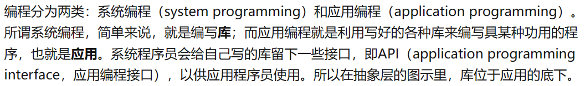

**应用场合**

- 事件驱动编程
- 异步编程
- 定时器
- 自定义排序
- 遍历
- 线程或任务回调
- 中间件或狗子
- 错误处理
- 数据库查询
- 动画渲染或游戏事件发生

### 指针和数组区别-difference between a pointer and an array

数组是一个常量指针，数组名代表数组的首地址。

```c++
int numbers[4] = {0, 1, 2, 3};
int * p = numbers;
cout << sizeof(numbers) << endl; //4*sizeof(int)：16
cout << sizeof(p) << endl; // 4 or 8：32位电脑4，64位电脑8;
cout << sizeof(double * ) << endl; // 4 or 8
```

sizeof


## 分配内存—C 风格-allocate memory:C style

过去内存分配：


常见内存分布图：
**图 1：**


- 栈：系统自动分配的空间。向下增长。(const 在栈里)
- 堆：使用动态内存分配的方式可以申请堆空间，用完需要手动释放。
- 全局区：全局变量、静态变量。
- 常量区（数字、字符等常量）。
- 代码区：存放可执行代码，避免频繁读盘。

大部分情况下，指针指向的内存是动态存储的。

**当内存开辟空间时，内存分配从高位到地位**

**当往内存存储数据，从低位往高位存储**

**图 2：**


五段：

- code / text 只读
- data 初始化的静态变量
- bss 未初始化时放此地
- heap 动态申请内存放堆里
- stack 临时变量放栈里

### malloc()

**工作机制**
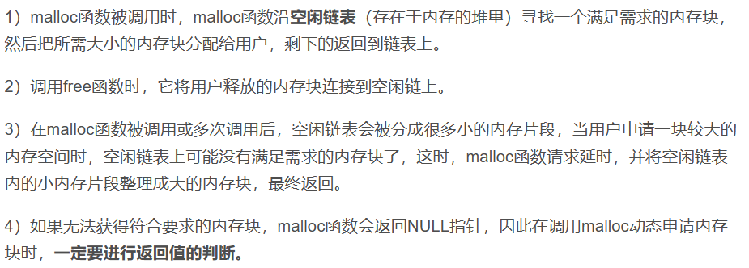

malloc 最后一位要对齐


临时变量栈中分配地址越来越小，
动态分配堆中分配地址越来越大。

（要申请大内存时，用堆存储）

### memory allocation

再 c 语言中，用 size_t 表达**C 中任何对象所能达到的最大长度。它是无符号整数**

```c
void* malloc(size_t size)

//allocate 4 bytes and convert the pointer to (int*) explicity
int * p1 = (int*) malloc (4);
//申请4个字节转成整数类型的指针

int * p1 = (int*) malloc(3);
//会越界
```

释放内存

```c
void free(void * ptr);
```

**注:释放的是指针指向的内存空间而不是指针本身，释放后指针仍存在，可以被赋值**：

```c
int* p = (int*)malloc(sizeof(int));

free(p);

int a = 10;
p = &a; //指针仍然存在且可以被赋值
```

**在 c 和 c++中申请的内存必须手动来释放，因为 c/c++中没有内存回收机制**

```c
p = (int*) malloc(4*sizeof(int));
//...
p = (itn*) malloc(8*sizeof(int));
//...
free(p);
```

此时第一个 p 内存回收不了了；

```c
for(int i = 0; i < 1024; i++){
    p = (int*) malloc(1024 * 1024 * 1024)
}
printf("end\n");
//此时需要有1TB内存程序才不会崩
//在一些系统里会崩，但在windows里作为无效内存申请没有崩掉

```

## 内存分配—CPP-memory allocation-CPP

**动态管理：malloc / calloc / realloc / free**

### 计算机操作系统内存管理机制：栈内存和堆内存。

**stack memory**
函数调用的时候，局部变量被分配在栈上。当函数返回的时候，局部变量全部销毁释放。

```cpp
int number;
// 4 bytes

int arr[4];
//编译的时候就确定式4个长度，式自动管理的机制
```

### new


### delete

释放指针 p 指向的内存，p 必须是 new 操作的返回值


### operator new and new[]

`new[]`&`malloc()`都是用于动态分配内存的函数。

**和 malloc()区别：**

- new[] 是 c++中的运算符，需要编译器支持；malloc()是 c 中的运算符，是库函数，需要头文件支持；
- new[] 会调用对象的构造函数 `operator new`（通常底层使用 malloc 实现），delete 先调用析构函数，然后调用 operator delete 函数释放内粗（通常底层使用 free 实现）；malloc()/free()是库函数，只是简单地分配内存，不会调用构造函数和析构函数；
- new[] 可以自动计算所需的内存大小，无需指定内存块的大小；malloc()需要显式指定所需的内存大小；
- new[] 返回的指针是类型安全的， malloc()返回的指针若内存分配成功返回 `void*`，需要通过强制类型转换将 `void*`指针转换为需要的类型；
- 
- new[] 可以抛出异常，malloc()不能；

**new 关键字调用关系**：

```c++
A *pa = new A(); // 操作符·
    operator new(); //函数
    malloc(); //（买地建房）C风格函数分配内存
A::A();       //有构造函数就调用构造函数
```

**delete 关键字调用关系**

```c++
delete pa;
    A::~A(); //如果有析构函数，先调用析构函数
    operator delete(); //函数
    free(); //C风格函数释放内存
```

```cpp
//allocate an int , default initializer(do nothing)
int * p = new int ;

//allocate an  int  ,default initialized to 5
int * p = new int(5);

//allocate 16 int , the first 3 elements are initialized to 1, 2, 3, the rest 0
int *p = new int[16]{1,2,3}

//allocate a Student object , default initializer
Student * ps1 = new Student[16];

//
Student * ps1 = new Student[16]{{"li" , 2000 ,1},{"yu" , 1888 , 0}};

```

### operator delete and delete[]

```cpp
delete ps1;
//释放析构函数

delete ps1;
//释放所有函数，应该常用此种
```

## 内存泄漏-memory leak

3 中情况：

- 指针重新赋值
- 错误的内存释放
- 返回值的不正确处理

### 指针重新赋值

```c
char * p = (char * ) malloc(10);
char * np = (char * ) malloc(10);

p = np;
```

上述 p 和 np 分别被分配了 10byte 内存。
当指针变量 p 被 np 重新赋值，p 以前所指向的内存位置变成了孤立的内存，无法释放。因为没有指向该位置的引用，导致 10byte 的内存泄漏。

### 错误的内存释放


当执行

```c
free(p);
```

则 np 指针因此变得无效。

\*\*每当释放结构化的元素，而该元素又包含指向动态分配的内存位置的指针时，应首先遍历子内存位置，并从那里释放，然后再遍历回父节点：

```c
free(n -> np);
free(p);
```

### ？返回值的不正确处理

```c
char *f(){
    return (char*)malloc(10);
}

void f1(){
    f();
}

```

f1 中对 f()的调用未处理该内存位置的返回地址，结果将导致 f()分配的 10byte 的块丢失，并导致内存泄漏。

### how to avoid the memory leak?

## 函数-functions

**求出矩阵最大数**
引例：

```cpp
struct Matrix
{
    int rows;
    int cols;
    float * pData;
}


Matrix matA;
float maxa = FLT_MIN;
for(int r = 0;r < matA.rows; r++)
    for(int c = 0; c < matA.cols;c++){
        float val = matA.pData[r * matA.cols + c];
        maxa = (maxa > val ? maxa : val)
    }
```


### 注意事项

### - **1.C 中，不支持嵌套定义函数**

```c
void func1(){
    void func2(){
        //...
    }
}
```

### 可以通过使用函数指针或 lambda 表达式模拟实现类似功能

````C++
#include <iostream>

void outerFunction(){
    std::cout << "this is the outer function" << std::endl

    //定义嵌套函数
    void nestedFunction(){
        std::cout << "this is the nested function" << std::endl;
    }

    //定义函数指针并调用嵌套函数
    void (*nestedPtr)() = nestedFunction;
    nestedPtr();
}

int main(){
    outerFunction();
    return 0;
}

**或用lambda**


### - **2.c/c++中，不支持函数重载**
  同一个程序中函数不能重名，函数名用来唯一标识一个函数

```c
int add(int i , int j){
    return i + j;
}

int add(int i , int j, int k){
    return i + j + k;
}
````

### main()函数

- main()是可以带参数的：

形参 argc，argument count，标识传给程序的参数个数；
argc[],指向字符串的指针数组。

```c
int main(int argc , char *agv[]){

}
```

### exit()

原型在 stdlib.h

```c
//程序运行成功相当于 exit(0)
exit(EXIT_SUCCESS);

//程序异常中止相当于 exit(1)
exit(EXIT_FAILURE);
```

main()函数结束时也会隐式调用 exit(),等价于 return。

**c 还提供了 atexit()**

### 函数原型

函数必须先声明，再使用


### 函数内变量的传递机制


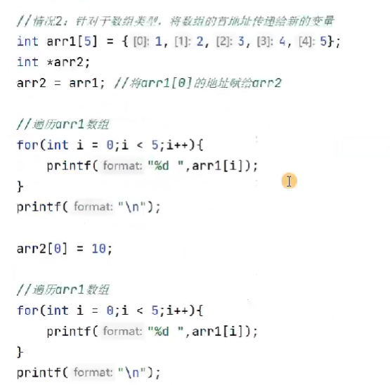


### 参数传递机制 - 传值

- 传值 pass by value
- 传递引用 pass by reference

**实参值赋值给被调用函数的形参**

**如果在函数内部修改形参的值，不会影响函数外部实参的值-->单向传递**

对应的数据类型：基本数据类型（整形/浮点型/字符型）/ 结构体 / 共用体 / 枚举类型


### 参数传递机制 - 传址

又称指针传递，把实参地址常量进行赋值，传送给形参。

**默认传址的类型：指针 / 数组**

当指针作为函数形参时，实参传给形参的是地址，**双向 传递**


右边错误，因为 `*temp`没有初始化。


### 数组作为形参

**数组名本身代表 数组首地址**，传数组本质就是传地址。


由于数组实际是以指针的形式传递给函数，因此函数一开始并不知道数组的确切尺寸，有 3 种解决 方法：

- **显式传递一个表示数组大小的形参**
  专门定义一个表示数组大小的形参
  
- **使用标记指定数组长度**
- **使用标准库函数 `iterator.h`中的 `begin / end`函数**
  begin(array)返回函数首指针,end(array)返回函数尾指针。
  

### 字符串作为形参

也是传址。


## 引用-reference

引用就是某一变量（目标）的另一个别名，即某已存在变量的另一个名字。


上操作错误：因为 ref 被 redifinition。
**对引用的操作和对变量名的直接操作完全一样**
**引用与指针**：


- reference are in C++,not in C
- a reference is an alias to an already-existing variable/object.

```cpp
int num  = 0;
int & num_ref = num;
//实际上是num的别名
```


### C++中的引用-reference in C++

- **传入数值型变量**
  
- **传入结构体变量**

```c
void insert(SqList &L, int x){
    //修改L内部data[]数组的内容，则认为修改了L，因此需要传入引用型L
}
```

- **传入指针型变量**
  `int* &x`表示引用指向整数的指针。

```c
void f(int* &x){
    x++; //将指针x向后移一个整数的大小
}

```

例 1：


例 2：
将两个链表合并成一个 C，此时 C 发生了改变，需要引用型。A/B 没有改变，不需要引用型。


**引用在声明时一定要初始化**
`类型标识符 &引用名 = 目标变量名`

```cpp
int & num_ref;//error
int & num_ref = num; //corect

```

**references are much safer**

### Return statement

**if we have a lot to return**

- such as a matrix addition function (A + B -> C)
- a suggested prototype :
  - to use reference to avoid data copying
  - to use const parameters to avoid the input data is modified
  - to use non-const reference parameters to receive the output

```cpp
bool matrix_add(const Matrix & matA , const Matrix & matB , Matrix & matC){
    //check the dimensions of the three matrices
    //re-create matC if needed
    //do: matC = matA + matB
    //return true if everything is right
}
```

### 引用与指针


**指针可以有多级，引用只能有一级。**

```cpp
int **p;
// 合法
int &&p;
// 不合法
```

**指针可以不初始化，引用必须初始化**

**指针可以指向 null，引用不可指向 null**

**指针初始化后可改变，引用不可以**

```cpp
int a = 33;
int *p = &a;
int &r = a;

int b = 35;
p = &b;
// 合法
r = b;
// 不合法
```

**sizeof 运算结果不同**

```cpp
int a = 996;
int *p = &a;
int &r = a;

cout << sizeof(p); // 返回 int* 类型的大小
cout << sizeof(r); // 返回 int 类型的大小
```

### 内联函数-Inline functions

- 当一个函数被声明为 inline 时，编译器会尝试将该函数的代码直接插入到调用该函数的地方，而不是像普通函数那样在调用时跳转到函数代码所在的地址。这样可以减少函数调用的开销，提高程序的执行效率。
- 但是，inline 函数的定义必须放在头文件中，因为编译器需要在调用该函数的地方看到函数的定义才能将其插入到代码中。
- 同时，inline 函数的定义中不能包含任何循环、switch、递归等语句，否则编译器无法将其转换为内联代码。因此，inline 函数适合于简单的、频繁调用的函数，例如一些简单的数学运算函数。


若频繁调用，代价较高，优化策略：
**inline functions**

```cpp
int main(){
    int num1 = 20;
    int num2 = 3;
    int maxv = {
        if(num1 > num2){
            return num1;
        }
        else{
            return num2;
        }
    }
    maxv = {
        if(numn > maxv)
            return numn;
        else
            return maxv;
            }
}
```

**是空间换时间的典型**

### 默认参数 Default arguments

- a feature in C++
- to call a function without providing one or more trailing arguments.

**默认参数必须设在尾部**

### 函数重载 function overload

在同一个作用域内，定义多个同名函数，但他们的参数列表（包括参数个数/类型/顺序）不同。这样在调用这些同名函数时，编译器会根据实际传入的参数类型/个数/顺序来选择最匹配的函数进行调用。

**函数重载的满足条件：**

- 同一个作用域下
- 函数名称相同
- 函数参数类型不同，或者个数不同，或者顺序不同。

**注 1：返回值不能作为函数重载的条件**

```C
void func(double a , int b);

int func(double a , int b);
```

**注 2：引用作为重载条件**

```c
void fun(int &a);

void fun(const int &a);

int main(){
    int a = 10;
    fun(a);//会调用fun(int &a)，因为a是一个变量

    //a = 10;
    //fun(a);
    //会调用const int &a，引用必须是一个合法的空间，所以不是int &a;
    //又因为此时编译器会优化，创建一个临时的数据，让a指向这个临时的空间，此时加上const 合法
}

//此时类型不同，
```

**注 3：函数重载碰到函数默认参数**
当函数重载碰到默认参数，会出现二义性；

```c
#include <iostream>

//定义两个同名的函数，但参数列表不同
void print(int num){
    std::cout << "the num is " << num << std::endl;
}

void print(std::string message){
    std::cout << "the message is " << message << endl;
}

int main(){
    print(10);//调用第一个函数
    print("hello");//调用第二个函数
    return 0;
}

```

### 运算符重载

```cpp
Box operator+(const Box&);
```

## 函数模板 function templates

是 cpp 中一种泛型编程技术，允许定义一个通用的函数。

C++提供两种模板机制：**函数模板**和**类模板**

### 函数模板语法

函数模板作用：建立一个通用函数，其函数返回值类型和形参类型不具体制定，用一个虚拟类型代替：

```cpp
template <typename T>
函数声明或定义
//template --声明创建模板
//typename --标识其后面的符号事一种数据类型，可以用class代替
//T --通用的数据类型，名称可以替换，通常为大写字母
```

注意: 1.自动类型推导，必须推导出一致的数据类型 T 才可以使用； 2.模板必须要确定 T 的数据类型，才可以使用

```cpp
//模板必须要确定T的数据类型，才可以使用
template<class T>
void func(){
    cout << "func 调用" << endl;
}

void test02(){
    func();
}


```

对于以下：

```cpp
#include <iostream>

using namespace std;

//比较int 类型
int Max(int a, int b)
{
	return a > b ? a : b;
}

//比较char 类型
char Max(char a, char b)
{
	return a > b ? a : b;
}

//比较float 类型
float Max(float a, float b)
{
	return a > b ? a : b;
}

int main(void)
{

	int  n = 1;
	int	 m = 2;
	cout << "max(1, 2) = " << Max(n, m) << endl;

	float a = 2.0;
	float b = 3.0;
	cout << "max(2.0, 3.0) = " << Max(a, b) << endl;

	char i = 'a';
	char j = 'b';
	cout << "max('a', 'b') = " << Max(i, j) << endl;

	return 0;
}

```

只需定义

```CPP
#include <iostream>

using namespace std;

//template 关键字告诉C++编译器 要开始泛型编程了
//T - 参数化数据类型
template <typename T>
T Max(T a, T b) {
	return a > b ? a : b;
}

int main(void)
{

	int  n = 1;
	int	 m = 2;
	cout << "max(1, 2) = " << Max(n, m) << endl;

	float a = 2.0;
	float b = 3.0;
	cout << "max(2.0, 3.0) = " << Max(a, b) << endl;

	char i = 'a';
	char j = 'b';
	cout << "max('a', 'b') = " << Max(i, j) << endl;

	return 0;
}

```

```cpp
template<typename T>
T sum(T x, T y){
    cout << "the input is" << typeid(T).name() << endl;
    return x + y;
}


//instantiates sum<double>(double, double)
template double sum<double>(double,double)

//instantiates sum<char>(char, char)
template char sum<char>(char , char)
```

**模板是虚的，一定要实例化**

### 函数模板显式和隐式实例化

**显式实例化**
在代码中直接声明需要实例化的模板类型，从而生成对应的函数实例。

```c
template void print<int>(int);
//显式实例化一个int 类型的print函数
```

**隐式实例化**
在代码调用函数模板时，编译器自动根据实际参数类型推导出需要实例化的模板类型，生成对应的函数实例。

```cpp

template<typename T>
T ADD(T a, T b){
    return a + b;
}

template int ADD<int, int>;//显式实例化
int main(){
    ADD<int>(1, 2);
    add(1, 2);//自动推导模板参数
}


```

- **显式实例化只能在全局作用域中进行，而不能在函数内部进行。**
- **显式实例化不会覆盖隐式实例化，即如果已存在一个隐式实例化函数，再进行显式实例化时，不会生成新的函数实例**

```cpp
temlate<typename T>
T sum(T x , T y){
    cout << "the input type is " << typeid(T).name() << endl;
    return x + y;
}
//此处还是the input type is d
//原因：
//函数模板除了可做显式实例化，还能做隐式实例化


//explicitly instantiate
template float sum<float>(float , float)

int main(){
    auto val = sum(4.1 , 5.4)
    cout << val << endl;
    return 0;
}
```

### 函数指针 function pointers

- `norm_ptr`is a pointers , a function pointer;
- the function should have two float parameters , and returns float .

```cpp
float norm_l1(float x , float y);
float nrom_l2(float x , float y);
flaot (*norm_ptr)(float x , float y);
norm_ptr = norm_l1;

norm_ptr = &norm_l2;


```

---

---

## 递归函数 Recursive functions

- 递归函数包含了一种 `隐式的循环`
- 递归函数会重复执行某段代码，但这种重复执行无需循环控制。
- 递归一定要向 `已知方向`递归，否则就变成了无穷递归，`死循环->内存溢出`。
- 直接递归
- 间接递归

---

---

## Intel vs ARM

计算机处理器领域 intel nvidia arm 三足鼎立
intel 传统 CPU 领域
NVIDIA GPU 深度学习
ARM 低功耗电子产品（树莓派）

---

---

## speed up your program

simple is beautiful!

---

---

## 避免内存拷贝 avoid memory copy

whats an image?


再 openCV 中

```c
class CV_EXPORTS Mat
{
    public:
    //一些成员变量
    int rows, cols;
    //pointer to data
    uchar * data;
    //size_t step.p
    MatStep step;
}
```


### ROI region of interest


---

---

## 类和对象-Classes and Objects

类定义：


**访问权限**
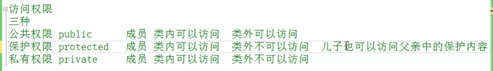


- 成员函数可以放在类的声明里面
- 可以把成员函数的声明放在类的声明里，定义放在函数体的外面。
  

建议简单函数/适合 inline 函数放在类的内部，打印操作等复杂函数放在类的外部。

### 空对象

空对象占用内存空间-1；
C++编译器会给每个空对象分配一个字节空间，是为了区分空对象占内存的位置。（每一个对象都应该有一个独一无二的内存空间，不能和别人占同一内存地址）

### struct 和 class 区别

唯一区别：**默认的访问权限不同**

- struct 默认权限公共
- class 默认权限 私有

## 对象的初始化和处理

### **构造函数 constructors**

`类名(){}`

- 1.构造函数，没有返回值也不写 void
- 2.函数名称和类名相同
- 3.构造函数可以有参数，因此可以发生重载
- 4.程序在调用对象时自动调用构造，无需手动调用，且只会调用一次

对比：c 结构体再分配内存时就是分配内存，
c++创建对象时，分配内存和调用 constructor。

**对象函数作用**

- 对对象里面的数据进行初始化；

**构造函数**

- 函数名字 跟类名完全一样且没有返回值；
- 

```cpp
class Student {
    private:
    //...
    public:
    Student(){
        name[0] = 0;
        born = 0 ;
        male  = false;
    }
    Student(const char * initName , int initBorn , bool isMale){
        setName(initName);
        born = initBorn;
        male = isMale;
    }
}
```

### 构造函数分类和调用

**按照参数构造**：无参构造（默认构造） / 有参构造
**按照类型分类**：普通构造 / 拷贝构造

**拷贝构造函数**
`const 类 &p`

- 自定义拷贝构造函数

```c
//假设已经定义了一个类Box，通过一下方式拷贝欸定义函数
Box (const Box &p){
    age = p.age;
    name = p.name;
}
//调用拷贝函数
Box b3(b2);//传入参数就是一个对象b2
```

**调用构造 函数**：

- 括号法
- 显式法
- 隐式转换法
- 括号法
  注意：调用默认构造函数时，不要加()
  

```c++
Box b1;//调用无参构造函数,不要加()
Box b2(10);//有参构造函数
Box b3(b2);//调用拷贝函数
```

- 显式法调用构造函数（实例化）

```c
//假设已经定义好了类Box，则实例化对象可以用显式法
Box b1 = Box(10 , "Chung");//调用有参构造函数
Box b2 = Box();//调用无参构造函数
Box b3 = Box(b1);//调用拷贝函数

Box(10);//匿名对象，当前行执行结束后，系统会立即回收掉匿名对象，尽量不要用。


```

- 隐式法调用构造函数（实例化）
  **禁止隐式法调用构造函数可在构造函数定义前加上：`explicit`**

```c
//假设已定义好类Box，则调用隐式法实例化对象有三种情况：
Box b1 = {10 , "Chung"};//调用有参构造函数
Box b2 = b1;//调用拷贝函数

//注意：隐式法无法调用无参构造函数，即不能写成：
Box b3 = {};
```

### 构造函数重载

### 拷贝构造函数调用时机

- 使用一个已经创建完毕的对象初始化一个新对象

```c++
Person p1(20);
p2(p1);
```

- 值传递的方式给函数参数传值

```c++
void doWork(Person p){

}

void test01(){
    Person p;
    doWork(p);
}
```

- 值方式返回局部对象

### 构造函数调用规则

C++默认情况下会给一个类添加 3 个函数：默认构造函数/默认析构函数/默认拷贝函数
即：
默认构造（空实现）
析构函数（空实现）
拷贝构造（值拷贝）

**构造函数调用规则：**
若用户定义有参构造函数，c++不再提供默认无参构造，但会提供默认拷贝构造。
若用户定义拷贝构造函数，c++不会再提供其他构造函数。

### **析构函数**

是一个成员函数，在**对象超出范围或通过调用 `delete`显示销毁对象**时，会自动调用析构函数。有助于在跳出程序（如关闭文件、释放内存）前释放资源。

- 1.析构函数，没有返回值也不写 void
- 2.函数名称和类名相同，前面加~
- 3.析构函数不可以有参数，因此不可以发生重载
- 4.程序在对象销毁时自动调用构造，无需手动调用，且只会调用一次

**析构的顺序**：
当对象超出范围或被删除时，完整析构中的事件序列： 1.将调用该类的析构函数，且会执行该析构函数的主体。 2.按照非静态成员对象的析构函数在类声明中的显示顺序的**相反顺序**调用这些函数。 用于这些成员的构造的可选成员初始化列表不影响构造或析构的顺序。 3.非虚拟基类的析构函数以声明的相反顺序被调用。 4.虚拟基类的析构函数以声明的相反顺序被调用。

### 深拷贝和浅拷贝


解决：深拷贝

```cpp

Person(const Person &p){
    cout << "Person拷贝构造函数的调用" << endl;
    //浅拷贝操作
    //m_Height = p.Height;

    //深拷贝操作
    m_Height  = new int(*p.m_Height);
}

```

### 初始化列表

```cpp
//传统方式初始化
Person(int a, int b, int c){
    m_a = a;
    m_b = b;
    m_c = c;
}

//初始化列表初始化
Person(int a, int b, int c):m_a(a), m_b(b), m_c(c){

}
```

### 类对象作为其它类的成员变量

```cpp
#include "stdio.h"
#include <iostream>
#include <string>
using namespace std;


//手机类
class Phone {
public:
	//手机初始化时传入名称
	Phone(string pName) {
		m_PName = pName;
		cout << "Phone构造函数调用" << endl;
	};
	~Phone() {
		cout << "Phone析构函数调用" << endl;
	}

	string m_PName;
};

//人类
class Person {
public:
	Person(string name, string pName):m_Name(name),m_Phone(pName) {
		cout << "Person构造函数调用" << endl;
	};
	~Person() {
		cout << "Person析构函数调用" << endl;
	};
	//姓名
	string m_Name;
	//手机
	Phone m_Phone;
};


void test() {
	Person p("yu", "huawei");
	cout << p.m_Name << "拿着" << p.m_Phone.m_PName << endl;

}

int main() {
	test();
}

```


上例代码中：
`Phone m_Phone = pName`
隐式转换法

**当其他类的对象作为本类成员，构造的时候先构造其他类对象，再构造自身；**

\*\*析构顺序，

## 封装

**public**
成员类内可以访问，类外可以范根

**protected**
成员类内可以访问，类外不能访问，子类可以访问父类中 的保护内容。

**private**
成员类内可以访问，类外不可访问，子类不可访问父类中的保护内容。

## 继承

`class  子类 : 继承方式 父类`

```c++
class Animal{
    //eat()
    //sleep()
};

//派生类
class Dog : public Animal{
    //bark() 函数
}
```

### 继承类型

- 公有继承 public
- 保护继承 protected
- 私有继承 private


```c++
#include <iostream>
#include "stdio.h"


using namespace std;

class Shape {
public:
	void setArg(int w , int h);

protected:
	int width;
	int height;

};

void  Shape::setArg(int w, int h) {
	this->width = w;
	this->height = h;
}

//派生类
class Rectangle :public Shape {
public:
	int getArea() {
		return (width * height);
	}
};


int main(void) {
	Rectangle Rect;

	Rect.setArg(3, 5);

	//输出对象的面积;
	cout << "total area:" << Rect.getArea() << endl;

	return 0;
}
```

上中不能写成如下形式：
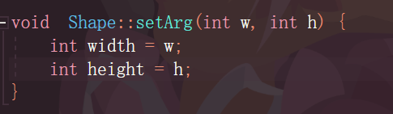
因为 width / height 会被重定义为局部变量，而不是被赋予给类的成员变量。
解决：在 Shape 类的 setArg 函数中使用 this 指针来指向类的成员变量：
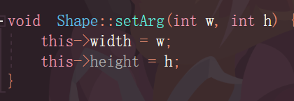

**多继承**
一个子类可以有多个父类


一个派生类继承所有基类方法，但下面情况除外：

- 基类的构造函数、析构函数和拷贝析构函数；
- 基类的重载运算符
- 基类的友元函数。

父类中所有非静态成员都会被子类继承下去
父类中私有成员属性 是被编译器隐藏了，虽访问不到，但确实被继承下去了。

**可以利用开发人员命令提示工具查看对象模型**

**多继承产生二义性问题：通过::域运算符对同名变量进行读写操作。**

```cpp
//基类A
class A{
    public:
        A():m_data(1), m_a(1){

        }}
        ~A(){}

    public:
        int m_data;// 同名变量，类型无要求
        int m_a;

};

//基类B
class B{
    public:
        B():m_data(1), m_b(1){

        }
        ~B(){
        }

    public:
        int m_data;//同名变量，类型无要求
        int m_b;
};

//多继承C
class C: public A , public B{

};

int main(){
    C Data;
    //通过域成员运算符才能访问
    Data.A::m_data = 10.3;
    Data.B::m_data = 34;
}

```

**菱形继承**


**利用虚继承 解决菱形继承问题**

**继承之前加上 `virtual`变为虚继承**

此时继承的是 vbptr ，继承的是两个指针。

## 多态

调用成员函数时，会根据调用函数的对象的类型执行不同的函数。

多态分为两类：

- 静态多态：函数重载和运算符重载属于静态多态，复用函数名。（函数地址在编译的时候就确定）
- 动态多态：派生类和虚函数实现运行时多态。（函数地址在运行阶段确定）

**父类引用指向子类对象**


### 虚函数

### 纯虚函数 / 抽象类

```cpp
//写法
virtual void func() = 0
```

**目的：重写父类中的虚函数**
在多态中，通常父类中的虚函数的实现是无意义的，主要都是调用子类重写的内容。因此可以把虚函数改为纯虚函数。

例如，动物作为一个基类可以派生出老虎、狮子等，但动物本身生成对象不合常理。

**1.无法实例化对象**
**2.抽象类的子类，必须要重写父类中的纯虚函数，否则也属于抽象类**


### 虚析构和纯虚析构

多态使用时，如果子类中有属性开辟到堆区，那么父类指针在释放时无法调用到子类的析构代码。

## this 指针-this_pointer

this 指针指向被调用的成员函数所属的对象。

作用：

- 当形参和成员变量同名时，可用 this 指针来区分（解决名称冲突）。
- 在类的非静态成员函数中返回对象本身可使用 `return* this`。


```c
class Person{
    public:
        void setName(string name){
            this->name = name;
        }
        void setAge(int age){
            this->age = age;
        }
        void printInfo(){
            cout << "Name" << this->name <<endl;
            cout << "Age" << this->age <<endl;
        }
    private:
        string name;
        int age;
}

int main(){
    Person p;
    p.setName("Alice");
    p.setAge(20);
    p.printInfo();
    return 0;
}
```

**为了避免和局部变量名冲突，建议在成员函数中始终使用 this 指针来引用成员变量**

- **`return *this`返回对象**
  **可以用来实现链式调用**

```cpp
class MyClass {
public:
    MyClass& setValue(int value) {
        // 设置对象的值
        this->value = value;
        // 返回对象的引用
        return *this;
    }

private:
    int value;
};

int main() {
    MyClass obj;
    obj.setValue(1).setValue(2).setValue(3);
    return 0;
}
```

### 空指针调用 成员函数

如果空指针调用普通成员函数，看该函数体中是否使用到了 this 指针（是否访问非静态成员变量）。如果使用到了 this 指针，程序会崩溃；如果没有使用到 this 指针，程序不会崩溃。当然，如果访问静态成员变量，是不会使用到 this 指针的。


## const & static variables

### const

表示常量：

- **使用宏**

```c
#define VALUE 100
```

- **C++中不推荐使用宏，使用 const**

```c
const int value = 100;
//初始化值未100，不能修改

const int * p_int;
int const * P_int;
//指针指向内容不能被修改

const * int p_int;
//指针里面内容能修改，但指针地址不能被修改
```

### 静态变量

静态成员就是在成员变量和成员函数前加上关键字 static。

静态成员分类：

- 静态成员变量
  - 所有对象共享同一份数据
  - 在编译阶段分配内存
  - **类内声明，类外初始化（必须）**
- 静态成员函数
  - 所有对象共享同一个函数
  - **静态成员函数只能访问静态成员变量**

```cpp
//静态 成员
class Person {
public :
	static int person_a;

};

//必须在 类外初始化，且要加Person::
int Person::person_a = 10;

//静态成员共享数据
void test(){
    Person p1;
    p1.person_a = 100;
    Person p2;
    p2.person_a = 200;
    cout << p1.person_a << endl;
};


//输出：200
```

**静态变量**
在程序运行期间只初始化一次的变量，存储在静态区域。

静态成员变量时属于类而不是类的实例的成员变量，在类的所有实例之间共享，二可在没有创建类的实例的情况下被访问。

**因为静态成员不属于某个对象上，所有对象都共享同一份数据，所以静态成员变量有两种访问方式：**

- 通过对象进行访问

```cpp
Person p;
cout << p.static_a << endl;
```

- 通过类名进行访问

```cpp
cout << P::static_a << endl;
```

- **可在函数内部或类中声明静态变量。**

```c
void myFunction(){
    static int count = 0;
    count++;
    cout << "count:" <<count <<endl;
}
```

- **在 类中声明静态变量**
  **如下程序 obj1, obj2 都输出 2.因为 count 变量是静态变量。**

```c
class MyClass{
    public:
        static int count;
        //类内声明
}

int MyClass::count  = 0;
//静态变量的初始化
//类外初始化

int main(){
    MyClass obj1 , obj2;
    obj1.count++;
    obj2.count++;
    cout << "count" << obj1.count << endl;//output 2
    cout << "count" << obj2.count << endl;
    //output 2
    //因为共享 内存
    return 0;
}

```

### 成员变量和成员函数内存分配（分开存储）

**空对象占一个字节**

输出 1
当空对象赋予一个非静态成员变量时，内存即按对象来分配内存：

非静态成员变量属于

**静态成员变量也有访问权限：**


### 静态函数

- 静态函数是不属于任何对象的函数，可以直接通过类名来调用。
- 静态函数不能访问非静态成员变量和非静态成员函数，但可以访问静态成员变量和静态成员函数。。

```cpp
class MyClass{
    public:
        static void myStaticFunction(){
            cout << "this is a static function" << endl;
        }
};

MyClass::myStaticFunction();
//调用静态函数
```

**静态成员函数不能访问非静态成员变量：**


### 静态类成员

属于整个类，而不属于类的任何一个对象，存储在静态存储区域内，只被初始化一次。

```cpp
class MyClass{
    public:
        static int count;
};

int MyClass::count = 0; //静态成员初始化
```

**可以通过类名或对象名来访问静态类成员**

```cpp
MyClass::count = 10;//使用类名访问

MyClass obj;
obj.count = 20;//使用对象名访问
```

**静态类成员可以被继承和覆盖，但不能被声明为虚函数**

## const 修饰成员函数

### 常函数

常函数：成员函数后加 const

- 常函数内不可修改成员属性
- 成员属性声明时加关键字 mutable 后，在常函数 中依然能修改。

### 常对象

常对象：声明对象前加 const
常对象只能调用常函数。


## 友元

家里有客厅（public），卧室（private）
客厅所有客人能去。卧室只有自己能去。
但可以邀请好友进去。

程序里，有些私有属性 也想让类外 特殊的一些函数或类进行访问，即需要**友元**

目的：让一个函数或类访问另一个类中的私有成员。

`friend`.

**三种实现**：

- 全局函数做友元
- 类做友元
- 成员函数做友元
- **全局函数做友元**
  
  解决：
  
- **类做友元**
  
- **成员函数做友元**
  

## C++中的运算符承载

对于内置数据类型，编译器知道如何进行运算：
int a = 10;
int b = 20;
int c = a + b;

### 加号运算符重载

- 成员函数重载+号
- 全局函数重载+号

**成员函数重载+号**


### 左移运算符重载

对自定义类型进行左移运算符（<<）的重载，使该类型能像基本类型一样进行左移运算。

重载后的左移运算符可以用于输出该类型的对象。

左移运算符重载的原理是通过在类中定义一个左移运算符重载函数来实现。这个函数需要返回一个 ostream&类型的引用，并且需要将要输出的内容插入到这个 ostream 对象中。


### 递增运算符重载 ++

- 重载前置++运算符
  
- 重载后置++运算符
  
  后置递增返回的是值，
  因为后置如果返回引用返回的是局部变量的引用，当前函数执行完后会被释放掉，后续操作视为非法操作。

### 赋值运算符重载

C++编译器至少给一个类添加 4 个函数：

- 默认构造函数（无参，函数体为空）
- 默认析构函数（无参，函数体为空）
- 默认拷贝构造函数，对属性进行值拷贝
- 赋值运算符 operator= , 对属性进行值拷贝

如果类中有属性指向堆区，做赋值操作时也会出现深浅拷贝问题。

编译器提供浅拷贝，但如果做析构函数时，会出现浅拷贝带来的堆区内存重复释放问题。所以需要自己写赋值运算符重载。


执行上面代码错误报告：


解决：深拷贝


### 关系运算符重载


### 函数调用运算符重载


### operators for cv:Mat

**Function overloading**
在同一个作用域内，可定义多个同名函数，但这些函数参数类型/参数个数和参数顺序不同。
当带哦用这些同名函数时， 编译器会根据实参的类型/个数和顺序来选择调用哪个参数。

```cpp
Mat A , B;
float a , b;
//...

Mat add(Mat& A , Mat& B);
Mat add(Mat& A , float b);
Mat mul(Mat& A , float b;

Mat C = A + B;
Mat D = A + b;
//函数承载
```

```cpp
#include <iostream>
#include <opencv2/opencv.hpp>

using namespace std;

int main(){
    float a[6] = {1.0f , 1.0f , 1.0f , 2.0f , 2.0f , 2.0f};
    float b[6] = {1.0f , 2.0f , 3.0f , 4.0f , 5.0f , 6.0f};
    cv::Mat A(2, 3, CV_32FC1 , a);
    cv::Mat B(3 , 2, CV_32FC1 , b);

    cv::Mat C = A * B;

    cout << "Matrix C=" << C << endl;
    return 0;

}

//Matrix C = [9 , 12;
              18, 24]
```

### 类型转换 user-defined type conversion

## visual studio 中 c++

软件工程中，在一个项目中只能使用一个 main()。

## 文件操作

程序运行时产生的数据属于临时数据，程序一旦运行结束都会被释放。
通过文件可以将数据永久化。

C++中 对文件操作需要包含头文件 `<fstream>`.

### ofstream 写操作


### ifstream 读操作

### fstream 读写操作

## STL

C++的面向对象和泛型编程的思想，目的是**提升复用性**。

提供了六大组件：

**容器、算法、迭代器、仿函数、适配器、空间配置器**

**STL 基本概念**
standard template library，标准模板库。

从广义上分为：
**容器 container;**
各种 数据结构：
vector / list / deque / set / map

这些容器分为 序列式容器和关联式容器；
**序列式容器**强调值的排序，每个元素都有固定的位置。
**关联式容器**二叉树结构，个元素兼没有严格的物理上的顺序关系。

**算法 algorithm;**
各种常用算法:
sort / find / copy / for_each

**迭代器 iterator;**
链接容器和算法。

迭代器使用**类似于指针。**


**仿函数;**
行为类似函数，可作为 算法的某种策略。

**适配器;**
一种用来修饰容器或仿函数或迭代器接口的东西。

**空间配置器;**
负责空间配置和管理

## 容器

### vector

数据结构和数组非常相似，称为**单端数组**

**与普通数组区别**
数组是静态空间，vector 可以动态扩展。

**动态扩展**
并不是在原空间后续接新空间，而是寻找更大的内存空间，然后把原数据拷贝新空间，释放原空间。


vector 容器 的迭代器是支持随机访问的迭代器。

### vector 函数原型

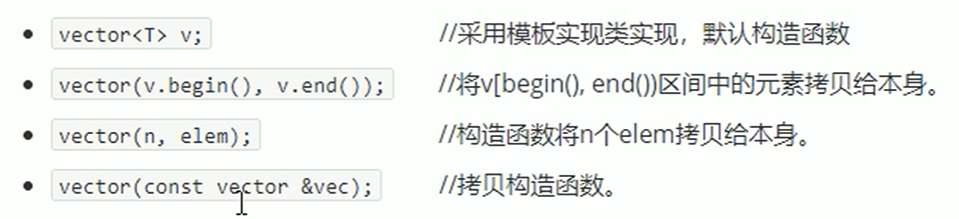


### vector 赋值操作


### vector 容量和大小

功能：对 vector 容器的容量和大小操作

函数原型：


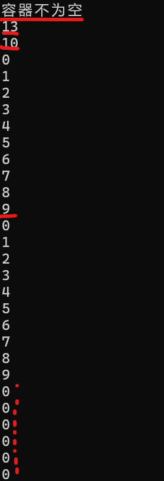

另外，resize 默认填充 0
`.size(const size_t N  ewsize , const int&_Val)`
也可以填充其他数字。

### vector 插入和删除


`void erase(vec.begin() , vec.end());`相当于删除整个 vec。
即删除迭代器 start 到 end 之间的元素。

<-->

`clear()`删除容器中所有元素

### vector 数据存取


### vector 互换容器

`swap(vec);`


swap互换原理：

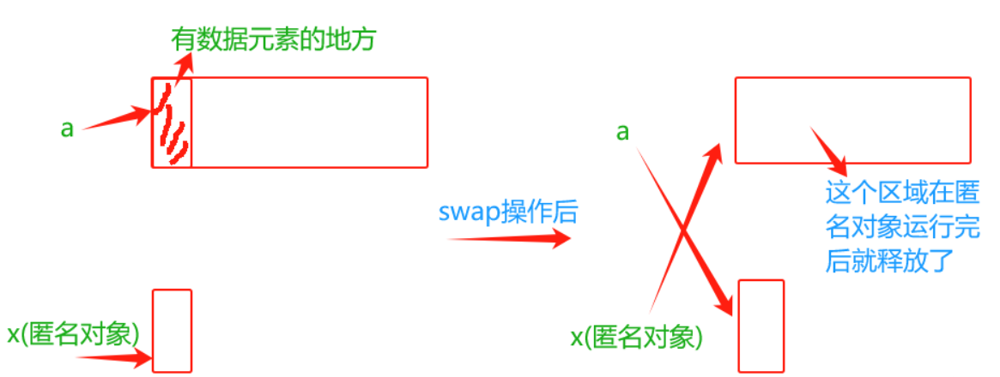

### vector 动态扩展规律


与动态数组两倍扩展不一样，接近于 1.5 倍的容量扩展。

### vector 预留空间

减少 vector 在动态扩展容量时 的扩展次数

`reserve(int len)`
容器预留 len 个元素长度，预留位置不初始化，元素不可访问。


### vector 存放内置数据类型

vector 可以理解为数组。

容器:`vector`
算法：`for_each`
迭代器:`vector<int>::iterator`


类似利用回调函数机制

.begin()指向容器中第一个 数据
.end() 指向容器元素的最后一个元素的下一个位置。

vector `<int>`::iterator-拿到 vector `<int>`这种容器的迭代器类型。

### vector 存放自定义数据类型


### vector 容器嵌套容器（相当于二维数组)

## string

string 本质是一个类。

### string 和 char\*区别

- char\* 是一个指针。
- string 是一个类，内部封装了 char\* 。

**特点**
string 类中封装了很多成员方法。

如:find / copy / delete / replace / insert。

### string 构造函数

构造函数原型：

```cpp
string()
//创建一个空字符串

string(const char* s);
//使用字符串s初始化

string(const string& str);
//使用一个string对象初始化另一个string 对象

string(int n , char c)
//使用n个字符初始化
```


### string 赋值操作 / 拼接操作 /查找替换操作 /

string 赋值函数原型有 2 种：operator / assign

```cpp
string& operator=(const char *s); //char*类型字符串 赋值给当前的字符串

string& operator=(const string *s); //把当前的字符串s赋值给当前的字符串

string& operator=(char c); //字符赋值给当前的字符串

string& assign(const char *s); //把字符串s赋给当前的字符串

string& assign(const char *s, int n); //把字符串的前n个字符赋值给当前字符串

string& assign(const string &s); //把字符串s赋给当前字符串

string& assign(int n, char c); //用n个字符c赋给当前字符串


//拼接操作


```


### string 比较操作

### string 字符存取操作


### string 插入删除

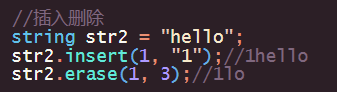


## deque 容器

双端数组，可以对头端进行插入和删除操作。

**deque 和 vector 区别**

- vector 对头部插入删除效率低，数据量越大，效率越低
- veector 访问元素时速度比 deque 快，这和两者内部实现有关。


**特点：**

- 容器两端进行常数时间复杂度的插入和删除操作，适合队列和栈。
- 支持随机访问，课通过索引快速访问容器中元素。
- 内存空间是动态分配的。
- 可存储任意类型对象，包括自定义类型。

**原理：**
deque 内部有个**中控器**，维护每段缓冲区的内容，缓冲区中存放真实数据。

中控器维护的是每个缓冲区的地址，使得使用 deque 时像一片连续内存空间。


### deque 大小操作


与 vector 不同，没有 `.capacity`即没有容量大小限制。

### deque 插入和删除


### deque 数据存取


## 案例--评委打分

**案例描述**
有 5 名选手：选手 ABCDE，10 个评委分别对每一名选手打分，去除最高分，去除评委中最低分，取平均分。

**实现步骤**
创建五名选手，放到 vector 中
遍历 vector 容器，取出来每一个选手，执行 for 循环，可以把 10 个评分打分存到 deque 容器中
sort 算法对 deque 容器中分数排序，去除最高和最低分
deque 容器遍历一遍，累加总分
获取平均分

## stack 容器

FILO


栈中只有顶端元素可以被外界使用，所以栈不允许有遍历行为。


## queue 容器

队列

只有队头和队尾才能被外界使用，因此队列不允许有遍历行为。

FIFO


## list 容器

**链表**：将数据链式存储。

是一种物理存储单元上非连续的存储结构，数据元素的逻辑顺序是通过链表中的指针链接实现的。

STL 链表：双向循环链表。


由于链表的存储方式并不是连续的内存空间，因此链表 list 中的迭代器只支持前移和后移，属于**双向迭代器**。


### list 构造函数


### list 容器赋值和交换


### list 大小操作


### list 插入和删除


**不能用 `[] / at() `方式访问 list 容器中的元素原因：list 本质是链表，存储空间不连续，迭代器不支持随机访问**

### list 数据存取


### list 反转和排序

所有不支持随机访问迭代器的容器，不可以用标准算法。

不支持随机访问迭代器的容器，内部会提供算法。


## Set / MultiSet 容器

**所有元素都会在插入时自动排序**

**本质**
属于关联式容器，底层结构由二叉树实现。

**set 和 multiset 区别**
set 不允许容器中由重复的元素
multiset 允许容器中有重复的元素


### set 大小和交换


### set 插入和删除


### set 查找和统计

`find(key)`查找 key 是否存在，若存在，返回该键的元素的迭代器；若不存在，返回**set.end()**;
`count(key)`统计 key 元素的个数


### multiset / set 区别


### pair 对组的创建

**成对出现的数据，利用对组可以返回两个数据**


### set 容器排序


### set 自定义类型排序

**必须指定一个排序规则**

报错


解决：


## map/multimap 容器

- map 中所有元素都是 pair
- pair 中第一个元素为 key（键值），起到索引作用，第二个元素为 value（实值）
- 所有元素都会根据元素的键值自动排序

**本质**
map/multimap 是关联式容器，底层是二叉树排序。

map 和 multimap 区别：
允不允许容器中有重复 key 值元素。


### map 插入和删除


### map 查找和统计


## C++11 被弃用的特性

- 不再运行字符串字面值常量复制给一个 char\*

应该使用*`const char*`或 `auto`。

```cpp
char *str=  "hello,world"
// 将出现弃用警告
```

- `auto_ptr`转为 `unique_ptr`
- `register`关键字被弃用

## 原始字面量

## 指针空置类型-nullptr

用来区分**空指针 / 0**

`nullptr`类型为 `nullptr_t`,能够隐式转换为任何指针或成员指针的类型。


## 常量表达式修饰符-constexpr

### std::Thread

## 自动类型推导

## final

**final 关键字用来修饰类、函数或虚函数，表示他们是最终的，不能再被继承或重写。保护基类的设计不受子类修改，防止继承滥用。**

- **final 关键字修饰类**

```cpp
class Animal final{

};

class Dog : public Animal{
    //编译错误，无法继承final类
}

```

- **final 关键字修饰成员函数**
  意味该函数不能被子类重写。

```cpp
class Shape[
    public:
    virtual void draw() final{

    }
];

class Rectangle : public Shape{
    public:
    void draw(){
        //编译错误，无法重写final函数
    }
}
```

## override

用于标记派生类中重新定义的虚函数

## 模板优化

## 使用 using

## 委托构造函数和继承构造函数

## 列表初始化

针对不同类型如普通数组{} / 类对象() 的初始化不能通用

```cpp
class Foo{
    public:
    int value_a;
    int value_b;
    Foo(int a,int b):value_a(a),value_b(b){

    }
}

int main(){
    int arr[3]={1, 2, 3};
    Foo foo(1,2);
    //before C++11
}
```

解决：
把初始化列表概念绑定到类型上：
**`std::initializer_list`**
允许构造函数或其他函数像参数一样使用初始化列表。

## 基于范围的 for 循环

## 可调用对象包装器 / 绑定器

## lambda

让 C++具有了【匿名函数】的【闭包】特性。

## 左值和右值

**区别：能否取地址**
**左值**有地址和值，可以出现在赋值运算符左边或右边。

**右值**只有值，只能出现在赋值运算符右边。

- **字面常量**
- **表达式返回值**
- **传值返回函数的返回值**

```cpp
double x = 1.3, y = 3.8;
// 以下几个都是常见的右值
10;                 // 字面常量
x + y;             // 表达式返回值
fmin(x, y);        // 传值返回函数的返回值
```

### 数组不能作为左值被赋值

数组不能作为左值被赋值的原因是数组是一种固定大小的连续内存空间，它在内存中是以地址的形式存在的。而赋值操作需要将一个值赋给一个变量，而不是将一个值赋给一个内存地址。

当我们使用数组名作为左值进行赋值操作时，实际上是将整个数组的地址作为一个常量传递给赋值操作符。这样的赋值操作会导致编译器报错，因为这样的操作是非法的。

```cpp
int arr[5];
arr = {1, 2, 3, 4, 5};
//以上操作非法

int arr[5];
for(int i = 0; i < 5; i++){
    arr[i] = i + 1;
}

```

### 左值引用

```cpp
// 以下几个是对上面左值的左值引用
int& ra = a;
int*& rp = p;
int& r = *p;
const int& rb = b;
```

- 左值引用只能引用左值，不能直接引用右值；
- 但是 `const 左值引用`既可以引用左值，也可以引用右值。

```cpp
// 1.左值引用只能引用左值
int t = 8;
int& rt1 = t;

//int& rt2 = 8;  // 编译报错，因为10是右值，不能直接引用右值


// 2.但是const左值引用既可以引用左值
const int& rt3 = t;

const int& rt4 = 8;  // 也可以引用右值
const double& r1 = x + y;
const double& r2 = fmin(x, y);
```

**为何？**
答：在 C++11 标准产生之前，是没有右值引用这个概念的，当时如果想要一个类型既能接收左值也能接收右值的话，需要用 const 左值引用，比如标准容器的 push_back 接口：void push_back (const T& val)。
也就是说，如果 const 左值引用不能引用右值的话，有些接口就不好支持了。

```cpp
#include <iostream>
#include <string>

// 参数中的 s 是引用，在调用函数时不会发生拷贝
char& char_number(std::string& s, std::size_t n) {
  s += s;          // 's' 与 main() 的 'str' 是同一对象
                   // 此处还说明左值也是可以放在等号右侧的
  return s.at(n);  // string::at() 返回 char 的引用
}

int main() {
  std::string str = "Test";
  char_number(str, 1) = 'a';  // 函数返回是左值，可被赋值
  std::cout << str << '\n';   // 此处输出 "TastTest"
}
```

### 右值引用

对右值的引用，给右值取别名。
右值**可以在内存里也可以在 CPU 寄存器里。**
另外，右值引用可以被看做一种**延长临时对象生存期的方式**。

```cpp
// 以下几个是对上面右值的右值引用
int&& rr1 = 10;
double&& rr2 = x + y;
double&& rr3 = fmin(x, y);
```

**注意：**
右值引用引用右值，会使右值被存储到特定的位置。
也就是说，右值引用变量其实是左值，可以对它取地址和赋值（const 右值引用变量可以取地址但不可以赋值，因为 const 在起作用）。
当然，取地址是指取变量空间的地址（右值是不能取地址的）。

比如：

```cpp
double&& rr2 = x + y;
&rr2;
rr2 = 9.4;
//右值引用 rr2 引用右值 x + y 后，该表达式的返回值被存储到特定的位置，不能取表达式返回值 x + y 的地址，但是可以取 rr2 的地址，也可以修改 rr2 。
const double&& rr4 = x + y;
&rr4;
//可以对 rr4 取地址，但不能修改 rr4，即写成rr4 = 5.3;会编译报错。
```

- 右值引用只能引用右值，不能直接引用左值
- 但是右值引用可以引用被 `move`的左值。

```cpp
// 1.右值引用只能引用右值
int&& rr1 = 10;
double&& rr2 = x + y;
const double&& rr3 = x + y;

int t = 10;
//int&& rrt = t;  // 编译报错，不能直接引用左值


// 2.但是右值引用可以引用被move的左值
int&& rrt = std::move(t);
int*&& rr4 = std::move(p);
int&& rr5 = std::move(*p);
const int&& rr6 = std::move(b);
```

```cpp
#include <iostream>
#include <string>

int main() {
  std::string s1 = "Test";
  // std::string&& r1 = s1;           // 错误：不能绑定到左值

  const std::string& r2 = s1 + s1;  // 可行：到常值的左值引用延长生存期
  // r2 += "Test";                    // 错误：不能通过到常值的引用修改

  std::string&& r3 = s1 + s1;  // 可行：右值引用延长生存期
  r3 += "Test";  // 可行：能通过到非常值的右值引用修改
  std::cout << r3 << '\n';
}
```

### ++i 和 i++ 是典型的左值和右值

### 移动语义和 `std::move(C++11)`

**move**:std::move(C++11)，将一个左值强制转换为右值，以实现移动语义。

在 C++11 后，利用右值引用新增了对移动语义的支持，用来避免对象在堆空间的赋值（但无法避免栈空间赋值）。

**注：一个对象被移动后不应该对其进行任何操作，无论是修改还是访问**

```cpp
// 移动构造函数
std::vector<int> v{1, 2, 3, 4, 5};
std::vector<int> v2(std::move(v));  // 移动v到v2, 不发生拷贝

// 移动赋值函数
std::vector<int> v3;
v3 = std::move(v2);

// 有移动能力的函数
std::string s = "def";
std::vector<std::string> numbers;
numbers.push_back(std::move(s));
```

## cast 显式转换——explicit conversion-四种类型转换

### static_cast 静态转换

```cpp
static_cast<type_name>(expression)
```


`static_cast`一般用于隐式转换，当 type_name 和 express 至少有一方可以隐式转换时，则可以用 static 进行强制类型转换。可以用于常见的 int、float、double 等类型转换；转换成功返回 true，否则返回 false（相当于 C 语言中的强制类型转换）。

**static_cast 基类转换子类是不安全的**

### dynamic_cast 动态转换

dynamic_cast 一般用于基类指向派生类时的强制转换。
其转换是安全的（RTTI 机制）。

**RTTI**
提供两个有用的操作符：

- typeid
- dynamic_cast<>

### const_cast 常量转换

加上 const：
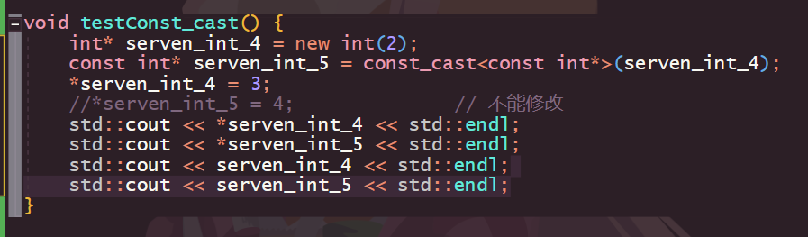

去掉 const:

- const 修饰指针，指针指向一个类对象（常量指针）-将一个常量指针转换为非常量指针。

### reinterpret_cast 重新解释转换

## 断点和读取内存
