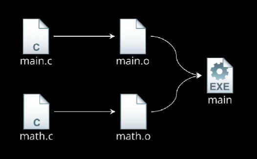
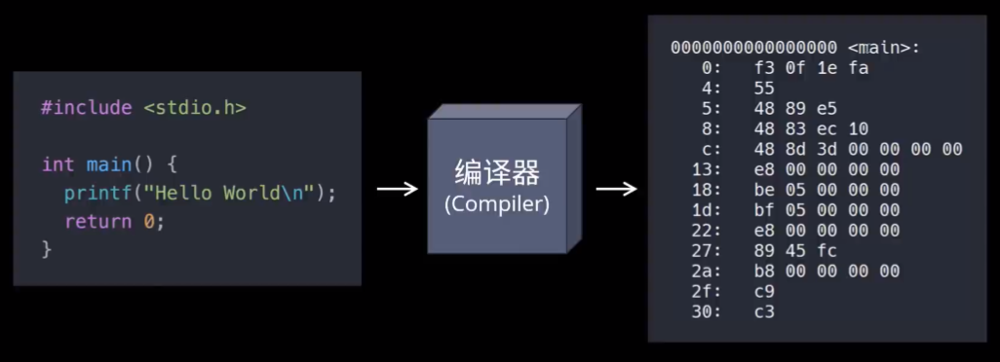
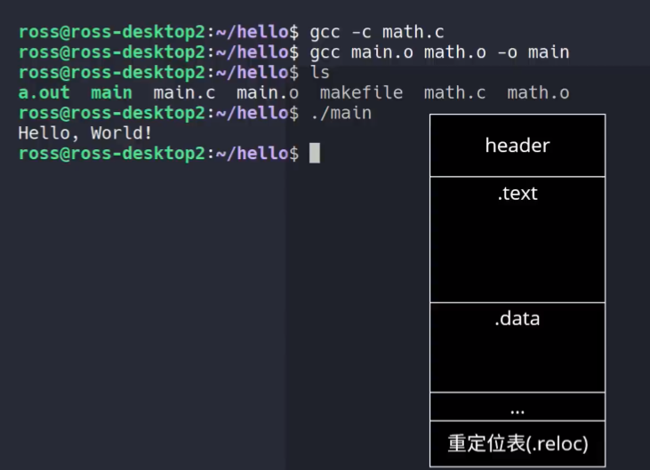
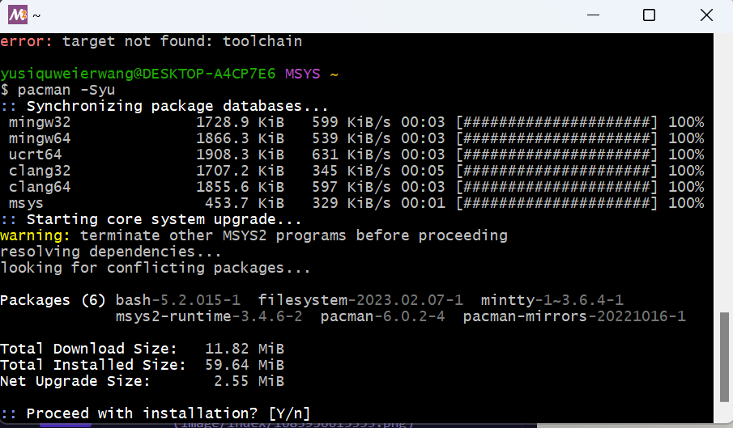
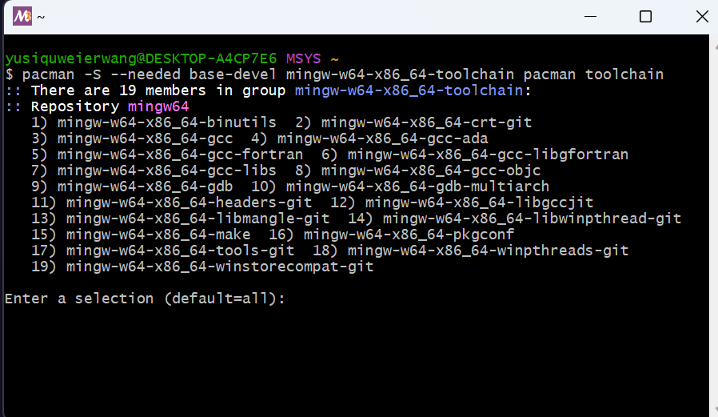

[toc]

```c
#include <stdio.h>

int main()
{
    printf("hello world");
    return 0;
}
```

---

### 编译四个阶段

- CPP（预处理器）：C 语言 pre-processor。头文件展开，宏替换，去掉注释。
- CCL（编译器）：C 语言 compile。C 文件编程汇编文件。
- AS（汇编器）：assembler。汇编文件变成可执行二进制文件。
- LD（链接器）：将函数中相应代码组合到目标文件中，汇编文件和系统库文件链接起来，生成在特定平台可执行的程序。

**编译和链接**



 
### **在 linux 下**

**想要在 linux 上运行，需要使用 GCC:**

- 预编译：将 hello.c 和 stdio.h 预编译为 hello.i。
- 编译：将 hello.i 编译为 hello.s
- 汇编：将 hello.s 编译为机器指令 hello.o
- 链接：链接其其他需要的库的都可执行文件 hello.out（like .exe in windows）

### **在 windows 下**

MinGW
Minimalist GNU for windows
允许在 windows 平台生成本地的 windows 程序而不需要第三方 C runtime kit。

## 前置知识

### 源**代码和编译器**

源代码文件是存放代码的为念。
文本文件不能运行，把写好的代码翻译成机器能够执行的形式，称**编译**。
用来编译代码生成可执行文件的程序称**编译器**。

**主流编译器：**
MSVC
GCC
LLVM

### 命令行和环境变量

**path 变量**
存放了一系列的路径。如，将
`E:\steam_main`添加到 path 变量中后，就可以在任意路径下输入 steam 来启动 steam

### MSYS2

是于 minGW 配套的命令行环境。

为 WINDOWS 提供了类似 LINUX 的命令和包管理器。
使用`pacman -Syu`同步更新所有工具。


