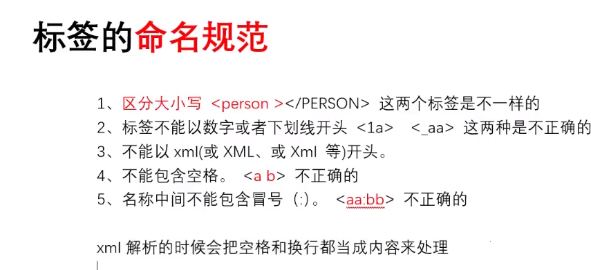
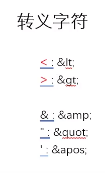
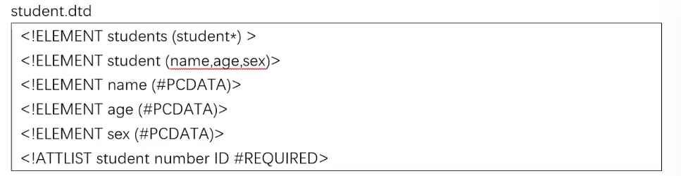
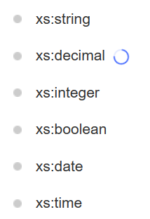

[toc]

### 应用

- 用于软件/框架的配置文件 --mysql my.ini -> port = 3306
- 保存数据
- 传输 / 交换数据

### 入门

```xml
<?xml version = "1.0" encoding = "utf-8"? standalone(可选)>
```



### 转义字符和 CDATA 区



character data
`<![CDATA[内容]]>`

里面写转义字符

### 处理指令

```xml
<?xml-stylesheet type = "text/css" href = "a.css">
```

### 约束

`dtd / schema`
did--



引入 dtd
在 student.xml 中

```xml
<!DOCTYPE students SYSTEM "student.dtd">
```

## schema

一些数据类型

