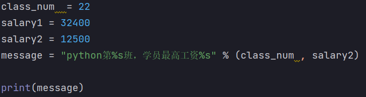

[toc]

### python 解释器的作用

将 Python 代码翻译成计算机认识的 0 / 1 并提交计算机执行。
在解释器环境内可以一行行执行代码。
也可用解释器程序，执行'.py'文件。

## 数值类型


### python 动态类型

**类型是属于对象的，而不是变量**

**变量没有类型，变量存储的数据有类型**

### 类型转换

## 标识符（变量、类、方法）命名规则--内容、大小写、关键字

- **内容限定**
- **大小写敏感**
- **不可使用关键字**
  False
  None
  True
  and not or
  as
  assert 断言
  async
  await
  break
  class
  continue while
  def
  except 包含捕获异常后的操作代码块，和 try / finally 结合使用。
  for
  from import
  global
  if in is
  lambda 定义匿名函数
  nonlocal 标识外部作用域的变量
  pass 空的类，方法或函数的占位符
  raise 异常抛出操作
  return
  with 简化 python 语句
  yield 用于从函数依次返回值

### 运算符

- 成员运算符
  IN / NOT IN
- 身份运算符
  IS / IS NOT

### 变量名命名规范

- \_
- 英文字符全小写

### 字符串

- 格式化 / **模板字符串**
  
  

**通过 f"内容{变量}"的格式**
不管类型 / 不做精度控制


**在无需使用变量进行数据存储的时候，可以直接格式化表达式，简化代码**

```python
print("字符串在python中的类型是：%s" % type('字符串'))
```

- 控制精度 --`m.n`
  `m` 控制宽度，要求数字（很少使用），设置宽度小于数字自身，不生效。
  `n`控制小数点精度，要求数字，会进行小数的四舍五入。
  
  

* **字符串内建函数**

```python
string.find(str , beg , end = len(string))
# 检查str是否包含在string中，不包含返回 -1

string.join(sequence)
# 将序列中的元素按string 连接成一个新的字符串
```

### 列表 `[]`

有序 的对象集合


- 更新 / 删除

```python
list.append('str')
# 更新添加

del list[]
# 删除列表元素
```

- **列表函数 / 方法**
  函数：

```python
cmp(list1 , list2)
len(list)
max(list)
min(list)
list(seq) # 将元组转换为列表
```


方法：

```python
list.append()
list.count(obj) # 统计某个元素在列表中的出现次数
list.extend(seq) # 扩展列表
list.index(obj) # 第一个匹配项的索引
list.insert(index , obj)
list.pop(index)
list.remove(obj) # 移除列表中某个值的第一个匹配项
list.reverse()
list.sort()
```

- del / pop(index) / remove(obj)区别
  del list[] 可删除任意位置元素并返回;
  remove(**obj**);
  pop(**index**);

### 元组 tuple `()`

用 `()`标识，不能二次赋值，相当于只读列表。

```python
tuple[index] # 元组索引
tuple(seq) # 将列表转换为元组
```

### 字典 dictionary `{}`

无序的对象集合
和列表区别：
通过键来存取，而非偏移存取。

```python
dict.clear() # 删除字典元素
dict.copy() # 字典的浅复制
dict.fromkeys(seq[ , val]) # 创建一个新字典，以序列seq中元素作为字典的键，val为字典所有键对应的初始值
dict.get(key , default = None) # 返回指定键的值
dict.has key(key) # python3不支持
dict.items() # 以列表返回可遍历的（键 ， 值）元组数组
dict.keys()
dict.update(dict2) # 把字典dict2的键/值对更新到dict里
dict.values()
pop(key[ , default])
popitem() # 返回并删除字典中最后一对键值对
```

### 字典练习


### 集合---Set

**创建一个空集合必须用{} ，因为{}是用来创建一个空字典**

```PYTHON
s.add(x)
# 添加元素
s.remove(x)
# 移除元素
s.discard(x)
# 同移除元素，且如果元素不存在，不会发生错误
s.pop()
# 随机删除一个元素
len(s)
# 统计集合中的元素个数
s.clear()
# 清除集合元素
x in s

copy(s)

intersection(set1 , set2 , ...)
# 返回集合的交集
union(set1 , set2 , ...)
## 饭hi

```

## 函数

### 参数类型

- 必备参数
- 关键字参数
  允许函数调用时参数顺序和声明时不一致（自动匹配）：

  ```python
  def printme(str):
    print(str)

  print(str = "Germany")
  ```

- 默认参数

  ```python
  def printme(age = 30 , name):
    print(age , name)

  printme(nam = 'Nikki')
  ```

- 不定长参数
  `*val*`

  ```python
  def printme(arg1 , *val):
    for i in val:
      print(i)

  print(1 , 2 , 3)
  # 2
  # 3
  ```

### 匿名函数--lambda

```python
sum = lambda arg1 , arg2:arg1 + arg2

print sum(1 , 3)
# 4
```

### return

即函数运算的结果

结果：None


结果：30

### 可更改（mutable）对象--list , dict / 不可更改(immutable) 对象--strings , tuples , numbers

- a=5 后再赋值 a=10，这里实际是新生成一个 int 值对象 10，再让 a 指向它，而 5 被丢弃，不是改变 a 的值，相当于新生成了 a。
- 可变类型：变量赋值 la=[1,2,3,4] 后再赋值 la[2]=5 则是将 list la 的第三个元素值更改，本身 la 没有动，只是其内部的一部分值被修改了。

**python 函数的参数传递**：

- 不可变类型：类似 c++ 的值传递，如 整数、字符串、元组。如 fun(a)，传递的只是 a 的值，没有影响 a 对象本身。比如在 fun(a)内部修改 a 的值，只是修改另一个复制的对象，不会影响 a 本身。
- 可变类型：类似 c++ 的引用传递，如 列表，字典。如 fun(la)，则是将 la 真正的传过去，修改后 fun 外部的 la 也会受影响

## 模块--Module

### globals() / locals()

### reload()

## 文件

计算机中可用编码--UTF-8 /
编码--记录内容和二进制之间转换的内容

**open()打开函数**

```python
open(name , mode , encoding)
# name:要打开的目标文件名的字符串
# mode:设置打开文件的模式：只读 / 写入 / 追加 -- r / w / a
# encoding:编码格式（UTF-8）
f = open('python.txt' , 'r' , encoding = 'UTF-8')
# 此时f是open函数的文件对象
```

### 文件读取

会续接上一次读取记录

```python
f = open("D:/测试.txt" , "r" , encoding = "UTF-8")
# 打开文件
read()
# 读取文件
readLines()
# 读取文件全部行，封装到列表中
readLine()
# 读取文件--一次读取一行内容

f.close()
# 文件的关闭，
with.open() as f:
# with open语法操作文件
```

### 迭代器 iterator()

### iter() / next()

```python
_iter_()  / _next()_
# 创建迭代器


## 面向对象

self 相对于 其他编程语言的 this 指针，self 通常作为类方法的第一个参数，用于访问实例变量、实例方法和类方法。


_init_()：类的构造函数或初始化方法。

### 函数属性

- getattr(obj , name[ , default])--访问对象属性
- hasattr(obj , name)--检查是否存在一个属性
- settattr(obj , name , value)--设置一个属性，若不存在，创建一个新属性
- delattr(obj , name)--删除属性

### 函数内置类属性

- _dict_ : 类属性--包含一个字典， 由类的数据属性组成
- _doc_ : 类的文档字符串
- \_name : 类名
-

```

```

```
