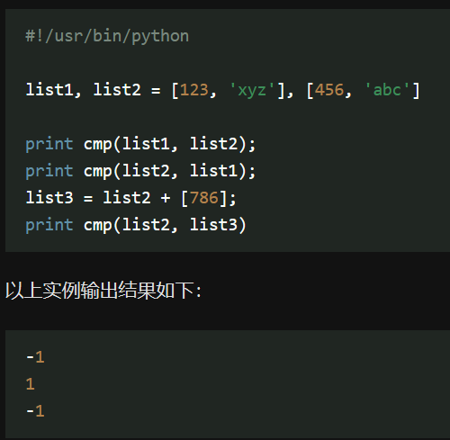
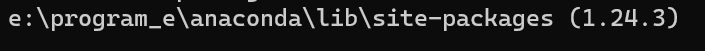
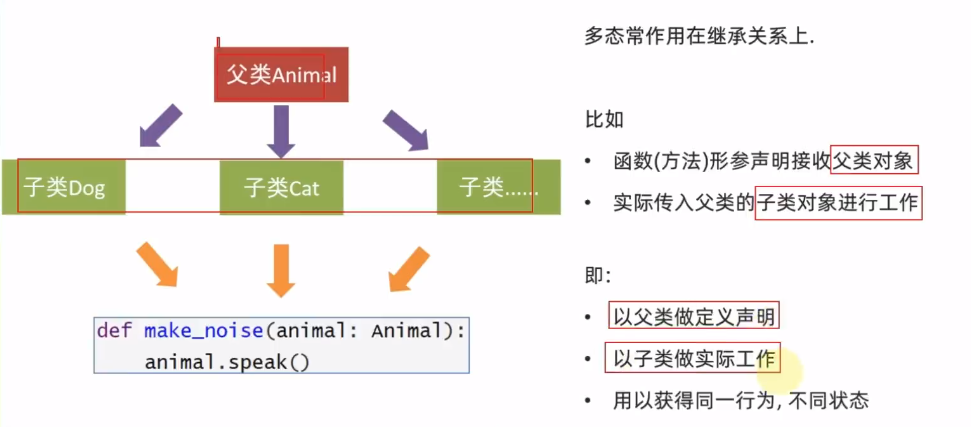
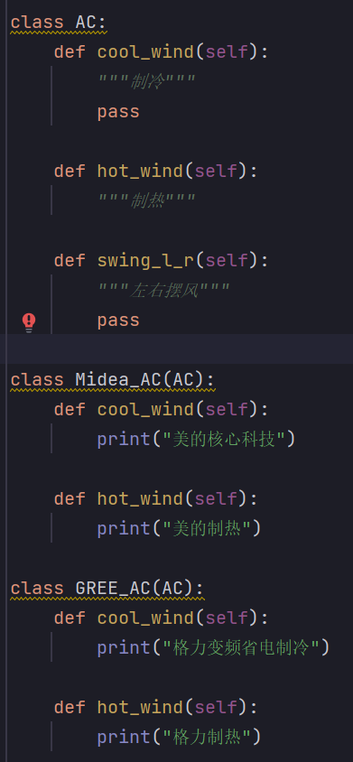

[toc]

### python 解释器的作用

将 Python 代码翻译成计算机认识的 0 / 1 并提交计算机执行。
在解释器环境内可以一行行执行代码。
也可用解释器程序，执行'.py'文件。

## 数值类型


### python 动态类型

**类型是属于对象的，而不是变量**

**变量没有类型，变量存储的数据有类型**

### 类型转换

## 标识符（变量、类、方法）命名规则--内容、大小写、关键字

- **内容限定**
- **大小写敏感**
- **不可使用关键字**
  False
  None
  True
  and not or
  as
  assert 断言
  async
  await
  break
  class
  continue while
  def
  except 包含捕获异常后的操作代码块，和 try / finally 结合使用。
  for
  from import
  global
  if in is
  lambda 定义匿名函数
  nonlocal 标识外部作用域的变量
  pass 空的类，方法或函数的占位符
  raise 异常抛出操作
  return
  with 简化 python 语句
  yield 用于从函数依次返回值

### 运算符

- 成员运算符
  IN / NOT IN
- 身份运算符
- IS / IS NOT

### 位运算符


### 变量名命名规范

- \_
- 英文字符全小写

## 字符串

- 格式化 / **模板字符串**
  
  

**通过 r 防止字符串转义**


**通过 f"内容{变量}"的格式**
不管类型 / 不做精度控制


**在无需使用变量进行数据存储的时候，可以直接格式化表达式，简化代码**

```python
print("字符串在python中的类型是：%s" % type('字符串'))
```

- 控制精度 --`m.n`
  `m` 控制宽度，要求数字（很少使用），设置宽度小于数字自身，不生效。
  `n`控制小数点精度，要求数字，会进行小数的四舍五入。
  
  

* **字符串内建函数**

```python
string.find(str , beg , end = len(string))
# 检查str是否包含在string中，不包含返回 -1

string.join(sequence)
# 将序列中的元素按string 连接成一个新的字符串

string.split(str = ',', num = string.count(str))
# str-- 分隔符，
# num -- 分割次数，默认-1，即分割所有

string.strip([char])
# 截掉字符串左边或右边的空格符或指定字符

```

### str.format()

```python
"{1}{0}{1}".format("hello" , "world")
//"world hello world"


```

## 列表 `[]`

有序 的对象集合


- 更新 / 删除

```python
list.append('str')
# 更新添加

del list[]
# 删除列表元素
```

- **列表函数 / 方法**
  函数：

```python
cmp(list1 , list2)
len(list)
max(list)
min(list)
list(seq) # 将元组转换为列表
```



方法：

```python
list.append()
list.count(obj) # 统计某个元素在列表中的出现次数
list.extend(seq) # 扩展列表
list.index(obj) # 第一个匹配项的索引
list.insert(index , obj)
list.pop(index)
list.remove(obj) # 移除列表中某个值的第一个匹配项
list.reverse()
list.sort()
```

- del / pop(index) / remove(obj)区别
  del list[] 可删除任意位置元素并返回;
  remove(**obj**);
  pop(**index**);

## 元组 tuple `()`

用 `()`标识，不能二次赋值，相当于只读列表。

```python
tuple[index] # 元组索引
tuple(seq) # 将列表转换为元组
```

## 字典 dictionary `{}`

无序的对象集合
和列表区别：
通过键来存取，而非偏移存取。

```python
dict.clear() # 删除字典元素
dict.copy() # 字典的浅复制
dict.fromkeys(seq[ , val]) # 创建一个新字典，以序列seq中元素作为字典的键，val为字典所有键对应的初始值
dict.get(key , default = None) # 返回指定键的值
dict.has key(key) # python3不支持
dict.items() # 以列表返回可遍历的（键 ， 值）元组数组
dict.keys()
dict.update(dict2) # 把字典dict2的键/值对更新到dict里
dict.values()
pop(key[ , default])
popitem() # 返回并删除字典中最后一对键值对
```

### 字典练习


## 集合---Set

**创建一个空集合必须用{} ，因为{}是用来创建一个空字典**

```PYTHON
s.add(x)
# 添加元素
s.remove(x)
# 移除元素
s.discard(x)
# 同移除元素，且如果元素不存在，不会发生错误
s.pop()
# 随机删除一个元素
len(s)
# 统计集合中的元素个数
s.clear()
# 清除集合元素
x in s

copy(s)

intersection(set1 , set2 , ...)
# 返回集合的交集
union(set1 , set2 , ...)
## 饭hi

```

## 函数

### 参数类型

- 必备参数
- 关键字参数
  允许函数调用时参数顺序和声明时不一致（自动匹配）：

  ```python
  def printme(str):
    print(str)

  print(str = "Germany")
  ```

- 默认参数

  ```python
  def printme(age = 30 , name):
    print(age , name)

  printme(nam = 'Nikki')
  ```

- 不定长参数
  `*val*`

  ```python
  def printme(arg1 , *val):
    for i in val:
      print(i)

  print(1 , 2 , 3)
  # 2
  # 3
  ```

### 匿名函数--lambda

```python
sum = lambda arg1 , arg2:arg1 + arg2

print sum(1 , 3)
# 4
```

### return

即函数运算的结果

结果：
30 None


结果：30

### 可更改（mutable）对象--list , dict / 不可更改(immutable) 对象--strings , tuples , numbers

- a=5 后再赋值 a=10，这里实际是新生成一个 int 值对象 10，再让 a 指向它，而 5 被丢弃，不是改变 a 的值，相当于新生成了 a。
- 可变类型：变量赋值 la=[1,2,3,4] 后再赋值 la[2]=5 则是将 list la 的第三个元素值更改，本身 la 没有动，只是其内部的一部分值被修改了。

**参数作为数据传递和参数作为计算逻辑传递**
任何逻辑都可以自定义并作为函数传入

```python
def test_func(compute):
  result = compute(1 , 2)
  print(result)
# 作为计算逻辑传递

def add(x , y):
  return x + y
# 作为数据传递
```

**python 函数的参数传递**：

- 不可变类型：类似 c++ 的值传递，如 整数、字符串、元组。如 fun(a)，传递的只是 a 的值，没有影响 a 对象本身。比如在 fun(a)内部修改 a 的值，只是修改另一个复制的对象，不会影响 a 本身。 
- 可变类型：类似 c++ 的引用传递，如 列表，字典。如 fun(la)，则是将 la 真正的传过去，修改后 fun 外部的 la 也会受影响

## 模块--Module

### 导入模块

```python
from time import * / fun as 别名
# 可以直接用模块函数
sleep(5)

import time
# 需要加模块名.fun()
time.sleep()
```

### 自定义模块


### \***\*main**变量\*\*

```python
if __name__ == '__main__'
# 标识只有当程序是直接执行的才会进入if内部，如果是被导入的，则if无法进入
```

即判断是执行程序还是模块引入。
**当被调用时就不执行，当前文件运行时就执行**

### \***\*all**变量\*\*

控制导入模块时哪些功能可以被导入


### globals() / locals()

### reload()

## 文件

计算机中可用编码--UTF-8 /
编码--记录内容和二进制之间转换的内容

**open()打开函数**

```python
open(name , mode , encoding)
# name:要打开的目标文件名的字符串
# mode:设置打开文件的模式：只读 / 写入 / 追加 -- r / w / a
# encoding:编码格式（UTF-8）
f = open('python.txt' , 'r' , encoding = 'UTF-8')
# 此时f是open函数的文件对象
```

### 文件读取--r

会续接上一次读取记录

```python
f = open("D:/测试.txt" , "r" , encoding = "UTF-8")
# 打开文件
read()
# 读取文件
readLines()
# 读取文件全部行，封装到列表中
readLine()
# 读取文件--一次读取一行内容

f.close()
# 文件的关闭，
with.open() as f:
#
#  open语法操作文件
```

**for 循环每次循环将文件的一行数据赋值给临时变量**

```python
for 临时变量 in 文件对象:
  # 每次循环将一行数据赋值给临时变量
  # 每次对读取的一行数据进行操作
```

### 写操作--w

```python
f = open('python.txt' , 'w')
# 打开文件

f.write('hello , world')
# 文件写入

f.flush()
# 内容刷新
```

- 直接调用 write，内容并未真正写入文件，而是积攒在程序的内存中，称为缓冲区。
- 当调用 flush 时，内容会真正写入文件
- 优点：避免频繁操作硬盘，导致效率下降（攒一堆，一次写入硬盘）

**attention**
w 模式，文件不存在，会创建新文件
w 模式，文件存在，会清空原有内容
close()方法，带有 flush()方法的功能

### 追加写入--a


### 读写练习


## 异常

### 捕获异常

```python
# 捕获所有异常1
try:
  # 可能发生错误的代码
except:
  # 如果出现异常执行的代码

# 捕获所有异常2
try:
  ##
except Exception as e:
  print('出现异常了')


# 捕获指定异常
try:
  print(name)
except NameError as e:
  print(出现了未定义的异常)

# 捕获多个异常
try:
  1 / 0
  print(name)
except (NameError / zeroDivisionError) as e:
  print('出现了变量未定义 或者 除以0的异常错误')

# else没有出现异常 , finally无论出现异常与否都输出
try:
  ###
except:
  ###
else:
  print('没有出现异常')
finally:
  ###
```


### 异常传递器


## python 包

### 导入包--\_init**.py 中添加**all\_\_控制允许导入的模块

### 第三包

numpy--科学计算

pandas--数据分析
matplotlib / pyecharts--图形可视化
tensorflow--人工智能

### 模块、包练习

## JSON

```python
import JSON

data = [{"name" : "老王" , "age" : 334} , {"name" : "李飞" , "age" : 33}]

# 通过json.dumps(data)把python数据转化为JSON数据
data = json.dumps(data)

# 通过json.loads(data)把json数据转换为python数据
data = json.loads(data)
```

## enumerate()

`enumerate(sequence , [start = 0])`

## 迭代器 iterator()

可迭代对象:

```python
iterables = [
  '123' ,
  [1 , 2 , 3],
  (1 , 2 , 3),
  {1 : '1' , 2 : '2'}
  {1 , 2 , 3}
]
```

**共同属性**：

```python
{'__contain' , '__len__' , '__iter__'}

# 文件也是可迭代对象
# 添加文件后共同交集：
{'__iter__'}

# __iter__方法，调用的内置函数就是iter()
```

### iter() / next()

```python
_iter_()  / _next()_
# 创建迭代器
```

**迭代器**

```python
# 接口
actions = ['点赞' , '投币' , '收藏']

action_iterator = iter(actions)

# 多次迭代
action = next(action_iterator)
print(action)
```

### 生成器 generator()

**使用 yield()**
用于在迭代过程中逐步产生值，而不是一次性返回所有结果。


## 面向对象

### 面向对象基本

- 类
- 类变量
  在整个实例化对象中公用，定义在类中且在函数体之外，通常不作为实例变量使用；
- 方法重写--override
- 局部变量
  定义在方法中变量，只作用于当前实例的类
- 实例变量
- 继承

### self

python 中的 self 相当于 c++ 中的 this 指针。

在类中定义成员方法和定义函数基本一致，但有细微差别：

```python
def 方法(self , 形参1 , ... , 形参N):
  方法体
```

- self 用来标识类对象自身的意思；
- 当使用类对象调用方法时，self 会自动被 python
- 在方法内部，想访问类的成员变量，必须使用 self

self 相对于 其他编程语言的 this 指针，self 通常作为类方法的第一个参数，用于访问实例变量、实例方法和类方法。

### `__init__()`构造方法


`__init__()`：类的构造函数或初始化方法。

构建类时传入的参数会自动提供给**init**()方法


### 函数属性

- getattr(obj , name[ , default])--访问对象属性
- hasattr(obj , name)--检查是否存在一个属性
- settattr(obj , name , value)--设置一个属性，若不存在，创建一个新属性
- delattr(obj , name)--删除属性

### 其他内置方法

- `__str__`字符串方法
- `__lt__`小于符号比较方法
  

### 函数内置类属性

- _dict_ : 类属性--包含一个字典， 由类的数据属性组成
- _doc_ : 类的文档字符串
- \_name : 类名
-

## why anaconda?

- 自带许多数据科学包
- 管理包
- 管理环境

### 封装


**私有成员**

- 私有成员变量
  `__变量`
- 私有成员方法
  `__方法`
  
  

**可以被类中其他成员使用**

### 封装练习


```python
# 手机类
class Phone:
    __is_5g_enable = False

    # 提供私有方法
    def __check_5g(self):
        if self.__is_5g_enable:
            print("5g开启")
        else:
            print("5g关闭，使用4g网络")

    # 提供公开方法
    def call_by_5g(self):
        self.__is_5g_enable()
        print("正在通话中")

phone = Phone()
phone.call_by_5g()
```

### 继承

```python
# 单继承
class 类名(父类名):
  类内容体

# 多继承
class 类名(父类1 , 父类2 , ... , 父类N)
  # pass使语法通过
  pass
```

多继承时，如果父类成员名字一样，则优先左边。

### 覆写

**如果子类中定义与父类同名的方法或属性，则会自动覆盖父类对应的方法或属性。**
如果需要使用被复写的父类成员，则需要特殊调用方式：

- 调用父类成员
  使用成员变量：父类名.成员变量
  使用成员方法：父类名.成员方法()
- 使用 super()调用父类成员
  super().成员变量
  super().成员方法()

## 类型注解

写法 1

- 为变量设置类型注解：

```python
# 基础数据类型注解
var_1 : int = 10

# 类对象类型注解
class Student:
  pass
stu : Student = Student()

# 基础容器类型(详细）注解
my_list : list[int] = [1 , 2 , 3]
my_tuple : tuple[int , str , bool] = (1 , "2" , True)
my_set : set[int] = {1 , 2 , 3}
my_dict : dict[str , int] = {'yu' : 'si'}
my_str : str = 'yusiquweierwang'

# 容器类型
```

写法 2：

- 在注释中进行类型注解# type : 类型

  

### 为函数（方法）形参进行类型注解

```python
def func(形参名 : type , 形参名 : type ...):
  pass
```

### 为函数（方法）返回值进行类型注解

```python
def func(形参 : type , ...) -> 返回值类型:
```


### Union 类型

```python
from typing import Union

my_list : dict[str , Union[str , int]] = {"name" : "周杰伦" , "age" : 33}

# 返回值
def func(data : Union[int , str]) -> Union[int , str]:
```


## 多态

一个接口， 多种实现

同样的行为（函数），传入不同的对象，得到不同的状态。


### 在抽象类中

抽象类类似定义了一个标准，包含了一些抽象的方法，要求子类必须实现：


配合多态，完成：

- 抽象的父类设计（设计标准）
- 具体的子类实现（实现标准）
  

### duck typing

## python 新语法

### format 函数


或 3.6 以上 `f-string`

### yield 函数

## with

`with`用来管理文件或数据库连接，以确保在使用完资源后正确关闭或释放它们。

```python
# 打开文件并写入数据
with open('example.txt', 'w') as file:
    file.write('Hello, world!')

# 在这里，文件已经在with语句块结束后自动关闭了
```

# python 自动化

## 爬虫

要获取静态网页的网页数据只需要给服务器发送该网页 url 地址就行，而动态网页的数据因为是存储在后端的数据库里。所以要获取动态网页的网页数据，我们需要向服务器发送请求文件的 url 地址，而不是该网页的 url 地址。

### XHR

爬虫时点击网络-XHR 分类

```
XHR类型即通过XMLHttpRequest方法发送的请求，它可以在后台与服务器交换数据，这意味着可以在不加载整个网页的情况下，对网页某部分的内容进行更新。也就是说，向数据库请求然后得到响应的数据是XHR类型的
```
