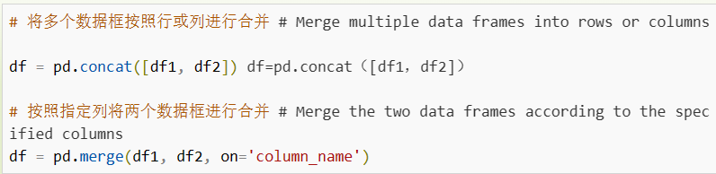

[toc]

### Series()
类似固定大小的字典：

```python
pandas.Series(data , index , dtype , name , copy)
```

- data : array
- index
- dtype
- name
- copy:(default:false)


**方法**
`get()`提取series没有的标签，返回none或指定默认值：


### DataFrame()

pandas.DataFrame( data, index, columns, dtype, copy)


**提取、添加、删除列**


**用方法链方式分配新列-assign()**

assign()d 返回的都是数据副本，原 DataFrame 不变


### read_csv

head(n)-读取前面 n 行。default5 行。

tail(n)-读取尾部 n 行。

### read_json()

嵌套数据：


使用`json_normalize()`将内嵌数据解析

```python
pandas.json_normalize(
    data , # 数据
    record_path = [ ], #用于展开的内嵌JSON数据
    meta = [ ], # 展示不用展开内嵌的数据
)
```


## 数据清洗

对没有用的数据进行处理。

### 清洗空值-dropna()

```python
DataFrame.dropna(
    axis, # 默认0表示逢空值去掉整行，1表示逢空值去掉整列
    how, # 默认any\
    thresh,
    subset,
    inplace
)
```


通过`isnull()`判断各个单元格是否为空。


```python
DataFrame.fillna(value) # 将缺失值替换为指定的值

DataFrame.replace(old_value , new_value) # 将指定值替换为新值

DataFrame.duplicate() # 检查是否有重复数据

DataFrame.drop_duplicates() # 删除重复的数据
```

## 数据选择和切片

```python
df['column_name'] # 选择指定的列

df.loc[row_index , column_name] # 通过位置选择数据

df.iloc[row_index , column_index] # 通过标签或位置选择数据

df.filter(items = ['column_name1' , 'column_name2']) # 选择指定的列

df.filter(regex = 'regex') # 选择列名匹配正则表达式的列

df.sample(n = 5)

```

### 数据排序


### 数据分组和聚合


### 数据合并-data merging



### 数据选择和过滤

```python
df.loc[row_index  , col_index] # 按标签选择行和列

df.iloc[row_index , col_index] # 按位置选择行和列

```
