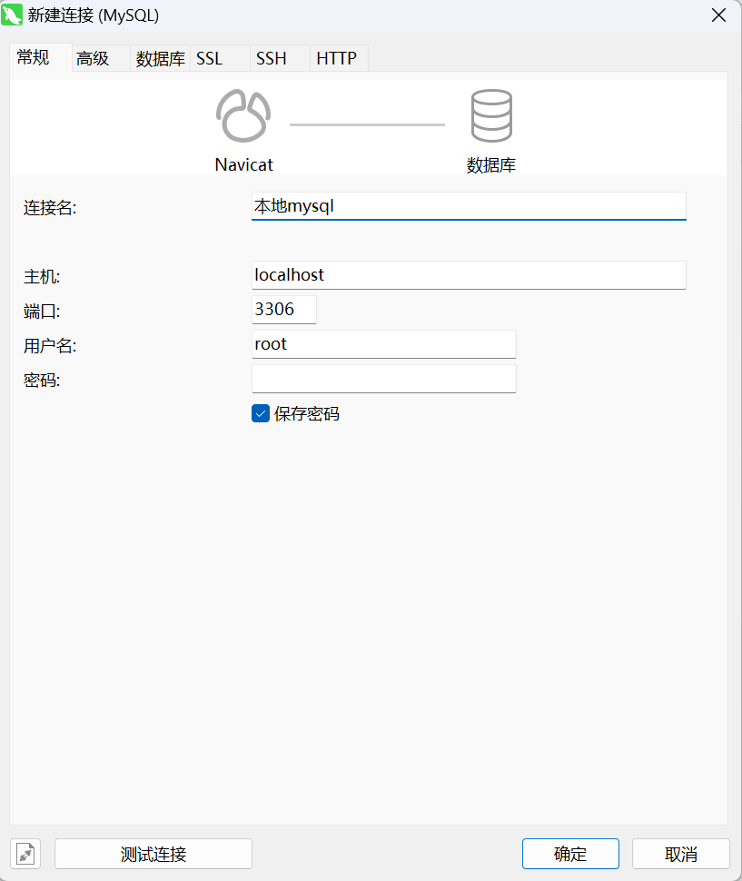

[toc]

### 我的mysql可执行路径

服务->Mysql57->

`"D:\DProgramFiles\mysql\bin\mysqld.exe" --defaults-file="C:\ProgramData\MySQL\MySQL Server 5.7\my.ini" MySQL57`

登录到mysql:
`terminal=>mysql -u root -p`
`-u`即管理员。
`-p`即以用户密码方式登录。

### 使用navicat 

all patch solutions are suppressed.patch abort

