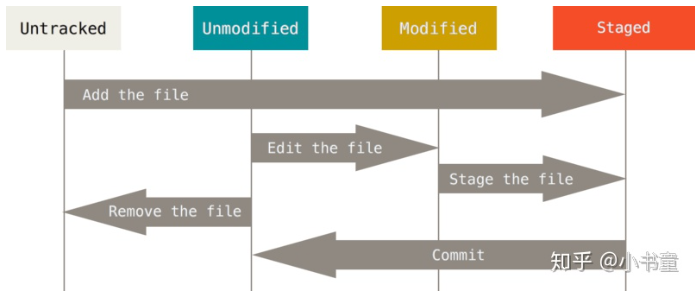

### git 仓库的 SSH 传输

git 默认支持两种传输协议：`SSH`&`HTTPS`。

### 基本指令

从远程 cLone 一个仓库
`git clone <remote url>`

显示当前工作目录下的提交文件状态
`git status`

将指定文件 stage(标记为将要被提交的文件)
`git add <path>`

将指定文件 unstage（取消将被标记的文件）
`git reset <path>`

创建要给提交并提供提交信息
`git commit -m "提交信息"

显示提交历史
`git log`

向远程仓库推送
`git push`

从远程仓库拉取
`git pull`

### 进阶

改写{amend}
对已提交的信息进行修改
（最好对本地提交使用）

提交代码在默认 master 上，创建分支

分支合并（merge）
若多人修改同一行代码，会冲突 conflict，compare 修改完后。

### git 文件四种状态

untracked
unmodified
modified
staged

### fetch

直接用 pull 会直接将远程仓库项目覆盖到工作区,所以应先用 fetch 将远程仓库项目添加到 repo,然后用 diff 对比区别，无问题再合并。

### 不需要提交（忽略的文件）

### git 中有两个人同时对一个文件进行修改，需要进行合并操作（merge)

- git pull
