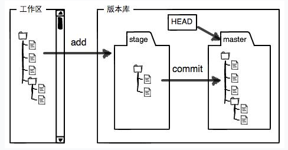
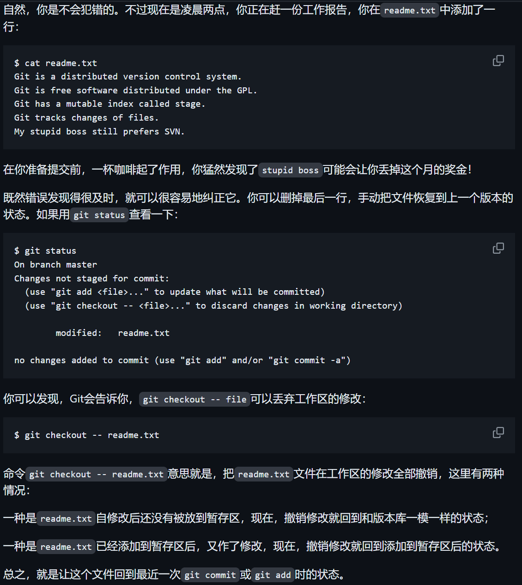
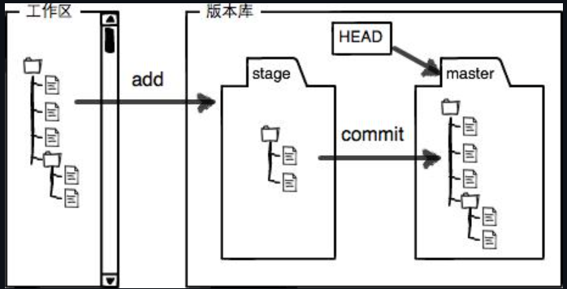
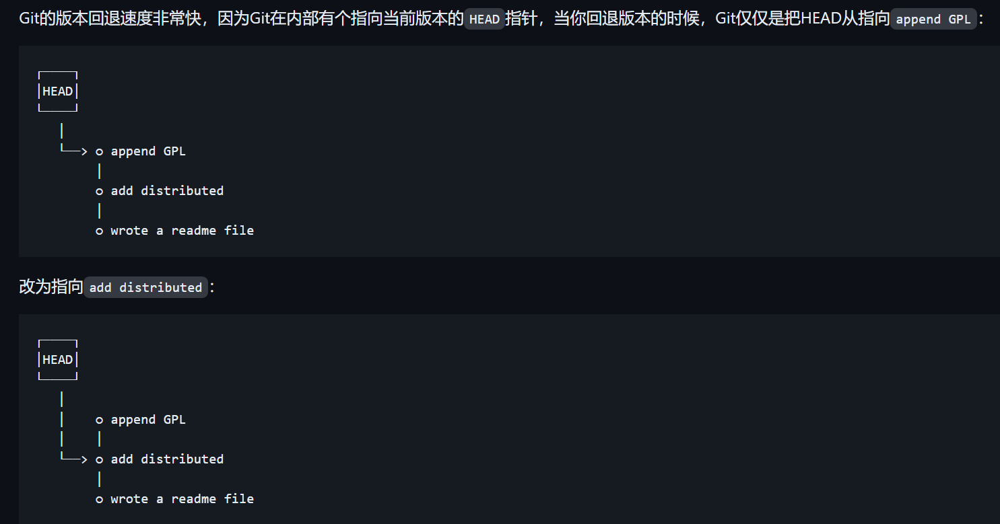
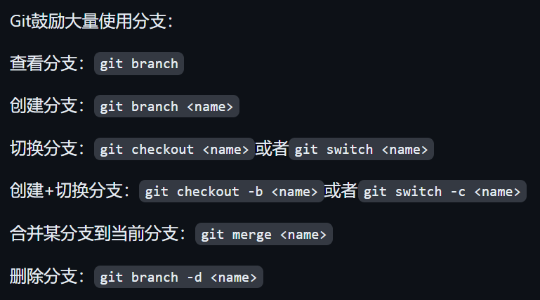
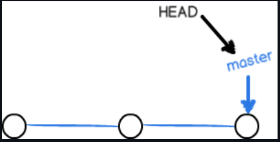
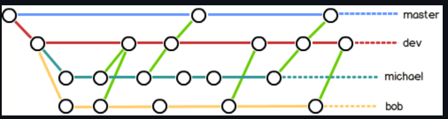
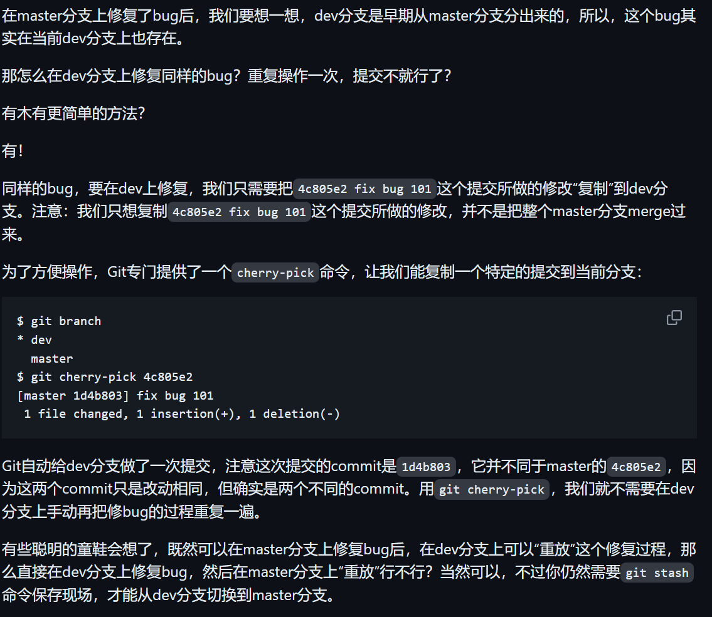
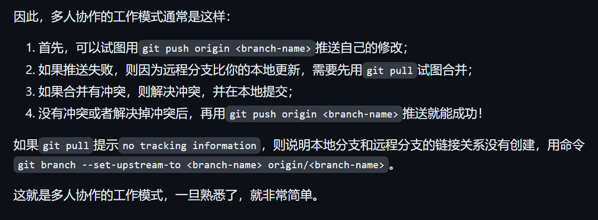

## what is git?
**分布式版本控制系统。**

git 管理的是 **-修改**，而不是 **文件**

git 两大功能：版本管理/ 分布式协作


## git 版本库 ( 仓库)
repository

  
`pwd`显示当前目录

```
$ mkdir learngit
$ cd learngit
$ pwd
/Users/michael/learngit
```

Git的版本库里存了很多东西，其中最重要的就是称为**stage（或者叫index）的暂存区**，还有Git为我们自动创建的**第一个分支master，以及指向master的一个指针叫HEAD**。




## git 管理修改
提交后，可以用`git diff HEAD --你的文件`命令来查看工作区和版本库里面最新的版本的区别

### 撤销修改

+ **git checkout -- file 丢弃工作区的修改**
`--`很重要，没有就变成“切换到另一个分支的命令.


场景：乱改了工作区某个文件的内容，想直接丢弃工作区的修改时.



### 版本控制

## git 原理

- git 首先指定一个目录作为工作区
- git 会自动在工作区生成一个.git 文件夹，作为版本库。
  - 存储版本变化信息。
- 同时，.git 中会有一个 index 文件夹，作为暂存区
  - 做的所有改动都会被自动记录，此时 git add 会储存到暂存区中

### git 仓库的 SSH 传输

git 默认支持两种传输协议：`SSH`&`HTTPS`。

### 基本指令

从远程 cLone 一个仓库
`git clone <remote url>`

显示当前工作目录下的提交文件状态
`git status`

将指定文件 stage(标记为将要被提交的文件)
`git add <path>`

将指定文件 unstage（取消将被标记的文件）
`git reset <path>`

创建要给提交并提供提交信息
`git commit -m "提交信息"

显示提交历史
`git log`

向远程仓库推送
`git push`

从远程仓库拉取
`git pull`

`git diff filename`
比较暂存区和工作区的文件差异

`git blame filename`
逐行查看文件的改动

### 进阶

改写{amend}
对已提交的信息进行修改
（最好对本地提交使用）

提交代码在默认 master 上，创建分支

分支合并（merge）
若多人修改同一行代码，会冲突 conflict，compare 修改完后。

### git 文件四种状态

untracked
unmodified
modified
staged


暂存区 stage / index：



### git reset HEAD `<file>` - 撤销掉（unstage）暂存区的修改，重新放回工作区

场景：不仅改了工作区某文件内容，还添加到暂存区时，想丢弃修改，两步：

- git reset HEAD `<file>`
- git checkout --file

### reset - 回退到上一个 commit 版本

场景：已经提交了不合适的修改到版本库时，想要撤销本次提交，参考版本回退一节，不过前提是没有推送到远程库。

```
git reset --hard xx
```

回滚原理：


**回滚分类**
```
git reset --hard HEAD^
//HEAD 表示当前版本，HEAD^^表示上上个版本
//--hard 会回退到上个版本的已提交状态。

//--soft 会回退到上个版本的未提交状态。

//--mixed 会回退到上个版本已添加但未提交状态


```


### git reflog - 查看命令历史，确定要回到未来的哪个版本。
吃后悔药

记录了每一次命令


### 删除文件 两种情况——确实要删除和误删

- 确定删除 `git rm`
- 误删，想把误删文件恢复到最新版本。

```
git checkout -- file
```
## 远程仓库

关联远程仓库
`git remote add origin git@server-name:path/repo-name.git
`


### 连接 github

本地 git 仓库和 github 仓库之间的传输是通过 SSH 加密的。


## 
### **git checkout 原理：用版本库里的版本替换工作区的版本**

### fetch

直接用 pull 会直接将远程仓库项目覆盖到工作区,所以应先用 fetch 将远程仓库项目添加到 repo,然后用 diff 对比区别，无问题再合并。

### 不需要提交（忽略的文件）

### git 中有两个人同时对一个文件进行修改，需要进行合并操作（merge)

- git pull

### 项目中 git 提交

git > 提交 > 勾选更改 > 提交信息 > 提交（不选提交并推送）> git > 拉取 > 合并冲突

不提交直接拉取：

git>更新分支 > 合并到 > 拉取

未进行版本管理的文件。


## 分支管理

### 创建分支和合并分支

每次提交，git 将他们串成一条时间线，此时间线就是一个分支。





- 创建 dev 分支，然后切换到 dev 分支:

```
git checkout -b dev
Switched to a new branch 'dev'
```

- 在 dev 分支上正常提交，比如对 readme.txt 做个修改，然后提交

```
git add readme.txt
git commit -m 'branch test'
```

- 现在 dev 分支工作完成，可以切换回 master 分支：

```
git checkout master
```

- 把 dev 分支的工作成果合并到 master 分支上：

```
git merge dev
```

- 合并后，就可以放心删除 dev 分支了：

```
git branch -d dev
//-d delete
```

### 分支策略

master-仅用来发布新版本，平时不在上面干活；
dev-干活分支；
团队合作分支 belike:


### BUG 分支-git stash - 通过一个新的临时分支来修复，修复后，合并分支，然后删除临时分支

**git stash**-

### cherry-pick - 复制一个特定的提交到当前分支



### 多人协作



### rebase
