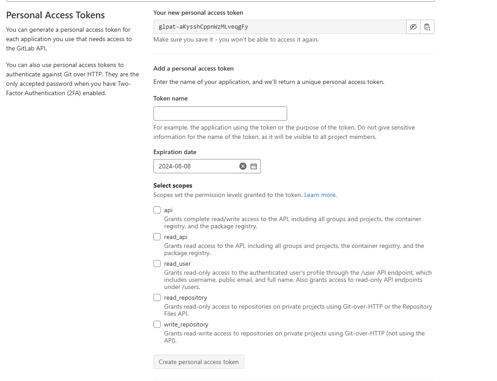

# UE5

### 使用 vs 生成 cmake 编译好的工程时报错：无法启动程序......拒绝访问。

https://blog.csdn.net/weixin_44120025/article/details/115270215?spm=1001.2101.3001.6650.2&utm_medium=distribute.pc_relevant.none-task-blog-2%7Edefault%7ECTRLIST%7ERate-2-115270215-blog-78053055.235%5Ev43%5Epc_blog_bottom_relevance_base8&depth_1-utm_source=distribute.pc_relevant.none-task-blog-2%7Edefault%7ECTRLIST%7ERate-2-115270215-blog-78053055.235%5Ev43%5Epc_blog_bottom_relevance_base8&utm_relevant_index=5

### 项目启动时报错-`UnrealBuildTool failed with exit code 0xe0434352`

- 先把 Binaries / intermediate / saved 文件夹删除，右键 Uproject ： generate vs project files。
- 打开.sln，解决方案配置设置为 developer editor，调试。
- 失败，则右键 games /
- 有可能是中文原因，再重新生成调试，查看错误报告
- 用 tortoiseGit
- 在项目“testE/AgentSim/AgentSim”下面右键 git commit > 'main'
- 重新调试

### 材质问题

- 找到材质文件 - 父项 - c4dreference
- datasmith 文件夹的问题 ，拷贝好的替换文件夹。

## git 问题

### 令牌问题 access denied

设置 - 版本控制 - gitlab - 登录 - 登录失败时获取令牌 - selected scopes 全选 -create - 上面即 your new personal access token

