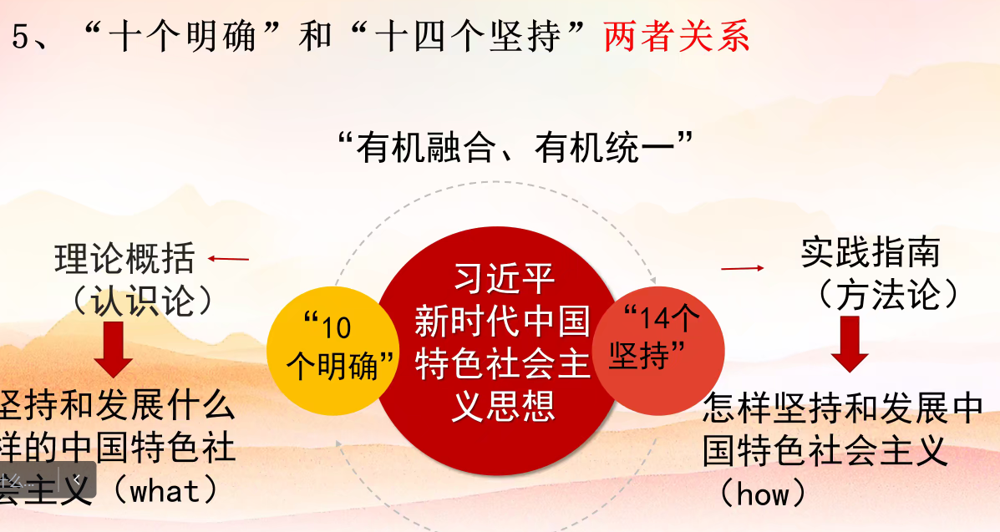

[toc]

我国国体：
工人阶级领导以工农联盟为基础的人民民主专政的社会主义国家。

新民主主义革命伟大成就--
社会主义革命和建设伟大成就--
改革开放和社会主义现代化建设--
新时代中国特色社会主义--

南海：搁置争议，共同开发。

我国政体：人民代表大会制度

### 党的基本理论、基本路线、基本方略

党的基本理论--马克思主义中国化成果：马列主义、毛泽东思想、中国特色社会主义理论体系。

党的基本路线--（十九大）领导和团结全国各族人民，以经济建设为中心， 坚持四项基本原则 （ 即坚持社会主义道路、坚持人民民主专政、坚持共产党的领导、坚持马克思列宁主义毛泽东思想 ），坚持改革开放 ，自力更生，艰苦创业，为把我国建设成为富强、民主、文明、和谐、美丽的社会主义现代化强国而奋斗。

党的基本方略--坚持党对一切工作的领导、坚持以人民为中心、坚持深化改革。

## 二十大

### 中国共产党的中心任务

团结带领全国各族人民全面建成社会主义现代化强国、实现第二个百年奋斗目标，以中国式现代化全面推进中华民族伟大复兴。

## 习近平新时代中国特色社会主义思想核心要义

### 1 思想旗帜--两个结合 / 六个必须坚持 / 十个明确 / 十四个坚持 / 十三个方面成就

马克思主义是在工人运动和社会主义的运动和实践中不断丰富发展起来的，也因此具有科学性、。。。

- 两个结合——把马克思主义基本原理同中国具体实际相结合 / 把马克思主义基本原理同中华优秀传统文化相结合。

* 是个明确——明确中国特色社会主义**最本质的特征是中国共产党领导** / 明确坚持和发展中国特色社会主义，**总任务是实现社会主义现代化和中华民族伟大复兴** / 明确新时代我国社会**主要矛盾**是人民日益增长的美好生活需要和不平衡不充分的发展之间的矛盾 / 明确中国特色社会主义事业**总体布局**是经济建设、政治建设、文化建设、社会建设、生态文明建设五位一体 / 明确全面深化改革**总目标**是完善和发展中国特色社会主义制度、推进国家治理体系和治理能力现代化 / 明确全面推进依法治国总目标是建设中国特色社会主义法治体系、建设社会主义法治国家 / 明确必须坚持和完善社会主义基本经济制度 / 明确党在新时代的强军目标是建设一支听党指挥、能打胜仗、作风优良的人民军队 / 明确中国特色大国外交要服务民族复兴、促进人类进步，推动建设新型国际关系，推动构建人类命运共同体 / 明确全面从严治党的战略方针。

* 十四个坚持——
  坚持党对一切工作的领导
  坚持以人民为中心
  坚持全面深化改革
  坚持新发展理念
  坚持人民当家作主
  坚持全面依法治国
  坚持社会主义核心价值他体系
  坚持在发展中保障和改善民生
  坚持人与自然和谐共生
  坚持总体国家安全观

* 十三个方面成就——党的十九届六中全会通过的《中共中央关于党的百年奋斗重大成就和历史经验的决议》，从坚持党的全面领导、全面从严治党、经济建设、全面深化改革开放、政治建设、全面依法治国、文化建设、社会建设、生态文明建设、国防和军队建设、维护国家安全、坚持“一国两制”和推进祖国统一、外交工作方面，深刻总结了党的十八大以来党和国家事业取得的历史性成就、发生的历史性变革。

增强对党的创新理论的政治、思想、理论、情感认同。

### 2 坚强核心--两个确立 / 四个意识 / 四个自信

### 3 强国复兴--党的二十大关于全面建成社会主义现代化强国、以中国式现代化全面推进中华民族伟大复兴的战略部署

### 4 挺膺担当--争做有理想、敢担当、能吃苦、肯奋斗的新时代好青年

### 世界观

### 方法论

## 共青团中央召开面向广大团员和青年开展学习贯彻习近平新时代中国特色社会主义思想主题教育工作会议

新时代中国青年在强国建设、民族复兴伟业中挺膺担当、始终走在坚定拥护“两个确立”、坚决做到“两个维护”的前列。

坚定不移听党话、跟党走，自觉做习近平新时代中国特色社会主义思想的坚定信仰者、积极传播者、忠实实践者；在坚定理想信念上下功夫，牢固树立对马克思主义的信仰、对中国特色社会主义的信念、对实现中华民族伟大复兴中国梦的信心；在发扬斗争精神上下功夫，在应对重大挑战、抵御重大风险、克服重大阻力、解决重大矛盾中经风雨、见世面、壮筋骨、长才干；在勇于挺膺担当上下功夫，争做走在时代前列的奋进者、开拓者、奉献者，在中国式现代化建设中勇当先锋队、突击队。

加强理论学习：读原著

组织交流研讨：支部讨论、读书小组、座谈交流、理论宣讲

重点领域：经济发展、科技创新、乡村振兴、民主法治、文教体育、绿色发展、社会服务、卫国戍边、统一战线、对外交流。
