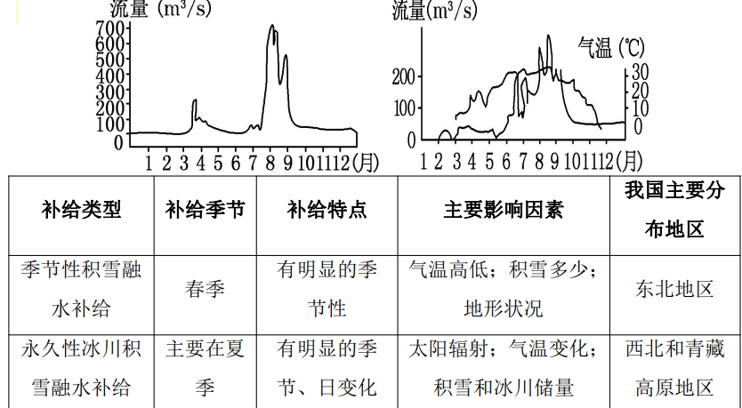

[toc]

+ 自然地理
+ 人文地理
+ 世界地理
+ 区域地理
+ 地理课程标准

# 自然地理

地层接触

地貌发育

### 时区 *

1度相差
经差
纬差

4min/度

### 热力环流
近地面规律：热低冷高 热凹冷凸

热力环流作用：城市风/海陆风/山谷风

### 冷暖锋

### 锋面气旋 *

1.锋面与低压槽重合
2.封面类型：
在锋面气旋中，位置偏左：冷锋；

## 地球水环境

### 水循环过程

S

### 河流补给类型
Ss

### 世界洋流分布和对地理环境影响

暖流增温增湿
寒流降温减湿

## 地球的陆地环境

### 等高线和地形特征

### 褶皱山和断块山
褶皱

断块

### 六大板块

### 外力作用主要表现形式

### 土壤结构和土壤的分异规律

### 岩石 *
1.岩浆岩：
+ 喷出岩
玄武岩/流纹岩
+ 侵入岩
花岗岩
2.沉积岩
+ 石灰岩/页岩/砂岩/砾岩
  （具有层理构造，含有化石）
3.变质岩
石灰岩->大理岩
花岗岩->片麻岩
页岩->板岩
砂岩->石灰岩

### 自然地理环境的整体性
1.自然地理环境要素：大气/水/岩石/土壤/地形
2.物质和能量相互交换途径：水循环/生物循环/岩石圈循环。
3.意义；各要素形成一个相互渗透/相互制约和相互联系的整体。
4.整体性的表现：
自然地理环境有统一的演化过程。
地理要素的变化会牵一发动全身
地理学第一定律

### 纬度和经度地带性规律

### 垂直自然带示意图判读

4.利用自然带判断南北半球

## 生态问题和自然灾害

# 人文地理

## 人口人种民族语言
### 人口增长率

### 人口迁移

人口增长率题（多看）

## 城市
### 城市化

### 城市化问题

### 城市功能分区
和付租能力关系

和交通通达度关系

### 城市等级关系

### kristalor中心地理论

## 农业
### 农业区位因素

### 农业地域类型
水田农业

商品谷物农业

放牧业

乳畜业

混合农业

经营多样化
加强农业生态建设，良好的山地农田生态系统可有效防止水土流失。

## 工业
### 影响因素
1.自然因素：土地/原料/能源/水源/环境
2.社会经济因素：劳动力/市场/交通运输/政策/科技

### 类型

### 韦伯工业区位论
运输成本和工资是决定工业区位的主要因素。

## 交通运输

### 宗教旅游

# 区域地理

## 中国

# 教材教法

### 义务教育地理课程性质和基本概念
1.课程性质：是一门兼有自然学科和社会学科性质的基础课程。具有综合性/区域性/思想性/生活性和实践性。

+ 区域性：义务教育地理课程内容以区域地理为主，展现各区域自然和人文特点，阐明不同区域的地理概况/发展差异和区际关系。
+ 综合性：地理环境是地球表层各种自然和人文要素相互联系/相互作用而形成的复杂系统。义务教育地理课程初步揭示了自然环境各要素之间/自然环境和人类活动之间的复杂关系，从不同角度反应了地理环境的综合性。
+ 思想性：地理课程突出当今社会面临的人口/资源/环境和发展问题，阐明科学人口观/资源观/环境观和可持续发展观，富含热爱家乡/热爱祖国/关注全球及可持续发展的内容。
+ 生活性：地理课程内容紧密联系生活实际，突出反映学生生活中经常遇到的地理现象和可能遇到的地理问题，有助于提升学生的生活质量和生存能力。
+ 实践性

2.基本理念：
+ 学习对生活有用的地理。与生活相关的地球和地图/世界地理/中国地理和乡村地理等基础知识，引导学生在生后中发现地理问题。
+ 学习对终身发展有用的地理。引导学生从地理视角思考问题，关注自然和社会，可持续发展，地理素养。
+ 构建开发的地理课程。着眼学生创新意识和实践能力的培养，充分重视校内外课程资源开发的利用。鼓励自主学习/合作交流/积极探讨。

3.课程教学建议
+ 突出地理事物的空间差异和空间联系
+ 选择多种多样的地理教学方式方法
+ 重视地理信息载体的运用
+ 关注培养创新意识和实践能力

### 高中地理课程性质
1.地理学是研究地理环境以及人类活动和地理环境关系的科学，具有综合性/区域性特点。
2.地理学兼有自然科学和社会科学的性质，对解决当代人口/资源/环境和发展问题，建设美丽中国/维护全球生态安全有重要作用。
3.高中地理课程是义务教育地理课程相衔接的一门基础学科课程，其内容反应地理学的本质，体现地理学的基本思想和方法。
4.地理课程旨在使学生具备人地协调观/综合思维/区域认知/地理实践力等地理学科核心素养。学会从地理视角认识和欣赏自然和人文环境，懂得人和自然和谐共生道理，提高生活品味和精神境界。为培养德智体美全面发展的社会主义建设者和接班人奠定基础。

### 高中地理学科核心素养
1.**人地协调观**
使地理学和地理教育核心观念，指人们对人了ihe地理环境之间形成协调关系的必要性和可能性的认识/理解和判断。学生建立人地协调观
+ 能够正确认识地理观景对人类活动的影响，以及人类了活动影响环境的不同方式强度和后果
+ 能够理解人们对人地关系认识的阶段性表现和其原因
+ 能够结合现实中出现的人地矛盾的实例，分析原因，提出改进建议

2.**综合思维**
指人们综合认识地理环境和人地关系的思维方式和能力。有助于学生形成系统/动态/辩证看待问题的思维方式，树立求真务实/开拓创新的科学精神。

3.**区域认知**
指人们从空间-区域视角认识地理环境和人地关系的思维和能力。有助于建立地理空间观念，认识不同区域既各有特色，又相互联系，增强热爱家乡的情感和国家认同感，增强对世界的理解，逐步形成人类命运共同体意识。

4.**地理实践能力**
指人们在地理实验/社会调查/野外考察等地理实践活动中所具备的行动力和意志品格。

### 课程内容
地理课程从空间尺度的视角对课程内容进行组织，按照“宇宙-地球-地表-世界-中国”的顺序，引导学生认识人类的地球家园。

### 课程实施
1.教学建议
+ 教学目标设计要体现核心素养培育的整体性
+ 教学内容和教学活动设计要聚焦重点内容
+ 教学策略和教学过程要有利于引导学生主动学习
+ 教学活动要强化基于真实体验的地理实践活动

2.评价建议
+ 以落实立德树人根本任务为目标，以核心素养培育为宗旨，梳理科学质量观。
+ 以课程目标/内容要求/学业要求/学业质量标准为基本依据，强化过程评价，健全综合评价。
+ 充分发挥评价对地理课程日常教学的正面导向作用

3.课程资源开发和利用
+ 建设学校地理课程数据库
+ 利用学生学习经理资源
+ 开发社会地理课程资源
+ 利用数字和网络资源

### 课程基本理念
1.培养未来公民必备的地理素养
+ 设计具有时代性和基础性的高中地理课程，提供未来公民必备的地理知识，增强学生的学习能力和生存能力。
+ 关注人口资源，环境和区域发展问题，利于学生正确认识人地关系，形成可持续发展观念，珍爱地球/善待环境。

2.满足学生不同地理学习需要。

3.重视对地理问题的探究
4.强调信息技术在地理学习中的应用
5.注重学习过程评价和学习结果评价的结合。

### 课程设计思路

### 教学评价类型

1.按评价功能划分
+ **诊断性评价**
在新课程开始之前或某学习单元开始之前。
目的：使教学内容适合学生需要和背景以实现因材施教
内容：对学生所具有的认知/技能和情感等方面进行评价
方法：测验/观察/访谈

+ **形成性评价**
在教学过程中，监控整个教学过程。
目的：反馈教学是否有效；及时发现问题，采取改进和修正措施；确保教学活动不偏离预定目标。
内容：教学内容呈现方式/呈现顺序教学方法
评价方法：

### 地理常用教学方法和特点
1.讲授法：
教师容易控制教学进程，使学生在较短实践内获得大量系统科学知识。
局限：容易形成注入式教学。

2.谈话法：
沟通师生教和学的中介；激发学生学校兴趣的重要手段；实现教学理论指导教学实践的基本途径。
局限：耗时长，难以对结果做出定量分析，在自由回答项目上答案多种多样，可比性较差，难以用定量手段进行分析。

3.纲要信号图示法：
信号直观，形象，充分利用形象思维，教学效果明显。但对老师和同学逻辑推理能力要求较高。。

### 地理特色教学方法
1.读图分析法
指教师和学生通过地图/剖面图，传授地理知识，培养读图用途技能/发展记忆能力和空间思维能力的教学方法。

步骤：
a.呈现地图/图表，直观感受；
b.按步骤读图，分析地图图表；
c.获取信息，总结评价；
d.迁移和应用；

意义：
直观，能够化难为易
增强学生学习兴趣
激发学生想象力，培养地理思维能力

++2+.案例分析法
教师基于一定的教学目标，以案例为基本教学材料，将学生引入教育实践情景中，组织/引导学生进行学习/研究，从而培养能力的教学方法。

步骤：
a.呈现地理案例
b.分析和讨论地       理案例
c.总结和评价地理案例
d.迁移和应用
       
### 地理教学过程实质和实现路径
实质；以学为本。
要求把教学过程变成师生互动、
学生主动求学的过程。

实现途径：
1.保证学生主体地位
2.发挥教师主导性
3.调动学生主动参与学习过程
4.强调自主合作探究学习过程。

### 初中阶段教学设计
1.教学目标
+ 知识和能力目标：学生能够了解/知道/掌握/理解地理某个知识点的名称由来/概念/特点/成因过程/作用。
+ 过程和方法目标：学生通过阅读地图信息，学会用图表分析方法，提升自主学习/读图分析能力。
+ 情感态度价值观目标：学生能够提升对自然地理/人文地理/区域地理的学习兴趣，形成对世界/祖国大好河山的热爱之情。
2.教学重难点
+ 教学重点：掌握地理某知识点的成因/原理/作用/关系等。
+ 教学难点：理解并运用知识点，分析地理现象。

3.教学方法
+ 讲授法
+ 小组讨论法
+ 读图分析法
+ 比较分析法

4.教学过程
+ 导入新课
+ 讲授新课
+ 巩固联系
+ 课堂小结
+ 作业布置

5.板书设计 
+ 纲目式板书
+ 结构式板书
+ 表格式板书
+ 图示式板书

### 高中阶段教学设计
1.教学目标
+ 人地协调观目标
+ 综合思维目标
+ 区域认知目标
+ 地理实践力目标

2.教学重难点
+ 重点：掌握地理某知识点的成因/医院里/作用/结果等。
+ 难点：理解并正确运用知识点，分析地理现象。

3.JOIAXUEFANGFA 
+ 小组讨论法
+ 讲授法
+ 读图分析法
+ 比较分析法

4.教学过程
+ 导入新课
+ 讲授新课
+ 巩固联系
+ 课堂小结
+ 板书设计

