# 入门

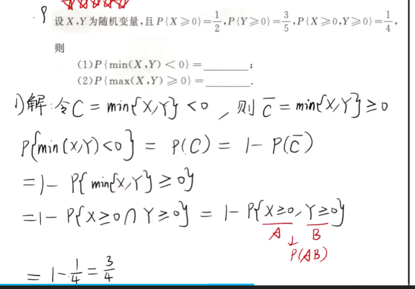

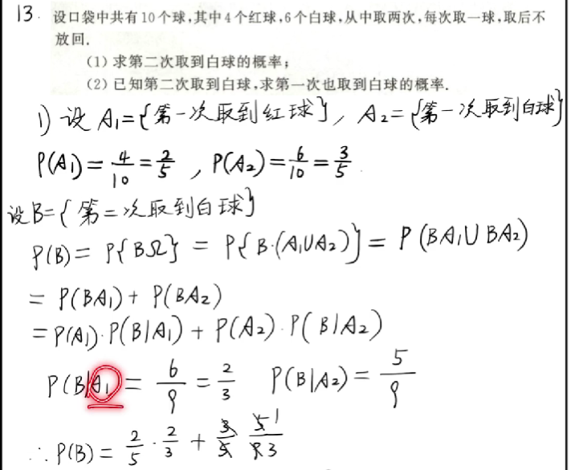
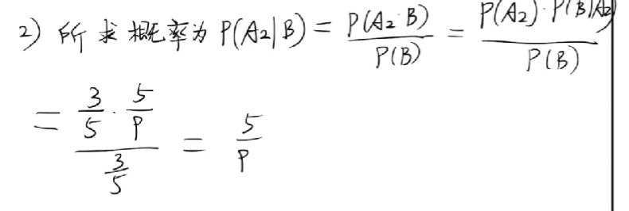

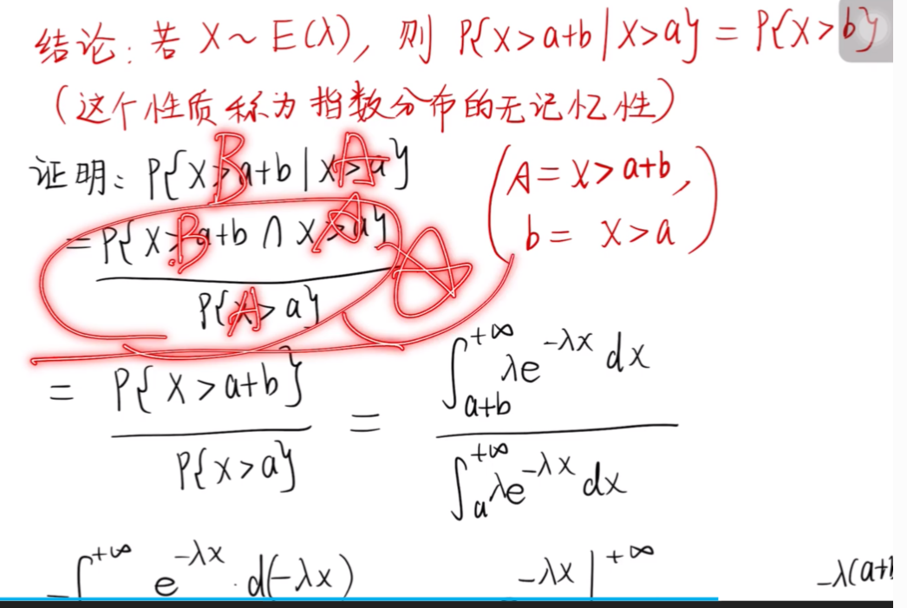

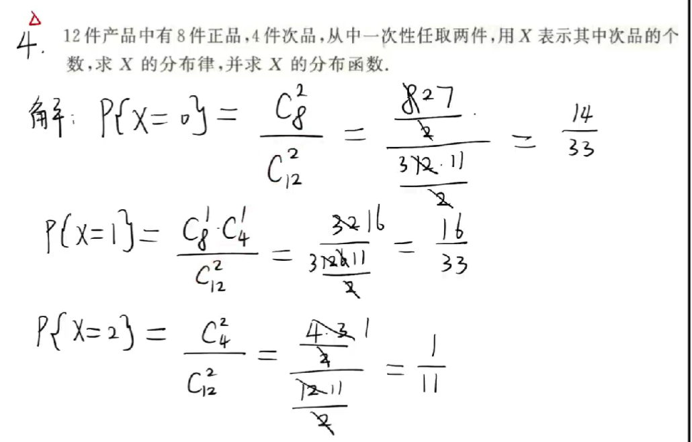

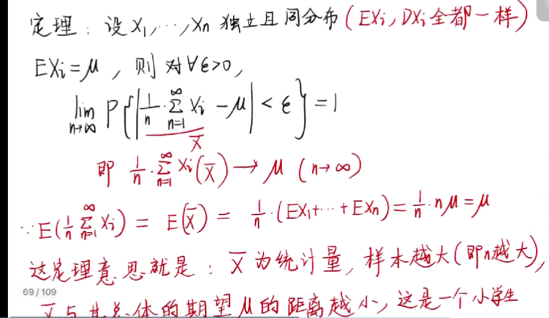
 
 ## 排列 组合

arrangement / permutation

**本质区别：决策的顺序对结果有无影响**

## 贝叶斯公式

## 随机变量

### 离散型随机变量

随机变量 X 是定义在随机试验样本空间 S = {e} 上的单实值函数，记 X = X(e)。

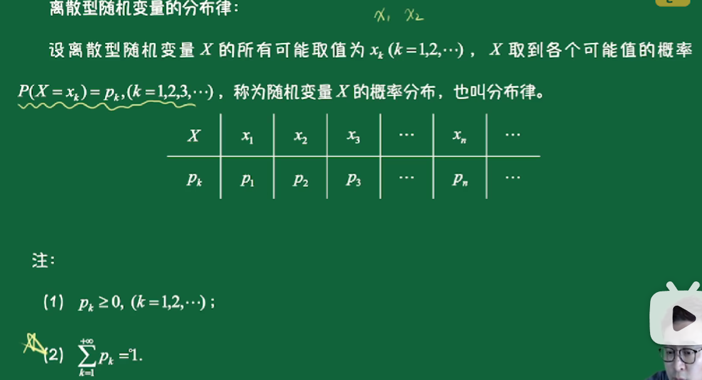

- **二项分布**
  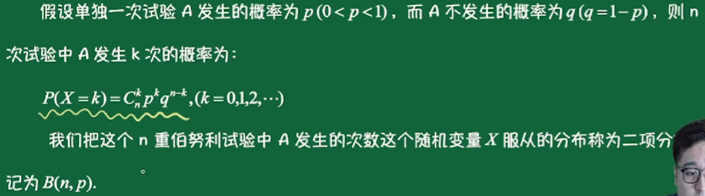

- **泊松分布**
  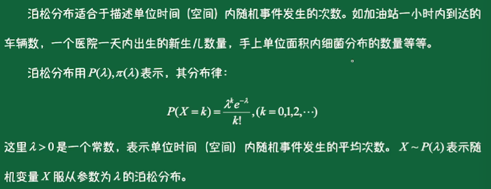

### 随机变量的分布函数

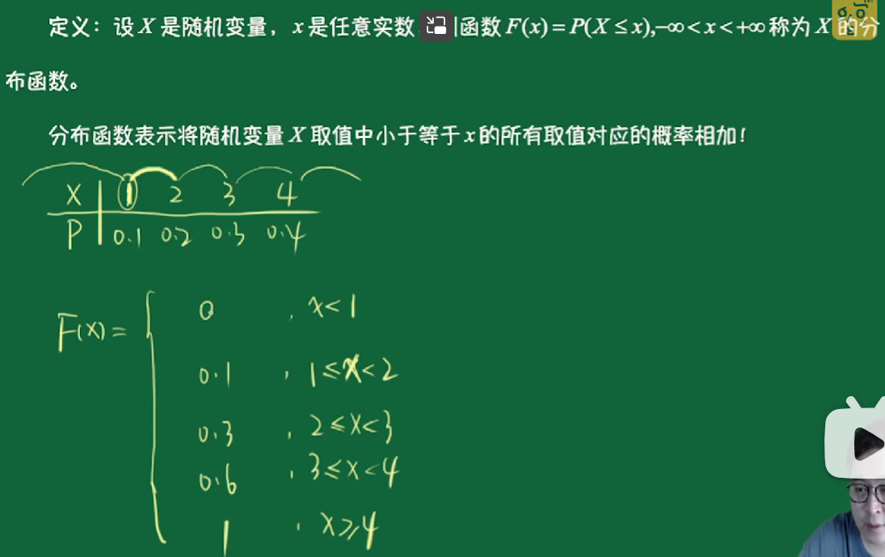

- **均匀分布**
  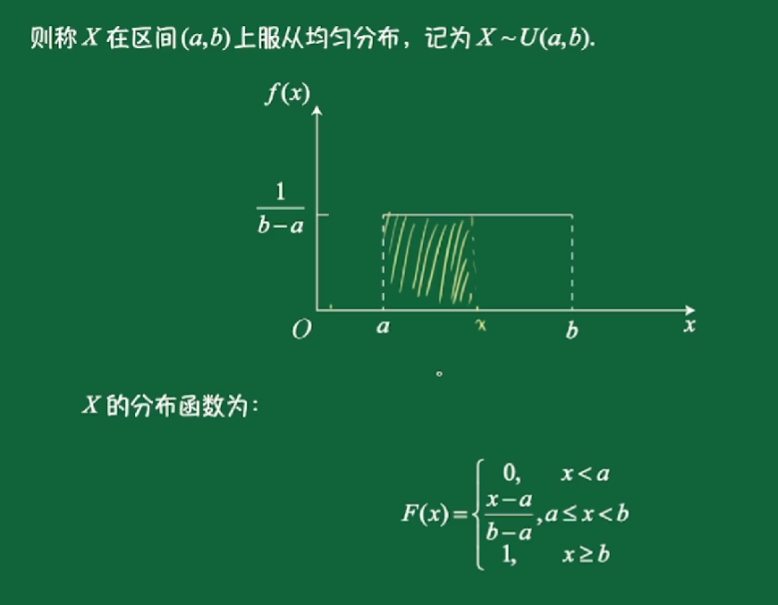

- **指数分布**
  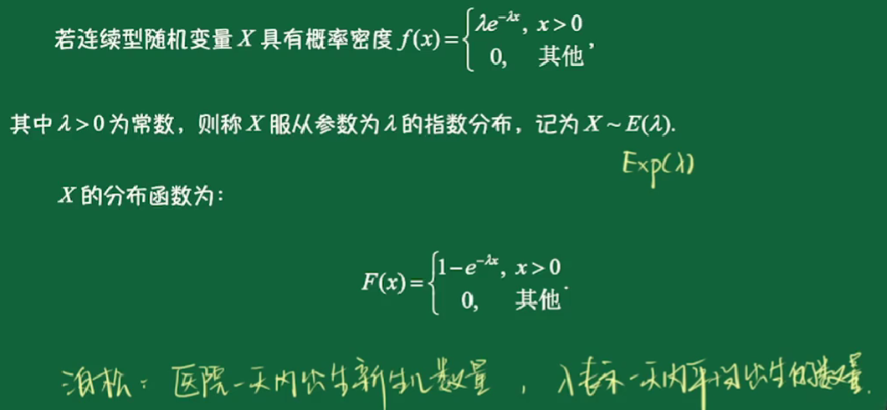

泊松：医院一天内出生新生儿数量，lambda 标识一天内平均出生的数量。
指数分布：两个新生儿出生的时间间隔，lambda 分之一标识新生儿出生时间平均间隔。

- **正态分布 normal distribution**
  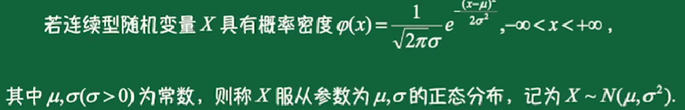

- **标准正态分布**
  经过转换公式：
  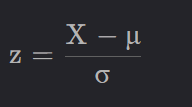

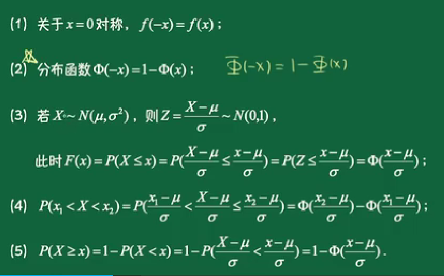
