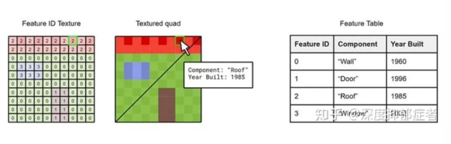
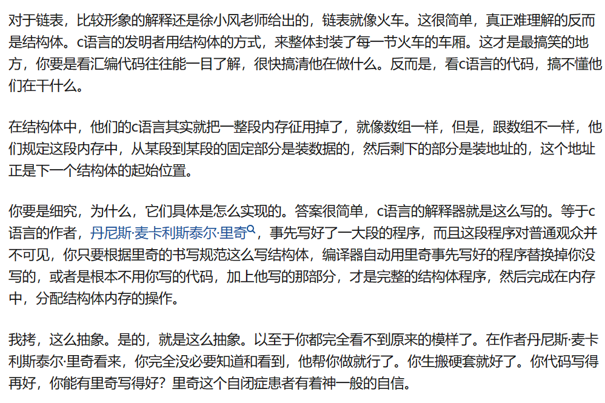
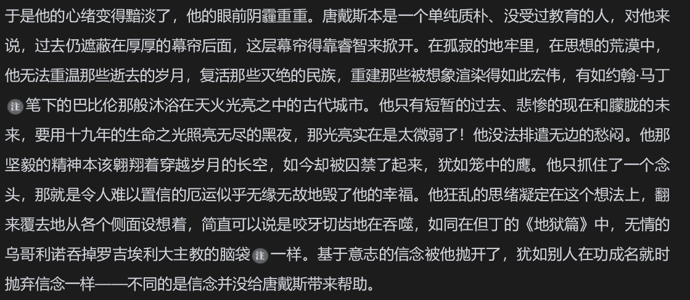

[toc]

## 感悟

### 理论与实操

Theory is when you know everything but nothing works. Practice is when everything works but no one knows why. In the industrial, theory and practice are combined: nothing works and no one knows why.

### 思辨与立场

培养思辨思维--看清事物的关键和本质。
思考，是对大脑输入的深化处理；辨析，是对深入处理后信息的辨别能力。
首先要学会独立思考
从多方面、多角度去评价事、物、人。

深学笃信，精思细悟，知行合一。

广泛涉猎，胸中有墨，下笔成章。

### 为甚么宗教之间会有战争

### 为什么爱情在文学作品中如此重要？

### 大学生出路分化 处于弱势之人

家庭社会经济地位
城乡
地域
父母教育水平

### 关于地理学科的思考

地理学作为显学

5 月在桂林听了关于传染病地理计算的讲座，深感地理必须依附于其他学科发挥作用。

### 关于数字孪生的思考

**业务管理的新视角**
传统信息系统管理基于二维平台交互和显示。

- 虽 GIS 可有效解决空间定位，却无法解决空间高度定位问题。
- GIS 系统基于俯视图视角，不基于人眼习惯。
- 隐蔽工程难呈现空间位置。

**资源组织新方式**

**数字孪生离去 unity 和 ue 还要多久**
技术路线：

- 基于 cesium 的 webgl
- 基于 ue 的游戏引擎技术路线

开源也要看协议

观看了无人机实时指挥平台后，思考数字孪生是否走错了路线

### 站在 2023 年审视 GIS 行业

### cesium 的未来思考

- 人工智能和机器学习的发展，使能生成更加丰富的语义元数据；
- 跨行业的时空 3D 地理空间数据使用需求；
- 建模和 仿真领域从仿真模型到实景模型的转变；
- 空间可视化分析逐步开始使用一个通用的空间数据结构；
- 矢量图层叠加 3D 模型的使用需求；
- 围绕 glTF 的开放生态的成长；

3D Tiles 未来：

- 通过扩展 Batch Table 概念提高要素元数据集成的颗粒度；

### 警用 GIS

GIS 公司对公安系统以人工智能/物联网为核心的海量数据处理能力不够，认识深度不够。

### 下一个十年-WebGL 和 WebGPU 的思考

webGPU 从设计上相比 webgl 的优点：

- promise API/async + await 的异步语法加入：对网络数据加载 / 解码等同步耗时操作有更好的支持 ， 一定程度上避免回调地狱问题 。
- 不再使用全局状态机制 ： 使用指令缓冲节约 CPU 到 GPU 之间的信息传递成本。
  （WebGL 切换某个状态如纹理 / 着色器就是在切换全局状态对象）
- 原生支持计算管线 / 计算着色器 ：WebGL 磨蹭实现的 GPU 并行计算功能直接提供出来 ， 并与渲染管线地位对等。

### 基于城市天际线对 GIS 高精地图的思考

玩过城市天际线以后发现，叠加车道对解决拥堵毫无意义，
在算法的加持下， 插队对单一车辆的虚高效被宏观的展现为集中堵在一条车道下 ，

所以最好的方案 我认为仍然是 特斯拉的纯视觉辅助方案

所谓高精地图在城市快速路和高速路已经基本成为了车企的标配了，
目前只是城市区域去高精 ，
所谓去高精不是不用高精地图，
而是把高精地图部分信息附加在导航地图上，
形成 SD+ 地图， 标高精地图，
图商仍然能在其中分一杯羹。

### 理科与文科的共情论

在近代 200 多年的历史里， 理科为自己找到了在资产阶级社会的生存途径：“变现、创造价值”。

作为近现代社会的自由七艺不需要考虑养家糊口的人所追求的东西。

随着大革命，务实的市民伦理崛起。

实际意义成为了大多数人眼中一门学问有无价值、是否应该存在的唯一标准。

## 电影

### 决战之后

备左右寡，备前后寡，处处皆备，则处处寡之。

只有人民，才是创造历史的动力。

历史有时只有回过头来，才能看得清楚。

他的罪恶，不是一种个人行为，而是一个集团，一个阶级的产物。

## 计算机

### 语言设计

## 文学

### 基督山伯爵

罗伯斯庇尔

